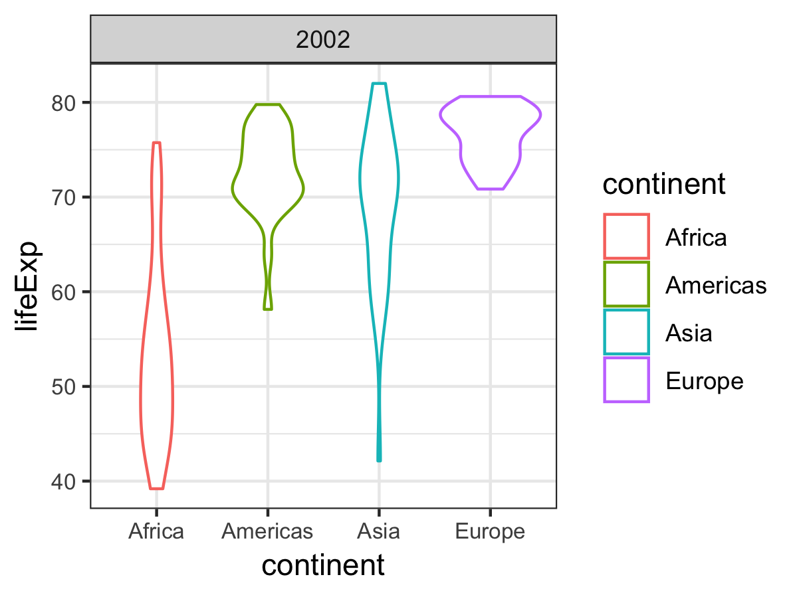

## Factor and figure management!
For this assignment I will be using gapminder.

```{r setup, include=FALSE}
suppressPackageStartupMessages(library(tidyverse))
knitr::opts_chunk$set(fig.width=4, fig.height=3)
library(tidyr)
library(dplyr)
library(ggplot2)
```

### Goals for this assignment
- Reorder a factor in a principled way based on the data and demonstrate the effect in arranged data and in figures.
- Write some data to file and load it back into R.
- Improve a figure (or make one from scratch), using new knowledge, e.g., control the color scheme, use factor levels, smoother mechanics.
- Make a plotly visual.
- Implement visualization design principles.

### Part 1: Factor management
Loading the data:
```{r}
library(gapminder)
```

Let's explore our factors:
```{r}
class(gapminder$continent)
str(gapminder$continent)
levels(gapminder$continent)
```

Or easily get more information on our **continent** factor:
```{r}
fct_count(gapminder$continent)
```

We can see the number of rows related to Oceania is significantly smaller than the others, therefore we can drop it. 
```{r}
nlevels(gapminder$continent)
```

First I will make an operation I find useful:
```{r}
'%!in%' <- function(x,y)!('%in%'(x,y))
```

#### Let's drop Oceania. 
```{r}
nlevels(gapminder$continent)
oceaniaDropped <- gapminder %>%
  filter(continent %!in% c("Oceania"))
```

However, nlevels doesn't drop, so we need to eplicitly call drop :
```{r}
nlevels(oceaniaDropped$continent)
nlevels(droplevels(oceaniaDropped$continent))

# or more explicitly
noOceaniaDf <- oceaniaDropped %>%
  droplevels()
levels(noOceaniaDf$continent)
# And also number of rows
fct_count(noOceaniaDf$continent)
```

#### Ordering Gapminder countries and continents by lifeExp.
```{r}
fct_reorder(gapminder$continent, gapminder$lifeExp, mean) %>% # using mean statistic of life Expectancy
  levels() %>% 
  head()
```

And a simple comparison of plots to understand why reordering helps! 
```{r fig.height = 9, fig.width = 9, fig.align = "center"}
gap_Europe_Africa_2002 <- gapminder %>% 
  filter(continent %in% c("Europe", "Africa")) # By Adding year=2002 we could filter for a single year!
ggplot(gap_Europe_Africa_2002, aes(x = lifeExp, y = country, color = continent)) + 
  geom_point()
ggplot(gap_Europe_Africa_2002, aes(x = lifeExp, y = fct_reorder(country, lifeExp, mean), color = continent)) +
  geom_point()
```

### Part 2: I/O 
I have some csv files from my [Machine learning class](https://courses.students.ubc.ca/cs/main?pname=subjarea&tname=subjareas&req=3&dept=CPSC&course=340), so I will use that for this purpose. 

```{r}
ratingsData <- read.csv(file="data/ratings_Patio_Lawn_and_Garden.csv", header=TRUE, sep=",")
```

Lets check the factors:
```{r}
class(ratingsData$item)
str(ratingsData$item)
str(ratingsData$user)
nlevels(ratingsData$user) # number of users
nlevels(ratingsData$item) # number of items
```

I'll filter by ratings = 5 and then write this as a csv file to a new file.
```{r}
ratingsData <- ratingsData %>%
  filter(rating == 5.0) %>%
  droplevels()
nlevels(ratingsData$item)
write.csv(ratingsData, file="data/max_Ratings_Patio_Lawn_and_Garden.csv")
```

In the max_Ratings_Patio_Lawn_and_Garden.csv file we now have only 5 star ratings. There are 2351 ratings, so some users have rated items with a 5 more than once, since levels are 2323 after we drop unnecessary ones. 

### Part 3: Visualization design
```{r}
suppressPackageStartupMessages(library(scales))
```

I had this plot from homework 3 and realised I could improve it with what we learned about visualization design. 
The colors are very off, I feel it is very packed. Have a look:
```{r fig.height = 9, fig.width = 9, fig.align = "center"}
ggplot(gapminder, aes(x=continent, y=lifeExp, fill=continent)) +
  geom_violin() +
  facet_wrap(~ year) +
  scale_fill_manual(values = c("blue", "red", "yellow", "green")) + 
  theme(axis.text.x = element_blank(), 
        axis.title.x = element_blank()) # to remove the continent names from the x axis.
```

And I have improved on it like this:
```{r fig.height = 9, fig.width = 9, fig.align = "center"}
(violin_plots <- ggplot(noOceaniaDf, aes(x=continent, y=lifeExp, color=continent)) +
  geom_violin() +
  facet_wrap(~ year) +
  theme_bw() +  
  theme(axis.text = element_text(size=8)) +     
  scale_y_continuous(breaks=1:10*10))
```

Though it is mostly similar, I believe this chart looks nicer in general, much nicer than before.
I have plotted in plotly only one of the plots, due to space concerns. 
```{r fig.height = 6, fig.width = 6, fig.align = "center"}
noOceaniaDf_2002 <- noOceaniaDf %>% filter(year==2002)
(violin_plots_2002 <- ggplot(noOceaniaDf_2002, aes(x=continent, y=lifeExp, color=continent)) +
  geom_violin() +
  facet_wrap(~ year) +
  theme_bw() +  
  theme(axis.text = element_text(size=8)) +     
  scale_y_continuous(breaks=1:10*10))
```
```{r fig.height = 6, fig.width = 6, fig.align = "center"}
suppressPackageStartupMessages(library(plotly))
# I have commented this because its rendered terribly in the md file. 
# ggplotly(violin_plots_2002)
```

Some things that plotly does that ggplot doesn't do is the interactivity with the plot. You can effectively zoom in and out of the plot, hover over the plot and gain information for the data visualised etc.  

### Part 4: Writing figures to file
I am going to save the above plot:
```{r}
ggsave("images/violin_plot_2002.png", plot = violin_plots_2002) # plot matters since it would otherwise store the latest run plot!
```

And loading this same image back:


