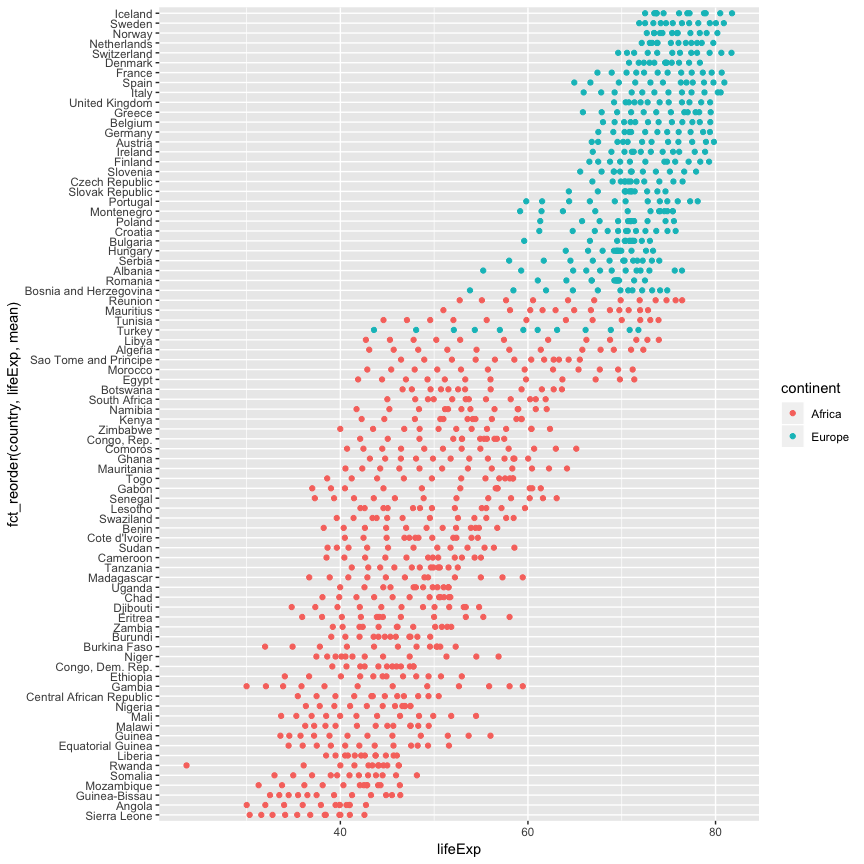

Hw 05: Factor and figure management
================
Figali Taho
19 Oct 2018

Factor and figure management!
-----------------------------

For this assignment I will be using gapminder.

### Goals for this assignment

-   Reorder a factor in a principled way based on the data and demonstrate the effect in arranged data and in figures.
-   Write some data to file and load it back into R.
-   Improve a figure (or make one from scratch), using new knowledge, e.g., control the color scheme, use factor levels, smoother mechanics.
-   Make a plotly visual.
-   Implement visualization design principles.

### Part 1: Factor management

Loading the data:

``` r
library(gapminder)
```

Let's explore our factors:

``` r
class(gapminder$continent)
```

    ## [1] "factor"

``` r
str(gapminder$continent)
```

    ##  Factor w/ 5 levels "Africa","Americas",..: 3 3 3 3 3 3 3 3 3 3 ...

``` r
levels(gapminder$continent)
```

    ## [1] "Africa"   "Americas" "Asia"     "Europe"   "Oceania"

Or easily get more information on our **continent** factor:

``` r
fct_count(gapminder$continent)
```

    ## # A tibble: 5 x 2
    ##   f            n
    ##   <fct>    <int>
    ## 1 Africa     624
    ## 2 Americas   300
    ## 3 Asia       396
    ## 4 Europe     360
    ## 5 Oceania     24

We can see the number of rows related to Oceania is significantly smaller than the others, therefore we can drop it.

``` r
nlevels(gapminder$continent)
```

    ## [1] 5

First I will make an operation I find useful:

``` r
'%!in%' <- function(x,y)!('%in%'(x,y))
```

#### Let's drop Oceania.

``` r
nlevels(gapminder$continent)
```

    ## [1] 5

``` r
oceaniaDropped <- gapminder %>%
  filter(continent %!in% c("Oceania"))
```

However, nlevels doesn't drop, so we need to eplicitly call drop :

``` r
nlevels(oceaniaDropped$continent)
```

    ## [1] 5

``` r
nlevels(droplevels(oceaniaDropped$continent))
```

    ## [1] 4

``` r
# or more explicitly
noOceaniaDf <- oceaniaDropped %>%
  droplevels()
levels(noOceaniaDf$continent)
```

    ## [1] "Africa"   "Americas" "Asia"     "Europe"

``` r
# And also number of rows
fct_count(noOceaniaDf$continent)
```

    ## # A tibble: 4 x 2
    ##   f            n
    ##   <fct>    <int>
    ## 1 Africa     624
    ## 2 Americas   300
    ## 3 Asia       396
    ## 4 Europe     360

#### Ordering Gapminder countries and continents by lifeExp.

``` r
fct_reorder(gapminder$continent, gapminder$lifeExp, mean) %>% # using mean statistic of life Expectancy
  levels() %>% 
  head()
```

    ## [1] "Africa"   "Asia"     "Americas" "Europe"   "Oceania"

And a simple comparison of plots to understand why reordering helps!

``` r
gap_Europe_Africa_2002 <- gapminder %>% 
  filter(continent %in% c("Europe", "Africa")) # By Adding year=2002 we could filter for a single year!
ggplot(gap_Europe_Africa_2002, aes(x = lifeExp, y = country, color = continent)) + 
  geom_point()
```


``` r
ggplot(gap_Europe_Africa_2002, aes(x = lifeExp, y = fct_reorder(country, lifeExp, mean), color = continent)) +
  geom_point()
```



### Part 2: I/O

I have some csv files from my [Machine learning class](https://courses.students.ubc.ca/cs/main?pname=subjarea&tname=subjareas&req=3&dept=CPSC&course=340), so I will use that for this purpose.

``` r
ratingsData <- read.csv(file="data/ratings_Patio_Lawn_and_Garden.csv", header=TRUE, sep=",")
```

Lets check the factors:

``` r
class(ratingsData$item)
```

    ## [1] "factor"

``` r
str(ratingsData$item)
```

    ##  Factor w/ 1078 levels "A106059W6NIRG6",..: 518 296 780 355 806 480 454 1006 755 833 ...

``` r
str(ratingsData$user)
```

    ##  Factor w/ 86 levels "0981850006","144072007X",..: 1 1 1 1 1 1 1 2 2 2 ...

``` r
nlevels(ratingsData$user) # number of users
```

    ## [1] 86

``` r
nlevels(ratingsData$item) # number of items
```

    ## [1] 1078

I'll filter by ratings = 5 and then write this as a csv file to a new file.

``` r
ratingsData <- ratingsData %>%
  filter(rating == 5.0) %>%
  droplevels()
nlevels(ratingsData$item)
```

    ## [1] 736

``` r
write.csv(ratingsData, file="data/max_Ratings_Patio_Lawn_and_Garden.csv")
```

In the max\_Ratings\_Patio\_Lawn\_and\_Garden.csv file we now have only 5 star ratings. There are 2351 ratings, so some users have rated items with a 5 more than once, since levels are 2323 after we drop unnecessary ones.

### Part 3: Visualization design

``` r
suppressPackageStartupMessages(library(scales))
```

I had this plot from homework 3 and realised I could improve it with what we learned about visualization design. The colors are very off, I feel it is very packed. Have a look:

``` r
ggplot(gapminder, aes(x=continent, y=lifeExp, fill=continent)) +
  geom_violin() +
  facet_wrap(~ year) +
  scale_fill_manual(values = c("blue", "red", "yellow", "green")) + 
  theme(axis.text.x = element_blank(), 
        axis.title.x = element_blank()) # to remove the continent names from the x axis.
```


And I have improved on it like this:

``` r
(violin_plots <- ggplot(noOceaniaDf, aes(x=continent, y=lifeExp, color=continent)) +
  geom_violin() +
  facet_wrap(~ year) +
  theme_bw() +  
  theme(axis.text = element_text(size=8)) +     
  scale_y_continuous(breaks=1:10*10))
```


Though it is mostly similar, I believe this chart looks nicer in general, much nicer than before. I have plotted in plotly only one of the plots, due to space concerns.

``` r
noOceaniaDf_2002 <- noOceaniaDf %>% filter(year==2002)
(violin_plots_2002 <- ggplot(noOceaniaDf_2002, aes(x=continent, y=lifeExp, color=continent)) +
  geom_violin() +
  facet_wrap(~ year) +
  theme_bw() +  
  theme(axis.text = element_text(size=8)) +     
  scale_y_continuous(breaks=1:10*10))
```


``` r
suppressPackageStartupMessages(library(plotly))
ggplotly(violin_plots_2002)
```

<!--html_preserve-->

<script type="application/json" data-for="htmlwidget-e9aa4d18386d0986566d">{"x":{"data":[{"x":[0.937928056162189,0.93678449668821,0.935636261694734,0.93447686145162,0.933314849545404,0.932141907268132,0.930965832123934,0.929782030956466,0.928593346265421,0.927399737023294,0.926199961198031,0.92499763359436,0.923788346822178,0.922577616958821,0.921361268661561,0.920143164337111,0.918921582198299,0.917697816276555,0.916472226574472,0.915244560285841,0.914016217646792,0.912786455732809,0.911556610984482,0.910326625802663,0.909097081478191,0.907868248801544,0.906640890561817,0.905414548814964,0.904191285634251,0.902968841524615,0.901751543114567,0.900535690025968,0.899324957484698,0.898117631470079,0.896914829792227,0.895717965159927,0.894524455662365,0.893339976979418,0.892157804851062,0.890986926719732,0.889819603941561,0.888662035091327,0.887511428717045,0.886368470502991,0.885236408598805,0.884109335697168,0.88299759865762,0.881889574803739,0.880797966228908,0.879712484069226,0.878640377657575,0.87757906840026,0.876527585283655,0.875492003169144,0.874462214783155,0.873453829138702,0.872450345069408,0.871466940659729,0.870492409453895,0.869533574537786,0.868589232661672,0.867655799683967,0.866742774772519,0.865835507660727,0.864954812941919,0.864079865363346,0.863226933678957,0.862385438327974,0.861560526288549,0.860753205044303,0.859956777562506,0.85918422475556,0.858417728609137,0.857679348391148,0.856948194224128,0.856239216925083,0.855543689277372,0.854864261193804,0.854204514986653,0.853554703198044,0.852930765377745,0.852313019662959,0.851722331080145,0.851140237003764,0.850578904596113,0.850032196688958,0.84949998700945,0.848988285176222,0.848484896084572,0.848007711569103,0.847536429299053,0.847089517885931,0.846651963349644,0.846232590510118,0.845828045450625,0.845435672718325,0.845063336968873,0.844697378170714,0.844356378852191,0.844020660854796,0.843705606436694,0.843399997774792,0.843109364853956,0.842832860084948,0.842565924889382,0.842317480730296,0.842073831718517,0.841852045011563,0.841635066289691,0.841434706885705,0.84124330802047,0.841063605142622,0.840896694071932,0.840736879303829,0.840593372410382,0.840453824480226,0.840331516907982,0.840213999404232,0.840109341776647,0.84001283011169,0.839925115205856,0.839848624559166,0.839777172085543,0.8397197650959,0.839665560498761,0.839624719423654,0.839588470104329,0.839562050384194,0.839542959197366,0.839530424504915,0.839527762221528,0.839528619248298,0.839541728524471,0.83955748546572,0.839583827361695,0.839614622514519,0.839653151536013,0.839698509779885,0.839748919676125,0.839808444367331,0.839870477172773,0.83994385002922,0.840019579771756,0.840104275938366,0.840193563962661,0.840289394238227,0.840392103464212,0.840498996436689,0.840615061367153,0.840733437427778,0.840862411853572,0.840994161089575,0.841134233907986,0.841279445670754,0.841430704199152,0.841589524539944,0.841752089236258,0.841924715490373,0.842099756345825,0.842285411924599,0.8424745828568,0.842672073605503,0.842875670007934,0.843085217082355,0.843303564667845,0.843525405898688,0.843758854292223,0.843994964756564,0.844242156997372,0.844493846694092,0.844754111683055,0.845021760846277,0.845295368293464,0.84557935919653,0.845866578298069,0.846167289247605,0.846470953062565,0.846786185032604,0.847107041954941,0.847436658526239,0.847775054069066,0.848119291507605,0.84847554856233,0.848834917448578,0.849209042094814,0.849586648717632,0.849976002084371,0.850372097042826,0.850776840528367,0.851191637325508,0.85161190840453,0.852045580133548,0.852482532396244,0.85293416707906,0.853390151671274,0.853857566775648,0.854332649168309,0.85481587136509,0.855310068185667,0.855809093599157,0.856322371032561,0.856838942704808,0.857369436997624,0.857904965201561,0.858451060819247,0.859005386929044,0.85956695163476,0.860139863676544,0.860716732384997,0.861307964887546,0.861902323647101,0.86250917377347,0.863121425524471,0.863742887821979,0.864372640538453,0.865008419679685,0.86565522938999,0.866304998390876,0.866968370167408,0.867634515953777,0.868311160144825,0.868993148326154,0.869682617897838,0.870379837455945,0.871081685726066,0.871793479774985,0.872507744124801,0.87323290008442,0.87396082182558,0.874696854759916,0.87543767585997,0.876184035239784,0.876936959274417,0.877693071791785,0.878457266531737,0.879223322620447,0.879997137733995,0.880773336474557,0.881555063111119,0.882340498617999,0.883129487768214,0.883923228676739,0.88471881668249,0.885519909514358,0.886322147052312,0.887128892618259,0.887937219095595,0.888748503696602,0.889561927701521,0.890377048464952,0.891194569193462,0.892012818597516,0.89283342978253,0.893654415384817,0.894476791725339,0.89529956332313,0.896122939557306,0.896946494535479,0.897770166360515,0.898593510593228,0.899416754357894,0.900238931892898,0.901060697009345,0.901881103784422,0.902700432695029,0.903518402551032,0.904334359695239,0.905149241184957,0.905960916602173,0.906771768915664,0.90757858762555,0.908384024721278,0.909185907539266,0.909985093963493,0.910781466212565,0.911573602676492,0.912363912671198,0.913148238401154,0.913931125194637,0.914707753346765,0.915481907236343,0.916250966953887,0.917015726333438,0.917776767820096,0.918531514585908,0.919284114956934,0.92002827494437,0.920770523764615,0.921505081298903,0.92223606851749,0.922961077853218,0.923680332955628,0.92439547778368,0.925102571972888,0.925807538995134,0.926502105684016,0.927194416072964,0.927878316246155,0.928557632882562,0.929230644049009,0.929896663784575,0.930558583319872,0.93121103384681,0.931861114849942,0.932500313600935,0.933136513582565,0.93376411338465,0.934386218930295,0.935002077348074,0.935609892928794,0.936213877210023,0.93680722105014,0.937398040626345,0.937977905749389,0.938554031913307,0.939121660017746,0.939682926633005,0.940238201043693,0.940784441509086,0.941327244084471,0.941858287531187,0.942386675714842,0.942904164406867,0.943417121242005,0.943921755493399,0.944419086043223,0.944910723302907,0.945392217754201,0.945870705668406,0.946336137252771,0.946798747952072,0.947250436106489,0.947696660702412,0.948134674877125,0.948564241028712,0.94898838233653,0.949400998060386,0.949810658458585,0.950206409962361,0.950598713319991,0.950979925763081,0.951354537280331,0.951720968189376,0.952077538598439,0.952428937502826,0.952767106078958,0.953102053692435,0.953422614532435,0.953738682113951,0.95404343115365,0.954340246909002,0.954628922762301,0.954906118610324,0.955178463837435,0.95543568100172,0.955689396876921,0.955928340292094,0.95616163819145,0.956383534841325,0.956596103752554,0.956800745329932,0.956992305714259,0.957179505256557,0.957349815963142,0.957516417965807,0.957668276884915,0.957813390139895,0.957947412118394,0.958070915887625,0.958187037164491,0.958288872880823,0.958386955320625,0.958467247452509,0.958543690262811,0.958606144166029,0.958661062828388,0.958705794757428,0.9587393875652,0.95876656632973,0.958779119239829,0.958788058372376,0.958780859528586,0.958769269791742,0.958745362671525,0.958713754992499,0.958673540000103,0.958622524322622,0.95856646326056,0.958496750016104,0.958423887090528,0.95833776736277,0.958247282908393,0.958147074527899,0.958039919242223,0.957926330993089,0.957803554099589,0.957677354604245,0.957540101183627,0.957400510217261,0.957251624621507,0.957099183277273,0.956940332334756,0.956776397608815,0.956608568090851,0.956434576532226,0.956258802289149,0.956076263371957,0.955892503399211,0.955704110282623,0.955513859466848,0.955320866015121,0.95512577566378,0.954929362719959,0.954731128648959,0.954532470238044,0.954332854913257,0.954133300127167,0.953933935559376,0.953735246573383,0.95353738055067,0.953341329527203,0.953146212559814,0.952954571041077,0.952763864267749,0.952577978751577,0.95239395612707,0.952214529326404,0.952038916881057,0.951867152012298,0.951701638341324,0.951538712418006,0.951384938372733,0.951233394703171,0.951091545361539,0.950953774353389,0.950824083260061,0.950701571477147,0.950585057323799,0.950479210998402,0.950376840649352,0.950288977453275,0.950204413873136,0.950133003086779,0.950067975986464,0.95001325699725,0.949968842917008,0.949931535401357,0.949908699383712,0.94988965155709,0.949889043812019,0.94989264814679,0.949911181865987,0.949938119229409,0.949976221272094,0.950027047956004,0.950085067953585,0.950160213873547,0.950239598674656,0.950338191260425,0.950442258021807,0.95056134876603,0.950690223906492,0.950829850331652,0.950983534461715,0.951143657359619,0.951322027337365,0.951504645591212,0.95170534385539,0.951912302512126,0.952132934278172,0.952363828160658,0.952604064125002,0.952858377206736,0.953117821464762,0.953394932084175,0.953675889865561,0.953972311737527,0.954275107236708,0.954589181125007,0.954912965557648,0.955244061388582,0.955587902288015,0.955935340599927,0.956298229044577,0.956664235634774,0.957042143100248,0.957425783386567,0.957817739208526,0.958217853421757,0.958623021661186,0.959038400233546,0.959456332259527,0.959885307987799,0.960316875942816,0.960756402765074,0.961200310751611,0.961649464716279,0.962104394271858,0.962562240054015,0.963026857792131,0.963493019452304,0.963965417858369,0.964439530895217,0.964917787478872,0.965398513010557,0.965881686920931,0.966367695717049,0.966854854046305,0.967344832947632,0.967835335040707,0.968327712112206,0.96882051941155,1.03117948058845,1.03167228788779,1.03216466495929,1.03265516705237,1.03314514595369,1.03363230428295,1.03411831307907,1.03460148698944,1.03508221252113,1.03556046910478,1.03603458214163,1.0365069805477,1.03697314220787,1.03743775994598,1.03789560572814,1.03835053528372,1.03879968924839,1.03924359723493,1.03968312405718,1.0401146920122,1.04054366774047,1.04096159976645,1.04137697833881,1.04178214657824,1.04218226079147,1.04257421661343,1.04295785689975,1.04333576436523,1.04370177095542,1.04406465940007,1.04441209771198,1.04475593861142,1.04508703444235,1.04541081887499,1.04572489276329,1.04602768826247,1.04632411013444,1.04660506791582,1.04688217853524,1.04714162279326,1.047395935875,1.04763617183934,1.04786706572183,1.04808769748787,1.04829465614461,1.04849535440879,1.04867797266263,1.04885634264038,1.04901646553829,1.04917014966835,1.04930977609351,1.04943865123397,1.04955774197819,1.04966180873958,1.04976040132534,1.04983978612645,1.04991493204642,1.049972952044,1.05002377872791,1.05006188077059,1.05008881813401,1.05010735185321,1.05011095618798,1.05011034844291,1.05009130061629,1.05006846459864,1.05003115708299,1.04998674300275,1.04993202401354,1.04986699691322,1.04979558612686,1.04971102254673,1.04962315935065,1.0495207890016,1.0494149426762,1.04929842852285,1.04917591673994,1.04904622564661,1.04890845463846,1.04876660529683,1.04861506162727,1.04846128758199,1.04829836165868,1.0481328479877,1.04796108311894,1.0477854706736,1.04760604387293,1.04742202124842,1.04723613573225,1.04704542895892,1.04685378744019,1.0466586704728,1.04646261944933,1.04626475342662,1.04606606444062,1.04586669987283,1.04566714508674,1.04546752976196,1.04526887135104,1.04507063728004,1.04487422433622,1.04467913398488,1.04448614053315,1.04429588971738,1.04410749660079,1.04392373662804,1.04374119771085,1.04356542346777,1.04339143190915,1.04322360239119,1.04305966766524,1.04290081672273,1.04274837537849,1.04259948978274,1.04245989881637,1.04232264539576,1.04219644590041,1.04207366900691,1.04196008075778,1.0418529254721,1.04175271709161,1.04166223263723,1.04157611290947,1.0415032499839,1.04143353673944,1.04137747567738,1.0413264599999,1.0412862450075,1.04125463732847,1.04123073020826,1.04121914047141,1.04121194162762,1.04122088076017,1.04123343367027,1.0412606124348,1.04129420524257,1.04133893717161,1.04139385583397,1.04145630973719,1.04153275254749,1.04161304467937,1.04171112711918,1.04181296283551,1.04192908411238,1.04205258788161,1.0421866098601,1.04233172311509,1.04248358203419,1.04265018403686,1.04282049474344,1.04300769428574,1.04319925467007,1.04340389624745,1.04361646515868,1.04383836180855,1.04407165970791,1.04431060312308,1.04456431899828,1.04482153616256,1.04509388138968,1.0453710772377,1.045659753091,1.04595656884635,1.04626131788605,1.04657738546757,1.04689794630756,1.04723289392104,1.04757106249717,1.04792246140156,1.04827903181062,1.04864546271967,1.04902007423692,1.04940128668001,1.04979359003764,1.05018934154142,1.05059900193961,1.05101161766347,1.05143575897129,1.05186532512287,1.05230333929759,1.05274956389351,1.05320125204793,1.05366386274723,1.05412929433159,1.0546077822458,1.05508927669709,1.05558091395678,1.0560782445066,1.05658287875799,1.05709583559313,1.05761332428516,1.05814171246881,1.05867275591553,1.05921555849091,1.05976179895631,1.06031707336699,1.06087833998225,1.06144596808669,1.06202209425061,1.06260195937365,1.06319277894986,1.06378612278998,1.06439010707121,1.06499792265193,1.06561378106971,1.06623588661535,1.06686348641744,1.06749968639907,1.06813888515006,1.06878896615319,1.06944141668013,1.07010333621542,1.07076935595099,1.07144236711744,1.07212168375385,1.07280558392704,1.07349789431598,1.07419246100487,1.07489742802711,1.07560452221632,1.07631966704437,1.07703892214678,1.07776393148251,1.0784949187011,1.07922947623539,1.07997172505563,1.08071588504307,1.08146848541409,1.0822232321799,1.08298427366656,1.08374903304611,1.08451809276366,1.08529224665323,1.08606887480536,1.08685176159885,1.0876360873288,1.08842639732351,1.08921853378743,1.09001490603651,1.09081409246073,1.09161597527872,1.09242141237445,1.09322823108434,1.09403908339783,1.09485075881504,1.09566564030476,1.09648159744897,1.09729956730497,1.09811889621558,1.09893930299066,1.0997610681071,1.10058324564211,1.10140648940677,1.10222983363949,1.10305350546452,1.10387706044269,1.10470043667687,1.10552320827466,1.10634558461518,1.10716657021747,1.10798718140248,1.10880543080654,1.10962295153505,1.11043807229848,1.1112514963034,1.1120627809044,1.11287110738174,1.11367785294769,1.11448009048564,1.11528118331751,1.11607677132326,1.11687051223179,1.117659501382,1.11844493688888,1.11922666352544,1.12000286226601,1.12077667737955,1.12154273346826,1.12230692820821,1.12306304072558,1.12381596476022,1.12456232414003,1.12530314524008,1.12603917817442,1.12676709991558,1.1274922558752,1.12820652022501,1.12891831427393,1.12962016254405,1.13031738210216,1.13100685167385,1.13168883985517,1.13236548404622,1.13303162983259,1.13369500160912,1.13434477061001,1.13499158032032,1.13562735946155,1.13625711217802,1.13687857447553,1.13749082622653,1.1380976763529,1.13869203511245,1.139283267615,1.13986013632346,1.14043304836524,1.14099461307096,1.14154893918075,1.14209503479844,1.14263056300238,1.14316105729519,1.14367762896744,1.14419090640084,1.14468993181433,1.14518412863491,1.14566735083169,1.14614243322435,1.14660984832873,1.14706583292094,1.14751746760376,1.14795441986645,1.14838809159547,1.14880836267449,1.14922315947163,1.14962790295717,1.15002399791563,1.15041335128237,1.15079095790519,1.15116508255142,1.15152445143767,1.15188070849239,1.15222494593093,1.15256334147376,1.15289295804506,1.1532138149674,1.15352904693744,1.1538327107524,1.15413342170193,1.15442064080347,1.15470463170654,1.15497823915372,1.15524588831695,1.15550615330591,1.15575784300263,1.15600503524344,1.15624114570778,1.15647459410131,1.15669643533216,1.15691478291765,1.15712432999207,1.1573279263945,1.1575254171432,1.1577145880754,1.15790024365417,1.15807528450963,1.15824791076374,1.15841047546006,1.15856929580085,1.15872055432925,1.15886576609201,1.15900583891043,1.15913758814643,1.15926656257222,1.15938493863285,1.15950100356331,1.15960789653579,1.15971060576177,1.15980643603734,1.15989572406163,1.15998042022824,1.16005614997078,1.16012952282723,1.16019155563267,1.16025108032388,1.16030149022012,1.16034684846399,1.16038537748548,1.16041617263831,1.16044251453428,1.16045827147553,1.1604713807517,1.16047223777847,1.16046957549509,1.16045704080263,1.16043794961581,1.16041152989567,1.16037528057635,1.16033443950124,1.1602802349041,1.16022282791446,1.16015137544083,1.16007488479414,1.15998716988831,1.15989065822335,1.15978600059577,1.15966848309202,1.15954617551977,1.15940662758962,1.15926312069617,1.15910330592807,1.15893639485738,1.15875669197953,1.15856529311429,1.15836493371031,1.15814795498844,1.15792616828148,1.1576825192697,1.15743407511062,1.15716713991505,1.15689063514604,1.15660000222521,1.15629439356331,1.1559793391452,1.15564362114781,1.15530262182929,1.15493666303113,1.15456432728167,1.15417195454937,1.15376740948988,1.15334803665036,1.15291048211407,1.15246357070095,1.1519922884309,1.15151510391543,1.15101171482378,1.15050001299055,1.14996780331104,1.14942109540389,1.14885976299624,1.14827766891986,1.14768698033704,1.14706923462225,1.14644529680196,1.14579548501335,1.1451357388062,1.14445631072263,1.14376078307492,1.14305180577587,1.14232065160885,1.14158227139086,1.14081577524444,1.14004322243749,1.1392467949557,1.13843947371145,1.13761456167203,1.13677306632104,1.13592013463665,1.13504518705808,1.13416449233927,1.13325722522748,1.13234420031603,1.13141076733833,1.13046642546221,1.12950759054611,1.12853305934027,1.12754965493059,1.1265461708613,1.12553778521685,1.12450799683086,1.12347241471634,1.12242093159974,1.12135962234242,1.12028751593077,1.11920203377109,1.11811042519626,1.11700240134238,1.11589066430283,1.11476359140119,1.11363152949701,1.11248857128295,1.11133796490867,1.11018039605844,1.10901307328027,1.10784219514894,1.10666002302058,1.10547554433764,1.10428203484007,1.10308517020777,1.10188236852992,1.1006750425153,1.09946430997403,1.09824845688543,1.09703115847538,1.09580871436575,1.09458545118504,1.09335910943818,1.09213175119846,1.09090291852181,1.08967337419734,1.08844338901552,1.08721354426719,1.08598378235321,1.08475543971416,1.08352777342553,1.08230218372344,1.0810784178017,1.07985683566289,1.07863873133844,1.07742238304118,1.07621165317782,1.07500236640564,1.07380003880197,1.07260026297671,1.07140665373458,1.07021796904353,1.06903416787607,1.06785809273187,1.0666851504546,1.06552313854838,1.06436373830527,1.06321550331179,1.06207194383781,0.937928056162189],"y":[39.193,39.2645283757339,39.3360567514677,39.4075851272016,39.4791135029354,39.5506418786693,39.6221702544031,39.693698630137,39.7652270058708,39.8367553816047,39.9082837573386,39.9798121330724,40.0513405088063,40.1228688845401,40.194397260274,40.2659256360078,40.3374540117417,40.4089823874755,40.4805107632094,40.5520391389432,40.6235675146771,40.695095890411,40.7666242661448,40.8381526418787,40.9096810176125,40.9812093933464,41.0527377690802,41.1242661448141,41.1957945205479,41.2673228962818,41.3388512720157,41.4103796477495,41.4819080234834,41.5534363992172,41.6249647749511,41.6964931506849,41.7680215264188,41.8395499021526,41.9110782778865,41.9826066536204,42.0541350293542,42.1256634050881,42.1971917808219,42.2687201565558,42.3402485322896,42.4117769080235,42.4833052837573,42.5548336594912,42.626362035225,42.6978904109589,42.7694187866928,42.8409471624266,42.9124755381605,42.9840039138943,43.0555322896282,43.127060665362,43.1985890410959,43.2701174168297,43.3416457925636,43.4131741682975,43.4847025440313,43.5562309197652,43.627759295499,43.6992876712329,43.7708160469667,43.8423444227006,43.9138727984344,43.9854011741683,44.0569295499022,44.128457925636,44.1999863013699,44.2715146771037,44.3430430528376,44.4145714285714,44.4860998043053,44.5576281800391,44.629156555773,44.7006849315068,44.7722133072407,44.8437416829746,44.9152700587084,44.9867984344423,45.0583268101761,45.12985518591,45.2013835616438,45.2729119373777,45.3444403131115,45.4159686888454,45.4874970645793,45.5590254403131,45.630553816047,45.7020821917808,45.7736105675147,45.8451389432485,45.9166673189824,45.9881956947162,46.0597240704501,46.131252446184,46.2027808219178,46.2743091976517,46.3458375733855,46.4173659491194,46.4888943248532,46.5604227005871,46.6319510763209,46.7034794520548,46.7750078277886,46.8465362035225,46.9180645792564,46.9895929549902,47.0611213307241,47.1326497064579,47.2041780821918,47.2757064579256,47.3472348336595,47.4187632093933,47.4902915851272,47.5618199608611,47.6333483365949,47.7048767123288,47.7764050880626,47.8479334637965,47.9194618395303,47.9909902152642,48.062518590998,48.1340469667319,48.2055753424657,48.2771037181996,48.3486320939335,48.4201604696673,48.4916888454012,48.563217221135,48.6347455968689,48.7062739726027,48.7778023483366,48.8493307240704,48.9208590998043,48.9923874755382,49.063915851272,49.1354442270059,49.2069726027397,49.2785009784736,49.3500293542074,49.4215577299413,49.4930861056751,49.564614481409,49.6361428571429,49.7076712328767,49.7791996086106,49.8507279843444,49.9222563600783,49.9937847358121,50.065313111546,50.1368414872798,50.2083698630137,50.2798982387475,50.3514266144814,50.4229549902153,50.4944833659491,50.566011741683,50.6375401174168,50.7090684931507,50.7805968688845,50.8521252446184,50.9236536203522,50.9951819960861,51.06671037182,51.1382387475538,51.2097671232877,51.2812954990215,51.3528238747554,51.4243522504892,51.4958806262231,51.5674090019569,51.6389373776908,51.7104657534247,51.7819941291585,51.8535225048924,51.9250508806262,51.9965792563601,52.0681076320939,52.1396360078278,52.2111643835616,52.2826927592955,52.3542211350293,52.4257495107632,52.4972778864971,52.5688062622309,52.6403346379648,52.7118630136986,52.7833913894325,52.8549197651663,52.9264481409002,52.997976516634,53.0695048923679,53.1410332681018,53.2125616438356,53.2840900195695,53.3556183953033,53.4271467710372,53.498675146771,53.5702035225049,53.6417318982387,53.7132602739726,53.7847886497065,53.8563170254403,53.9278454011742,53.999373776908,54.0709021526419,54.1424305283757,54.2139589041096,54.2854872798434,54.3570156555773,54.4285440313112,54.500072407045,54.5716007827789,54.6431291585127,54.7146575342466,54.7861859099804,54.8577142857143,54.9292426614481,55.000771037182,55.0722994129159,55.1438277886497,55.2153561643836,55.2868845401174,55.3584129158513,55.4299412915851,55.501469667319,55.5729980430528,55.6445264187867,55.7160547945205,55.7875831702544,55.8591115459883,55.9306399217221,56.002168297456,56.0736966731898,56.1452250489237,56.2167534246575,56.2882818003914,56.3598101761252,56.4313385518591,56.502866927593,56.5743953033268,56.6459236790607,56.7174520547945,56.7889804305284,56.8605088062622,56.9320371819961,57.0035655577299,57.0750939334638,57.1466223091977,57.2181506849315,57.2896790606654,57.3612074363992,57.4327358121331,57.5042641878669,57.5757925636008,57.6473209393346,57.7188493150685,57.7903776908023,57.8619060665362,57.9334344422701,58.0049628180039,58.0764911937378,58.1480195694716,58.2195479452055,58.2910763209393,58.3626046966732,58.434133072407,58.5056614481409,58.5771898238748,58.6487181996086,58.7202465753425,58.7917749510763,58.8633033268102,58.934831702544,59.0063600782779,59.0778884540117,59.1494168297456,59.2209452054795,59.2924735812133,59.3640019569472,59.435530332681,59.5070587084149,59.5785870841487,59.6501154598826,59.7216438356164,59.7931722113503,59.8647005870841,59.936228962818,60.0077573385519,60.0792857142857,60.1508140900196,60.2223424657534,60.2938708414873,60.3653992172211,60.436927592955,60.5084559686888,60.5799843444227,60.6515127201566,60.7230410958904,60.7945694716243,60.8660978473581,60.937626223092,61.0091545988258,61.0806829745597,61.1522113502935,61.2237397260274,61.2952681017613,61.3667964774951,61.438324853229,61.5098532289628,61.5813816046967,61.6529099804305,61.7244383561644,61.7959667318982,61.8674951076321,61.9390234833659,62.0105518590998,62.0820802348337,62.1536086105675,62.2251369863014,62.2966653620352,62.3681937377691,62.4397221135029,62.5112504892368,62.5827788649706,62.6543072407045,62.7258356164384,62.7973639921722,62.8688923679061,62.9404207436399,63.0119491193738,63.0834774951076,63.1550058708415,63.2265342465753,63.2980626223092,63.3695909980431,63.4411193737769,63.5126477495108,63.5841761252446,63.6557045009785,63.7272328767123,63.7987612524462,63.87028962818,63.9418180039139,64.0133463796477,64.0848747553816,64.1564031311155,64.2279315068493,64.2994598825832,64.370988258317,64.4425166340509,64.5140450097847,64.5855733855186,64.6571017612524,64.7286301369863,64.8001585127202,64.871686888454,64.9432152641879,65.0147436399217,65.0862720156556,65.1578003913894,65.2293287671233,65.3008571428571,65.372385518591,65.4439138943249,65.5154422700587,65.5869706457926,65.6584990215264,65.7300273972603,65.8015557729941,65.873084148728,65.9446125244618,66.0161409001957,66.0876692759296,66.1591976516634,66.2307260273973,66.3022544031311,66.373782778865,66.4453111545988,66.5168395303327,66.5883679060665,66.6598962818004,66.7314246575342,66.8029530332681,66.874481409002,66.9460097847358,67.0175381604697,67.0890665362035,67.1605949119374,67.2321232876712,67.3036516634051,67.3751800391389,67.4467084148728,67.5182367906067,67.5897651663405,67.6612935420744,67.7328219178082,67.8043502935421,67.8758786692759,67.9474070450098,68.0189354207436,68.0904637964775,68.1619921722113,68.2335205479452,68.3050489236791,68.3765772994129,68.4481056751468,68.5196340508806,68.5911624266145,68.6626908023483,68.7342191780822,68.805747553816,68.8772759295499,68.9488043052838,69.0203326810176,69.0918610567515,69.1633894324853,69.2349178082192,69.306446183953,69.3779745596869,69.4495029354207,69.5210313111546,69.5925596868884,69.6640880626223,69.7356164383562,69.80714481409,69.8786731898239,69.9502015655577,70.0217299412916,70.0932583170254,70.1647866927593,70.2363150684932,70.307843444227,70.3793718199609,70.4509001956947,70.5224285714286,70.5939569471624,70.6654853228963,70.7370136986301,70.808542074364,70.8800704500978,70.9515988258317,71.0231272015656,71.0946555772994,71.1661839530333,71.2377123287671,71.309240704501,71.3807690802348,71.4522974559687,71.5238258317025,71.5953542074364,71.6668825831703,71.7384109589041,71.809939334638,71.8814677103718,71.9529960861057,72.0245244618395,72.0960528375734,72.1675812133072,72.2391095890411,72.3106379647749,72.3821663405088,72.4536947162427,72.5252230919765,72.5967514677104,72.6682798434442,72.7398082191781,72.8113365949119,72.8828649706458,72.9543933463796,73.0259217221135,73.0974500978474,73.1689784735812,73.2405068493151,73.3120352250489,73.3835636007828,73.4550919765166,73.5266203522505,73.5981487279844,73.6696771037182,73.741205479452,73.8127338551859,73.8842622309198,73.9557906066536,74.0273189823875,74.0988473581213,74.1703757338552,74.241904109589,74.3134324853229,74.3849608610568,74.4564892367906,74.5280176125245,74.5995459882583,74.6710743639922,74.742602739726,74.8141311154599,74.8856594911937,74.9571878669276,75.0287162426614,75.1002446183953,75.1717729941292,75.243301369863,75.3148297455969,75.3863581213307,75.4578864970646,75.5294148727984,75.6009432485323,75.6724716242661,75.744,75.744,75.6724716242661,75.6009432485323,75.5294148727984,75.4578864970646,75.3863581213307,75.3148297455969,75.243301369863,75.1717729941292,75.1002446183953,75.0287162426614,74.9571878669276,74.8856594911937,74.8141311154599,74.742602739726,74.6710743639922,74.5995459882583,74.5280176125245,74.4564892367906,74.3849608610568,74.3134324853229,74.241904109589,74.1703757338552,74.0988473581213,74.0273189823875,73.9557906066536,73.8842622309198,73.8127338551859,73.741205479452,73.6696771037182,73.5981487279844,73.5266203522505,73.4550919765166,73.3835636007828,73.3120352250489,73.2405068493151,73.1689784735812,73.0974500978474,73.0259217221135,72.9543933463796,72.8828649706458,72.8113365949119,72.7398082191781,72.6682798434442,72.5967514677104,72.5252230919765,72.4536947162427,72.3821663405088,72.3106379647749,72.2391095890411,72.1675812133072,72.0960528375734,72.0245244618395,71.9529960861057,71.8814677103718,71.809939334638,71.7384109589041,71.6668825831703,71.5953542074364,71.5238258317025,71.4522974559687,71.3807690802348,71.309240704501,71.2377123287671,71.1661839530333,71.0946555772994,71.0231272015656,70.9515988258317,70.8800704500978,70.808542074364,70.7370136986301,70.6654853228963,70.5939569471624,70.5224285714286,70.4509001956947,70.3793718199609,70.307843444227,70.2363150684932,70.1647866927593,70.0932583170254,70.0217299412916,69.9502015655577,69.8786731898239,69.80714481409,69.7356164383562,69.6640880626223,69.5925596868884,69.5210313111546,69.4495029354207,69.3779745596869,69.306446183953,69.2349178082192,69.1633894324853,69.0918610567515,69.0203326810176,68.9488043052838,68.8772759295499,68.805747553816,68.7342191780822,68.6626908023483,68.5911624266145,68.5196340508806,68.4481056751468,68.3765772994129,68.3050489236791,68.2335205479452,68.1619921722113,68.0904637964775,68.0189354207436,67.9474070450098,67.8758786692759,67.8043502935421,67.7328219178082,67.6612935420744,67.5897651663405,67.5182367906067,67.4467084148728,67.3751800391389,67.3036516634051,67.2321232876712,67.1605949119374,67.0890665362035,67.0175381604697,66.9460097847358,66.874481409002,66.8029530332681,66.7314246575342,66.6598962818004,66.5883679060665,66.5168395303327,66.4453111545988,66.373782778865,66.3022544031311,66.2307260273973,66.1591976516634,66.0876692759296,66.0161409001957,65.9446125244618,65.873084148728,65.8015557729941,65.7300273972603,65.6584990215264,65.5869706457926,65.5154422700587,65.4439138943249,65.372385518591,65.3008571428571,65.2293287671233,65.1578003913894,65.0862720156556,65.0147436399217,64.9432152641879,64.871686888454,64.8001585127202,64.7286301369863,64.6571017612524,64.5855733855186,64.5140450097847,64.4425166340509,64.370988258317,64.2994598825832,64.2279315068493,64.1564031311155,64.0848747553816,64.0133463796477,63.9418180039139,63.87028962818,63.7987612524462,63.7272328767123,63.6557045009785,63.5841761252446,63.5126477495108,63.4411193737769,63.3695909980431,63.2980626223092,63.2265342465753,63.1550058708415,63.0834774951076,63.0119491193738,62.9404207436399,62.8688923679061,62.7973639921722,62.7258356164384,62.6543072407045,62.5827788649706,62.5112504892368,62.4397221135029,62.3681937377691,62.2966653620352,62.2251369863014,62.1536086105675,62.0820802348337,62.0105518590998,61.9390234833659,61.8674951076321,61.7959667318982,61.7244383561644,61.6529099804305,61.5813816046967,61.5098532289628,61.438324853229,61.3667964774951,61.2952681017613,61.2237397260274,61.1522113502935,61.0806829745597,61.0091545988258,60.937626223092,60.8660978473581,60.7945694716243,60.7230410958904,60.6515127201566,60.5799843444227,60.5084559686888,60.436927592955,60.3653992172211,60.2938708414873,60.2223424657534,60.1508140900196,60.0792857142857,60.0077573385519,59.936228962818,59.8647005870841,59.7931722113503,59.7216438356164,59.6501154598826,59.5785870841487,59.5070587084149,59.435530332681,59.3640019569472,59.2924735812133,59.2209452054795,59.1494168297456,59.0778884540117,59.0063600782779,58.934831702544,58.8633033268102,58.7917749510763,58.7202465753425,58.6487181996086,58.5771898238748,58.5056614481409,58.434133072407,58.3626046966732,58.2910763209393,58.2195479452055,58.1480195694716,58.0764911937378,58.0049628180039,57.9334344422701,57.8619060665362,57.7903776908023,57.7188493150685,57.6473209393346,57.5757925636008,57.5042641878669,57.4327358121331,57.3612074363992,57.2896790606654,57.2181506849315,57.1466223091977,57.0750939334638,57.0035655577299,56.9320371819961,56.8605088062622,56.7889804305284,56.7174520547945,56.6459236790607,56.5743953033268,56.502866927593,56.4313385518591,56.3598101761252,56.2882818003914,56.2167534246575,56.1452250489237,56.0736966731898,56.002168297456,55.9306399217221,55.8591115459883,55.7875831702544,55.7160547945205,55.6445264187867,55.5729980430528,55.501469667319,55.4299412915851,55.3584129158513,55.2868845401174,55.2153561643836,55.1438277886497,55.0722994129159,55.000771037182,54.9292426614481,54.8577142857143,54.7861859099804,54.7146575342466,54.6431291585127,54.5716007827789,54.500072407045,54.4285440313112,54.3570156555773,54.2854872798434,54.2139589041096,54.1424305283757,54.0709021526419,53.999373776908,53.9278454011742,53.8563170254403,53.7847886497065,53.7132602739726,53.6417318982387,53.5702035225049,53.498675146771,53.4271467710372,53.3556183953033,53.2840900195695,53.2125616438356,53.1410332681018,53.0695048923679,52.997976516634,52.9264481409002,52.8549197651663,52.7833913894325,52.7118630136986,52.6403346379648,52.5688062622309,52.4972778864971,52.4257495107632,52.3542211350293,52.2826927592955,52.2111643835616,52.1396360078278,52.0681076320939,51.9965792563601,51.9250508806262,51.8535225048924,51.7819941291585,51.7104657534247,51.6389373776908,51.5674090019569,51.4958806262231,51.4243522504892,51.3528238747554,51.2812954990215,51.2097671232877,51.1382387475538,51.06671037182,50.9951819960861,50.9236536203522,50.8521252446184,50.7805968688845,50.7090684931507,50.6375401174168,50.566011741683,50.4944833659491,50.4229549902153,50.3514266144814,50.2798982387475,50.2083698630137,50.1368414872798,50.065313111546,49.9937847358121,49.9222563600783,49.8507279843444,49.7791996086106,49.7076712328767,49.6361428571429,49.564614481409,49.4930861056751,49.4215577299413,49.3500293542074,49.2785009784736,49.2069726027397,49.1354442270059,49.063915851272,48.9923874755382,48.9208590998043,48.8493307240704,48.7778023483366,48.7062739726027,48.6347455968689,48.563217221135,48.4916888454012,48.4201604696673,48.3486320939335,48.2771037181996,48.2055753424657,48.1340469667319,48.062518590998,47.9909902152642,47.9194618395303,47.8479334637965,47.7764050880626,47.7048767123288,47.6333483365949,47.5618199608611,47.4902915851272,47.4187632093933,47.3472348336595,47.2757064579256,47.2041780821918,47.1326497064579,47.0611213307241,46.9895929549902,46.9180645792564,46.8465362035225,46.7750078277886,46.7034794520548,46.6319510763209,46.5604227005871,46.4888943248532,46.4173659491194,46.3458375733855,46.2743091976517,46.2027808219178,46.131252446184,46.0597240704501,45.9881956947162,45.9166673189824,45.8451389432485,45.7736105675147,45.7020821917808,45.630553816047,45.5590254403131,45.4874970645793,45.4159686888454,45.3444403131115,45.2729119373777,45.2013835616438,45.12985518591,45.0583268101761,44.9867984344423,44.9152700587084,44.8437416829746,44.7722133072407,44.7006849315068,44.629156555773,44.5576281800391,44.4860998043053,44.4145714285714,44.3430430528376,44.2715146771037,44.1999863013699,44.128457925636,44.0569295499022,43.9854011741683,43.9138727984344,43.8423444227006,43.7708160469667,43.6992876712329,43.627759295499,43.5562309197652,43.4847025440313,43.4131741682975,43.3416457925636,43.2701174168297,43.1985890410959,43.127060665362,43.0555322896282,42.9840039138943,42.9124755381605,42.8409471624266,42.7694187866928,42.6978904109589,42.626362035225,42.5548336594912,42.4833052837573,42.4117769080235,42.3402485322896,42.2687201565558,42.1971917808219,42.1256634050881,42.0541350293542,41.9826066536204,41.9110782778865,41.8395499021526,41.7680215264188,41.6964931506849,41.6249647749511,41.5534363992172,41.4819080234834,41.4103796477495,41.3388512720157,41.2673228962818,41.1957945205479,41.1242661448141,41.0527377690802,40.9812093933464,40.9096810176125,40.8381526418787,40.7666242661448,40.695095890411,40.6235675146771,40.5520391389432,40.4805107632094,40.4089823874755,40.3374540117417,40.2659256360078,40.194397260274,40.1228688845401,40.0513405088063,39.9798121330724,39.9082837573386,39.8367553816047,39.7652270058708,39.693698630137,39.6221702544031,39.5506418786693,39.4791135029354,39.4075851272016,39.3360567514677,39.2645283757339,39.193,39.193],"text":["continent: Africa<br />lifeExp: 39.19300<br />continent: Africa<br />density: 0.016789957","continent: Africa<br />lifeExp: 39.26453<br />continent: Africa<br />density: 0.017099281","continent: Africa<br />lifeExp: 39.33606<br />continent: Africa<br />density: 0.017409869","continent: Africa<br />lifeExp: 39.40759<br />continent: Africa<br />density: 0.017723478","continent: Africa<br />lifeExp: 39.47911<br />continent: Africa<br />density: 0.018037792","continent: Africa<br />lifeExp: 39.55064<br />continent: Africa<br />density: 0.018355064","continent: Africa<br />lifeExp: 39.62217<br />continent: Africa<br />density: 0.018673183","continent: Africa<br />lifeExp: 39.69370<br />continent: Africa<br />density: 0.018993391","continent: Africa<br />lifeExp: 39.76523<br />continent: Africa<br />density: 0.019314921","continent: Africa<br />lifeExp: 39.83676<br />continent: Africa<br />density: 0.019637782","continent: Africa<br />lifeExp: 39.90828<br />continent: Africa<br />density: 0.019962312","continent: Africa<br />lifeExp: 39.97981<br />continent: Africa<br />density: 0.020287532","continent: Africa<br />lifeExp: 40.05134<br />continent: Africa<br />density: 0.020614634","continent: Africa<br />lifeExp: 40.12287<br />continent: Africa<br />density: 0.020942127","continent: Africa<br />lifeExp: 40.19440<br />continent: Africa<br />density: 0.021271139","continent: Africa<br />lifeExp: 40.26593<br />continent: Africa<br />density: 0.021600627","continent: Africa<br />lifeExp: 40.33745<br />continent: Africa<br />density: 0.021931055","continent: Africa<br />lifeExp: 40.40898<br />continent: Africa<br />density: 0.022262073","continent: Africa<br />lifeExp: 40.48051<br />continent: Africa<br />density: 0.022593585","continent: Africa<br />lifeExp: 40.55204<br />continent: Africa<br />density: 0.022925659","continent: Africa<br />lifeExp: 40.62357<br />continent: Africa<br />density: 0.023257916","continent: Africa<br />lifeExp: 40.69510<br />continent: Africa<br />density: 0.023590557","continent: Africa<br />lifeExp: 40.76662<br />continent: Africa<br />density: 0.023923220","continent: Africa<br />lifeExp: 40.83815<br />continent: Africa<br />density: 0.024255921","continent: Africa<br />lifeExp: 40.90968<br />continent: Africa<br />density: 0.024588502","continent: Africa<br />lifeExp: 40.98121<br />continent: Africa<br />density: 0.024920892","continent: Africa<br />lifeExp: 41.05274<br />continent: Africa<br />density: 0.025252882","continent: Africa<br />lifeExp: 41.12427<br />continent: Africa<br />density: 0.025584598","continent: Africa<br />lifeExp: 41.19579<br />continent: Africa<br />density: 0.025915480","continent: Africa<br />lifeExp: 41.26732<br />continent: Africa<br />density: 0.026246142","continent: Africa<br />lifeExp: 41.33885<br />continent: Africa<br />density: 0.026575411","continent: Africa<br />lifeExp: 41.41038<br />continent: Africa<br />density: 0.026904289","continent: Africa<br />lifeExp: 41.48191<br />continent: Africa<br />density: 0.027231783","continent: Africa<br />lifeExp: 41.55344<br />continent: Africa<br />density: 0.027558355","continent: Africa<br />lifeExp: 41.62496<br />continent: Africa<br />density: 0.027883703","continent: Africa<br />lifeExp: 41.69649<br />continent: Africa<br />density: 0.028207445","continent: Africa<br />lifeExp: 41.76802<br />continent: Africa<br />density: 0.028530279","continent: Africa<br />lifeExp: 41.83955<br />continent: Africa<br />density: 0.028850671","continent: Africa<br />lifeExp: 41.91108<br />continent: Africa<br />density: 0.029170439","continent: Africa<br />lifeExp: 41.98261<br />continent: Africa<br />density: 0.029487152","continent: Africa<br />lifeExp: 42.05414<br />continent: Africa<br />density: 0.029802904","continent: Africa<br />lifeExp: 42.12566<br />continent: Africa<br />density: 0.030116017","continent: Africa<br />lifeExp: 42.19719<br />continent: Africa<br />density: 0.030427246","continent: Africa<br />lifeExp: 42.26872<br />continent: Africa<br />density: 0.030736407","continent: Africa<br />lifeExp: 42.34025<br />continent: Africa<br />density: 0.031042621","continent: Africa<br />lifeExp: 42.41178<br />continent: Africa<br />density: 0.031347485","continent: Africa<br />lifeExp: 42.48331<br />continent: Africa<br />density: 0.031648201","continent: Africa<br />lifeExp: 42.55483<br />continent: Africa<br />density: 0.031947912","continent: Africa<br />lifeExp: 42.62636<br />continent: Africa<br />density: 0.032243184","continent: Africa<br />lifeExp: 42.69789<br />continent: Africa<br />density: 0.032536798","continent: Africa<br />lifeExp: 42.76942<br />continent: Africa<br />density: 0.032826794","continent: Africa<br />lifeExp: 42.84095<br />continent: Africa<br />density: 0.033113869","continent: Africa<br />lifeExp: 42.91248<br />continent: Africa<br />density: 0.033398287","continent: Africa<br />lifeExp: 42.98400<br />continent: Africa<br />density: 0.033678404","continent: Africa<br />lifeExp: 43.05553<br />continent: Africa<br />density: 0.033956953","continent: Africa<br />lifeExp: 43.12706<br />continent: Africa<br />density: 0.034229713","continent: Africa<br />lifeExp: 43.19859<br />continent: Africa<br />density: 0.034501147","continent: Africa<br />lifeExp: 43.27012<br />continent: Africa<br />density: 0.034767150","continent: Africa<br />lifeExp: 43.34165<br />continent: Africa<br />density: 0.035030753","continent: Africa<br />lifeExp: 43.41317<br />continent: Africa<br />density: 0.035290110","continent: Africa<br />lifeExp: 43.48470<br />continent: Africa<br />density: 0.035545547","continent: Africa<br />lifeExp: 43.55623<br />continent: Africa<br />density: 0.035798033","continent: Africa<br />lifeExp: 43.62776<br />continent: Africa<br />density: 0.036044999","continent: Africa<br />lifeExp: 43.69929<br />continent: Africa<br />density: 0.036290407","continent: Africa<br />lifeExp: 43.77082<br />continent: Africa<br />density: 0.036528628","continent: Africa<br />lifeExp: 43.84234<br />continent: Africa<br />density: 0.036765294","continent: Africa<br />lifeExp: 43.91387<br />continent: Africa<br />density: 0.036996005","continent: Africa<br />lifeExp: 43.98540<br />continent: Africa<br />density: 0.037223623","continent: Africa<br />lifeExp: 44.05693<br />continent: Africa<br />density: 0.037446755","continent: Africa<br />lifeExp: 44.12846<br />continent: Africa<br />density: 0.037665129","continent: Africa<br />lifeExp: 44.19999<br />continent: Africa<br />density: 0.037880556","continent: Africa<br />lifeExp: 44.27151<br />continent: Africa<br />density: 0.038089525","continent: Africa<br />lifeExp: 44.34304<br />continent: Africa<br />density: 0.038296856","continent: Africa<br />lifeExp: 44.41457<br />continent: Africa<br />density: 0.038496582","continent: Africa<br />lifeExp: 44.48610<br />continent: Africa<br />density: 0.038694354","continent: Africa<br />lifeExp: 44.55763<br />continent: Africa<br />density: 0.038886126","continent: Africa<br />lifeExp: 44.62916<br />continent: Africa<br />density: 0.039074261","continent: Africa<br />lifeExp: 44.70068<br />continent: Africa<br />density: 0.039258041","continent: Africa<br />lifeExp: 44.77221<br />continent: Africa<br />density: 0.039436497","continent: Africa<br />lifeExp: 44.84374<br />continent: Africa<br />density: 0.039612265","continent: Africa<br />lifeExp: 44.91527<br />continent: Africa<br />density: 0.039781035","continent: Africa<br />lifeExp: 44.98680<br />continent: Africa<br />density: 0.039948131","continent: Africa<br />lifeExp: 45.05833<br />continent: Africa<br />density: 0.040107907","continent: Africa<br />lifeExp: 45.12986<br />continent: Africa<br />density: 0.040265359","continent: Africa<br />lifeExp: 45.20138<br />continent: Africa<br />density: 0.040417195","continent: Africa<br />lifeExp: 45.27291<br />continent: Africa<br />density: 0.040565075","continent: Africa<br />lifeExp: 45.34444<br />continent: Africa<br />density: 0.040709033","continent: Africa<br />lifeExp: 45.41597<br />continent: Africa<br />density: 0.040847444","continent: Africa<br />lifeExp: 45.48750<br />continent: Africa<br />density: 0.040983607","continent: Africa<br />lifeExp: 45.55903<br />continent: Africa<br />density: 0.041112682","continent: Africa<br />lifeExp: 45.63055<br />continent: Africa<br />density: 0.041240160","continent: Africa<br />lifeExp: 45.70208<br />continent: Africa<br />density: 0.041361046","continent: Africa<br />lifeExp: 45.77361<br />continent: Africa<br />density: 0.041479400","continent: Africa<br />lifeExp: 45.84514<br />continent: Africa<br />density: 0.041592837","continent: Africa<br />lifeExp: 45.91667<br />continent: Africa<br />density: 0.041702264","continent: Africa<br />lifeExp: 45.98820<br />continent: Africa<br />density: 0.041808397","continent: Africa<br />lifeExp: 46.05972<br />continent: Africa<br />density: 0.041909111","continent: Africa<br />lifeExp: 46.13125<br />continent: Africa<br />density: 0.042008100","continent: Africa<br />lifeExp: 46.20278<br />continent: Africa<br />density: 0.042100337","continent: Africa<br />lifeExp: 46.27431<br />continent: Africa<br />density: 0.042191146","continent: Africa<br />lifeExp: 46.34584<br />continent: Africa<br />density: 0.042276366","continent: Africa<br />lifeExp: 46.41737<br />continent: Africa<br />density: 0.042359031","continent: Africa<br />lifeExp: 46.48889<br />continent: Africa<br />density: 0.042437645","continent: Africa<br />lifeExp: 46.56042<br />continent: Africa<br />density: 0.042512437","continent: Africa<br />lifeExp: 46.63195<br />continent: Africa<br />density: 0.042584641","continent: Africa<br />lifeExp: 46.70348<br />continent: Africa<br />density: 0.042651843","continent: Africa<br />lifeExp: 46.77501<br />continent: Africa<br />density: 0.042717748","continent: Africa<br />lifeExp: 46.84654<br />continent: Africa<br />density: 0.042777739","continent: Africa<br />lifeExp: 46.91806<br />continent: Africa<br />density: 0.042836430","continent: Africa<br />lifeExp: 46.98959<br />continent: Africa<br />density: 0.042890626","continent: Africa<br />lifeExp: 47.06112<br />continent: Africa<br />density: 0.042942398","continent: Africa<br />lifeExp: 47.13265<br />continent: Africa<br />density: 0.042991006","continent: Africa<br />lifeExp: 47.20418<br />continent: Africa<br />density: 0.043036154","continent: Africa<br />lifeExp: 47.27571<br />continent: Africa<br />density: 0.043079383","continent: Africa<br />lifeExp: 47.34723<br />continent: Africa<br />density: 0.043118200","continent: Africa<br />lifeExp: 47.41876<br />continent: Africa<br />density: 0.043155947","continent: Africa<br />lifeExp: 47.49029<br />continent: Africa<br />density: 0.043189030","continent: Africa<br />lifeExp: 47.56182<br />continent: Africa<br />density: 0.043220818","continent: Africa<br />lifeExp: 47.63335<br />continent: Africa<br />density: 0.043249127","continent: Africa<br />lifeExp: 47.70488<br />continent: Africa<br />density: 0.043275232","continent: Africa<br />lifeExp: 47.77641<br />continent: Africa<br />density: 0.043298958","continent: Africa<br />lifeExp: 47.84793<br />continent: Africa<br />density: 0.043319648","continent: Africa<br />lifeExp: 47.91946<br />continent: Africa<br />density: 0.043338976","continent: Africa<br />lifeExp: 47.99099<br />continent: Africa<br />density: 0.043354504","continent: Africa<br />lifeExp: 48.06252<br />continent: Africa<br />density: 0.043369166","continent: Africa<br />lifeExp: 48.13405<br />continent: Africa<br />density: 0.043380213","continent: Africa<br />lifeExp: 48.20558<br />continent: Africa<br />density: 0.043390018","continent: Africa<br />lifeExp: 48.27710<br />continent: Africa<br />density: 0.043397164","continent: Africa<br />lifeExp: 48.34863<br />continent: Africa<br />density: 0.043402328","continent: Africa<br />lifeExp: 48.42016<br />continent: Africa<br />density: 0.043405719","continent: Africa<br />lifeExp: 48.49169<br />continent: Africa<br />density: 0.043406439","continent: Africa<br />lifeExp: 48.56322<br />continent: Africa<br />density: 0.043406207","continent: Africa<br />lifeExp: 48.63475<br />continent: Africa<br />density: 0.043402661","continent: Africa<br />lifeExp: 48.70627<br />continent: Africa<br />density: 0.043398399","continent: Africa<br />lifeExp: 48.77780<br />continent: Africa<br />density: 0.043391274","continent: Africa<br />lifeExp: 48.84933<br />continent: Africa<br />density: 0.043382944","continent: Africa<br />lifeExp: 48.92086<br />continent: Africa<br />density: 0.043372522","continent: Africa<br />lifeExp: 48.99239<br />continent: Africa<br />density: 0.043360253","continent: Africa<br />lifeExp: 49.06392<br />continent: Africa<br />density: 0.043346618","continent: Africa<br />lifeExp: 49.13544<br />continent: Africa<br />density: 0.043330517","continent: Africa<br />lifeExp: 49.20697<br />continent: Africa<br />density: 0.043313738","continent: Africa<br />lifeExp: 49.27850<br />continent: Africa<br />density: 0.043293891","continent: Africa<br />lifeExp: 49.35003<br />continent: Africa<br />density: 0.043273406","continent: Africa<br />lifeExp: 49.42156<br />continent: Africa<br />density: 0.043250497","continent: Africa<br />lifeExp: 49.49309<br />continent: Africa<br />density: 0.043226345","continent: Africa<br />lifeExp: 49.56461<br />continent: Africa<br />density: 0.043200424","continent: Africa<br />lifeExp: 49.63614<br />continent: Africa<br />density: 0.043172642","continent: Africa<br />lifeExp: 49.70767<br />continent: Africa<br />density: 0.043143728","continent: Africa<br />lifeExp: 49.77920<br />continent: Africa<br />density: 0.043112334","continent: Africa<br />lifeExp: 49.85073<br />continent: Africa<br />density: 0.043080314","continent: Africa<br />lifeExp: 49.92226<br />continent: Africa<br />density: 0.043045427","continent: Africa<br />lifeExp: 49.99378<br />continent: Africa<br />density: 0.043009790","continent: Africa<br />lifeExp: 50.06531<br />continent: Africa<br />density: 0.042971902","continent: Africa<br />lifeExp: 50.13684<br />continent: Africa<br />density: 0.042932623","continent: Africa<br />lifeExp: 50.20837<br />continent: Africa<br />density: 0.042891709","continent: Africa<br />lifeExp: 50.27990<br />continent: Africa<br />density: 0.042848749","continent: Africa<br />lifeExp: 50.35143<br />continent: Africa<br />density: 0.042804777","continent: Africa<br />lifeExp: 50.42295<br />continent: Africa<br />density: 0.042758083","continent: Africa<br />lifeExp: 50.49448<br />continent: Africa<br />density: 0.042710736","continent: Africa<br />lifeExp: 50.56601<br />continent: Africa<br />density: 0.042660517","continent: Africa<br />lifeExp: 50.63754<br />continent: Africa<br />density: 0.042609348","continent: Africa<br />lifeExp: 50.70907<br />continent: Africa<br />density: 0.042555928","continent: Africa<br />lifeExp: 50.78060<br />continent: Africa<br />density: 0.042500857","continent: Africa<br />lifeExp: 50.85213<br />continent: Africa<br />density: 0.042444176","continent: Africa<br />lifeExp: 50.92365<br />continent: Africa<br />density: 0.042385115","continent: Africa<br />lifeExp: 50.99518<br />continent: Africa<br />density: 0.042325109","continent: Africa<br />lifeExp: 51.06671<br />continent: Africa<br />density: 0.042261963","continent: Africa<br />lifeExp: 51.13824<br />continent: Africa<br />density: 0.042198097","continent: Africa<br />lifeExp: 51.20977<br />continent: Africa<br />density: 0.042131234","continent: Africa<br />lifeExp: 51.28130<br />continent: Africa<br />density: 0.042063154","continent: Africa<br />lifeExp: 51.35282<br />continent: Africa<br />density: 0.041992754","continent: Africa<br />lifeExp: 51.42435<br />continent: Africa<br />density: 0.041920357","continent: Africa<br />lifeExp: 51.49588<br />continent: Africa<br />density: 0.041846348","continent: Africa<br />lifeExp: 51.56741<br />continent: Africa<br />density: 0.041769531","continent: Africa<br />lifeExp: 51.63894<br />continent: Africa<br />density: 0.041691841","continent: Africa<br />lifeExp: 51.71047<br />continent: Africa<br />density: 0.041610501","continent: Africa<br />lifeExp: 51.78199<br />continent: Africa<br />density: 0.041528362","continent: Africa<br />lifeExp: 51.85352<br />continent: Africa<br />density: 0.041443095","continent: Africa<br />lifeExp: 51.92505<br />continent: Africa<br />density: 0.041356305","continent: Africa<br />lifeExp: 51.99658<br />continent: Africa<br />density: 0.041267147","continent: Africa<br />lifeExp: 52.06811<br />continent: Africa<br />density: 0.041175614","continent: Africa<br />lifeExp: 52.13964<br />continent: Africa<br />density: 0.041082500","continent: Africa<br />lifeExp: 52.21116<br />continent: Africa<br />density: 0.040986135","continent: Africa<br />lifeExp: 52.28269<br />continent: Africa<br />density: 0.040888929","continent: Africa<br />lifeExp: 52.35422<br />continent: Africa<br />density: 0.040787731","continent: Africa<br />lifeExp: 52.42575<br />continent: Africa<br />density: 0.040685592","continent: Africa<br />lifeExp: 52.49728<br />continent: Africa<br />density: 0.040580275","continent: Africa<br />lifeExp: 52.56881<br />continent: Africa<br />density: 0.040473134","continent: Africa<br />lifeExp: 52.64033<br />continent: Africa<br />density: 0.040363655","continent: Africa<br />lifeExp: 52.71186<br />continent: Africa<br />density: 0.040251455","continent: Africa<br />lifeExp: 52.78339<br />continent: Africa<br />density: 0.040137776","continent: Africa<br />lifeExp: 52.85492<br />continent: Africa<br />density: 0.040020471","continent: Africa<br />lifeExp: 52.92645<br />continent: Africa<br />density: 0.039902279","continent: Africa<br />lifeExp: 52.99798<br />continent: Africa<br />density: 0.039780115","continent: Africa<br />lifeExp: 53.06950<br />continent: Africa<br />density: 0.039656775","continent: Africa<br />lifeExp: 53.14103<br />continent: Africa<br />density: 0.039530343","continent: Africa<br />lifeExp: 53.21256<br />continent: Africa<br />density: 0.039401837","continent: Africa<br />lifeExp: 53.28409<br />continent: Africa<br />density: 0.039271130","continent: Africa<br />lifeExp: 53.35562<br />continent: Africa<br />density: 0.039137453","continent: Africa<br />lifeExp: 53.42715<br />continent: Africa<br />density: 0.039002471","continent: Africa<br />lifeExp: 53.49868<br />continent: Africa<br />density: 0.038863634","continent: Africa<br />lifeExp: 53.57020<br />continent: Africa<br />density: 0.038723905","continent: Africa<br />lifeExp: 53.64173<br />continent: Africa<br />density: 0.038580411","continent: Africa<br />lifeExp: 53.71326<br />continent: Africa<br />density: 0.038435555","continent: Africa<br />lifeExp: 53.78479<br />continent: Africa<br />density: 0.038287840","continent: Africa<br />lifeExp: 53.85632<br />continent: Africa<br />density: 0.038137900","continent: Africa<br />lifeExp: 53.92785<br />continent: Africa<br />density: 0.037986001","continent: Africa<br />lifeExp: 53.99937<br />continent: Africa<br />density: 0.037831033","continent: Africa<br />lifeExp: 54.07090<br />continent: Africa<br />density: 0.037674995","continent: Africa<br />lifeExp: 54.14243<br />continent: Africa<br />density: 0.037515071","continent: Africa<br />lifeExp: 54.21396<br />continent: Africa<br />density: 0.037354302","continent: Africa<br />lifeExp: 54.28549<br />continent: Africa<br />density: 0.037190154","continent: Africa<br />lifeExp: 54.35702<br />continent: Africa<br />density: 0.037024545","continent: Africa<br />lifeExp: 54.42854<br />continent: Africa<br />density: 0.036856444","continent: Africa<br />lifeExp: 54.50007<br />continent: Africa<br />density: 0.036686101","continent: Africa<br />lifeExp: 54.57160<br />continent: Africa<br />density: 0.036514128","continent: Africa<br />lifeExp: 54.64313<br />continent: Africa<br />density: 0.036339171","continent: Africa<br />lifeExp: 54.71466<br />continent: Africa<br />density: 0.036163414","continent: Africa<br />lifeExp: 54.78619<br />continent: Africa<br />density: 0.035983977","continent: Africa<br />lifeExp: 54.85771<br />continent: Africa<br />density: 0.035803790","continent: Africa<br />lifeExp: 54.92924<br />continent: Africa<br />density: 0.035620763","continent: Africa<br />lifeExp: 55.00077<br />continent: Africa<br />density: 0.035436291","continent: Africa<br />lifeExp: 55.07230<br />continent: Africa<br />density: 0.035249795","continent: Africa<br />lifeExp: 55.14383<br />continent: Africa<br />density: 0.035061203","continent: Africa<br />lifeExp: 55.21536<br />continent: Africa<br />density: 0.034871359","continent: Africa<br />lifeExp: 55.28688<br />continent: Africa<br />density: 0.034678824","continent: Africa<br />lifeExp: 55.35841<br />continent: Africa<br />density: 0.034485621","continent: Africa<br />lifeExp: 55.42994<br />continent: Africa<br />density: 0.034289473","continent: Africa<br />lifeExp: 55.50147<br />continent: Africa<br />density: 0.034092576","continent: Africa<br />lifeExp: 55.57300<br />continent: Africa<br />density: 0.033893485","continent: Africa<br />lifeExp: 55.64453<br />continent: Africa<br />density: 0.033693099","continent: Africa<br />lifeExp: 55.71605<br />continent: Africa<br />density: 0.033491214","continent: Africa<br />lifeExp: 55.78758<br />continent: Africa<br />density: 0.033287555","continent: Africa<br />lifeExp: 55.85911<br />continent: Africa<br />density: 0.033083032","continent: Africa<br />lifeExp: 55.93064<br />continent: Africa<br />density: 0.032876324","continent: Africa<br />lifeExp: 56.00217<br />continent: Africa<br />density: 0.032669112","continent: Africa<br />lifeExp: 56.07370<br />continent: Africa<br />density: 0.032459801","continent: Africa<br />lifeExp: 56.14523<br />continent: Africa<br />density: 0.032249846","continent: Africa<br />lifeExp: 56.21675<br />continent: Africa<br />density: 0.032038395","continent: Africa<br />lifeExp: 56.28828<br />continent: Africa<br />density: 0.031825941","continent: Africa<br />lifeExp: 56.35981<br />continent: Africa<br />density: 0.031612526","continent: Africa<br />lifeExp: 56.43134<br />continent: Africa<br />density: 0.031397825","continent: Africa<br />lifeExp: 56.50287<br />continent: Africa<br />density: 0.031182625","continent: Africa<br />lifeExp: 56.57440<br />continent: Africa<br />density: 0.030965936","continent: Africa<br />lifeExp: 56.64592<br />continent: Africa<br />density: 0.030748937","continent: Africa<br />lifeExp: 56.71745<br />continent: Africa<br />density: 0.030530719","continent: Africa<br />lifeExp: 56.78898<br />continent: Africa<br />density: 0.030312074","continent: Africa<br />lifeExp: 56.86051<br />continent: Africa<br />density: 0.030092628","continent: Africa<br />lifeExp: 56.93204<br />continent: Africa<br />density: 0.029872603","continent: Africa<br />lifeExp: 57.00357<br />continent: Africa<br />density: 0.029652120","continent: Africa<br />lifeExp: 57.07509<br />continent: Africa<br />density: 0.029430987","continent: Africa<br />lifeExp: 57.14662<br />continent: Africa<br />density: 0.029209657","continent: Africa<br />lifeExp: 57.21815<br />continent: Africa<br />density: 0.028987688","continent: Africa<br />lifeExp: 57.28968<br />continent: Africa<br />density: 0.028765618","continent: Africa<br />lifeExp: 57.36121<br />continent: Africa<br />density: 0.028543172","continent: Africa<br />lifeExp: 57.43274<br />continent: Africa<br />density: 0.028320619","continent: Africa<br />lifeExp: 57.50426<br />continent: Africa<br />density: 0.028097903","continent: Africa<br />lifeExp: 57.57579<br />continent: Africa<br />density: 0.027875138","continent: Africa<br />lifeExp: 57.64732<br />continent: Africa<br />density: 0.027652341","continent: Africa<br />lifeExp: 57.71885<br />continent: Africa<br />density: 0.027429633","continent: Africa<br />lifeExp: 57.79038<br />continent: Africa<br />density: 0.027206952","continent: Africa<br />lifeExp: 57.86191<br />continent: Africa<br />density: 0.026984560","continent: Africa<br />lifeExp: 57.93343<br />continent: Africa<br />density: 0.026762279","continent: Africa<br />lifeExp: 58.00496<br />continent: Africa<br />density: 0.026540366","continent: Africa<br />lifeExp: 58.07649<br />continent: Africa<br />density: 0.026318744","continent: Africa<br />lifeExp: 58.14802<br />continent: Africa<br />density: 0.026097490","continent: Africa<br />lifeExp: 58.21955<br />continent: Africa<br />density: 0.025876780","continent: Africa<br />lifeExp: 58.29108<br />continent: Africa<br />density: 0.025656361","continent: Africa<br />lifeExp: 58.36260<br />continent: Africa<br />density: 0.025436810","continent: Africa<br />lifeExp: 58.43413<br />continent: Africa<br />density: 0.025217481","continent: Africa<br />lifeExp: 58.50566<br />continent: Africa<br />density: 0.024999243","continent: Africa<br />lifeExp: 58.57719<br />continent: Africa<br />density: 0.024781378","continent: Africa<br />lifeExp: 58.64872<br />continent: Africa<br />density: 0.024564476","continent: Africa<br />lifeExp: 58.72025<br />continent: Africa<br />density: 0.024348302","continent: Africa<br />lifeExp: 58.79177<br />continent: Africa<br />density: 0.024132890","continent: Africa<br />lifeExp: 58.86330<br />continent: Africa<br />density: 0.023918623","continent: Africa<br />lifeExp: 58.93483<br />continent: Africa<br />density: 0.023704851","continent: Africa<br />lifeExp: 59.00636<br />continent: Africa<br />density: 0.023492697","continent: Africa<br />lifeExp: 59.07789<br />continent: Africa<br />density: 0.023280933","continent: Africa<br />lifeExp: 59.14942<br />continent: Africa<br />density: 0.023070861","continent: Africa<br />lifeExp: 59.22095<br />continent: Africa<br />density: 0.022861459","continent: Africa<br />lifeExp: 59.29247<br />continent: Africa<br />density: 0.022653434","continent: Africa<br />lifeExp: 59.36400<br />continent: Africa<br />density: 0.022446573","continent: Africa<br />lifeExp: 59.43553<br />continent: Africa<br />density: 0.022240718","continent: Africa<br />lifeExp: 59.50706<br />continent: Africa<br />density: 0.022036565","continent: Africa<br />lifeExp: 59.57859<br />continent: Africa<br />density: 0.021832992","continent: Africa<br />lifeExp: 59.65012<br />continent: Africa<br />density: 0.021631703","continent: Africa<br />lifeExp: 59.72164<br />continent: Africa<br />density: 0.021430931","continent: Africa<br />lifeExp: 59.79317<br />continent: Africa<br />density: 0.021232239","continent: Africa<br />lifeExp: 59.86470<br />continent: Africa<br />density: 0.021034513","continent: Africa<br />lifeExp: 59.93623<br />continent: Africa<br />density: 0.020838404","continent: Africa<br />lifeExp: 60.00776<br />continent: Africa<br />density: 0.020643851","continent: Africa<br />lifeExp: 60.07929<br />continent: Africa<br />density: 0.020450410","continent: Africa<br />lifeExp: 60.15081<br />continent: Africa<br />density: 0.020259147","continent: Africa<br />lifeExp: 60.22234<br />continent: Africa<br />density: 0.020068459","continent: Africa<br />lifeExp: 60.29387<br />continent: Africa<br />density: 0.019880584","continent: Africa<br />lifeExp: 60.36540<br />continent: Africa<br />density: 0.019693320","continent: Africa<br />lifeExp: 60.43693<br />continent: Africa<br />density: 0.019508331","continent: Africa<br />lifeExp: 60.50846<br />continent: Africa<br />density: 0.019324581","continent: Africa<br />lifeExp: 60.57998<br />continent: Africa<br />density: 0.019142537","continent: Africa<br />lifeExp: 60.65151<br />continent: Africa<br />density: 0.018962384","continent: Africa<br />lifeExp: 60.72304<br />continent: Africa<br />density: 0.018783340","continent: Africa<br />lifeExp: 60.79457<br />continent: Africa<br />density: 0.018606858","continent: Africa<br />lifeExp: 60.86610<br />continent: Africa<br />density: 0.018431016","continent: Africa<br />lifeExp: 60.93763<br />continent: Africa<br />density: 0.018258118","continent: Africa<br />lifeExp: 61.00915<br />continent: Africa<br />density: 0.018086031","continent: Africa<br />lifeExp: 61.08068<br />continent: Africa<br />density: 0.017916270","continent: Africa<br />lifeExp: 61.15221<br />continent: Africa<br />density: 0.017747996","continent: Africa<br />lifeExp: 61.22374<br />continent: Africa<br />density: 0.017581411","continent: Africa<br />lifeExp: 61.29527<br />continent: Africa<br />density: 0.017417002","continent: Africa<br />lifeExp: 61.36680<br />continent: Africa<br />density: 0.017253629","continent: Africa<br />lifeExp: 61.43832<br />continent: Africa<br />density: 0.017093134","continent: Africa<br />lifeExp: 61.50985<br />continent: Africa<br />density: 0.016933322","continent: Africa<br />lifeExp: 61.58138<br />continent: Africa<br />density: 0.016776474","continent: Africa<br />lifeExp: 61.65291<br />continent: Africa<br />density: 0.016620636","continent: Africa<br />lifeExp: 61.72444<br />continent: Africa<br />density: 0.016467097","continent: Africa<br />lifeExp: 61.79597<br />continent: Africa<br />density: 0.016315279","continent: Africa<br />lifeExp: 61.86750<br />continent: Africa<br />density: 0.016165082","continent: Africa<br />lifeExp: 61.93902<br />continent: Africa<br />density: 0.016017328","continent: Africa<br />lifeExp: 62.01055<br />continent: Africa<br />density: 0.015870505","continent: Africa<br />lifeExp: 62.08208<br />continent: Africa<br />density: 0.015726862","continent: Africa<br />lifeExp: 62.15361<br />continent: Africa<br />density: 0.015583937","continent: Africa<br />lifeExp: 62.22514<br />continent: Africa<br />density: 0.015443961","continent: Africa<br />lifeExp: 62.29667<br />continent: Africa<br />density: 0.015305210","continent: Africa<br />lifeExp: 62.36819<br />continent: Africa<br />density: 0.015168710","continent: Africa<br />lifeExp: 62.43972<br />continent: Africa<br />density: 0.015034187","continent: Africa<br />lifeExp: 62.51125<br />continent: Africa<br />density: 0.014901203","continent: Africa<br />lifeExp: 62.58278<br />continent: Africa<br />density: 0.014770962","continent: Africa<br />lifeExp: 62.65431<br />continent: Africa<br />density: 0.014641535","continent: Africa<br />lifeExp: 62.72584<br />continent: Africa<br />density: 0.014515640","continent: Africa<br />lifeExp: 62.79736<br />continent: Africa<br />density: 0.014390507","continent: Africa<br />lifeExp: 62.86889<br />continent: Africa<br />density: 0.014268329","continent: Africa<br />lifeExp: 62.94042<br />continent: Africa<br />density: 0.014147629","continent: Africa<br />lifeExp: 63.01195<br />continent: Africa<br />density: 0.014029150","continent: Africa<br />lifeExp: 63.08348<br />continent: Africa<br />density: 0.013912956","continent: Africa<br />lifeExp: 63.15501<br />continent: Africa<br />density: 0.013798229","continent: Africa<br />lifeExp: 63.22653<br />continent: Africa<br />density: 0.013686620","continent: Africa<br />lifeExp: 63.29806<br />continent: Africa<br />density: 0.013575810","continent: Africa<br />lifeExp: 63.36959<br />continent: Africa<br />density: 0.013468762","continent: Africa<br />lifeExp: 63.44112<br />continent: Africa<br />density: 0.013362647","continent: Africa<br />lifeExp: 63.51265<br />continent: Africa<br />density: 0.013259533","continent: Africa<br />lifeExp: 63.58418<br />continent: Africa<br />density: 0.013158203","continent: Africa<br />lifeExp: 63.65570<br />continent: Africa<br />density: 0.013059087","continent: Africa<br />lifeExp: 63.72723<br />continent: Africa<br />density: 0.012962637","continent: Africa<br />lifeExp: 63.79876<br />continent: Africa<br />density: 0.012867587","continent: Africa<br />lifeExp: 63.87029<br />continent: Africa<br />density: 0.012776115","continent: Africa<br />lifeExp: 63.94182<br />continent: Africa<br />density: 0.012685514","continent: Africa<br />lifeExp: 64.01335<br />continent: Africa<br />density: 0.012598805","continent: Africa<br />lifeExp: 64.08487<br />continent: Africa<br />density: 0.012513311","continent: Africa<br />lifeExp: 64.15640<br />continent: Africa<br />density: 0.012430879","continent: Africa<br />lifeExp: 64.22793<br />continent: Africa<br />density: 0.012350593","continent: Africa<br />lifeExp: 64.29946<br />continent: Africa<br />density: 0.012272508","continent: Africa<br />lifeExp: 64.37099<br />continent: Africa<br />density: 0.012197529","continent: Africa<br />lifeExp: 64.44252<br />continent: Africa<br />density: 0.012123862","continent: Africa<br />lifeExp: 64.51405<br />continent: Africa<br />density: 0.012054287","continent: Africa<br />lifeExp: 64.58557<br />continent: Africa<br />density: 0.011985659","continent: Africa<br />lifeExp: 64.65710<br />continent: Africa<br />density: 0.011921027","continent: Africa<br />lifeExp: 64.72863<br />continent: Africa<br />density: 0.011857921","continent: Africa<br />lifeExp: 64.80016<br />continent: Africa<br />density: 0.011797900","continent: Africa<br />lifeExp: 64.87169<br />continent: Africa<br />density: 0.011740402","continent: Africa<br />lifeExp: 64.94322<br />continent: Africa<br />density: 0.011685048","continent: Africa<br />lifeExp: 65.01474<br />continent: Africa<br />density: 0.011633233","continent: Africa<br />lifeExp: 65.08627<br />continent: Africa<br />density: 0.011582597","continent: Africa<br />lifeExp: 65.15780<br />continent: Africa<br />density: 0.011536529","continent: Africa<br />lifeExp: 65.22933<br />continent: Africa<br />density: 0.011491464","continent: Africa<br />lifeExp: 65.30086<br />continent: Africa<br />density: 0.011450388","continent: Africa<br />lifeExp: 65.37239<br />continent: Africa<br />density: 0.011411136","continent: Africa<br />lifeExp: 65.44391<br />continent: Africa<br />density: 0.011374884","continent: Africa<br />lifeExp: 65.51544<br />continent: Africa<br />density: 0.011341477","continent: Africa<br />lifeExp: 65.58697<br />continent: Africa<br />density: 0.011310067","continent: Africa<br />lifeExp: 65.65850<br />continent: Africa<br />density: 0.011282522","continent: Africa<br />lifeExp: 65.73003<br />continent: Africa<br />density: 0.011255991","continent: Africa<br />lifeExp: 65.80156<br />continent: Africa<br />density: 0.011234273","continent: Africa<br />lifeExp: 65.87308<br />continent: Africa<br />density: 0.011213596","continent: Africa<br />lifeExp: 65.94461<br />continent: Africa<br />density: 0.011196702","continent: Africa<br />lifeExp: 66.01614<br />continent: Africa<br />density: 0.011181847","continent: Africa<br />lifeExp: 66.08767<br />continent: Africa<br />density: 0.011169748","continent: Africa<br />lifeExp: 66.15920<br />continent: Africa<br />density: 0.011160661","continent: Africa<br />lifeExp: 66.23073<br />continent: Africa<br />density: 0.011153309","continent: Africa<br />lifeExp: 66.30225<br />continent: Africa<br />density: 0.011149914","continent: Africa<br />lifeExp: 66.37378<br />continent: Africa<br />density: 0.011147496","continent: Africa<br />lifeExp: 66.44531<br />continent: Africa<br />density: 0.011149443","continent: Africa<br />lifeExp: 66.51684<br />continent: Africa<br />density: 0.011152578","continent: Africa<br />lifeExp: 66.58837<br />continent: Africa<br />density: 0.011159045","continent: Africa<br />lifeExp: 66.65990<br />continent: Africa<br />density: 0.011167595","continent: Africa<br />lifeExp: 66.73142<br />continent: Africa<br />density: 0.011178472","continent: Africa<br />lifeExp: 66.80295<br />continent: Africa<br />density: 0.011192272","continent: Africa<br />lifeExp: 66.87448<br />continent: Africa<br />density: 0.011207436","continent: Africa<br />lifeExp: 66.94601<br />continent: Africa<br />density: 0.011226293","continent: Africa<br />lifeExp: 67.01754<br />continent: Africa<br />density: 0.011246001","continent: Africa<br />lifeExp: 67.08907<br />continent: Africa<br />density: 0.011269296","continent: Africa<br />lifeExp: 67.16059<br />continent: Africa<br />density: 0.011293771","continent: Africa<br />lifeExp: 67.23212<br />continent: Africa<br />density: 0.011320877","continent: Africa<br />lifeExp: 67.30365<br />continent: Africa<br />density: 0.011349862","continent: Africa<br />lifeExp: 67.37518<br />continent: Africa<br />density: 0.011380586","continent: Africa<br />lifeExp: 67.44671<br />continent: Africa<br />density: 0.011413796","continent: Africa<br />lifeExp: 67.51824<br />continent: Africa<br />density: 0.011447932","continent: Africa<br />lifeExp: 67.58977<br />continent: Africa<br />density: 0.011485058","continent: Africa<br />lifeExp: 67.66129<br />continent: Africa<br />density: 0.011522817","continent: Africa<br />lifeExp: 67.73282<br />continent: Africa<br />density: 0.011563089","continent: Africa<br />lifeExp: 67.80435<br />continent: Africa<br />density: 0.011604323","continent: Africa<br />lifeExp: 67.87588<br />continent: Africa<br />density: 0.011647291","continent: Africa<br />lifeExp: 67.94741<br />continent: Africa<br />density: 0.011691634","continent: Africa<br />lifeExp: 68.01894<br />continent: Africa<br />density: 0.011737030","continent: Africa<br />lifeExp: 68.09046<br />continent: Africa<br />density: 0.011784094","continent: Africa<br />lifeExp: 68.16199<br />continent: Africa<br />density: 0.011831639","continent: Africa<br />lifeExp: 68.23352<br />continent: Africa<br />density: 0.011881015","continent: Africa<br />lifeExp: 68.30505<br />continent: Africa<br />density: 0.011930720","continent: Africa<br />lifeExp: 68.37658<br />continent: Africa<br />density: 0.011981679","continent: Africa<br />lifeExp: 68.44811<br />continent: Africa<br />density: 0.012033140","continent: Africa<br />lifeExp: 68.51963<br />continent: Africa<br />density: 0.012085343","continent: Africa<br />lifeExp: 68.59116<br />continent: Africa<br />density: 0.012138114","continent: Africa<br />lifeExp: 68.66269<br />continent: Africa<br />density: 0.012191242","continent: Africa<br />lifeExp: 68.73422<br />continent: Africa<br />density: 0.012244863","continent: Africa<br />lifeExp: 68.80575<br />continent: Africa<br />density: 0.012298598","continent: Africa<br />lifeExp: 68.87728<br />continent: Africa<br />density: 0.012352592","continent: Africa<br />lifeExp: 68.94880<br />continent: Africa<br />density: 0.012406570","continent: Africa<br />lifeExp: 69.02033<br />continent: Africa<br />density: 0.012460497","continent: Africa<br />lifeExp: 69.09186<br />continent: Africa<br />density: 0.012514241","continent: Africa<br />lifeExp: 69.16339<br />continent: Africa<br />density: 0.012567762","continent: Africa<br />lifeExp: 69.23492<br />continent: Africa<br />density: 0.012620792","continent: Africa<br />lifeExp: 69.30645<br />continent: Africa<br />density: 0.012673570","continent: Africa<br />lifeExp: 69.37797<br />continent: Africa<br />density: 0.012725407","continent: Africa<br />lifeExp: 69.44950<br />continent: Africa<br />density: 0.012776992","continent: Africa<br />lifeExp: 69.52103<br />continent: Africa<br />density: 0.012827272","continent: Africa<br />lifeExp: 69.59256<br />continent: Africa<br />density: 0.012877049","continent: Africa<br />lifeExp: 69.66409<br />continent: Africa<br />density: 0.012925582","continent: Africa<br />lifeExp: 69.73562<br />continent: Africa<br />density: 0.012973084","continent: Africa<br />lifeExp: 69.80714<br />continent: Africa<br />density: 0.013019545","continent: Africa<br />lifeExp: 69.87867<br />continent: Africa<br />density: 0.013064315","continent: Africa<br />lifeExp: 69.95020<br />continent: Africa<br />density: 0.013108385","continent: Africa<br />lifeExp: 70.02173<br />continent: Africa<br />density: 0.013149980","continent: Africa<br />lifeExp: 70.09326<br />continent: Africa<br />density: 0.013190971","continent: Africa<br />lifeExp: 70.16479<br />continent: Africa<br />density: 0.013229340","continent: Africa<br />lifeExp: 70.23632<br />continent: Africa<br />density: 0.013266606","continent: Africa<br />lifeExp: 70.30784<br />continent: Africa<br />density: 0.013301687","continent: Africa<br />lifeExp: 70.37937<br />continent: Africa<br />density: 0.013334825","continent: Africa<br />lifeExp: 70.45090<br />continent: Africa<br />density: 0.013366341","continent: Africa<br />lifeExp: 70.52243<br />continent: Africa<br />density: 0.013394972","continent: Africa<br />lifeExp: 70.59396<br />continent: Africa<br />density: 0.013422662","continent: Africa<br />lifeExp: 70.66549<br />continent: Africa<br />density: 0.013446429","continent: Africa<br />lifeExp: 70.73701<br />continent: Africa<br />density: 0.013469302","continent: Africa<br />lifeExp: 70.80854<br />continent: Africa<br />density: 0.013488618","continent: Africa<br />lifeExp: 70.88007<br />continent: Africa<br />density: 0.013506208","continent: Africa<br />lifeExp: 70.95160<br />continent: Africa<br />density: 0.013521009","continent: Africa<br />lifeExp: 71.02313<br />continent: Africa<br />density: 0.013533022","continent: Africa<br />lifeExp: 71.09466<br />continent: Africa<br />density: 0.013543114","continent: Africa<br />lifeExp: 71.16618<br />continent: Africa<br />density: 0.013549291","continent: Africa<br />lifeExp: 71.23771<br />continent: Africa<br />density: 0.013554443","continent: Africa<br />lifeExp: 71.30924<br />continent: Africa<br />density: 0.013554607","continent: Africa<br />lifeExp: 71.38077<br />continent: Africa<br />density: 0.013553632","continent: Africa<br />lifeExp: 71.45230<br />continent: Africa<br />density: 0.013548619","continent: Africa<br />lifeExp: 71.52383<br />continent: Africa<br />density: 0.013541333","continent: Africa<br />lifeExp: 71.59535<br />continent: Africa<br />density: 0.013531027","continent: Africa<br />lifeExp: 71.66688<br />continent: Africa<br />density: 0.013517278","continent: Africa<br />lifeExp: 71.73841<br />continent: Africa<br />density: 0.013501584","continent: Africa<br />lifeExp: 71.80994<br />continent: Africa<br />density: 0.013481258","continent: Africa<br />lifeExp: 71.88147<br />continent: Africa<br />density: 0.013459785","continent: Africa<br />lifeExp: 71.95300<br />continent: Africa<br />density: 0.013433117","continent: Africa<br />lifeExp: 72.02452<br />continent: Africa<br />density: 0.013404967","continent: Africa<br />lifeExp: 72.09605<br />continent: Africa<br />density: 0.013372754","continent: Africa<br />lifeExp: 72.16758<br />continent: Africa<br />density: 0.013337895","continent: Africa<br />lifeExp: 72.23911<br />continent: Africa<br />density: 0.013300127","continent: Africa<br />lifeExp: 72.31064<br />continent: Africa<br />density: 0.013258556","continent: Africa<br />lifeExp: 72.38217<br />continent: Africa<br />density: 0.013215245","continent: Africa<br />lifeExp: 72.45369<br />continent: Africa<br />density: 0.013166997","continent: Africa<br />lifeExp: 72.52522<br />continent: Africa<br />density: 0.013117600","continent: Africa<br />lifeExp: 72.59675<br />continent: Africa<br />density: 0.013063313","continent: Africa<br />lifeExp: 72.66828<br />continent: Africa<br />density: 0.013007332","continent: Africa<br />lifeExp: 72.73981<br />continent: Africa<br />density: 0.012947653","continent: Africa<br />lifeExp: 72.81134<br />continent: Africa<br />density: 0.012885198","continent: Africa<br />lifeExp: 72.88286<br />continent: Africa<br />density: 0.012820216","continent: Africa<br />lifeExp: 72.95439<br />continent: Africa<br />density: 0.012751427","continent: Africa<br />lifeExp: 73.02592<br />continent: Africa<br />density: 0.012681249","continent: Africa<br />lifeExp: 73.09745<br />continent: Africa<br />density: 0.012606293","continent: Africa<br />lifeExp: 73.16898<br />continent: Africa<br />density: 0.012530296","continent: Africa<br />lifeExp: 73.24051<br />continent: Africa<br />density: 0.012450116","continent: Africa<br />lifeExp: 73.31204<br />continent: Africa<br />density: 0.012368213","continent: Africa<br />lifeExp: 73.38356<br />continent: Africa<br />density: 0.012283258","continent: Africa<br />lifeExp: 73.45509<br />continent: Africa<br />density: 0.012195677","continent: Africa<br />lifeExp: 73.52662<br />continent: Africa<br />density: 0.012106118","continent: Africa<br />lifeExp: 73.59815<br />continent: Africa<br />density: 0.012013112","continent: Africa<br />lifeExp: 73.66968<br />continent: Africa<br />density: 0.011919133","continent: Africa<br />lifeExp: 73.74121<br />continent: Africa<br />density: 0.011820975","continent: Africa<br />lifeExp: 73.81273<br />continent: Africa<br />density: 0.011721973","continent: Africa<br />lifeExp: 73.88426<br />continent: Africa<br />density: 0.011619752","continent: Africa<br />lifeExp: 73.95579<br />continent: Africa<br />density: 0.011515980","continent: Africa<br />lifeExp: 74.02732<br />continent: Africa<br />density: 0.011409960","continent: Africa<br />lifeExp: 74.09885<br />continent: Africa<br />density: 0.011301732","continent: Africa<br />lifeExp: 74.17038<br />continent: Africa<br />density: 0.011192137","continent: Africa<br />lifeExp: 74.24190<br />continent: Africa<br />density: 0.011079781","continent: Africa<br />lifeExp: 74.31343<br />continent: Africa<br />density: 0.010966733","continent: Africa<br />lifeExp: 74.38496<br />continent: Africa<br />density: 0.010850699","continent: Africa<br />lifeExp: 74.45649<br />continent: Africa<br />density: 0.010733963","continent: Africa<br />lifeExp: 74.52802<br />continent: Africa<br />density: 0.010615075","continent: Africa<br />lifeExp: 74.59955<br />continent: Africa<br />density: 0.010495001","continent: Africa<br />lifeExp: 74.67107<br />continent: Africa<br />density: 0.010373509","continent: Africa<br />lifeExp: 74.74260<br />continent: Africa<br />density: 0.010250454","continent: Africa<br />lifeExp: 74.81413<br />continent: Africa<br />density: 0.010126610","continent: Africa<br />lifeExp: 74.88566<br />continent: Africa<br />density: 0.010000935","continent: Africa<br />lifeExp: 74.95719<br />continent: Africa<br />density: 0.009874842","continent: Africa<br />lifeExp: 75.02872<br />continent: Africa<br />density: 0.009747062","continent: Africa<br />lifeExp: 75.10024<br />continent: Africa<br />density: 0.009618819","continent: Africa<br />lifeExp: 75.17177<br />continent: Africa<br />density: 0.009489454","continent: Africa<br />lifeExp: 75.24330<br />continent: Africa<br />density: 0.009359422","continent: Africa<br />lifeExp: 75.31483<br />continent: Africa<br />density: 0.009228727","continent: Africa<br />lifeExp: 75.38636<br />continent: Africa<br />density: 0.009097266","continent: Africa<br />lifeExp: 75.45789<br />continent: Africa<br />density: 0.008965493","continent: Africa<br />lifeExp: 75.52941<br />continent: Africa<br />density: 0.008832958","continent: Africa<br />lifeExp: 75.60094<br />continent: Africa<br />density: 0.008700281","continent: Africa<br />lifeExp: 75.67247<br />continent: Africa<br />density: 0.008567097","continent: Africa<br />lifeExp: 75.74400<br />continent: Africa<br />density: 0.008433797","continent: Africa<br />lifeExp: 75.74400<br />continent: Africa<br />density: 0.008433797","continent: Africa<br />lifeExp: 75.67247<br />continent: Africa<br />density: 0.008567097","continent: Africa<br />lifeExp: 75.60094<br />continent: Africa<br />density: 0.008700281","continent: Africa<br />lifeExp: 75.52941<br />continent: Africa<br />density: 0.008832958","continent: Africa<br />lifeExp: 75.45789<br />continent: Africa<br />density: 0.008965493","continent: Africa<br />lifeExp: 75.38636<br />continent: Africa<br />density: 0.009097266","continent: Africa<br />lifeExp: 75.31483<br />continent: Africa<br />density: 0.009228727","continent: Africa<br />lifeExp: 75.24330<br />continent: Africa<br />density: 0.009359422","continent: Africa<br />lifeExp: 75.17177<br />continent: Africa<br />density: 0.009489454","continent: Africa<br />lifeExp: 75.10024<br />continent: Africa<br />density: 0.009618819","continent: Africa<br />lifeExp: 75.02872<br />continent: Africa<br />density: 0.009747062","continent: Africa<br />lifeExp: 74.95719<br />continent: Africa<br />density: 0.009874842","continent: Africa<br />lifeExp: 74.88566<br />continent: Africa<br />density: 0.010000935","continent: Africa<br />lifeExp: 74.81413<br />continent: Africa<br />density: 0.010126610","continent: Africa<br />lifeExp: 74.74260<br />continent: Africa<br />density: 0.010250454","continent: Africa<br />lifeExp: 74.67107<br />continent: Africa<br />density: 0.010373509","continent: Africa<br />lifeExp: 74.59955<br />continent: Africa<br />density: 0.010495001","continent: Africa<br />lifeExp: 74.52802<br />continent: Africa<br />density: 0.010615075","continent: Africa<br />lifeExp: 74.45649<br />continent: Africa<br />density: 0.010733963","continent: Africa<br />lifeExp: 74.38496<br />continent: Africa<br />density: 0.010850699","continent: Africa<br />lifeExp: 74.31343<br />continent: Africa<br />density: 0.010966733","continent: Africa<br />lifeExp: 74.24190<br />continent: Africa<br />density: 0.011079781","continent: Africa<br />lifeExp: 74.17038<br />continent: Africa<br />density: 0.011192137","continent: Africa<br />lifeExp: 74.09885<br />continent: Africa<br />density: 0.011301732","continent: Africa<br />lifeExp: 74.02732<br />continent: Africa<br />density: 0.011409960","continent: Africa<br />lifeExp: 73.95579<br />continent: Africa<br />density: 0.011515980","continent: Africa<br />lifeExp: 73.88426<br />continent: Africa<br />density: 0.011619752","continent: Africa<br />lifeExp: 73.81273<br />continent: Africa<br />density: 0.011721973","continent: Africa<br />lifeExp: 73.74121<br />continent: Africa<br />density: 0.011820975","continent: Africa<br />lifeExp: 73.66968<br />continent: Africa<br />density: 0.011919133","continent: Africa<br />lifeExp: 73.59815<br />continent: Africa<br />density: 0.012013112","continent: Africa<br />lifeExp: 73.52662<br />continent: Africa<br />density: 0.012106118","continent: Africa<br />lifeExp: 73.45509<br />continent: Africa<br />density: 0.012195677","continent: Africa<br />lifeExp: 73.38356<br />continent: Africa<br />density: 0.012283258","continent: Africa<br />lifeExp: 73.31204<br />continent: Africa<br />density: 0.012368213","continent: Africa<br />lifeExp: 73.24051<br />continent: Africa<br />density: 0.012450116","continent: Africa<br />lifeExp: 73.16898<br />continent: Africa<br />density: 0.012530296","continent: Africa<br />lifeExp: 73.09745<br />continent: Africa<br />density: 0.012606293","continent: Africa<br />lifeExp: 73.02592<br />continent: Africa<br />density: 0.012681249","continent: Africa<br />lifeExp: 72.95439<br />continent: Africa<br />density: 0.012751427","continent: Africa<br />lifeExp: 72.88286<br />continent: Africa<br />density: 0.012820216","continent: Africa<br />lifeExp: 72.81134<br />continent: Africa<br />density: 0.012885198","continent: Africa<br />lifeExp: 72.73981<br />continent: Africa<br />density: 0.012947653","continent: Africa<br />lifeExp: 72.66828<br />continent: Africa<br />density: 0.013007332","continent: Africa<br />lifeExp: 72.59675<br />continent: Africa<br />density: 0.013063313","continent: Africa<br />lifeExp: 72.52522<br />continent: Africa<br />density: 0.013117600","continent: Africa<br />lifeExp: 72.45369<br />continent: Africa<br />density: 0.013166997","continent: Africa<br />lifeExp: 72.38217<br />continent: Africa<br />density: 0.013215245","continent: Africa<br />lifeExp: 72.31064<br />continent: Africa<br />density: 0.013258556","continent: Africa<br />lifeExp: 72.23911<br />continent: Africa<br />density: 0.013300127","continent: Africa<br />lifeExp: 72.16758<br />continent: Africa<br />density: 0.013337895","continent: Africa<br />lifeExp: 72.09605<br />continent: Africa<br />density: 0.013372754","continent: Africa<br />lifeExp: 72.02452<br />continent: Africa<br />density: 0.013404967","continent: Africa<br />lifeExp: 71.95300<br />continent: Africa<br />density: 0.013433117","continent: Africa<br />lifeExp: 71.88147<br />continent: Africa<br />density: 0.013459785","continent: Africa<br />lifeExp: 71.80994<br />continent: Africa<br />density: 0.013481258","continent: Africa<br />lifeExp: 71.73841<br />continent: Africa<br />density: 0.013501584","continent: Africa<br />lifeExp: 71.66688<br />continent: Africa<br />density: 0.013517278","continent: Africa<br />lifeExp: 71.59535<br />continent: Africa<br />density: 0.013531027","continent: Africa<br />lifeExp: 71.52383<br />continent: Africa<br />density: 0.013541333","continent: Africa<br />lifeExp: 71.45230<br />continent: Africa<br />density: 0.013548619","continent: Africa<br />lifeExp: 71.38077<br />continent: Africa<br />density: 0.013553632","continent: Africa<br />lifeExp: 71.30924<br />continent: Africa<br />density: 0.013554607","continent: Africa<br />lifeExp: 71.23771<br />continent: Africa<br />density: 0.013554443","continent: Africa<br />lifeExp: 71.16618<br />continent: Africa<br />density: 0.013549291","continent: Africa<br />lifeExp: 71.09466<br />continent: Africa<br />density: 0.013543114","continent: Africa<br />lifeExp: 71.02313<br />continent: Africa<br />density: 0.013533022","continent: Africa<br />lifeExp: 70.95160<br />continent: Africa<br />density: 0.013521009","continent: Africa<br />lifeExp: 70.88007<br />continent: Africa<br />density: 0.013506208","continent: Africa<br />lifeExp: 70.80854<br />continent: Africa<br />density: 0.013488618","continent: Africa<br />lifeExp: 70.73701<br />continent: Africa<br />density: 0.013469302","continent: Africa<br />lifeExp: 70.66549<br />continent: Africa<br />density: 0.013446429","continent: Africa<br />lifeExp: 70.59396<br />continent: Africa<br />density: 0.013422662","continent: Africa<br />lifeExp: 70.52243<br />continent: Africa<br />density: 0.013394972","continent: Africa<br />lifeExp: 70.45090<br />continent: Africa<br />density: 0.013366341","continent: Africa<br />lifeExp: 70.37937<br />continent: Africa<br />density: 0.013334825","continent: Africa<br />lifeExp: 70.30784<br />continent: Africa<br />density: 0.013301687","continent: Africa<br />lifeExp: 70.23632<br />continent: Africa<br />density: 0.013266606","continent: Africa<br />lifeExp: 70.16479<br />continent: Africa<br />density: 0.013229340","continent: Africa<br />lifeExp: 70.09326<br />continent: Africa<br />density: 0.013190971","continent: Africa<br />lifeExp: 70.02173<br />continent: Africa<br />density: 0.013149980","continent: Africa<br />lifeExp: 69.95020<br />continent: Africa<br />density: 0.013108385","continent: Africa<br />lifeExp: 69.87867<br />continent: Africa<br />density: 0.013064315","continent: Africa<br />lifeExp: 69.80714<br />continent: Africa<br />density: 0.013019545","continent: Africa<br />lifeExp: 69.73562<br />continent: Africa<br />density: 0.012973084","continent: Africa<br />lifeExp: 69.66409<br />continent: Africa<br />density: 0.012925582","continent: Africa<br />lifeExp: 69.59256<br />continent: Africa<br />density: 0.012877049","continent: Africa<br />lifeExp: 69.52103<br />continent: Africa<br />density: 0.012827272","continent: Africa<br />lifeExp: 69.44950<br />continent: Africa<br />density: 0.012776992","continent: Africa<br />lifeExp: 69.37797<br />continent: Africa<br />density: 0.012725407","continent: Africa<br />lifeExp: 69.30645<br />continent: Africa<br />density: 0.012673570","continent: Africa<br />lifeExp: 69.23492<br />continent: Africa<br />density: 0.012620792","continent: Africa<br />lifeExp: 69.16339<br />continent: Africa<br />density: 0.012567762","continent: Africa<br />lifeExp: 69.09186<br />continent: Africa<br />density: 0.012514241","continent: Africa<br />lifeExp: 69.02033<br />continent: Africa<br />density: 0.012460497","continent: Africa<br />lifeExp: 68.94880<br />continent: Africa<br />density: 0.012406570","continent: Africa<br />lifeExp: 68.87728<br />continent: Africa<br />density: 0.012352592","continent: Africa<br />lifeExp: 68.80575<br />continent: Africa<br />density: 0.012298598","continent: Africa<br />lifeExp: 68.73422<br />continent: Africa<br />density: 0.012244863","continent: Africa<br />lifeExp: 68.66269<br />continent: Africa<br />density: 0.012191242","continent: Africa<br />lifeExp: 68.59116<br />continent: Africa<br />density: 0.012138114","continent: Africa<br />lifeExp: 68.51963<br />continent: Africa<br />density: 0.012085343","continent: Africa<br />lifeExp: 68.44811<br />continent: Africa<br />density: 0.012033140","continent: Africa<br />lifeExp: 68.37658<br />continent: Africa<br />density: 0.011981679","continent: Africa<br />lifeExp: 68.30505<br />continent: Africa<br />density: 0.011930720","continent: Africa<br />lifeExp: 68.23352<br />continent: Africa<br />density: 0.011881015","continent: Africa<br />lifeExp: 68.16199<br />continent: Africa<br />density: 0.011831639","continent: Africa<br />lifeExp: 68.09046<br />continent: Africa<br />density: 0.011784094","continent: Africa<br />lifeExp: 68.01894<br />continent: Africa<br />density: 0.011737030","continent: Africa<br />lifeExp: 67.94741<br />continent: Africa<br />density: 0.011691634","continent: Africa<br />lifeExp: 67.87588<br />continent: Africa<br />density: 0.011647291","continent: Africa<br />lifeExp: 67.80435<br />continent: Africa<br />density: 0.011604323","continent: Africa<br />lifeExp: 67.73282<br />continent: Africa<br />density: 0.011563089","continent: Africa<br />lifeExp: 67.66129<br />continent: Africa<br />density: 0.011522817","continent: Africa<br />lifeExp: 67.58977<br />continent: Africa<br />density: 0.011485058","continent: Africa<br />lifeExp: 67.51824<br />continent: Africa<br />density: 0.011447932","continent: Africa<br />lifeExp: 67.44671<br />continent: Africa<br />density: 0.011413796","continent: Africa<br />lifeExp: 67.37518<br />continent: Africa<br />density: 0.011380586","continent: Africa<br />lifeExp: 67.30365<br />continent: Africa<br />density: 0.011349862","continent: Africa<br />lifeExp: 67.23212<br />continent: Africa<br />density: 0.011320877","continent: Africa<br />lifeExp: 67.16059<br />continent: Africa<br />density: 0.011293771","continent: Africa<br />lifeExp: 67.08907<br />continent: Africa<br />density: 0.011269296","continent: Africa<br />lifeExp: 67.01754<br />continent: Africa<br />density: 0.011246001","continent: Africa<br />lifeExp: 66.94601<br />continent: Africa<br />density: 0.011226293","continent: Africa<br />lifeExp: 66.87448<br />continent: Africa<br />density: 0.011207436","continent: Africa<br />lifeExp: 66.80295<br />continent: Africa<br />density: 0.011192272","continent: Africa<br />lifeExp: 66.73142<br />continent: Africa<br />density: 0.011178472","continent: Africa<br />lifeExp: 66.65990<br />continent: Africa<br />density: 0.011167595","continent: Africa<br />lifeExp: 66.58837<br />continent: Africa<br />density: 0.011159045","continent: Africa<br />lifeExp: 66.51684<br />continent: Africa<br />density: 0.011152578","continent: Africa<br />lifeExp: 66.44531<br />continent: Africa<br />density: 0.011149443","continent: Africa<br />lifeExp: 66.37378<br />continent: Africa<br />density: 0.011147496","continent: Africa<br />lifeExp: 66.30225<br />continent: Africa<br />density: 0.011149914","continent: Africa<br />lifeExp: 66.23073<br />continent: Africa<br />density: 0.011153309","continent: Africa<br />lifeExp: 66.15920<br />continent: Africa<br />density: 0.011160661","continent: Africa<br />lifeExp: 66.08767<br />continent: Africa<br />density: 0.011169748","continent: Africa<br />lifeExp: 66.01614<br />continent: Africa<br />density: 0.011181847","continent: Africa<br />lifeExp: 65.94461<br />continent: Africa<br />density: 0.011196702","continent: Africa<br />lifeExp: 65.87308<br />continent: Africa<br />density: 0.011213596","continent: Africa<br />lifeExp: 65.80156<br />continent: Africa<br />density: 0.011234273","continent: Africa<br />lifeExp: 65.73003<br />continent: Africa<br />density: 0.011255991","continent: Africa<br />lifeExp: 65.65850<br />continent: Africa<br />density: 0.011282522","continent: Africa<br />lifeExp: 65.58697<br />continent: Africa<br />density: 0.011310067","continent: Africa<br />lifeExp: 65.51544<br />continent: Africa<br />density: 0.011341477","continent: Africa<br />lifeExp: 65.44391<br />continent: Africa<br />density: 0.011374884","continent: Africa<br />lifeExp: 65.37239<br />continent: Africa<br />density: 0.011411136","continent: Africa<br />lifeExp: 65.30086<br />continent: Africa<br />density: 0.011450388","continent: Africa<br />lifeExp: 65.22933<br />continent: Africa<br />density: 0.011491464","continent: Africa<br />lifeExp: 65.15780<br />continent: Africa<br />density: 0.011536529","continent: Africa<br />lifeExp: 65.08627<br />continent: Africa<br />density: 0.011582597","continent: Africa<br />lifeExp: 65.01474<br />continent: Africa<br />density: 0.011633233","continent: Africa<br />lifeExp: 64.94322<br />continent: Africa<br />density: 0.011685048","continent: Africa<br />lifeExp: 64.87169<br />continent: Africa<br />density: 0.011740402","continent: Africa<br />lifeExp: 64.80016<br />continent: Africa<br />density: 0.011797900","continent: Africa<br />lifeExp: 64.72863<br />continent: Africa<br />density: 0.011857921","continent: Africa<br />lifeExp: 64.65710<br />continent: Africa<br />density: 0.011921027","continent: Africa<br />lifeExp: 64.58557<br />continent: Africa<br />density: 0.011985659","continent: Africa<br />lifeExp: 64.51405<br />continent: Africa<br />density: 0.012054287","continent: Africa<br />lifeExp: 64.44252<br />continent: Africa<br />density: 0.012123862","continent: Africa<br />lifeExp: 64.37099<br />continent: Africa<br />density: 0.012197529","continent: Africa<br />lifeExp: 64.29946<br />continent: Africa<br />density: 0.012272508","continent: Africa<br />lifeExp: 64.22793<br />continent: Africa<br />density: 0.012350593","continent: Africa<br />lifeExp: 64.15640<br />continent: Africa<br />density: 0.012430879","continent: Africa<br />lifeExp: 64.08487<br />continent: Africa<br />density: 0.012513311","continent: Africa<br />lifeExp: 64.01335<br />continent: Africa<br />density: 0.012598805","continent: Africa<br />lifeExp: 63.94182<br />continent: Africa<br />density: 0.012685514","continent: Africa<br />lifeExp: 63.87029<br />continent: Africa<br />density: 0.012776115","continent: Africa<br />lifeExp: 63.79876<br />continent: Africa<br />density: 0.012867587","continent: Africa<br />lifeExp: 63.72723<br />continent: Africa<br />density: 0.012962637","continent: Africa<br />lifeExp: 63.65570<br />continent: Africa<br />density: 0.013059087","continent: Africa<br />lifeExp: 63.58418<br />continent: Africa<br />density: 0.013158203","continent: Africa<br />lifeExp: 63.51265<br />continent: Africa<br />density: 0.013259533","continent: Africa<br />lifeExp: 63.44112<br />continent: Africa<br />density: 0.013362647","continent: Africa<br />lifeExp: 63.36959<br />continent: Africa<br />density: 0.013468762","continent: Africa<br />lifeExp: 63.29806<br />continent: Africa<br />density: 0.013575810","continent: Africa<br />lifeExp: 63.22653<br />continent: Africa<br />density: 0.013686620","continent: Africa<br />lifeExp: 63.15501<br />continent: Africa<br />density: 0.013798229","continent: Africa<br />lifeExp: 63.08348<br />continent: Africa<br />density: 0.013912956","continent: Africa<br />lifeExp: 63.01195<br />continent: Africa<br />density: 0.014029150","continent: Africa<br />lifeExp: 62.94042<br />continent: Africa<br />density: 0.014147629","continent: Africa<br />lifeExp: 62.86889<br />continent: Africa<br />density: 0.014268329","continent: Africa<br />lifeExp: 62.79736<br />continent: Africa<br />density: 0.014390507","continent: Africa<br />lifeExp: 62.72584<br />continent: Africa<br />density: 0.014515640","continent: Africa<br />lifeExp: 62.65431<br />continent: Africa<br />density: 0.014641535","continent: Africa<br />lifeExp: 62.58278<br />continent: Africa<br />density: 0.014770962","continent: Africa<br />lifeExp: 62.51125<br />continent: Africa<br />density: 0.014901203","continent: Africa<br />lifeExp: 62.43972<br />continent: Africa<br />density: 0.015034187","continent: Africa<br />lifeExp: 62.36819<br />continent: Africa<br />density: 0.015168710","continent: Africa<br />lifeExp: 62.29667<br />continent: Africa<br />density: 0.015305210","continent: Africa<br />lifeExp: 62.22514<br />continent: Africa<br />density: 0.015443961","continent: Africa<br />lifeExp: 62.15361<br />continent: Africa<br />density: 0.015583937","continent: Africa<br />lifeExp: 62.08208<br />continent: Africa<br />density: 0.015726862","continent: Africa<br />lifeExp: 62.01055<br />continent: Africa<br />density: 0.015870505","continent: Africa<br />lifeExp: 61.93902<br />continent: Africa<br />density: 0.016017328","continent: Africa<br />lifeExp: 61.86750<br />continent: Africa<br />density: 0.016165082","continent: Africa<br />lifeExp: 61.79597<br />continent: Africa<br />density: 0.016315279","continent: Africa<br />lifeExp: 61.72444<br />continent: Africa<br />density: 0.016467097","continent: Africa<br />lifeExp: 61.65291<br />continent: Africa<br />density: 0.016620636","continent: Africa<br />lifeExp: 61.58138<br />continent: Africa<br />density: 0.016776474","continent: Africa<br />lifeExp: 61.50985<br />continent: Africa<br />density: 0.016933322","continent: Africa<br />lifeExp: 61.43832<br />continent: Africa<br />density: 0.017093134","continent: Africa<br />lifeExp: 61.36680<br />continent: Africa<br />density: 0.017253629","continent: Africa<br />lifeExp: 61.29527<br />continent: Africa<br />density: 0.017417002","continent: Africa<br />lifeExp: 61.22374<br />continent: Africa<br />density: 0.017581411","continent: Africa<br />lifeExp: 61.15221<br />continent: Africa<br />density: 0.017747996","continent: Africa<br />lifeExp: 61.08068<br />continent: Africa<br />density: 0.017916270","continent: Africa<br />lifeExp: 61.00915<br />continent: Africa<br />density: 0.018086031","continent: Africa<br />lifeExp: 60.93763<br />continent: Africa<br />density: 0.018258118","continent: Africa<br />lifeExp: 60.86610<br />continent: Africa<br />density: 0.018431016","continent: Africa<br />lifeExp: 60.79457<br />continent: Africa<br />density: 0.018606858","continent: Africa<br />lifeExp: 60.72304<br />continent: Africa<br />density: 0.018783340","continent: Africa<br />lifeExp: 60.65151<br />continent: Africa<br />density: 0.018962384","continent: Africa<br />lifeExp: 60.57998<br />continent: Africa<br />density: 0.019142537","continent: Africa<br />lifeExp: 60.50846<br />continent: Africa<br />density: 0.019324581","continent: Africa<br />lifeExp: 60.43693<br />continent: Africa<br />density: 0.019508331","continent: Africa<br />lifeExp: 60.36540<br />continent: Africa<br />density: 0.019693320","continent: Africa<br />lifeExp: 60.29387<br />continent: Africa<br />density: 0.019880584","continent: Africa<br />lifeExp: 60.22234<br />continent: Africa<br />density: 0.020068459","continent: Africa<br />lifeExp: 60.15081<br />continent: Africa<br />density: 0.020259147","continent: Africa<br />lifeExp: 60.07929<br />continent: Africa<br />density: 0.020450410","continent: Africa<br />lifeExp: 60.00776<br />continent: Africa<br />density: 0.020643851","continent: Africa<br />lifeExp: 59.93623<br />continent: Africa<br />density: 0.020838404","continent: Africa<br />lifeExp: 59.86470<br />continent: Africa<br />density: 0.021034513","continent: Africa<br />lifeExp: 59.79317<br />continent: Africa<br />density: 0.021232239","continent: Africa<br />lifeExp: 59.72164<br />continent: Africa<br />density: 0.021430931","continent: Africa<br />lifeExp: 59.65012<br />continent: Africa<br />density: 0.021631703","continent: Africa<br />lifeExp: 59.57859<br />continent: Africa<br />density: 0.021832992","continent: Africa<br />lifeExp: 59.50706<br />continent: Africa<br />density: 0.022036565","continent: Africa<br />lifeExp: 59.43553<br />continent: Africa<br />density: 0.022240718","continent: Africa<br />lifeExp: 59.36400<br />continent: Africa<br />density: 0.022446573","continent: Africa<br />lifeExp: 59.29247<br />continent: Africa<br />density: 0.022653434","continent: Africa<br />lifeExp: 59.22095<br />continent: Africa<br />density: 0.022861459","continent: Africa<br />lifeExp: 59.14942<br />continent: Africa<br />density: 0.023070861","continent: Africa<br />lifeExp: 59.07789<br />continent: Africa<br />density: 0.023280933","continent: Africa<br />lifeExp: 59.00636<br />continent: Africa<br />density: 0.023492697","continent: Africa<br />lifeExp: 58.93483<br />continent: Africa<br />density: 0.023704851","continent: Africa<br />lifeExp: 58.86330<br />continent: Africa<br />density: 0.023918623","continent: Africa<br />lifeExp: 58.79177<br />continent: Africa<br />density: 0.024132890","continent: Africa<br />lifeExp: 58.72025<br />continent: Africa<br />density: 0.024348302","continent: Africa<br />lifeExp: 58.64872<br />continent: Africa<br />density: 0.024564476","continent: Africa<br />lifeExp: 58.57719<br />continent: Africa<br />density: 0.024781378","continent: Africa<br />lifeExp: 58.50566<br />continent: Africa<br />density: 0.024999243","continent: Africa<br />lifeExp: 58.43413<br />continent: Africa<br />density: 0.025217481","continent: Africa<br />lifeExp: 58.36260<br />continent: Africa<br />density: 0.025436810","continent: Africa<br />lifeExp: 58.29108<br />continent: Africa<br />density: 0.025656361","continent: Africa<br />lifeExp: 58.21955<br />continent: Africa<br />density: 0.025876780","continent: Africa<br />lifeExp: 58.14802<br />continent: Africa<br />density: 0.026097490","continent: Africa<br />lifeExp: 58.07649<br />continent: Africa<br />density: 0.026318744","continent: Africa<br />lifeExp: 58.00496<br />continent: Africa<br />density: 0.026540366","continent: Africa<br />lifeExp: 57.93343<br />continent: Africa<br />density: 0.026762279","continent: Africa<br />lifeExp: 57.86191<br />continent: Africa<br />density: 0.026984560","continent: Africa<br />lifeExp: 57.79038<br />continent: Africa<br />density: 0.027206952","continent: Africa<br />lifeExp: 57.71885<br />continent: Africa<br />density: 0.027429633","continent: Africa<br />lifeExp: 57.64732<br />continent: Africa<br />density: 0.027652341","continent: Africa<br />lifeExp: 57.57579<br />continent: Africa<br />density: 0.027875138","continent: Africa<br />lifeExp: 57.50426<br />continent: Africa<br />density: 0.028097903","continent: Africa<br />lifeExp: 57.43274<br />continent: Africa<br />density: 0.028320619","continent: Africa<br />lifeExp: 57.36121<br />continent: Africa<br />density: 0.028543172","continent: Africa<br />lifeExp: 57.28968<br />continent: Africa<br />density: 0.028765618","continent: Africa<br />lifeExp: 57.21815<br />continent: Africa<br />density: 0.028987688","continent: Africa<br />lifeExp: 57.14662<br />continent: Africa<br />density: 0.029209657","continent: Africa<br />lifeExp: 57.07509<br />continent: Africa<br />density: 0.029430987","continent: Africa<br />lifeExp: 57.00357<br />continent: Africa<br />density: 0.029652120","continent: Africa<br />lifeExp: 56.93204<br />continent: Africa<br />density: 0.029872603","continent: Africa<br />lifeExp: 56.86051<br />continent: Africa<br />density: 0.030092628","continent: Africa<br />lifeExp: 56.78898<br />continent: Africa<br />density: 0.030312074","continent: Africa<br />lifeExp: 56.71745<br />continent: Africa<br />density: 0.030530719","continent: Africa<br />lifeExp: 56.64592<br />continent: Africa<br />density: 0.030748937","continent: Africa<br />lifeExp: 56.57440<br />continent: Africa<br />density: 0.030965936","continent: Africa<br />lifeExp: 56.50287<br />continent: Africa<br />density: 0.031182625","continent: Africa<br />lifeExp: 56.43134<br />continent: Africa<br />density: 0.031397825","continent: Africa<br />lifeExp: 56.35981<br />continent: Africa<br />density: 0.031612526","continent: Africa<br />lifeExp: 56.28828<br />continent: Africa<br />density: 0.031825941","continent: Africa<br />lifeExp: 56.21675<br />continent: Africa<br />density: 0.032038395","continent: Africa<br />lifeExp: 56.14523<br />continent: Africa<br />density: 0.032249846","continent: Africa<br />lifeExp: 56.07370<br />continent: Africa<br />density: 0.032459801","continent: Africa<br />lifeExp: 56.00217<br />continent: Africa<br />density: 0.032669112","continent: Africa<br />lifeExp: 55.93064<br />continent: Africa<br />density: 0.032876324","continent: Africa<br />lifeExp: 55.85911<br />continent: Africa<br />density: 0.033083032","continent: Africa<br />lifeExp: 55.78758<br />continent: Africa<br />density: 0.033287555","continent: Africa<br />lifeExp: 55.71605<br />continent: Africa<br />density: 0.033491214","continent: Africa<br />lifeExp: 55.64453<br />continent: Africa<br />density: 0.033693099","continent: Africa<br />lifeExp: 55.57300<br />continent: Africa<br />density: 0.033893485","continent: Africa<br />lifeExp: 55.50147<br />continent: Africa<br />density: 0.034092576","continent: Africa<br />lifeExp: 55.42994<br />continent: Africa<br />density: 0.034289473","continent: Africa<br />lifeExp: 55.35841<br />continent: Africa<br />density: 0.034485621","continent: Africa<br />lifeExp: 55.28688<br />continent: Africa<br />density: 0.034678824","continent: Africa<br />lifeExp: 55.21536<br />continent: Africa<br />density: 0.034871359","continent: Africa<br />lifeExp: 55.14383<br />continent: Africa<br />density: 0.035061203","continent: Africa<br />lifeExp: 55.07230<br />continent: Africa<br />density: 0.035249795","continent: Africa<br />lifeExp: 55.00077<br />continent: Africa<br />density: 0.035436291","continent: Africa<br />lifeExp: 54.92924<br />continent: Africa<br />density: 0.035620763","continent: Africa<br />lifeExp: 54.85771<br />continent: Africa<br />density: 0.035803790","continent: Africa<br />lifeExp: 54.78619<br />continent: Africa<br />density: 0.035983977","continent: Africa<br />lifeExp: 54.71466<br />continent: Africa<br />density: 0.036163414","continent: Africa<br />lifeExp: 54.64313<br />continent: Africa<br />density: 0.036339171","continent: Africa<br />lifeExp: 54.57160<br />continent: Africa<br />density: 0.036514128","continent: Africa<br />lifeExp: 54.50007<br />continent: Africa<br />density: 0.036686101","continent: Africa<br />lifeExp: 54.42854<br />continent: Africa<br />density: 0.036856444","continent: Africa<br />lifeExp: 54.35702<br />continent: Africa<br />density: 0.037024545","continent: Africa<br />lifeExp: 54.28549<br />continent: Africa<br />density: 0.037190154","continent: Africa<br />lifeExp: 54.21396<br />continent: Africa<br />density: 0.037354302","continent: Africa<br />lifeExp: 54.14243<br />continent: Africa<br />density: 0.037515071","continent: Africa<br />lifeExp: 54.07090<br />continent: Africa<br />density: 0.037674995","continent: Africa<br />lifeExp: 53.99937<br />continent: Africa<br />density: 0.037831033","continent: Africa<br />lifeExp: 53.92785<br />continent: Africa<br />density: 0.037986001","continent: Africa<br />lifeExp: 53.85632<br />continent: Africa<br />density: 0.038137900","continent: Africa<br />lifeExp: 53.78479<br />continent: Africa<br />density: 0.038287840","continent: Africa<br />lifeExp: 53.71326<br />continent: Africa<br />density: 0.038435555","continent: Africa<br />lifeExp: 53.64173<br />continent: Africa<br />density: 0.038580411","continent: Africa<br />lifeExp: 53.57020<br />continent: Africa<br />density: 0.038723905","continent: Africa<br />lifeExp: 53.49868<br />continent: Africa<br />density: 0.038863634","continent: Africa<br />lifeExp: 53.42715<br />continent: Africa<br />density: 0.039002471","continent: Africa<br />lifeExp: 53.35562<br />continent: Africa<br />density: 0.039137453","continent: Africa<br />lifeExp: 53.28409<br />continent: Africa<br />density: 0.039271130","continent: Africa<br />lifeExp: 53.21256<br />continent: Africa<br />density: 0.039401837","continent: Africa<br />lifeExp: 53.14103<br />continent: Africa<br />density: 0.039530343","continent: Africa<br />lifeExp: 53.06950<br />continent: Africa<br />density: 0.039656775","continent: Africa<br />lifeExp: 52.99798<br />continent: Africa<br />density: 0.039780115","continent: Africa<br />lifeExp: 52.92645<br />continent: Africa<br />density: 0.039902279","continent: Africa<br />lifeExp: 52.85492<br />continent: Africa<br />density: 0.040020471","continent: Africa<br />lifeExp: 52.78339<br />continent: Africa<br />density: 0.040137776","continent: Africa<br />lifeExp: 52.71186<br />continent: Africa<br />density: 0.040251455","continent: Africa<br />lifeExp: 52.64033<br />continent: Africa<br />density: 0.040363655","continent: Africa<br />lifeExp: 52.56881<br />continent: Africa<br />density: 0.040473134","continent: Africa<br />lifeExp: 52.49728<br />continent: Africa<br />density: 0.040580275","continent: Africa<br />lifeExp: 52.42575<br />continent: Africa<br />density: 0.040685592","continent: Africa<br />lifeExp: 52.35422<br />continent: Africa<br />density: 0.040787731","continent: Africa<br />lifeExp: 52.28269<br />continent: Africa<br />density: 0.040888929","continent: Africa<br />lifeExp: 52.21116<br />continent: Africa<br />density: 0.040986135","continent: Africa<br />lifeExp: 52.13964<br />continent: Africa<br />density: 0.041082500","continent: Africa<br />lifeExp: 52.06811<br />continent: Africa<br />density: 0.041175614","continent: Africa<br />lifeExp: 51.99658<br />continent: Africa<br />density: 0.041267147","continent: Africa<br />lifeExp: 51.92505<br />continent: Africa<br />density: 0.041356305","continent: Africa<br />lifeExp: 51.85352<br />continent: Africa<br />density: 0.041443095","continent: Africa<br />lifeExp: 51.78199<br />continent: Africa<br />density: 0.041528362","continent: Africa<br />lifeExp: 51.71047<br />continent: Africa<br />density: 0.041610501","continent: Africa<br />lifeExp: 51.63894<br />continent: Africa<br />density: 0.041691841","continent: Africa<br />lifeExp: 51.56741<br />continent: Africa<br />density: 0.041769531","continent: Africa<br />lifeExp: 51.49588<br />continent: Africa<br />density: 0.041846348","continent: Africa<br />lifeExp: 51.42435<br />continent: Africa<br />density: 0.041920357","continent: Africa<br />lifeExp: 51.35282<br />continent: Africa<br />density: 0.041992754","continent: Africa<br />lifeExp: 51.28130<br />continent: Africa<br />density: 0.042063154","continent: Africa<br />lifeExp: 51.20977<br />continent: Africa<br />density: 0.042131234","continent: Africa<br />lifeExp: 51.13824<br />continent: Africa<br />density: 0.042198097","continent: Africa<br />lifeExp: 51.06671<br />continent: Africa<br />density: 0.042261963","continent: Africa<br />lifeExp: 50.99518<br />continent: Africa<br />density: 0.042325109","continent: Africa<br />lifeExp: 50.92365<br />continent: Africa<br />density: 0.042385115","continent: Africa<br />lifeExp: 50.85213<br />continent: Africa<br />density: 0.042444176","continent: Africa<br />lifeExp: 50.78060<br />continent: Africa<br />density: 0.042500857","continent: Africa<br />lifeExp: 50.70907<br />continent: Africa<br />density: 0.042555928","continent: Africa<br />lifeExp: 50.63754<br />continent: Africa<br />density: 0.042609348","continent: Africa<br />lifeExp: 50.56601<br />continent: Africa<br />density: 0.042660517","continent: Africa<br />lifeExp: 50.49448<br />continent: Africa<br />density: 0.042710736","continent: Africa<br />lifeExp: 50.42295<br />continent: Africa<br />density: 0.042758083","continent: Africa<br />lifeExp: 50.35143<br />continent: Africa<br />density: 0.042804777","continent: Africa<br />lifeExp: 50.27990<br />continent: Africa<br />density: 0.042848749","continent: Africa<br />lifeExp: 50.20837<br />continent: Africa<br />density: 0.042891709","continent: Africa<br />lifeExp: 50.13684<br />continent: Africa<br />density: 0.042932623","continent: Africa<br />lifeExp: 50.06531<br />continent: Africa<br />density: 0.042971902","continent: Africa<br />lifeExp: 49.99378<br />continent: Africa<br />density: 0.043009790","continent: Africa<br />lifeExp: 49.92226<br />continent: Africa<br />density: 0.043045427","continent: Africa<br />lifeExp: 49.85073<br />continent: Africa<br />density: 0.043080314","continent: Africa<br />lifeExp: 49.77920<br />continent: Africa<br />density: 0.043112334","continent: Africa<br />lifeExp: 49.70767<br />continent: Africa<br />density: 0.043143728","continent: Africa<br />lifeExp: 49.63614<br />continent: Africa<br />density: 0.043172642","continent: Africa<br />lifeExp: 49.56461<br />continent: Africa<br />density: 0.043200424","continent: Africa<br />lifeExp: 49.49309<br />continent: Africa<br />density: 0.043226345","continent: Africa<br />lifeExp: 49.42156<br />continent: Africa<br />density: 0.043250497","continent: Africa<br />lifeExp: 49.35003<br />continent: Africa<br />density: 0.043273406","continent: Africa<br />lifeExp: 49.27850<br />continent: Africa<br />density: 0.043293891","continent: Africa<br />lifeExp: 49.20697<br />continent: Africa<br />density: 0.043313738","continent: Africa<br />lifeExp: 49.13544<br />continent: Africa<br />density: 0.043330517","continent: Africa<br />lifeExp: 49.06392<br />continent: Africa<br />density: 0.043346618","continent: Africa<br />lifeExp: 48.99239<br />continent: Africa<br />density: 0.043360253","continent: Africa<br />lifeExp: 48.92086<br />continent: Africa<br />density: 0.043372522","continent: Africa<br />lifeExp: 48.84933<br />continent: Africa<br />density: 0.043382944","continent: Africa<br />lifeExp: 48.77780<br />continent: Africa<br />density: 0.043391274","continent: Africa<br />lifeExp: 48.70627<br />continent: Africa<br />density: 0.043398399","continent: Africa<br />lifeExp: 48.63475<br />continent: Africa<br />density: 0.043402661","continent: Africa<br />lifeExp: 48.56322<br />continent: Africa<br />density: 0.043406207","continent: Africa<br />lifeExp: 48.49169<br />continent: Africa<br />density: 0.043406439","continent: Africa<br />lifeExp: 48.42016<br />continent: Africa<br />density: 0.043405719","continent: Africa<br />lifeExp: 48.34863<br />continent: Africa<br />density: 0.043402328","continent: Africa<br />lifeExp: 48.27710<br />continent: Africa<br />density: 0.043397164","continent: Africa<br />lifeExp: 48.20558<br />continent: Africa<br />density: 0.043390018","continent: Africa<br />lifeExp: 48.13405<br />continent: Africa<br />density: 0.043380213","continent: Africa<br />lifeExp: 48.06252<br />continent: Africa<br />density: 0.043369166","continent: Africa<br />lifeExp: 47.99099<br />continent: Africa<br />density: 0.043354504","continent: Africa<br />lifeExp: 47.91946<br />continent: Africa<br />density: 0.043338976","continent: Africa<br />lifeExp: 47.84793<br />continent: Africa<br />density: 0.043319648","continent: Africa<br />lifeExp: 47.77641<br />continent: Africa<br />density: 0.043298958","continent: Africa<br />lifeExp: 47.70488<br />continent: Africa<br />density: 0.043275232","continent: Africa<br />lifeExp: 47.63335<br />continent: Africa<br />density: 0.043249127","continent: Africa<br />lifeExp: 47.56182<br />continent: Africa<br />density: 0.043220818","continent: Africa<br />lifeExp: 47.49029<br />continent: Africa<br />density: 0.043189030","continent: Africa<br />lifeExp: 47.41876<br />continent: Africa<br />density: 0.043155947","continent: Africa<br />lifeExp: 47.34723<br />continent: Africa<br />density: 0.043118200","continent: Africa<br />lifeExp: 47.27571<br />continent: Africa<br />density: 0.043079383","continent: Africa<br />lifeExp: 47.20418<br />continent: Africa<br />density: 0.043036154","continent: Africa<br />lifeExp: 47.13265<br />continent: Africa<br />density: 0.042991006","continent: Africa<br />lifeExp: 47.06112<br />continent: Africa<br />density: 0.042942398","continent: Africa<br />lifeExp: 46.98959<br />continent: Africa<br />density: 0.042890626","continent: Africa<br />lifeExp: 46.91806<br />continent: Africa<br />density: 0.042836430","continent: Africa<br />lifeExp: 46.84654<br />continent: Africa<br />density: 0.042777739","continent: Africa<br />lifeExp: 46.77501<br />continent: Africa<br />density: 0.042717748","continent: Africa<br />lifeExp: 46.70348<br />continent: Africa<br />density: 0.042651843","continent: Africa<br />lifeExp: 46.63195<br />continent: Africa<br />density: 0.042584641","continent: Africa<br />lifeExp: 46.56042<br />continent: Africa<br />density: 0.042512437","continent: Africa<br />lifeExp: 46.48889<br />continent: Africa<br />density: 0.042437645","continent: Africa<br />lifeExp: 46.41737<br />continent: Africa<br />density: 0.042359031","continent: Africa<br />lifeExp: 46.34584<br />continent: Africa<br />density: 0.042276366","continent: Africa<br />lifeExp: 46.27431<br />continent: Africa<br />density: 0.042191146","continent: Africa<br />lifeExp: 46.20278<br />continent: Africa<br />density: 0.042100337","continent: Africa<br />lifeExp: 46.13125<br />continent: Africa<br />density: 0.042008100","continent: Africa<br />lifeExp: 46.05972<br />continent: Africa<br />density: 0.041909111","continent: Africa<br />lifeExp: 45.98820<br />continent: Africa<br />density: 0.041808397","continent: Africa<br />lifeExp: 45.91667<br />continent: Africa<br />density: 0.041702264","continent: Africa<br />lifeExp: 45.84514<br />continent: Africa<br />density: 0.041592837","continent: Africa<br />lifeExp: 45.77361<br />continent: Africa<br />density: 0.041479400","continent: Africa<br />lifeExp: 45.70208<br />continent: Africa<br />density: 0.041361046","continent: Africa<br />lifeExp: 45.63055<br />continent: Africa<br />density: 0.041240160","continent: Africa<br />lifeExp: 45.55903<br />continent: Africa<br />density: 0.041112682","continent: Africa<br />lifeExp: 45.48750<br />continent: Africa<br />density: 0.040983607","continent: Africa<br />lifeExp: 45.41597<br />continent: Africa<br />density: 0.040847444","continent: Africa<br />lifeExp: 45.34444<br />continent: Africa<br />density: 0.040709033","continent: Africa<br />lifeExp: 45.27291<br />continent: Africa<br />density: 0.040565075","continent: Africa<br />lifeExp: 45.20138<br />continent: Africa<br />density: 0.040417195","continent: Africa<br />lifeExp: 45.12986<br />continent: Africa<br />density: 0.040265359","continent: Africa<br />lifeExp: 45.05833<br />continent: Africa<br />density: 0.040107907","continent: Africa<br />lifeExp: 44.98680<br />continent: Africa<br />density: 0.039948131","continent: Africa<br />lifeExp: 44.91527<br />continent: Africa<br />density: 0.039781035","continent: Africa<br />lifeExp: 44.84374<br />continent: Africa<br />density: 0.039612265","continent: Africa<br />lifeExp: 44.77221<br />continent: Africa<br />density: 0.039436497","continent: Africa<br />lifeExp: 44.70068<br />continent: Africa<br />density: 0.039258041","continent: Africa<br />lifeExp: 44.62916<br />continent: Africa<br />density: 0.039074261","continent: Africa<br />lifeExp: 44.55763<br />continent: Africa<br />density: 0.038886126","continent: Africa<br />lifeExp: 44.48610<br />continent: Africa<br />density: 0.038694354","continent: Africa<br />lifeExp: 44.41457<br />continent: Africa<br />density: 0.038496582","continent: Africa<br />lifeExp: 44.34304<br />continent: Africa<br />density: 0.038296856","continent: Africa<br />lifeExp: 44.27151<br />continent: Africa<br />density: 0.038089525","continent: Africa<br />lifeExp: 44.19999<br />continent: Africa<br />density: 0.037880556","continent: Africa<br />lifeExp: 44.12846<br />continent: Africa<br />density: 0.037665129","continent: Africa<br />lifeExp: 44.05693<br />continent: Africa<br />density: 0.037446755","continent: Africa<br />lifeExp: 43.98540<br />continent: Africa<br />density: 0.037223623","continent: Africa<br />lifeExp: 43.91387<br />continent: Africa<br />density: 0.036996005","continent: Africa<br />lifeExp: 43.84234<br />continent: Africa<br />density: 0.036765294","continent: Africa<br />lifeExp: 43.77082<br />continent: Africa<br />density: 0.036528628","continent: Africa<br />lifeExp: 43.69929<br />continent: Africa<br />density: 0.036290407","continent: Africa<br />lifeExp: 43.62776<br />continent: Africa<br />density: 0.036044999","continent: Africa<br />lifeExp: 43.55623<br />continent: Africa<br />density: 0.035798033","continent: Africa<br />lifeExp: 43.48470<br />continent: Africa<br />density: 0.035545547","continent: Africa<br />lifeExp: 43.41317<br />continent: Africa<br />density: 0.035290110","continent: Africa<br />lifeExp: 43.34165<br />continent: Africa<br />density: 0.035030753","continent: Africa<br />lifeExp: 43.27012<br />continent: Africa<br />density: 0.034767150","continent: Africa<br />lifeExp: 43.19859<br />continent: Africa<br />density: 0.034501147","continent: Africa<br />lifeExp: 43.12706<br />continent: Africa<br />density: 0.034229713","continent: Africa<br />lifeExp: 43.05553<br />continent: Africa<br />density: 0.033956953","continent: Africa<br />lifeExp: 42.98400<br />continent: Africa<br />density: 0.033678404","continent: Africa<br />lifeExp: 42.91248<br />continent: Africa<br />density: 0.033398287","continent: Africa<br />lifeExp: 42.84095<br />continent: Africa<br />density: 0.033113869","continent: Africa<br />lifeExp: 42.76942<br />continent: Africa<br />density: 0.032826794","continent: Africa<br />lifeExp: 42.69789<br />continent: Africa<br />density: 0.032536798","continent: Africa<br />lifeExp: 42.62636<br />continent: Africa<br />density: 0.032243184","continent: Africa<br />lifeExp: 42.55483<br />continent: Africa<br />density: 0.031947912","continent: Africa<br />lifeExp: 42.48331<br />continent: Africa<br />density: 0.031648201","continent: Africa<br />lifeExp: 42.41178<br />continent: Africa<br />density: 0.031347485","continent: Africa<br />lifeExp: 42.34025<br />continent: Africa<br />density: 0.031042621","continent: Africa<br />lifeExp: 42.26872<br />continent: Africa<br />density: 0.030736407","continent: Africa<br />lifeExp: 42.19719<br />continent: Africa<br />density: 0.030427246","continent: Africa<br />lifeExp: 42.12566<br />continent: Africa<br />density: 0.030116017","continent: Africa<br />lifeExp: 42.05414<br />continent: Africa<br />density: 0.029802904","continent: Africa<br />lifeExp: 41.98261<br />continent: Africa<br />density: 0.029487152","continent: Africa<br />lifeExp: 41.91108<br />continent: Africa<br />density: 0.029170439","continent: Africa<br />lifeExp: 41.83955<br />continent: Africa<br />density: 0.028850671","continent: Africa<br />lifeExp: 41.76802<br />continent: Africa<br />density: 0.028530279","continent: Africa<br />lifeExp: 41.69649<br />continent: Africa<br />density: 0.028207445","continent: Africa<br />lifeExp: 41.62496<br />continent: Africa<br />density: 0.027883703","continent: Africa<br />lifeExp: 41.55344<br />continent: Africa<br />density: 0.027558355","continent: Africa<br />lifeExp: 41.48191<br />continent: Africa<br />density: 0.027231783","continent: Africa<br />lifeExp: 41.41038<br />continent: Africa<br />density: 0.026904289","continent: Africa<br />lifeExp: 41.33885<br />continent: Africa<br />density: 0.026575411","continent: Africa<br />lifeExp: 41.26732<br />continent: Africa<br />density: 0.026246142","continent: Africa<br />lifeExp: 41.19579<br />continent: Africa<br />density: 0.025915480","continent: Africa<br />lifeExp: 41.12427<br />continent: Africa<br />density: 0.025584598","continent: Africa<br />lifeExp: 41.05274<br />continent: Africa<br />density: 0.025252882","continent: Africa<br />lifeExp: 40.98121<br />continent: Africa<br />density: 0.024920892","continent: Africa<br />lifeExp: 40.90968<br />continent: Africa<br />density: 0.024588502","continent: Africa<br />lifeExp: 40.83815<br />continent: Africa<br />density: 0.024255921","continent: Africa<br />lifeExp: 40.76662<br />continent: Africa<br />density: 0.023923220","continent: Africa<br />lifeExp: 40.69510<br />continent: Africa<br />density: 0.023590557","continent: Africa<br />lifeExp: 40.62357<br />continent: Africa<br />density: 0.023257916","continent: Africa<br />lifeExp: 40.55204<br />continent: Africa<br />density: 0.022925659","continent: Africa<br />lifeExp: 40.48051<br />continent: Africa<br />density: 0.022593585","continent: Africa<br />lifeExp: 40.40898<br />continent: Africa<br />density: 0.022262073","continent: Africa<br />lifeExp: 40.33745<br />continent: Africa<br />density: 0.021931055","continent: Africa<br />lifeExp: 40.26593<br />continent: Africa<br />density: 0.021600627","continent: Africa<br />lifeExp: 40.19440<br />continent: Africa<br />density: 0.021271139","continent: Africa<br />lifeExp: 40.12287<br />continent: Africa<br />density: 0.020942127","continent: Africa<br />lifeExp: 40.05134<br />continent: Africa<br />density: 0.020614634","continent: Africa<br />lifeExp: 39.97981<br />continent: Africa<br />density: 0.020287532","continent: Africa<br />lifeExp: 39.90828<br />continent: Africa<br />density: 0.019962312","continent: Africa<br />lifeExp: 39.83676<br />continent: Africa<br />density: 0.019637782","continent: Africa<br />lifeExp: 39.76523<br />continent: Africa<br />density: 0.019314921","continent: Africa<br />lifeExp: 39.69370<br />continent: Africa<br />density: 0.018993391","continent: Africa<br />lifeExp: 39.62217<br />continent: Africa<br />density: 0.018673183","continent: Africa<br />lifeExp: 39.55064<br />continent: Africa<br />density: 0.018355064","continent: Africa<br />lifeExp: 39.47911<br />continent: Africa<br />density: 0.018037792","continent: Africa<br />lifeExp: 39.40759<br />continent: Africa<br />density: 0.017723478","continent: Africa<br />lifeExp: 39.33606<br />continent: Africa<br />density: 0.017409869","continent: Africa<br />lifeExp: 39.26453<br />continent: Africa<br />density: 0.017099281","continent: Africa<br />lifeExp: 39.19300<br />continent: Africa<br />density: 0.016789957","continent: Africa<br />lifeExp: 39.19300<br />continent: Africa<br />density: 0.016789957"],"type":"scatter","mode":"lines","line":{"width":1.88976377952756,"color":"rgba(248,118,109,1)","dash":"solid"},"fill":"toself","fillcolor":"rgba(255,255,255,1)","hoveron":"points","name":"Africa","legendgroup":"Africa","showlegend":true,"xaxis":"x","yaxis":"y","hoverinfo":"text","frame":null},{"x":[1.96338548842903,1.96338677548343,1.96342068917871,1.96347673179343,1.96354946778437,1.96365945612283,1.96378459215444,1.96393310503702,1.96411010753242,1.96430162359846,1.96452199494724,1.96476228394173,1.96501660247623,1.96530296860695,1.96560169909734,1.96591899806714,1.96625915273962,1.96661046149531,1.96698305231626,1.96737035825258,1.96776748389798,1.96818649879545,1.96861354498283,1.96905214212573,1.96950459398601,1.96996334551061,1.97043337726005,1.97091067331709,1.97139262969714,1.97188335458663,1.97237673352769,1.97287367617481,1.97337347833771,1.97387402312725,1.97437508563989,1.97487482757188,1.97537362398988,1.97586782537213,1.97635872101462,1.97684546980851,1.97732370299825,1.97779724825633,1.9782613604583,1.97871565479084,1.97916375710424,1.97959548585051,1.98001819539225,1.98043032945799,1.98082371479036,1.98120781309396,1.98157454074435,1.98192414082124,1.98226330871222,1.98257722035617,1.98287737929295,1.98316245971843,1.98342091323385,1.983666810402,1.98389014123152,1.98409107357035,1.98427877187696,1.98443596565856,1.98457622293624,1.9846991133094,1.98479069327992,1.98486806627891,1.98492072107003,1.98494832812942,1.98496157027058,1.98494295498542,1.98490617071042,1.98485196105705,1.9847654591439,1.98466483859425,1.98454037715708,1.98439119037658,1.98422825600111,1.98403592063594,1.98382638439503,1.98360141999462,1.98334710701708,1.98308048869707,1.98279369043226,1.98248559256874,1.98216605880516,1.98182302483255,1.98146604020008,1.9810973561521,1.98070610865059,1.98030593998454,1.97989157368423,1.97946229342262,1.97902537882941,1.97857363992597,1.97811332512413,1.97764628858455,1.97716680335025,1.97668301333844,1.97619260980932,1.97569609831391,1.97519683846703,1.97469316111158,1.97418790551225,1.97368149442399,1.97317498616313,1.97266945114701,1.97216548038775,1.97166557590311,1.97116824909435,1.97067720101318,1.97019227280547,1.96971152683063,1.96924352483568,1.96878163329303,1.96832882968203,1.96789005360947,1.96745876100472,1.9670430031652,1.96664044360623,1.96624662617732,1.9658759332449,1.96551572624578,1.96517015246847,1.9648463983679,1.96453364650555,1.96424248878171,1.96396943352501,1.96370803831261,1.96347535085316,1.9632557461146,1.96305319159486,1.96287607594342,1.96271120211552,1.96256935693611,1.96244684169278,1.96233639955823,1.96225394197534,1.962184314679,1.96213031282828,1.96209956843474,1.96207941037447,1.96207832667346,1.96209300832838,1.96211717378884,1.96216165854622,1.96221515859897,1.96227892308429,1.96235710673968,1.96244114398971,1.96253501562328,1.96263585173288,1.96274054730983,1.9628514431641,1.96296377873927,1.9630776472337,1.96319060267984,1.96330191772948,1.96340951779775,1.9635104225747,1.96360699123976,1.96369073228664,1.96376498300883,1.96382978291937,1.96387306372672,1.9639052214265,1.96391747454154,1.96390569826065,1.96387970843684,1.96381927731399,1.96373605315375,1.96363159981203,1.96348186375145,1.96331063703454,1.96310273938221,1.9628516381506,1.96257593623467,1.96224430204418,1.96187563190923,1.96147470445827,1.96100428870178,1.96050239709501,1.95994861878887,1.95933285893117,1.95868288333026,1.95795829513965,1.9571831860643,1.95636694174055,1.95545951728494,1.95451227100077,1.95350136792163,1.95241245372675,1.95128170208645,1.95006278410283,1.94878236965632,1.94745516787412,1.94602043589009,1.94454026506492,1.9429895471175,1.94134971533762,1.93966342944684,1.93788222646388,1.93603264807175,1.93413449175764,1.93212015395086,1.93005828381354,1.9279246793809,1.92569752273688,1.92342298543065,1.92105445109139,1.91861598258467,1.91613061380696,1.91353079528578,1.91088474671975,1.90817163179065,1.90536827815934,1.90252059573966,1.89958751476307,1.89658897341922,1.89354778279054,1.89040609317339,1.88722229822517,1.88398148223807,1.88066182884538,1.87730476379174,1.87387781029244,1.8703960490656,1.86687965091347,1.86328493380628,1.8596565737991,1.85598565244177,1.85225500858992,1.84849728860024,1.84469077379071,1.840845919279,1.83697767499928,1.83305976991822,1.82912078522091,1.82515687509956,1.82115915139102,1.81714744141787,1.81311199754077,1.80905975659691,1.80499790109897,1.8009195063628,1.79683620295051,1.7927474724489,1.78865635556645,1.78456632292365,1.78047990000769,1.7764022942862,1.7723305814372,1.76827784021214,1.76423926569971,1.76021533966312,1.75622441360928,1.75225077247654,1.74830867836215,1.744403812919,1.74052119675899,1.73669330164854,1.73290058038739,1.72914187616808,1.72545353665554,1.72179881647846,1.71820237304803,1.71467264624562,1.71118130850353,1.70777824953043,1.70443189243297,1.70113682086378,1.69794875495166,1.6948095090884,1.69175197882625,1.68878931099786,1.68587958620099,1.68308659936608,1.68037033610398,1.67771895853728,1.6752068402055,1.6727560048476,1.6704046301588,1.66817168992909,1.66600296768174,1.66397103118915,1.66203167995864,1.6601655133593,1.65846197365873,1.65682762247051,1.65530232562787,1.65391067755453,1.65258942114004,1.65141338047946,1.65033866942894,1.64933878193235,1.64851138069224,1.64775484702684,1.64710689004231,1.64659585398954,1.64615476367386,1.64585350481455,1.64565263465331,1.64552096421907,1.64555463657696,1.64565365078753,1.64585005589725,1.64617244335893,1.64655705492282,1.64706210166952,1.64765563542145,1.64830772440145,1.64909673792336,1.64994026058931,1.65086050710169,1.65188174091006,1.65295087103424,1.65410945838879,1.65533446891755,1.65660205596837,1.65796392091903,1.65936364687499,1.66081313667993,1.66232774711094,1.66387144834831,1.66546699636409,1.66709989953088,1.66875581488055,1.67045775865211,1.67217689874237,1.67391715875457,1.67568173501007,1.67745537158884,1.67924311579957,1.68103720170349,1.68283461090533,1.68463261317397,1.68642690614487,1.68821694031923,1.68999297101814,1.69176042040369,1.69351057702701,1.69523989272521,1.69695625282806,1.69863821509702,1.70029934172728,1.70193809785343,1.70353398486807,1.70510904094294,1.70664646140114,1.70814459408629,1.70961953758807,1.71104033122004,1.71243004139592,1.71378853815833,1.71508926256518,1.71636383891224,1.71759322378918,1.71877617755489,1.71993274084197,1.72103136268262,1.72209673659303,1.7231308839792,1.72410701026381,1.72505826339661,1.72596797808439,1.72683485975321,1.72767827874868,1.72847261154003,1.72923853121634,1.72997949553124,1.73067357020016,1.73134860837133,1.73199281829645,1.73260507817715,1.73320051880852,1.73376235365037,1.73430462833249,1.73483084187561,1.73532663982094,1.73581083922891,1.73627678764096,1.7367238612101,1.73716144076848,1.73758095168824,1.73798999272888,1.73839100017725,1.73877680662601,1.73915723312552,1.73952941188049,1.73989313106289,1.74025279790557,1.74060509766974,1.74095310550283,1.74129803780658,1.74163697702377,1.7419738443716,1.74230759525714,1.74263783886225,1.74296637572737,1.74329167501425,1.7436146485822,1.74393605660866,1.7442535175868,1.74456926532036,1.74488250605817,1.74519199990549,1.7454995171976,1.74580298502618,1.74610293243865,1.74640056343638,1.74669201749963,1.74698057763359,1.74726518504586,1.74754375292706,1.74781929471437,1.74808894319842,1.74835365043002,1.74861520957533,1.74886929130069,1.74912009879622,1.74936672888055,1.74960757809682,1.74984588385365,1.75007970222021,1.75031046454847,1.75053941343442,1.75076542318622,1.75099091652517,1.75121579408122,1.75144171262734,1.75166883307087,1.75189884748139,1.75213352675646,1.75237126854922,1.75261871337174,1.75287286260473,1.75313448659397,1.75341208332422,1.75369823977958,1.75400064100558,1.75432154303292,1.75465378067987,1.75501509890324,1.75539438112332,1.7557923939366,1.75622759982226,1.75668108696301,1.75716740515554,1.75768984348915,1.75823361192004,1.75882809936744,1.75945363114531,1.76010943788807,1.76082520552913,1.76156892733433,1.76236093716884,1.76320621505535,1.76408193612812,1.7650264245573,1.76601352937891,1.76703950347312,1.76814369883294,1.7692827788177,1.77048014039535,1.77174271820035,1.77304138780791,1.77441820342505,1.77584438999416,1.77731268215861,1.77886766883576,1.78045970252568,1.78211176069754,1.78383219309228,1.78558922820389,1.78742249792863,1.78930490053302,1.79122647035308,1.79323064659618,1.79526854748052,1.79735952645433,1.79951193059595,1.80169604082332,1.80394366057164,1.80623280434622,1.8085528729234,1.81093936741383,1.81335149196875,1.81580285214012,1.81829980500955,1.82081924924964,1.82338173567035,1.82597218191994,1.82858206842198,1.83123339581219,1.83389925346159,1.83658679099622,1.83929836670372,1.8420208618787,1.84476259021442,1.84751537710328,1.85027545898658,1.85304778207354,1.85582282250899,1.85860172074621,1.86138135213176,1.86416012813262,1.86693528691783,1.86970421142295,1.87246896393731,1.87521894940987,1.87796028182723,1.88069014366136,1.88339930539603,2.11660069460397,2.11930985633864,2.12203971817277,2.12478105059013,2.12753103606269,2.13029578857705,2.13306471308216,2.13583987186738,2.13861864786824,2.14139827925379,2.14417717749101,2.14695221792646,2.14972454101342,2.15248462289672,2.15523740978558,2.1579791381213,2.16070163329628,2.16341320900377,2.16610074653841,2.16876660418781,2.17141793157802,2.17402781808006,2.17661826432965,2.17918075075036,2.18170019499045,2.18419714785988,2.18664850803125,2.18906063258617,2.1914471270766,2.19376719565378,2.19605633942836,2.19830395917668,2.20048806940405,2.20264047354567,2.20473145251948,2.20676935340382,2.20877352964692,2.21069509946698,2.21257750207137,2.21441077179611,2.21616780690772,2.21788823930246,2.21954029747432,2.22113233116424,2.22268731784139,2.22415561000584,2.22558179657495,2.22695861219209,2.22825728179965,2.22951985960465,2.2307172211823,2.23185630116706,2.23296049652688,2.23398647062109,2.2349735754427,2.23591806387188,2.23679378494465,2.23763906283116,2.23843107266567,2.23917479447087,2.23989056211193,2.24054636885469,2.24117190063256,2.24176638807996,2.24231015651085,2.24283259484446,2.24331891303699,2.24377240017774,2.2442076060634,2.24460561887668,2.24498490109676,2.24534621932013,2.24567845696708,2.24599935899442,2.24630176022042,2.24658791667578,2.24686551340603,2.24712713739527,2.24738128662826,2.24762873145078,2.24786647324354,2.24810115251861,2.24833116692913,2.24855828737266,2.24878420591878,2.24900908347483,2.24923457681378,2.24946058656558,2.24968953545153,2.24992029777979,2.25015411614635,2.25039242190318,2.25063327111945,2.25087990120378,2.25113070869931,2.25138479042467,2.25164634956998,2.25191105680158,2.25218070528563,2.25245624707294,2.25273481495414,2.25301942236641,2.25330798250037,2.25359943656362,2.25389706756135,2.25419701497382,2.2545004828024,2.25480800009451,2.25511749394183,2.25543073467964,2.2557464824132,2.25606394339134,2.2563853514178,2.25670832498575,2.25703362427263,2.25736216113775,2.25769240474286,2.2580261556284,2.25836302297623,2.25870196219342,2.25904689449717,2.25939490233026,2.25974720209443,2.26010686893711,2.26047058811951,2.26084276687448,2.26122319337399,2.26160899982275,2.26201000727112,2.26241904831176,2.26283855923152,2.2632761387899,2.26372321235904,2.26418916077109,2.26467336017906,2.26516915812439,2.26569537166751,2.26623764634963,2.26679948119148,2.26739492182285,2.26800718170355,2.26865139162867,2.26932642979984,2.27002050446876,2.27076146878366,2.27152738845997,2.27232172125132,2.27316514024679,2.27403202191561,2.27494173660339,2.27589298973619,2.2768691160208,2.27790326340697,2.27896863731738,2.28006725915803,2.28122382244511,2.28240677621082,2.28363616108776,2.28491073743482,2.28621146184167,2.28756995860408,2.28895966877996,2.29038046241193,2.29185540591371,2.29335353859886,2.29489095905706,2.29646601513193,2.29806190214657,2.29970065827272,2.30136178490298,2.30304374717194,2.30476010727479,2.30648942297299,2.30823957959631,2.31000702898186,2.31178305968077,2.31357309385513,2.31536738682603,2.31716538909467,2.31896279829651,2.32075688420043,2.32254462841116,2.32431826498993,2.32608284124543,2.32782310125763,2.32954224134789,2.33124418511945,2.33290010046912,2.33453300363591,2.33612855165169,2.33767225288906,2.33918686332007,2.34063635312501,2.34203607908097,2.34339794403163,2.34466553108245,2.34589054161121,2.34704912896576,2.34811825908994,2.34913949289831,2.35005973941069,2.35090326207664,2.35169227559855,2.35234436457855,2.35293789833048,2.35344294507718,2.35382755664107,2.35414994410275,2.35434634921247,2.35444536342304,2.35447903578093,2.35434736534669,2.35414649518545,2.35384523632614,2.35340414601046,2.35289310995769,2.35224515297316,2.35148861930776,2.35066121806765,2.34966133057106,2.34858661952054,2.34741057885996,2.34608932244547,2.34469767437213,2.34317237752949,2.34153802634127,2.3398344866407,2.33796832004136,2.33602896881085,2.33399703231826,2.33182831007091,2.3295953698412,2.3272439951524,2.3247931597945,2.32228104146273,2.31962966389602,2.31691340063392,2.31412041379901,2.31121068900214,2.30824802117375,2.3051904909116,2.30205124504834,2.29886317913622,2.29556810756703,2.29222175046957,2.28881869149647,2.28532735375438,2.28179762695197,2.27820118352154,2.27454646334446,2.27085812383193,2.26709941961261,2.26330669835146,2.25947880324101,2.255596187081,2.25169132163785,2.24774922752346,2.24377558639072,2.23978466033688,2.23576073430029,2.23172215978786,2.2276694185628,2.2235977057138,2.21952009999231,2.21543367707635,2.21134364443355,2.2072525275511,2.20316379704949,2.1990804936372,2.19500209890103,2.19094024340309,2.18688800245923,2.18285255858213,2.17884084860898,2.17484312490044,2.17087921477909,2.16694023008178,2.16302232500072,2.159154080721,2.15530922620929,2.15150271139976,2.14774499141008,2.14401434755823,2.1403434262009,2.13671506619372,2.13312034908653,2.1296039509344,2.12612218970756,2.12269523620826,2.11933817115462,2.11601851776193,2.11277770177483,2.10959390682661,2.10645221720946,2.10341102658078,2.10041248523693,2.09747940426034,2.09463172184066,2.09182836820935,2.08911525328025,2.08646920471422,2.08386938619304,2.08138401741533,2.07894554890861,2.07657701456935,2.07430247726312,2.0720753206191,2.06994171618646,2.06787984604914,2.06586550824236,2.06396735192825,2.06211777353612,2.06033657055316,2.05865028466238,2.0570104528825,2.05545973493508,2.05397956410991,2.05254483212588,2.05121763034368,2.04993721589717,2.04871829791355,2.04758754627325,2.04649863207837,2.04548772899923,2.04454048271506,2.04363305825945,2.0428168139357,2.04204170486035,2.04131711666974,2.04066714106883,2.04005138121113,2.03949760290499,2.03899571129822,2.03852529554173,2.03812436809076,2.03775569795582,2.03742406376533,2.0371483618494,2.03689726061779,2.03668936296546,2.03651813624855,2.03636840018797,2.03626394684625,2.03618072268601,2.03612029156316,2.03609430173935,2.03608252545846,2.0360947785735,2.03612693627328,2.03617021708063,2.03623501699117,2.03630926771336,2.03639300876024,2.0364895774253,2.03659048220225,2.03669808227052,2.03680939732016,2.0369223527663,2.03703622126073,2.0371485568359,2.03725945269017,2.03736414826712,2.03746498437672,2.03755885601029,2.03764289326032,2.03772107691571,2.03778484140103,2.03783834145378,2.03788282621116,2.03790699167162,2.03792167332654,2.03792058962553,2.03790043156526,2.03786968717172,2.037815685321,2.03774605802466,2.03766360044177,2.03755315830722,2.03743064306389,2.03728879788448,2.03712392405658,2.03694680840514,2.0367442538854,2.03652464914684,2.03629196168739,2.03603056647499,2.03575751121829,2.03546635349445,2.0351536016321,2.03482984753153,2.03448427375422,2.0341240667551,2.03375337382268,2.03335955639377,2.0329569968348,2.03254123899528,2.03210994639053,2.03167117031797,2.03121836670697,2.03075647516432,2.03028847316937,2.02980772719453,2.02932279898682,2.02883175090565,2.02833442409689,2.02783451961225,2.02733054885299,2.02682501383687,2.02631850557601,2.02581209448775,2.02530683888842,2.02480316153297,2.02430390168609,2.02380739019068,2.02331698666156,2.02283319664975,2.02235371141545,2.02188667487587,2.02142636007403,2.02097462117059,2.02053770657738,2.02010842631577,2.01969406001546,2.01929389134941,2.0189026438479,2.01853395979992,2.01817697516745,2.01783394119485,2.01751440743126,2.01720630956774,2.01691951130293,2.01665289298292,2.01639858000538,2.01617361560497,2.01596407936406,2.01577174399889,2.01560880962342,2.01545962284292,2.01533516140575,2.0152345408561,2.01514803894295,2.01509382928958,2.01505704501458,2.01503842972942,2.01505167187058,2.01507927892997,2.01513193372109,2.01520930672008,2.0153008866906,2.01542377706376,2.01556403434144,2.01572122812304,2.01590892642965,2.01610985876848,2.016333189598,2.01657908676615,2.01683754028157,2.01712262070705,2.01742277964383,2.01773669128778,2.01807585917876,2.01842545925565,2.01879218690604,2.01917628520964,2.01956967054201,2.01998180460775,2.02040451414949,2.02083624289576,2.02128434520916,2.0217386395417,2.02220275174367,2.02267629700175,2.02315453019149,2.02364127898537,2.02413217462787,2.02462637601012,2.02512517242812,2.02562491436011,2.02612597687275,2.02662652166229,2.02712632382519,2.02762326647231,2.02811664541337,2.02860737030286,2.02908932668291,2.02956662273995,2.03003665448939,2.03049540601399,2.03094785787427,2.03138645501717,2.03181350120455,2.03223251610202,2.03262964174742,2.03301694768374,2.03338953850469,2.03374084726038,2.03408100193286,2.03439830090266,2.03469703139305,2.03498339752377,2.03523771605827,2.03547800505276,2.03569837640154,2.03588989246758,2.03606689496298,2.03621540784556,2.03634054387717,2.03645053221563,2.03652326820657,2.03657931082129,2.03661322451657,2.03661451157097,1.96338548842903],"y":[58.137,58.1793346379648,58.2216692759295,58.2640039138943,58.3063385518591,58.3486731898239,58.3910078277886,58.4333424657534,58.4756771037182,58.518011741683,58.5603463796477,58.6026810176125,58.6450156555773,58.6873502935421,58.7296849315069,58.7720195694716,58.8143542074364,58.8566888454012,58.899023483366,58.9413581213307,58.9836927592955,59.0260273972603,59.0683620352251,59.1106966731898,59.1530313111546,59.1953659491194,59.2377005870841,59.2800352250489,59.3223698630137,59.3647045009785,59.4070391389432,59.449373776908,59.4917084148728,59.5340430528376,59.5763776908023,59.6187123287671,59.6610469667319,59.7033816046967,59.7457162426615,59.7880508806262,59.830385518591,59.8727201565558,59.9150547945206,59.9573894324853,59.9997240704501,60.0420587084149,60.0843933463796,60.1267279843444,60.1690626223092,60.211397260274,60.2537318982387,60.2960665362035,60.3384011741683,60.3807358121331,60.4230704500978,60.4654050880626,60.5077397260274,60.5500743639922,60.5924090019569,60.6347436399217,60.6770782778865,60.7194129158513,60.7617475538161,60.8040821917808,60.8464168297456,60.8887514677104,60.9310861056751,60.9734207436399,61.0157553816047,61.0580900195695,61.1004246575342,61.142759295499,61.1850939334638,61.2274285714286,61.2697632093933,61.3120978473581,61.3544324853229,61.3967671232877,61.4391017612524,61.4814363992172,61.523771037182,61.5661056751468,61.6084403131115,61.6507749510763,61.6931095890411,61.7354442270059,61.7777788649706,61.8201135029354,61.8624481409002,61.904782778865,61.9471174168297,61.9894520547945,62.0317866927593,62.0741213307241,62.1164559686888,62.1587906066536,62.2011252446184,62.2434598825832,62.2857945205479,62.3281291585127,62.3704637964775,62.4127984344423,62.455133072407,62.4974677103718,62.5398023483366,62.5821369863014,62.6244716242661,62.6668062622309,62.7091409001957,62.7514755381605,62.7938101761252,62.83614481409,62.8784794520548,62.9208140900196,62.9631487279843,63.0054833659491,63.0478180039139,63.0901526418787,63.1324872798434,63.1748219178082,63.217156555773,63.2594911937378,63.3018258317025,63.3441604696673,63.3864951076321,63.4288297455969,63.4711643835616,63.5134990215264,63.5558336594912,63.598168297456,63.6405029354207,63.6828375733855,63.7251722113503,63.7675068493151,63.8098414872798,63.8521761252446,63.8945107632094,63.9368454011742,63.9791800391389,64.0215146771037,64.0638493150685,64.1061839530333,64.148518590998,64.1908532289628,64.2331878669276,64.2755225048924,64.3178571428571,64.3601917808219,64.4025264187867,64.4448610567515,64.4871956947162,64.529530332681,64.5718649706458,64.6141996086106,64.6565342465753,64.6988688845401,64.7412035225049,64.7835381604697,64.8258727984344,64.8682074363992,64.910542074364,64.9528767123288,64.9952113502935,65.0375459882583,65.0798806262231,65.1222152641879,65.1645499021526,65.2068845401174,65.2492191780822,65.291553816047,65.3338884540117,65.3762230919765,65.4185577299413,65.4608923679061,65.5032270058708,65.5455616438356,65.5878962818004,65.6302309197652,65.6725655577299,65.7149001956947,65.7572348336595,65.7995694716243,65.841904109589,65.8842387475538,65.9265733855186,65.9689080234834,66.0112426614481,66.0535772994129,66.0959119373777,66.1382465753425,66.1805812133072,66.222915851272,66.2652504892368,66.3075851272016,66.3499197651663,66.3922544031311,66.4345890410959,66.4769236790607,66.5192583170254,66.5615929549902,66.603927592955,66.6462622309198,66.6885968688845,66.7309315068493,66.7732661448141,66.8156007827789,66.8579354207436,66.9002700587084,66.9426046966732,66.984939334638,67.0272739726027,67.0696086105675,67.1119432485323,67.1542778864971,67.1966125244618,67.2389471624266,67.2812818003914,67.3236164383562,67.3659510763209,67.4082857142857,67.4506203522505,67.4929549902153,67.53528962818,67.5776242661448,67.6199589041096,67.6622935420744,67.7046281800391,67.7469628180039,67.7892974559687,67.8316320939335,67.8739667318982,67.916301369863,67.9586360078278,68.0009706457926,68.0433052837573,68.0856399217221,68.1279745596869,68.1703091976517,68.2126438356164,68.2549784735812,68.297313111546,68.3396477495108,68.3819823874755,68.4243170254403,68.4666516634051,68.5089863013699,68.5513209393346,68.5936555772994,68.6359902152642,68.678324853229,68.7206594911937,68.7629941291585,68.8053287671233,68.8476634050881,68.8899980430528,68.9323326810176,68.9746673189824,69.0170019569472,69.0593365949119,69.1016712328767,69.1440058708415,69.1863405088063,69.228675146771,69.2710097847358,69.3133444227006,69.3556790606654,69.3980136986301,69.4403483365949,69.4826829745597,69.5250176125245,69.5673522504892,69.609686888454,69.6520215264188,69.6943561643836,69.7366908023483,69.7790254403131,69.8213600782779,69.8636947162427,69.9060293542074,69.9483639921722,69.990698630137,70.0330332681018,70.0753679060665,70.1177025440313,70.1600371819961,70.2023718199609,70.2447064579256,70.2870410958904,70.3293757338552,70.37171037182,70.4140450097847,70.4563796477495,70.4987142857143,70.5410489236791,70.5833835616438,70.6257181996086,70.6680528375734,70.7103874755382,70.7527221135029,70.7950567514677,70.8373913894325,70.8797260273973,70.922060665362,70.9643953033268,71.0067299412916,71.0490645792564,71.0913992172211,71.1337338551859,71.1760684931507,71.2184031311155,71.2607377690802,71.303072407045,71.3454070450098,71.3877416829746,71.4300763209393,71.4724109589041,71.5147455968689,71.5570802348337,71.5994148727984,71.6417495107632,71.684084148728,71.7264187866928,71.7687534246575,71.8110880626223,71.8534227005871,71.8957573385519,71.9380919765166,71.9804266144814,72.0227612524462,72.065095890411,72.1074305283757,72.1497651663405,72.1920998043053,72.2344344422701,72.2767690802348,72.3191037181996,72.3614383561644,72.4037729941292,72.4461076320939,72.4884422700587,72.5307769080235,72.5731115459883,72.615446183953,72.6577808219178,72.7001154598826,72.7424500978474,72.7847847358121,72.8271193737769,72.8694540117417,72.9117886497065,72.9541232876712,72.996457925636,73.0387925636008,73.0811272015656,73.1234618395303,73.1657964774951,73.2081311154599,73.2504657534246,73.2928003913894,73.3351350293542,73.377469667319,73.4198043052837,73.4621389432485,73.5044735812133,73.5468082191781,73.5891428571429,73.6314774951076,73.6738121330724,73.7161467710372,73.758481409002,73.8008160469667,73.8431506849315,73.8854853228963,73.9278199608611,73.9701545988258,74.0124892367906,74.0548238747554,74.0971585127202,74.1394931506849,74.1818277886497,74.2241624266145,74.2664970645793,74.308831702544,74.3511663405088,74.3935009784736,74.4358356164384,74.4781702544031,74.5205048923679,74.5628395303327,74.6051741682975,74.6475088062622,74.689843444227,74.7321780821918,74.7745127201566,74.8168473581213,74.8591819960861,74.9015166340509,74.9438512720156,74.9861859099804,75.0285205479452,75.07085518591,75.1131898238747,75.1555244618395,75.1978590998043,75.2401937377691,75.2825283757338,75.3248630136986,75.3671976516634,75.4095322896282,75.451866927593,75.4942015655577,75.5365362035225,75.5788708414873,75.621205479452,75.6635401174168,75.7058747553816,75.7482093933464,75.7905440313112,75.8328786692759,75.8752133072407,75.9175479452055,75.9598825831703,76.002217221135,76.0445518590998,76.0868864970646,76.1292211350294,76.1715557729941,76.2138904109589,76.2562250489237,76.2985596868885,76.3408943248532,76.383228962818,76.4255636007828,76.4678982387476,76.5102328767123,76.5525675146771,76.5949021526419,76.6372367906067,76.6795714285714,76.7219060665362,76.764240704501,76.8065753424657,76.8489099804305,76.8912446183953,76.9335792563601,76.9759138943248,77.0182485322896,77.0605831702544,77.1029178082192,77.1452524461839,77.1875870841487,77.2299217221135,77.2722563600783,77.314590998043,77.3569256360078,77.3992602739726,77.4415949119374,77.4839295499021,77.5262641878669,77.5685988258317,77.6109334637965,77.6532681017613,77.695602739726,77.7379373776908,77.7802720156556,77.8226066536203,77.8649412915851,77.9072759295499,77.9496105675147,77.9919452054795,78.0342798434442,78.076614481409,78.1189491193738,78.1612837573386,78.2036183953033,78.2459530332681,78.2882876712329,78.3306223091977,78.3729569471624,78.4152915851272,78.457626223092,78.4999608610567,78.5422954990215,78.5846301369863,78.6269647749511,78.6692994129158,78.7116340508806,78.7539686888454,78.7963033268102,78.8386379647749,78.8809726027397,78.9233072407045,78.9656418786693,79.007976516634,79.0503111545988,79.0926457925636,79.1349804305284,79.1773150684931,79.2196497064579,79.2619843444227,79.3043189823875,79.3466536203522,79.388988258317,79.4313228962818,79.4736575342466,79.5159921722113,79.5583268101761,79.6006614481409,79.6429960861057,79.6853307240704,79.7276653620352,79.77,79.77,79.7276653620352,79.6853307240704,79.6429960861057,79.6006614481409,79.5583268101761,79.5159921722113,79.4736575342466,79.4313228962818,79.388988258317,79.3466536203522,79.3043189823875,79.2619843444227,79.2196497064579,79.1773150684931,79.1349804305284,79.0926457925636,79.0503111545988,79.007976516634,78.9656418786693,78.9233072407045,78.8809726027397,78.8386379647749,78.7963033268102,78.7539686888454,78.7116340508806,78.6692994129158,78.6269647749511,78.5846301369863,78.5422954990215,78.4999608610567,78.457626223092,78.4152915851272,78.3729569471624,78.3306223091977,78.2882876712329,78.2459530332681,78.2036183953033,78.1612837573386,78.1189491193738,78.076614481409,78.0342798434442,77.9919452054795,77.9496105675147,77.9072759295499,77.8649412915851,77.8226066536203,77.7802720156556,77.7379373776908,77.695602739726,77.6532681017613,77.6109334637965,77.5685988258317,77.5262641878669,77.4839295499021,77.4415949119374,77.3992602739726,77.3569256360078,77.314590998043,77.2722563600783,77.2299217221135,77.1875870841487,77.1452524461839,77.1029178082192,77.0605831702544,77.0182485322896,76.9759138943248,76.9335792563601,76.8912446183953,76.8489099804305,76.8065753424657,76.764240704501,76.7219060665362,76.6795714285714,76.6372367906067,76.5949021526419,76.5525675146771,76.5102328767123,76.4678982387476,76.4255636007828,76.383228962818,76.3408943248532,76.2985596868885,76.2562250489237,76.2138904109589,76.1715557729941,76.1292211350294,76.0868864970646,76.0445518590998,76.002217221135,75.9598825831703,75.9175479452055,75.8752133072407,75.8328786692759,75.7905440313112,75.7482093933464,75.7058747553816,75.6635401174168,75.621205479452,75.5788708414873,75.5365362035225,75.4942015655577,75.451866927593,75.4095322896282,75.3671976516634,75.3248630136986,75.2825283757338,75.2401937377691,75.1978590998043,75.1555244618395,75.1131898238747,75.07085518591,75.0285205479452,74.9861859099804,74.9438512720156,74.9015166340509,74.8591819960861,74.8168473581213,74.7745127201566,74.7321780821918,74.689843444227,74.6475088062622,74.6051741682975,74.5628395303327,74.5205048923679,74.4781702544031,74.4358356164384,74.3935009784736,74.3511663405088,74.308831702544,74.2664970645793,74.2241624266145,74.1818277886497,74.1394931506849,74.0971585127202,74.0548238747554,74.0124892367906,73.9701545988258,73.9278199608611,73.8854853228963,73.8431506849315,73.8008160469667,73.758481409002,73.7161467710372,73.6738121330724,73.6314774951076,73.5891428571429,73.5468082191781,73.5044735812133,73.4621389432485,73.4198043052837,73.377469667319,73.3351350293542,73.2928003913894,73.2504657534246,73.2081311154599,73.1657964774951,73.1234618395303,73.0811272015656,73.0387925636008,72.996457925636,72.9541232876712,72.9117886497065,72.8694540117417,72.8271193737769,72.7847847358121,72.7424500978474,72.7001154598826,72.6577808219178,72.615446183953,72.5731115459883,72.5307769080235,72.4884422700587,72.4461076320939,72.4037729941292,72.3614383561644,72.3191037181996,72.2767690802348,72.2344344422701,72.1920998043053,72.1497651663405,72.1074305283757,72.065095890411,72.0227612524462,71.9804266144814,71.9380919765166,71.8957573385519,71.8534227005871,71.8110880626223,71.7687534246575,71.7264187866928,71.684084148728,71.6417495107632,71.5994148727984,71.5570802348337,71.5147455968689,71.4724109589041,71.4300763209393,71.3877416829746,71.3454070450098,71.303072407045,71.2607377690802,71.2184031311155,71.1760684931507,71.1337338551859,71.0913992172211,71.0490645792564,71.0067299412916,70.9643953033268,70.922060665362,70.8797260273973,70.8373913894325,70.7950567514677,70.7527221135029,70.7103874755382,70.6680528375734,70.6257181996086,70.5833835616438,70.5410489236791,70.4987142857143,70.4563796477495,70.4140450097847,70.37171037182,70.3293757338552,70.2870410958904,70.2447064579256,70.2023718199609,70.1600371819961,70.1177025440313,70.0753679060665,70.0330332681018,69.990698630137,69.9483639921722,69.9060293542074,69.8636947162427,69.8213600782779,69.7790254403131,69.7366908023483,69.6943561643836,69.6520215264188,69.609686888454,69.5673522504892,69.5250176125245,69.4826829745597,69.4403483365949,69.3980136986301,69.3556790606654,69.3133444227006,69.2710097847358,69.228675146771,69.1863405088063,69.1440058708415,69.1016712328767,69.0593365949119,69.0170019569472,68.9746673189824,68.9323326810176,68.8899980430528,68.8476634050881,68.8053287671233,68.7629941291585,68.7206594911937,68.678324853229,68.6359902152642,68.5936555772994,68.5513209393346,68.5089863013699,68.4666516634051,68.4243170254403,68.3819823874755,68.3396477495108,68.297313111546,68.2549784735812,68.2126438356164,68.1703091976517,68.1279745596869,68.0856399217221,68.0433052837573,68.0009706457926,67.9586360078278,67.916301369863,67.8739667318982,67.8316320939335,67.7892974559687,67.7469628180039,67.7046281800391,67.6622935420744,67.6199589041096,67.5776242661448,67.53528962818,67.4929549902153,67.4506203522505,67.4082857142857,67.3659510763209,67.3236164383562,67.2812818003914,67.2389471624266,67.1966125244618,67.1542778864971,67.1119432485323,67.0696086105675,67.0272739726027,66.984939334638,66.9426046966732,66.9002700587084,66.8579354207436,66.8156007827789,66.7732661448141,66.7309315068493,66.6885968688845,66.6462622309198,66.603927592955,66.5615929549902,66.5192583170254,66.4769236790607,66.4345890410959,66.3922544031311,66.3499197651663,66.3075851272016,66.2652504892368,66.222915851272,66.1805812133072,66.1382465753425,66.0959119373777,66.0535772994129,66.0112426614481,65.9689080234834,65.9265733855186,65.8842387475538,65.841904109589,65.7995694716243,65.7572348336595,65.7149001956947,65.6725655577299,65.6302309197652,65.5878962818004,65.5455616438356,65.5032270058708,65.4608923679061,65.4185577299413,65.3762230919765,65.3338884540117,65.291553816047,65.2492191780822,65.2068845401174,65.1645499021526,65.1222152641879,65.0798806262231,65.0375459882583,64.9952113502935,64.9528767123288,64.910542074364,64.8682074363992,64.8258727984344,64.7835381604697,64.7412035225049,64.6988688845401,64.6565342465753,64.6141996086106,64.5718649706458,64.529530332681,64.4871956947162,64.4448610567515,64.4025264187867,64.3601917808219,64.3178571428571,64.2755225048924,64.2331878669276,64.1908532289628,64.148518590998,64.1061839530333,64.0638493150685,64.0215146771037,63.9791800391389,63.9368454011742,63.8945107632094,63.8521761252446,63.8098414872798,63.7675068493151,63.7251722113503,63.6828375733855,63.6405029354207,63.598168297456,63.5558336594912,63.5134990215264,63.4711643835616,63.4288297455969,63.3864951076321,63.3441604696673,63.3018258317025,63.2594911937378,63.217156555773,63.1748219178082,63.1324872798434,63.0901526418787,63.0478180039139,63.0054833659491,62.9631487279843,62.9208140900196,62.8784794520548,62.83614481409,62.7938101761252,62.7514755381605,62.7091409001957,62.6668062622309,62.6244716242661,62.5821369863014,62.5398023483366,62.4974677103718,62.455133072407,62.4127984344423,62.3704637964775,62.3281291585127,62.2857945205479,62.2434598825832,62.2011252446184,62.1587906066536,62.1164559686888,62.0741213307241,62.0317866927593,61.9894520547945,61.9471174168297,61.904782778865,61.8624481409002,61.8201135029354,61.7777788649706,61.7354442270059,61.6931095890411,61.6507749510763,61.6084403131115,61.5661056751468,61.523771037182,61.4814363992172,61.4391017612524,61.3967671232877,61.3544324853229,61.3120978473581,61.2697632093933,61.2274285714286,61.1850939334638,61.142759295499,61.1004246575342,61.0580900195695,61.0157553816047,60.9734207436399,60.9310861056751,60.8887514677104,60.8464168297456,60.8040821917808,60.7617475538161,60.7194129158513,60.6770782778865,60.6347436399217,60.5924090019569,60.5500743639922,60.5077397260274,60.4654050880626,60.4230704500978,60.3807358121331,60.3384011741683,60.2960665362035,60.2537318982387,60.211397260274,60.1690626223092,60.1267279843444,60.0843933463796,60.0420587084149,59.9997240704501,59.9573894324853,59.9150547945206,59.8727201565558,59.830385518591,59.7880508806262,59.7457162426615,59.7033816046967,59.6610469667319,59.6187123287671,59.5763776908023,59.5340430528376,59.4917084148728,59.449373776908,59.4070391389432,59.3647045009785,59.3223698630137,59.2800352250489,59.2377005870841,59.1953659491194,59.1530313111546,59.1106966731898,59.0683620352251,59.0260273972603,58.9836927592955,58.9413581213307,58.899023483366,58.8566888454012,58.8143542074364,58.7720195694716,58.7296849315069,58.6873502935421,58.6450156555773,58.6026810176125,58.5603463796477,58.518011741683,58.4756771037182,58.4333424657534,58.3910078277886,58.3486731898239,58.3063385518591,58.2640039138943,58.2216692759295,58.1793346379648,58.137,58.137],"text":["continent: Americas<br />lifeExp: 58.13700<br />continent: Americas<br />density: 0.009903928","continent: Americas<br />lifeExp: 58.17933<br />continent: Americas<br />density: 0.009903580","continent: Americas<br />lifeExp: 58.22167<br />continent: Americas<br />density: 0.009894407","continent: Americas<br />lifeExp: 58.26400<br />continent: Americas<br />density: 0.009879248","continent: Americas<br />lifeExp: 58.30634<br />continent: Americas<br />density: 0.009859573","continent: Americas<br />lifeExp: 58.34867<br />continent: Americas<br />density: 0.009829822","continent: Americas<br />lifeExp: 58.39101<br />continent: Americas<br />density: 0.009795974","continent: Americas<br />lifeExp: 58.43334<br />continent: Americas<br />density: 0.009755803","continent: Americas<br />lifeExp: 58.47568<br />continent: Americas<br />density: 0.009707925","continent: Americas<br />lifeExp: 58.51801<br />continent: Americas<br />density: 0.009656121","continent: Americas<br />lifeExp: 58.56035<br />continent: Americas<br />density: 0.009596513","continent: Americas<br />lifeExp: 58.60268<br />continent: Americas<br />density: 0.009531516","continent: Americas<br />lifeExp: 58.64502<br />continent: Americas<br />density: 0.009462725","continent: Americas<br />lifeExp: 58.68735<br />continent: Americas<br />density: 0.009385266","continent: Americas<br />lifeExp: 58.72968<br />continent: Americas<br />density: 0.009304461","continent: Americas<br />lifeExp: 58.77202<br />continent: Americas<br />density: 0.009218635","continent: Americas<br />lifeExp: 58.81435<br />continent: Americas<br />density: 0.009126626","continent: Americas<br />lifeExp: 58.85669<br />continent: Americas<br />density: 0.009031599","continent: Americas<br />lifeExp: 58.89902<br />continent: Americas<br />density: 0.008930817","continent: Americas<br />lifeExp: 58.94136<br />continent: Americas<br />density: 0.008826054","continent: Americas<br />lifeExp: 58.98369<br />continent: Americas<br />density: 0.008718634","continent: Americas<br />lifeExp: 59.02603<br />continent: Americas<br />density: 0.008605294","continent: Americas<br />lifeExp: 59.06836<br />continent: Americas<br />density: 0.008489782","continent: Americas<br />lifeExp: 59.11070<br />continent: Americas<br />density: 0.008371145","continent: Americas<br />lifeExp: 59.15303<br />continent: Americas<br />density: 0.008248760","continent: Americas<br />lifeExp: 59.19537<br />continent: Americas<br />density: 0.008124671","continent: Americas<br />lifeExp: 59.23770<br />continent: Americas<br />density: 0.007997532","continent: Americas<br />lifeExp: 59.28004<br />continent: Americas<br />density: 0.007868427","continent: Americas<br />lifeExp: 59.32237<br />continent: Americas<br />density: 0.007738062","continent: Americas<br />lifeExp: 59.36470<br />continent: Americas<br />density: 0.007605325","continent: Americas<br />lifeExp: 59.40704<br />continent: Americas<br />density: 0.007471870","continent: Americas<br />lifeExp: 59.44937<br />continent: Americas<br />density: 0.007337451","continent: Americas<br />lifeExp: 59.49171<br />continent: Americas<br />density: 0.007202258","continent: Americas<br />lifeExp: 59.53404<br />continent: Americas<br />density: 0.007066865","continent: Americas<br />lifeExp: 59.57638<br />continent: Americas<br />density: 0.006931332","continent: Americas<br />lifeExp: 59.61871<br />continent: Americas<br />density: 0.006796155","continent: Americas<br />lifeExp: 59.66105<br />continent: Americas<br />density: 0.006661235","continent: Americas<br />lifeExp: 59.70338<br />continent: Americas<br />density: 0.006527558","continent: Americas<br />lifeExp: 59.74572<br />continent: Americas<br />density: 0.006394774","continent: Americas<br />lifeExp: 59.78805<br />continent: Americas<br />density: 0.006263113","continent: Americas<br />lifeExp: 59.83039<br />continent: Americas<br />density: 0.006133754","continent: Americas<br />lifeExp: 59.87272<br />continent: Americas<br />density: 0.006005664","continent: Americas<br />lifeExp: 59.91505<br />continent: Americas<br />density: 0.005880126","continent: Americas<br />lifeExp: 59.95739<br />continent: Americas<br />density: 0.005757243","continent: Americas<br />lifeExp: 59.99972<br />continent: Americas<br />density: 0.005636035","continent: Americas<br />lifeExp: 60.04206<br />continent: Americas<br />density: 0.005519256","continent: Americas<br />lifeExp: 60.08439<br />continent: Americas<br />density: 0.005404916","continent: Americas<br />lifeExp: 60.12673<br />continent: Americas<br />density: 0.005293437","continent: Americas<br />lifeExp: 60.16906<br />continent: Americas<br />density: 0.005187030","continent: Americas<br />lifeExp: 60.21140<br />continent: Americas<br />density: 0.005083134","continent: Americas<br />lifeExp: 60.25373<br />continent: Americas<br />density: 0.004983937","continent: Americas<br />lifeExp: 60.29607<br />continent: Americas<br />density: 0.004889373","continent: Americas<br />lifeExp: 60.33840<br />continent: Americas<br />density: 0.004797631","continent: Americas<br />lifeExp: 60.38074<br />continent: Americas<br />density: 0.004712721","continent: Americas<br />lifeExp: 60.42307<br />continent: Americas<br />density: 0.004631530","continent: Americas<br />lifeExp: 60.46541<br />continent: Americas<br />density: 0.004554418","continent: Americas<br />lifeExp: 60.50774<br />continent: Americas<br />density: 0.004484509","continent: Americas<br />lifeExp: 60.55007<br />continent: Americas<br />density: 0.004417995","continent: Americas<br />lifeExp: 60.59241<br />continent: Americas<br />density: 0.004357586","continent: Americas<br />lifeExp: 60.63474<br />continent: Americas<br />density: 0.004303236","continent: Americas<br />lifeExp: 60.67708<br />continent: Americas<br />density: 0.004252465","continent: Americas<br />lifeExp: 60.71941<br />continent: Americas<br />density: 0.004209945","continent: Americas<br />lifeExp: 60.76175<br />continent: Americas<br />density: 0.004172007","continent: Americas<br />lifeExp: 60.80408<br />continent: Americas<br />density: 0.004138766","continent: Americas<br />lifeExp: 60.84642<br />continent: Americas<br />density: 0.004113994","continent: Americas<br />lifeExp: 60.88875<br />continent: Americas<br />density: 0.004093065","continent: Americas<br />lifeExp: 60.93109<br />continent: Americas<br />density: 0.004078823","continent: Americas<br />lifeExp: 60.97342<br />continent: Americas<br />density: 0.004071355","continent: Americas<br />lifeExp: 61.01576<br />continent: Americas<br />density: 0.004067773","continent: Americas<br />lifeExp: 61.05809<br />continent: Americas<br />density: 0.004072809","continent: Americas<br />lifeExp: 61.10042<br />continent: Americas<br />density: 0.004082758","continent: Americas<br />lifeExp: 61.14276<br />continent: Americas<br />density: 0.004097422","continent: Americas<br />lifeExp: 61.18509<br />continent: Americas<br />density: 0.004120820","continent: Americas<br />lifeExp: 61.22743<br />continent: Americas<br />density: 0.004148037","continent: Americas<br />lifeExp: 61.26976<br />continent: Americas<br />density: 0.004181703","continent: Americas<br />lifeExp: 61.31210<br />continent: Americas<br />density: 0.004222056","continent: Americas<br />lifeExp: 61.35443<br />continent: Americas<br />density: 0.004266129","continent: Americas<br />lifeExp: 61.39677<br />continent: Americas<br />density: 0.004318154","continent: Americas<br />lifeExp: 61.43910<br />continent: Americas<br />density: 0.004374832","continent: Americas<br />lifeExp: 61.48144<br />continent: Americas<br />density: 0.004435683","continent: Americas<br />lifeExp: 61.52377<br />continent: Americas<br />density: 0.004504473","continent: Americas<br />lifeExp: 61.56611<br />continent: Americas<br />density: 0.004576591","continent: Americas<br />lifeExp: 61.60844<br />continent: Americas<br />density: 0.004654167","continent: Americas<br />lifeExp: 61.65077<br />continent: Americas<br />density: 0.004737505","continent: Americas<br />lifeExp: 61.69311<br />continent: Americas<br />density: 0.004823936","continent: Americas<br />lifeExp: 61.73544<br />continent: Americas<br />density: 0.004916724","continent: Americas<br />lifeExp: 61.77778<br />continent: Americas<br />density: 0.005013286","continent: Americas<br />lifeExp: 61.82011<br />continent: Americas<br />density: 0.005113012","continent: Americas<br />lifeExp: 61.86245<br />continent: Americas<br />density: 0.005218841","continent: Americas<br />lifeExp: 61.90478<br />continent: Americas<br />density: 0.005327084","continent: Americas<br />lifeExp: 61.94712<br />continent: Americas<br />density: 0.005439166","continent: Americas<br />lifeExp: 61.98945<br />continent: Americas<br />density: 0.005555283","continent: Americas<br />lifeExp: 62.03179<br />continent: Americas<br />density: 0.005673465","continent: Americas<br />lifeExp: 62.07412<br />continent: Americas<br />density: 0.005795657","continent: Americas<br />lifeExp: 62.11646<br />continent: Americas<br />density: 0.005920168","continent: Americas<br />lifeExp: 62.15879<br />continent: Americas<br />density: 0.006046498","continent: Americas<br />lifeExp: 62.20113<br />continent: Americas<br />density: 0.006176195","continent: Americas<br />lifeExp: 62.24346<br />continent: Americas<br />density: 0.006307056","continent: Americas<br />lifeExp: 62.28579<br />continent: Americas<br />density: 0.006439706","continent: Americas<br />lifeExp: 62.32813<br />continent: Americas<br />density: 0.006574008","continent: Americas<br />lifeExp: 62.37046<br />continent: Americas<br />density: 0.006709054","continent: Americas<br />lifeExp: 62.41280<br />continent: Americas<br />density: 0.006845295","continent: Americas<br />lifeExp: 62.45513<br />continent: Americas<br />density: 0.006981962","continent: Americas<br />lifeExp: 62.49747<br />continent: Americas<br />density: 0.007118942","continent: Americas<br />lifeExp: 62.53980<br />continent: Americas<br />density: 0.007255949","continent: Americas<br />lifeExp: 62.58214<br />continent: Americas<br />density: 0.007392692","continent: Americas<br />lifeExp: 62.62447<br />continent: Americas<br />density: 0.007529012","continent: Americas<br />lifeExp: 62.66681<br />continent: Americas<br />density: 0.007664232","continent: Americas<br />lifeExp: 62.70914<br />continent: Americas<br />density: 0.007798755","continent: Americas<br />lifeExp: 62.75148<br />continent: Americas<br />density: 0.007931579","continent: Americas<br />lifeExp: 62.79381<br />continent: Americas<br />density: 0.008062749","continent: Americas<br />lifeExp: 62.83614<br />continent: Americas<br />density: 0.008192786","continent: Americas<br />lifeExp: 62.87848<br />continent: Americas<br />density: 0.008319377","continent: Americas<br />lifeExp: 62.92081<br />continent: Americas<br />density: 0.008444315","continent: Americas<br />lifeExp: 62.96315<br />continent: Americas<br />density: 0.008566795","continent: Americas<br />lifeExp: 63.00548<br />continent: Americas<br />density: 0.008685480","continent: Americas<br />lifeExp: 63.04782<br />continent: Americas<br />density: 0.008802141","continent: Americas<br />lifeExp: 63.09015<br />continent: Americas<br />density: 0.008914600","continent: Americas<br />lifeExp: 63.13249<br />continent: Americas<br />density: 0.009023490","continent: Americas<br />lifeExp: 63.17482<br />continent: Americas<br />density: 0.009130014","continent: Americas<br />lifeExp: 63.21716<br />continent: Americas<br />density: 0.009230283","continent: Americas<br />lifeExp: 63.25949<br />continent: Americas<br />density: 0.009327716","continent: Americas<br />lifeExp: 63.30183<br />continent: Americas<br />density: 0.009421191","continent: Americas<br />lifeExp: 63.34416<br />continent: Americas<br />density: 0.009508764","continent: Americas<br />lifeExp: 63.38650<br />continent: Americas<br />density: 0.009593361","continent: Americas<br />lifeExp: 63.42883<br />continent: Americas<br />density: 0.009672117","continent: Americas<br />lifeExp: 63.47116<br />continent: Americas<br />density: 0.009745976","continent: Americas<br />lifeExp: 63.51350<br />continent: Americas<br />density: 0.009816681","continent: Americas<br />lifeExp: 63.55583<br />continent: Americas<br />density: 0.009879621","continent: Americas<br />lifeExp: 63.59817<br />continent: Americas<br />density: 0.009939023","continent: Americas<br />lifeExp: 63.64050<br />continent: Americas<br />density: 0.009993812","continent: Americas<br />lifeExp: 63.68284<br />continent: Americas<br />density: 0.010041720","continent: Americas<br />lifeExp: 63.72517<br />continent: Americas<br />density: 0.010086317","continent: Americas<br />lifeExp: 63.76751<br />continent: Americas<br />density: 0.010124685","continent: Americas<br />lifeExp: 63.80984<br />continent: Americas<br />density: 0.010157825","continent: Americas<br />lifeExp: 63.85218<br />continent: Americas<br />density: 0.010187699","continent: Americas<br />lifeExp: 63.89451<br />continent: Americas<br />density: 0.010210003","continent: Americas<br />lifeExp: 63.93685<br />continent: Americas<br />density: 0.010228836","continent: Americas<br />lifeExp: 63.97918<br />continent: Americas<br />density: 0.010243443","continent: Americas<br />lifeExp: 64.02151<br />continent: Americas<br />density: 0.010251759","continent: Americas<br />lifeExp: 64.06385<br />continent: Americas<br />density: 0.010257212","continent: Americas<br />lifeExp: 64.10618<br />continent: Americas<br />density: 0.010257505","continent: Americas<br />lifeExp: 64.14852<br />continent: Americas<br />density: 0.010253534","continent: Americas<br />lifeExp: 64.19085<br />continent: Americas<br />density: 0.010246997","continent: Americas<br />lifeExp: 64.23319<br />continent: Americas<br />density: 0.010234965","continent: Americas<br />lifeExp: 64.27552<br />continent: Americas<br />density: 0.010220493","continent: Americas<br />lifeExp: 64.31786<br />continent: Americas<br />density: 0.010203245","continent: Americas<br />lifeExp: 64.36019<br />continent: Americas<br />density: 0.010182097","continent: Americas<br />lifeExp: 64.40253<br />continent: Americas<br />density: 0.010159366","continent: Americas<br />lifeExp: 64.44486<br />continent: Americas<br />density: 0.010133974","continent: Americas<br />lifeExp: 64.48720<br />continent: Americas<br />density: 0.010106699","continent: Americas<br />lifeExp: 64.52953<br />continent: Americas<br />density: 0.010078380","continent: Americas<br />lifeExp: 64.57186<br />continent: Americas<br />density: 0.010048383","continent: Americas<br />lifeExp: 64.61420<br />continent: Americas<br />density: 0.010017998","continent: Americas<br />lifeExp: 64.65653<br />continent: Americas<br />density: 0.009987197","continent: Americas<br />lifeExp: 64.69887<br />continent: Americas<br />density: 0.009956644","continent: Americas<br />lifeExp: 64.74120<br />continent: Americas<br />density: 0.009926534","continent: Americas<br />lifeExp: 64.78354<br />continent: Americas<br />density: 0.009897429","continent: Americas<br />lifeExp: 64.82587<br />continent: Americas<br />density: 0.009870135","continent: Americas<br />lifeExp: 64.86821<br />continent: Americas<br />density: 0.009844014","continent: Americas<br />lifeExp: 64.91054<br />continent: Americas<br />density: 0.009821363","continent: Americas<br />lifeExp: 64.95288<br />continent: Americas<br />density: 0.009801278","continent: Americas<br />lifeExp: 64.99521<br />continent: Americas<br />density: 0.009783750","continent: Americas<br />lifeExp: 65.03755<br />continent: Americas<br />density: 0.009772043","continent: Americas<br />lifeExp: 65.07988<br />continent: Americas<br />density: 0.009763345","continent: Americas<br />lifeExp: 65.12222<br />continent: Americas<br />density: 0.009760031","continent: Americas<br />lifeExp: 65.16455<br />continent: Americas<br />density: 0.009763216","continent: Americas<br />lifeExp: 65.20688<br />continent: Americas<br />density: 0.009770246","continent: Americas<br />lifeExp: 65.24922<br />continent: Americas<br />density: 0.009786592","continent: Americas<br />lifeExp: 65.29155<br />continent: Americas<br />density: 0.009809104","continent: Americas<br />lifeExp: 65.33389<br />continent: Americas<br />density: 0.009837357","continent: Americas<br />lifeExp: 65.37622<br />continent: Americas<br />density: 0.009877860","continent: Americas<br />lifeExp: 65.41856<br />continent: Americas<br />density: 0.009924175","continent: Americas<br />lifeExp: 65.46089<br />continent: Americas<br />density: 0.009980410","continent: Americas<br />lifeExp: 65.50323<br />continent: Americas<br />density: 0.010048331","continent: Americas<br />lifeExp: 65.54556<br />continent: Americas<br />density: 0.010122906","continent: Americas<br />lifeExp: 65.58790<br />continent: Americas<br />density: 0.010212610","continent: Americas<br />lifeExp: 65.63023<br />continent: Americas<br />density: 0.010312332","continent: Americas<br />lifeExp: 65.67257<br />continent: Americas<br />density: 0.010420780","continent: Americas<br />lifeExp: 65.71490<br />continent: Americas<br />density: 0.010548024","continent: Americas<br />lifeExp: 65.75723<br />continent: Americas<br />density: 0.010683781","continent: Americas<br />lifeExp: 65.79957<br />continent: Americas<br />density: 0.010833574","continent: Americas<br />lifeExp: 65.84190<br />continent: Americas<br />density: 0.011000132","continent: Americas<br />lifeExp: 65.88424<br />continent: Americas<br />density: 0.011175945","continent: Americas<br />lifeExp: 65.92657<br />continent: Americas<br />density: 0.011371940","continent: Americas<br />lifeExp: 65.96891<br />continent: Americas<br />density: 0.011581601","continent: Americas<br />lifeExp: 66.01124<br />continent: Americas<br />density: 0.011802388","continent: Americas<br />lifeExp: 66.05358<br />continent: Americas<br />density: 0.012047839","continent: Americas<br />lifeExp: 66.09591<br />continent: Americas<br />density: 0.012304062","continent: Americas<br />lifeExp: 66.13825<br />continent: Americas<br />density: 0.012577503","continent: Americas<br />lifeExp: 66.18058<br />continent: Americas<br />density: 0.012872045","continent: Americas<br />lifeExp: 66.22292<br />continent: Americas<br />density: 0.013177905","continent: Americas<br />lifeExp: 66.26525<br />continent: Americas<br />density: 0.013507612","continent: Americas<br />lifeExp: 66.30759<br />continent: Americas<br />density: 0.013853954","continent: Americas<br />lifeExp: 66.34992<br />continent: Americas<br />density: 0.014212951","continent: Americas<br />lifeExp: 66.39225<br />continent: Americas<br />density: 0.014601034","continent: Americas<br />lifeExp: 66.43459<br />continent: Americas<br />density: 0.015001409","continent: Americas<br />lifeExp: 66.47692<br />continent: Americas<br />density: 0.015420865","continent: Americas<br />lifeExp: 66.51926<br />continent: Americas<br />density: 0.015864426","continent: Americas<br />lifeExp: 66.56159<br />continent: Americas<br />density: 0.016320553","continent: Americas<br />lifeExp: 66.60393<br />continent: Americas<br />density: 0.016802354","continent: Americas<br />lifeExp: 66.64626<br />continent: Americas<br />density: 0.017302650","continent: Americas<br />lifeExp: 66.68860<br />continent: Americas<br />density: 0.017816086","continent: Americas<br />lifeExp: 66.73093<br />continent: Americas<br />density: 0.018360948","continent: Americas<br />lifeExp: 66.77327<br />continent: Americas<br />density: 0.018918667","continent: Americas<br />lifeExp: 66.81560<br />continent: Americas<br />density: 0.019495790","continent: Americas<br />lifeExp: 66.85794<br />continent: Americas<br />density: 0.020098218","continent: Americas<br />lifeExp: 66.90027<br />continent: Americas<br />density: 0.020713462","continent: Americas<br />lifeExp: 66.94260<br />continent: Americas<br />density: 0.021354131","continent: Americas<br />lifeExp: 66.98494<br />continent: Americas<br />density: 0.022013717","continent: Americas<br />lifeExp: 67.02727<br />continent: Americas<br />density: 0.022685989","continent: Americas<br />lifeExp: 67.06961<br />continent: Americas<br />density: 0.023389219","continent: Americas<br />lifeExp: 67.11194<br />continent: Americas<br />density: 0.024104953","continent: Americas<br />lifeExp: 67.15428<br />continent: Americas<br />density: 0.024838829","continent: Americas<br />lifeExp: 67.19661<br />continent: Americas<br />density: 0.025597113","continent: Americas<br />lifeExp: 67.23895<br />continent: Americas<br />density: 0.026367388","continent: Americas<br />lifeExp: 67.28128<br />continent: Americas<br />density: 0.027160763","continent: Americas<br />lifeExp: 67.32362<br />continent: Americas<br />density: 0.027971844","continent: Americas<br />lifeExp: 67.36595<br />continent: Americas<br />density: 0.028794462","continent: Americas<br />lifeExp: 67.40829<br />continent: Americas<br />density: 0.029644263","continent: Americas<br />lifeExp: 67.45062<br />continent: Americas<br />density: 0.030505454","continent: Americas<br />lifeExp: 67.49295<br />continent: Americas<br />density: 0.031382068","continent: Americas<br />lifeExp: 67.53529<br />continent: Americas<br />density: 0.032280008","continent: Americas<br />lifeExp: 67.57762<br />continent: Americas<br />density: 0.033188067","continent: Americas<br />lifeExp: 67.61996<br />continent: Americas<br />density: 0.034115030","continent: Americas<br />lifeExp: 67.66229<br />continent: Americas<br />density: 0.035056818","continent: Americas<br />lifeExp: 67.70463<br />continent: Americas<br />density: 0.036007975","continent: Americas<br />lifeExp: 67.74696<br />continent: Americas<br />density: 0.036980317","continent: Americas<br />lifeExp: 67.78930<br />continent: Americas<br />density: 0.037961759","continent: Americas<br />lifeExp: 67.83163<br />continent: Americas<br />density: 0.038954713","continent: Americas<br />lifeExp: 67.87397<br />continent: Americas<br />density: 0.039963822","continent: Americas<br />lifeExp: 67.91630<br />continent: Americas<br />density: 0.040980255","continent: Americas<br />lifeExp: 67.95864<br />continent: Americas<br />density: 0.042009886","continent: Americas<br />lifeExp: 68.00097<br />continent: Americas<br />density: 0.043049888","continent: Americas<br />lifeExp: 68.04331<br />continent: Americas<br />density: 0.044096217","continent: Americas<br />lifeExp: 68.08564<br />continent: Americas<br />density: 0.045155979","continent: Americas<br />lifeExp: 68.12797<br />continent: Americas<br />density: 0.046221442","continent: Americas<br />lifeExp: 68.17031<br />continent: Americas<br />density: 0.047293648","continent: Americas<br />lifeExp: 68.21264<br />continent: Americas<br />density: 0.048374999","continent: Americas<br />lifeExp: 68.25498<br />continent: Americas<br />density: 0.049460134","continent: Americas<br />lifeExp: 68.29731<br />continent: Americas<br />density: 0.050551689","continent: Americas<br />lifeExp: 68.33965<br />continent: Americas<br />density: 0.051647788","continent: Americas<br />lifeExp: 68.38198<br />continent: Americas<br />density: 0.052746487","continent: Americas<br />lifeExp: 68.42432<br />continent: Americas<br />density: 0.053849659","continent: Americas<br />lifeExp: 68.46665<br />continent: Americas<br />density: 0.054954160","continent: Americas<br />lifeExp: 68.50899<br />continent: Americas<br />density: 0.056060128","continent: Americas<br />lifeExp: 68.55132<br />continent: Americas<br />density: 0.057166742","continent: Americas<br />lifeExp: 68.59366<br />continent: Americas<br />density: 0.058273063","continent: Americas<br />lifeExp: 68.63599<br />continent: Americas<br />density: 0.059378407","continent: Americas<br />lifeExp: 68.67832<br />continent: Americas<br />density: 0.060481366","continent: Americas<br />lifeExp: 68.72066<br />continent: Americas<br />density: 0.061582732","continent: Americas<br />lifeExp: 68.76299<br />continent: Americas<br />density: 0.062678965","continent: Americas<br />lifeExp: 68.80533<br />continent: Americas<br />density: 0.063771367","continent: Americas<br />lifeExp: 68.84766<br />continent: Americas<br />density: 0.064859806","continent: Americas<br />lifeExp: 68.89000<br />continent: Americas<br />density: 0.065939319","continent: Americas<br />lifeExp: 68.93233<br />continent: Americas<br />density: 0.067014157","continent: Americas<br />lifeExp: 68.97467<br />continent: Americas<br />density: 0.068080462","continent: Americas<br />lifeExp: 69.01700<br />continent: Americas<br />density: 0.069136696","continent: Americas<br />lifeExp: 69.05934<br />continent: Americas<br />density: 0.070186912","continent: Americas<br />lifeExp: 69.10167<br />continent: Americas<br />density: 0.071222327","continent: Americas<br />lifeExp: 69.14401<br />continent: Americas<br />density: 0.072248227","continent: Americas<br />lifeExp: 69.18634<br />continent: Americas<br />density: 0.073264926","continent: Americas<br />lifeExp: 69.22868<br />continent: Americas<br />density: 0.074262592","continent: Americas<br />lifeExp: 69.27101<br />continent: Americas<br />density: 0.075251164","continent: Americas<br />lifeExp: 69.31334<br />continent: Americas<br />density: 0.076223973","continent: Americas<br />lifeExp: 69.35568<br />continent: Americas<br />density: 0.077178736","continent: Americas<br />lifeExp: 69.39801<br />continent: Americas<br />density: 0.078123114","continent: Americas<br />lifeExp: 69.44035<br />continent: Americas<br />density: 0.079043614","continent: Americas<br />lifeExp: 69.48268<br />continent: Americas<br />density: 0.079948776","continent: Americas<br />lifeExp: 69.52502<br />continent: Americas<br />density: 0.080840067","continent: Americas<br />lifeExp: 69.56735<br />continent: Americas<br />density: 0.081702413","continent: Americas<br />lifeExp: 69.60969<br />continent: Americas<br />density: 0.082551553","continent: Americas<br />lifeExp: 69.65202<br />continent: Americas<br />density: 0.083378590","continent: Americas<br />lifeExp: 69.69436<br />continent: Americas<br />density: 0.084179968","continent: Americas<br />lifeExp: 69.73669<br />continent: Americas<br />density: 0.084967025","continent: Americas<br />lifeExp: 69.77903<br />continent: Americas<br />density: 0.085722505","continent: Americas<br />lifeExp: 69.82136<br />continent: Americas<br />density: 0.086457232","continent: Americas<br />lifeExp: 69.86369<br />continent: Americas<br />density: 0.087174408","continent: Americas<br />lifeExp: 69.90603<br />continent: Americas<br />density: 0.087853916","continent: Americas<br />lifeExp: 69.94836<br />continent: Americas<br />density: 0.088516847","continent: Americas<br />lifeExp: 69.99070<br />continent: Americas<br />density: 0.089152875","continent: Americas<br />lifeExp: 70.03303<br />continent: Americas<br />density: 0.089756867","continent: Americas<br />lifeExp: 70.07537<br />continent: Americas<br />density: 0.090343489","continent: Americas<br />lifeExp: 70.11770<br />continent: Americas<br />density: 0.090893111","continent: Americas<br />lifeExp: 70.16004<br />continent: Americas<br />density: 0.091417690","continent: Americas<br />lifeExp: 70.20237<br />continent: Americas<br />density: 0.091922473","continent: Americas<br />lifeExp: 70.24471<br />continent: Americas<br />density: 0.092383267","continent: Americas<br />lifeExp: 70.28704<br />continent: Americas<br />density: 0.092825345","continent: Americas<br />lifeExp: 70.32938<br />continent: Americas<br />density: 0.093237926","continent: Americas<br />lifeExp: 70.37171<br />continent: Americas<br />density: 0.093614355","continent: Americas<br />lifeExp: 70.41405<br />continent: Americas<br />density: 0.093971745","continent: Americas<br />lifeExp: 70.45638<br />continent: Americas<br />density: 0.094289854","continent: Americas<br />lifeExp: 70.49871<br />continent: Americas<br />density: 0.094580555","continent: Americas<br />lifeExp: 70.54105<br />continent: Americas<br />density: 0.094851016","continent: Americas<br />lifeExp: 70.58338<br />continent: Americas<br />density: 0.095074821","continent: Americas<br />lifeExp: 70.62572<br />continent: Americas<br />density: 0.095279458","continent: Americas<br />lifeExp: 70.66805<br />continent: Americas<br />density: 0.095454725","continent: Americas<br />lifeExp: 70.71039<br />continent: Americas<br />density: 0.095592956","continent: Americas<br />lifeExp: 70.75272<br />continent: Americas<br />density: 0.095712267","continent: Americas<br />lifeExp: 70.79506<br />continent: Americas<br />density: 0.095793755","continent: Americas<br />lifeExp: 70.83739<br />continent: Americas<br />density: 0.095848089","continent: Americas<br />lifeExp: 70.87973<br />continent: Americas<br />density: 0.095883705","continent: Americas<br />lifeExp: 70.92206<br />continent: Americas<br />density: 0.095874597","continent: Americas<br />lifeExp: 70.96440<br />continent: Americas<br />density: 0.095847814","continent: Americas<br />lifeExp: 71.00673<br />continent: Americas<br />density: 0.095794688","continent: Americas<br />lifeExp: 71.04906<br />continent: Americas<br />density: 0.095707485","continent: Americas<br />lifeExp: 71.09140<br />continent: Americas<br />density: 0.095603451","continent: Americas<br />lifeExp: 71.13373<br />continent: Americas<br />density: 0.095466840","continent: Americas<br />lifeExp: 71.17607<br />continent: Americas<br />density: 0.095306294","continent: Americas<br />lifeExp: 71.21840<br />continent: Americas<br />density: 0.095129909","continent: Americas<br />lifeExp: 71.26074<br />continent: Americas<br />density: 0.094916487","continent: Americas<br />lifeExp: 71.30307<br />continent: Americas<br />density: 0.094688321","continent: Americas<br />lifeExp: 71.34541<br />continent: Americas<br />density: 0.094439402","continent: Americas<br />lifeExp: 71.38774<br />continent: Americas<br />density: 0.094163166","continent: Americas<br />lifeExp: 71.43008<br />continent: Americas<br />density: 0.093873975","continent: Americas<br />lifeExp: 71.47241<br />continent: Americas<br />density: 0.093560587","continent: Americas<br />lifeExp: 71.51475<br />continent: Americas<br />density: 0.093229231","continent: Americas<br />lifeExp: 71.55708<br />continent: Americas<br />density: 0.092886359","continent: Americas<br />lifeExp: 71.59941<br />continent: Americas<br />density: 0.092517986","continent: Americas<br />lifeExp: 71.64175<br />continent: Americas<br />density: 0.092139371","continent: Americas<br />lifeExp: 71.68408<br />continent: Americas<br />density: 0.091747296","continent: Americas<br />lifeExp: 71.72642<br />continent: Americas<br />density: 0.091337606","continent: Americas<br />lifeExp: 71.76875<br />continent: Americas<br />density: 0.090920048","continent: Americas<br />lifeExp: 71.81109<br />continent: Americas<br />density: 0.090488465","continent: Americas<br />lifeExp: 71.85342<br />continent: Americas<br />density: 0.090046778","continent: Americas<br />lifeExp: 71.89576<br />continent: Americas<br />density: 0.089598866","continent: Americas<br />lifeExp: 71.93809<br />continent: Americas<br />density: 0.089138504","continent: Americas<br />lifeExp: 71.98043<br />continent: Americas<br />density: 0.088673491","continent: Americas<br />lifeExp: 72.02276<br />continent: Americas<br />density: 0.088202764","continent: Americas<br />lifeExp: 72.06510<br />continent: Americas<br />density: 0.087725461","continent: Americas<br />lifeExp: 72.10743<br />continent: Americas<br />density: 0.087245707","continent: Americas<br />lifeExp: 72.14977<br />continent: Americas<br />density: 0.086762136","continent: Americas<br />lifeExp: 72.19210<br />continent: Americas<br />density: 0.086276851","continent: Americas<br />lifeExp: 72.23443<br />continent: Americas<br />density: 0.085790666","continent: Americas<br />lifeExp: 72.27677<br />continent: Americas<br />density: 0.085304321","continent: Americas<br />lifeExp: 72.31910<br />continent: Americas<br />density: 0.084818979","continent: Americas<br />lifeExp: 72.36144<br />continent: Americas<br />density: 0.084334790","continent: Americas<br />lifeExp: 72.40377<br />continent: Americas<br />density: 0.083854388","continent: Americas<br />lifeExp: 72.44611<br />continent: Americas<br />density: 0.083376307","continent: Americas<br />lifeExp: 72.48844<br />continent: Americas<br />density: 0.082902904","continent: Americas<br />lifeExp: 72.53078<br />continent: Americas<br />density: 0.082435138","continent: Americas<br />lifeExp: 72.57311<br />continent: Americas<br />density: 0.081970876","continent: Americas<br />lifeExp: 72.61545<br />continent: Americas<br />density: 0.081515919","continent: Americas<br />lifeExp: 72.65778<br />continent: Americas<br />density: 0.081066598","continent: Americas<br />lifeExp: 72.70012<br />continent: Americas<br />density: 0.080623328","continent: Americas<br />lifeExp: 72.74245<br />continent: Americas<br />density: 0.080191653","continent: Americas<br />lifeExp: 72.78478<br />continent: Americas<br />density: 0.079765613","continent: Americas<br />lifeExp: 72.82712<br />continent: Americas<br />density: 0.079349754","continent: Americas<br />lifeExp: 72.86945<br />continent: Americas<br />density: 0.078944521","continent: Americas<br />lifeExp: 72.91179<br />continent: Americas<br />density: 0.078545561","continent: Americas<br />lifeExp: 72.95412<br />continent: Americas<br />density: 0.078161247","continent: Americas<br />lifeExp: 72.99646<br />continent: Americas<br />density: 0.077785342","continent: Americas<br />lifeExp: 73.03879<br />continent: Americas<br />density: 0.077417880","continent: Americas<br />lifeExp: 73.08113<br />continent: Americas<br />density: 0.077066044","continent: Americas<br />lifeExp: 73.12346<br />continent: Americas<br />density: 0.076721282","continent: Americas<br />lifeExp: 73.16580<br />continent: Americas<br />density: 0.076388743","continent: Americas<br />lifeExp: 73.20813<br />continent: Americas<br />density: 0.076068764","continent: Americas<br />lifeExp: 73.25047<br />continent: Americas<br />density: 0.075755923","continent: Americas<br />lifeExp: 73.29280<br />continent: Americas<br />density: 0.075458754","continent: Americas<br />lifeExp: 73.33514<br />continent: Americas<br />density: 0.075170579","continent: Americas<br />lifeExp: 73.37747<br />continent: Americas<br />density: 0.074890851","continent: Americas<br />lifeExp: 73.41980<br />continent: Americas<br />density: 0.074626817","continent: Americas<br />lifeExp: 73.46214<br />continent: Americas<br />density: 0.074369510","continent: Americas<br />lifeExp: 73.50447<br />continent: Americas<br />density: 0.074123440","continent: Americas<br />lifeExp: 73.54681<br />continent: Americas<br />density: 0.073888955","continent: Americas<br />lifeExp: 73.58914<br />continent: Americas<br />density: 0.073660817","continent: Americas<br />lifeExp: 73.63148<br />continent: Americas<br />density: 0.073445957","continent: Americas<br />lifeExp: 73.67381<br />continent: Americas<br />density: 0.073238782","continent: Americas<br />lifeExp: 73.71615<br />continent: Americas<br />density: 0.073038357","continent: Americas<br />lifeExp: 73.75848<br />continent: Americas<br />density: 0.072850615","continent: Americas<br />lifeExp: 73.80082<br />continent: Americas<br />density: 0.072668023","continent: Americas<br />lifeExp: 73.84315<br />continent: Americas<br />density: 0.072493769","continent: Americas<br />lifeExp: 73.88549<br />continent: Americas<br />density: 0.072328158","continent: Americas<br />lifeExp: 73.92782<br />continent: Americas<br />density: 0.072167096","continent: Americas<br />lifeExp: 73.97015<br />continent: Americas<br />density: 0.072015125","continent: Americas<br />lifeExp: 74.01249<br />continent: Americas<br />density: 0.071868444","continent: Americas<br />lifeExp: 74.05482<br />continent: Americas<br />density: 0.071726107","continent: Americas<br />lifeExp: 74.09716<br />continent: Americas<br />density: 0.071591998","continent: Americas<br />lifeExp: 74.13949<br />continent: Americas<br />density: 0.071461026","continent: Americas<br />lifeExp: 74.18183<br />continent: Americas<br />density: 0.071334991","continent: Americas<br />lifeExp: 74.22416<br />continent: Americas<br />density: 0.071214061","continent: Americas<br />lifeExp: 74.26650<br />continent: Americas<br />density: 0.071095699","continent: Americas<br />lifeExp: 74.30883<br />continent: Americas<br />density: 0.070982225","continent: Americas<br />lifeExp: 74.35117<br />continent: Americas<br />density: 0.070871582","continent: Americas<br />lifeExp: 74.39350<br />continent: Americas<br />density: 0.070763113","continent: Americas<br />lifeExp: 74.43584<br />continent: Americas<br />density: 0.070658756","continent: Americas<br />lifeExp: 74.47817<br />continent: Americas<br />density: 0.070555853","continent: Americas<br />lifeExp: 74.52050<br />continent: Americas<br />density: 0.070455182","continent: Americas<br />lifeExp: 74.56284<br />continent: Americas<br />density: 0.070356799","continent: Americas<br />lifeExp: 74.60517<br />continent: Americas<br />density: 0.070259512","continent: Americas<br />lifeExp: 74.64751<br />continent: Americas<br />density: 0.070164218","continent: Americas<br />lifeExp: 74.68984<br />continent: Americas<br />density: 0.070070084","continent: Americas<br />lifeExp: 74.73218<br />continent: Americas<br />density: 0.069976783","continent: Americas<br />lifeExp: 74.77451<br />continent: Americas<br />density: 0.069885103","continent: Americas<br />lifeExp: 74.81685<br />continent: Americas<br />density: 0.069793983","continent: Americas<br />lifeExp: 74.85918<br />continent: Americas<br />density: 0.069703706","continent: Americas<br />lifeExp: 74.90152<br />continent: Americas<br />density: 0.069614378","continent: Americas<br />lifeExp: 74.94385<br />continent: Americas<br />density: 0.069525511","continent: Americas<br />lifeExp: 74.98619<br />continent: Americas<br />density: 0.069437520","continent: Americas<br />lifeExp: 75.02852<br />continent: Americas<br />density: 0.069350159","continent: Americas<br />lifeExp: 75.07086<br />continent: Americas<br />density: 0.069263220","continent: Americas<br />lifeExp: 75.11319<br />continent: Americas<br />density: 0.069177350","continent: Americas<br />lifeExp: 75.15552<br />continent: Americas<br />density: 0.069091943","continent: Americas<br />lifeExp: 75.19786<br />continent: Americas<br />density: 0.069007213","continent: Americas<br />lifeExp: 75.24019<br />continent: Americas<br />density: 0.068923498","continent: Americas<br />lifeExp: 75.28253<br />continent: Americas<br />density: 0.068840317","continent: Americas<br />lifeExp: 75.32486<br />continent: Americas<br />density: 0.068758231","continent: Americas<br />lifeExp: 75.36720<br />continent: Americas<br />density: 0.068677098","continent: Americas<br />lifeExp: 75.40953<br />continent: Americas<br />density: 0.068596591","continent: Americas<br />lifeExp: 75.45187<br />continent: Americas<br />density: 0.068517755","continent: Americas<br />lifeExp: 75.49420<br />continent: Americas<br />density: 0.068439702","continent: Americas<br />lifeExp: 75.53654<br />continent: Americas<br />density: 0.068362718","continent: Americas<br />lifeExp: 75.57887<br />continent: Americas<br />density: 0.068287368","continent: Americas<br />lifeExp: 75.62121<br />continent: Americas<br />density: 0.068212836","continent: Americas<br />lifeExp: 75.66354<br />continent: Americas<br />density: 0.068139898","continent: Americas<br />lifeExp: 75.70587<br />continent: Americas<br />density: 0.068068297","continent: Americas<br />lifeExp: 75.74821<br />continent: Americas<br />density: 0.067997547","continent: Americas<br />lifeExp: 75.79054<br />continent: Americas<br />density: 0.067928820","continent: Americas<br />lifeExp: 75.83288<br />continent: Americas<br />density: 0.067860979","continent: Americas<br />lifeExp: 75.87521<br />continent: Americas<br />density: 0.067794268","continent: Americas<br />lifeExp: 75.91755<br />continent: Americas<br />density: 0.067729120","continent: Americas<br />lifeExp: 75.95988<br />continent: Americas<br />density: 0.067664660","continent: Americas<br />lifeExp: 76.00222<br />continent: Americas<br />density: 0.067601414","continent: Americas<br />lifeExp: 76.04455<br />continent: Americas<br />density: 0.067538995","continent: Americas<br />lifeExp: 76.08689<br />continent: Americas<br />density: 0.067477066","continent: Americas<br />lifeExp: 76.12922<br />continent: Americas<br />density: 0.067415932","continent: Americas<br />lifeExp: 76.17156<br />continent: Americas<br />density: 0.067354938","continent: Americas<br />lifeExp: 76.21389<br />continent: Americas<br />density: 0.067294110","continent: Americas<br />lifeExp: 76.25623<br />continent: Americas<br />density: 0.067233001","continent: Americas<br />lifeExp: 76.29856<br />continent: Americas<br />density: 0.067171567","continent: Americas<br />lifeExp: 76.34089<br />continent: Americas<br />density: 0.067109350","continent: Americas<br />lifeExp: 76.38323<br />continent: Americas<br />density: 0.067045871","continent: Americas<br />lifeExp: 76.42556<br />continent: Americas<br />density: 0.066981564","continent: Americas<br />lifeExp: 76.46790<br />continent: Americas<br />density: 0.066914632","continent: Americas<br />lifeExp: 76.51023<br />continent: Americas<br />density: 0.066845887","continent: Americas<br />lifeExp: 76.55257<br />continent: Americas<br />density: 0.066775120","continent: Americas<br />lifeExp: 76.59490<br />continent: Americas<br />density: 0.066700032","continent: Americas<br />lifeExp: 76.63724<br />continent: Americas<br />density: 0.066622629","continent: Americas<br />lifeExp: 76.67957<br />continent: Americas<br />density: 0.066540832","continent: Americas<br />lifeExp: 76.72191<br />continent: Americas<br />density: 0.066454031","continent: Americas<br />lifeExp: 76.76424<br />continent: Americas<br />density: 0.066364163","continent: Americas<br />lifeExp: 76.80658<br />continent: Americas<br />density: 0.066266429","continent: Americas<br />lifeExp: 76.84891<br />continent: Americas<br />density: 0.066163837","continent: Americas<br />lifeExp: 76.89124<br />continent: Americas<br />density: 0.066056177","continent: Americas<br />lifeExp: 76.93358<br />continent: Americas<br />density: 0.065938458","continent: Americas<br />lifeExp: 76.97591<br />continent: Americas<br />density: 0.065815793","continent: Americas<br />lifeExp: 77.01825<br />continent: Americas<br />density: 0.065684248","continent: Americas<br />lifeExp: 77.06058<br />continent: Americas<br />density: 0.065542933","continent: Americas<br />lifeExp: 77.10292<br />continent: Americas<br />density: 0.065395848","continent: Americas<br />lifeExp: 77.14525<br />continent: Americas<br />density: 0.065235044","continent: Americas<br />lifeExp: 77.18759<br />continent: Americas<br />density: 0.065065842","continent: Americas<br />lifeExp: 77.22992<br />continent: Americas<br />density: 0.064888452","continent: Americas<br />lifeExp: 77.27226<br />continent: Americas<br />density: 0.064694843","continent: Americas<br />lifeExp: 77.31459<br />continent: Americas<br />density: 0.064493672","continent: Americas<br />lifeExp: 77.35693<br />continent: Americas<br />density: 0.064279440","continent: Americas<br />lifeExp: 77.39926<br />continent: Americas<br />density: 0.064050799","continent: Americas<br />lifeExp: 77.44159<br />continent: Americas<br />density: 0.063813923","continent: Americas<br />lifeExp: 77.48393<br />continent: Americas<br />density: 0.063558447","continent: Americas<br />lifeExp: 77.52626<br />continent: Americas<br />density: 0.063291443","continent: Americas<br />lifeExp: 77.56860<br />continent: Americas<br />density: 0.063013925","continent: Americas<br />lifeExp: 77.61093<br />continent: Americas<br />density: 0.062715249","continent: Americas<br />lifeExp: 77.65327<br />continent: Americas<br />density: 0.062407138","continent: Americas<br />lifeExp: 77.69560<br />continent: Americas<br />density: 0.062083261","continent: Americas<br />lifeExp: 77.73794<br />continent: Americas<br />density: 0.061741744","continent: Americas<br />lifeExp: 77.78027<br />continent: Americas<br />density: 0.061390464","continent: Americas<br />lifeExp: 77.82261<br />continent: Americas<br />density: 0.061018047","continent: Americas<br />lifeExp: 77.86494<br />continent: Americas<br />density: 0.060632275","continent: Americas<br />lifeExp: 77.90728<br />continent: Americas<br />density: 0.060235114","continent: Americas<br />lifeExp: 77.94961<br />continent: Americas<br />density: 0.059814503","continent: Americas<br />lifeExp: 77.99195<br />continent: Americas<br />density: 0.059383870","continent: Americas<br />lifeExp: 78.03428<br />continent: Americas<br />density: 0.058937002","continent: Americas<br />lifeExp: 78.07661<br />continent: Americas<br />density: 0.058471639","continent: Americas<br />lifeExp: 78.11895<br />continent: Americas<br />density: 0.057996375","continent: Americas<br />lifeExp: 78.16128<br />continent: Americas<br />density: 0.057500491","continent: Americas<br />lifeExp: 78.20362<br />continent: Americas<br />density: 0.056991316","continent: Americas<br />lifeExp: 78.24595<br />continent: Americas<br />density: 0.056471547","continent: Americas<br />lifeExp: 78.28829<br />continent: Americas<br />density: 0.055929433","continent: Americas<br />lifeExp: 78.33062<br />continent: Americas<br />density: 0.055378198","continent: Americas<br />lifeExp: 78.37296<br />continent: Americas<br />density: 0.054812605","continent: Americas<br />lifeExp: 78.41529<br />continent: Americas<br />density: 0.054230397","continent: Americas<br />lifeExp: 78.45763<br />continent: Americas<br />density: 0.053639613","continent: Americas<br />lifeExp: 78.49996<br />continent: Americas<br />density: 0.053031650","continent: Americas<br />lifeExp: 78.54230<br />continent: Americas<br />density: 0.052412455","continent: Americas<br />lifeExp: 78.58463<br />continent: Americas<br />density: 0.051784896","continent: Americas<br />lifeExp: 78.62696<br />continent: Americas<br />density: 0.051139368","continent: Americas<br />lifeExp: 78.66930<br />continent: Americas<br />density: 0.050486908","continent: Americas<br />lifeExp: 78.71163<br />continent: Americas<br />density: 0.049823835","continent: Americas<br />lifeExp: 78.75397<br />continent: Americas<br />density: 0.049148429","continent: Americas<br />lifeExp: 78.79630<br />continent: Americas<br />density: 0.048466940","continent: Americas<br />lifeExp: 78.83864<br />continent: Americas<br />density: 0.047773808","continent: Americas<br />lifeExp: 78.88097<br />continent: Americas<br />density: 0.047073114","continent: Americas<br />lifeExp: 78.92331<br />continent: Americas<br />density: 0.046367161","continent: Americas<br />lifeExp: 78.96564<br />continent: Americas<br />density: 0.045649998","continent: Americas<br />lifeExp: 79.00798<br />continent: Americas<br />density: 0.044928905","continent: Americas<br />lifeExp: 79.05031<br />continent: Americas<br />density: 0.044201948","continent: Americas<br />lifeExp: 79.09265<br />continent: Americas<br />density: 0.043468489","continent: Americas<br />lifeExp: 79.13498<br />continent: Americas<br />density: 0.042732076","continent: Americas<br />lifeExp: 79.17732<br />continent: Americas<br />density: 0.041990461","continent: Americas<br />lifeExp: 79.21965<br />continent: Americas<br />density: 0.041245854","continent: Americas<br />lifeExp: 79.26198<br />continent: Americas<br />density: 0.040499274","continent: Americas<br />lifeExp: 79.30432<br />continent: Americas<br />density: 0.039749383","continent: Americas<br />lifeExp: 79.34665<br />continent: Americas<br />density: 0.038998757","continent: Americas<br />lifeExp: 79.38899<br />continent: Americas<br />density: 0.038247088","continent: Americas<br />lifeExp: 79.43132<br />continent: Americas<br />density: 0.037495220","continent: Americas<br />lifeExp: 79.47366<br />continent: Americas<br />density: 0.036743584","continent: Americas<br />lifeExp: 79.51599<br />continent: Americas<br />density: 0.035992926","continent: Americas<br />lifeExp: 79.55833<br />continent: Americas<br />density: 0.035243954","continent: Americas<br />lifeExp: 79.60066<br />continent: Americas<br />density: 0.034496111","continent: Americas<br />lifeExp: 79.64300<br />continent: Americas<br />density: 0.033752262","continent: Americas<br />lifeExp: 79.68533<br />continent: Americas<br />density: 0.033010754","continent: Americas<br />lifeExp: 79.72767<br />continent: Americas<br />density: 0.032272349","continent: Americas<br />lifeExp: 79.77000<br />continent: Americas<br />density: 0.031539542","continent: Americas<br />lifeExp: 79.77000<br />continent: Americas<br />density: 0.031539542","continent: Americas<br />lifeExp: 79.72767<br />continent: Americas<br />density: 0.032272349","continent: Americas<br />lifeExp: 79.68533<br />continent: Americas<br />density: 0.033010754","continent: Americas<br />lifeExp: 79.64300<br />continent: Americas<br />density: 0.033752262","continent: Americas<br />lifeExp: 79.60066<br />continent: Americas<br />density: 0.034496111","continent: Americas<br />lifeExp: 79.55833<br />continent: Americas<br />density: 0.035243954","continent: Americas<br />lifeExp: 79.51599<br />continent: Americas<br />density: 0.035992926","continent: Americas<br />lifeExp: 79.47366<br />continent: Americas<br />density: 0.036743584","continent: Americas<br />lifeExp: 79.43132<br />continent: Americas<br />density: 0.037495220","continent: Americas<br />lifeExp: 79.38899<br />continent: Americas<br />density: 0.038247088","continent: Americas<br />lifeExp: 79.34665<br />continent: Americas<br />density: 0.038998757","continent: Americas<br />lifeExp: 79.30432<br />continent: Americas<br />density: 0.039749383","continent: Americas<br />lifeExp: 79.26198<br />continent: Americas<br />density: 0.040499274","continent: Americas<br />lifeExp: 79.21965<br />continent: Americas<br />density: 0.041245854","continent: Americas<br />lifeExp: 79.17732<br />continent: Americas<br />density: 0.041990461","continent: Americas<br />lifeExp: 79.13498<br />continent: Americas<br />density: 0.042732076","continent: Americas<br />lifeExp: 79.09265<br />continent: Americas<br />density: 0.043468489","continent: Americas<br />lifeExp: 79.05031<br />continent: Americas<br />density: 0.044201948","continent: Americas<br />lifeExp: 79.00798<br />continent: Americas<br />density: 0.044928905","continent: Americas<br />lifeExp: 78.96564<br />continent: Americas<br />density: 0.045649998","continent: Americas<br />lifeExp: 78.92331<br />continent: Americas<br />density: 0.046367161","continent: Americas<br />lifeExp: 78.88097<br />continent: Americas<br />density: 0.047073114","continent: Americas<br />lifeExp: 78.83864<br />continent: Americas<br />density: 0.047773808","continent: Americas<br />lifeExp: 78.79630<br />continent: Americas<br />density: 0.048466940","continent: Americas<br />lifeExp: 78.75397<br />continent: Americas<br />density: 0.049148429","continent: Americas<br />lifeExp: 78.71163<br />continent: Americas<br />density: 0.049823835","continent: Americas<br />lifeExp: 78.66930<br />continent: Americas<br />density: 0.050486908","continent: Americas<br />lifeExp: 78.62696<br />continent: Americas<br />density: 0.051139368","continent: Americas<br />lifeExp: 78.58463<br />continent: Americas<br />density: 0.051784896","continent: Americas<br />lifeExp: 78.54230<br />continent: Americas<br />density: 0.052412455","continent: Americas<br />lifeExp: 78.49996<br />continent: Americas<br />density: 0.053031650","continent: Americas<br />lifeExp: 78.45763<br />continent: Americas<br />density: 0.053639613","continent: Americas<br />lifeExp: 78.41529<br />continent: Americas<br />density: 0.054230397","continent: Americas<br />lifeExp: 78.37296<br />continent: Americas<br />density: 0.054812605","continent: Americas<br />lifeExp: 78.33062<br />continent: Americas<br />density: 0.055378198","continent: Americas<br />lifeExp: 78.28829<br />continent: Americas<br />density: 0.055929433","continent: Americas<br />lifeExp: 78.24595<br />continent: Americas<br />density: 0.056471547","continent: Americas<br />lifeExp: 78.20362<br />continent: Americas<br />density: 0.056991316","continent: Americas<br />lifeExp: 78.16128<br />continent: Americas<br />density: 0.057500491","continent: Americas<br />lifeExp: 78.11895<br />continent: Americas<br />density: 0.057996375","continent: Americas<br />lifeExp: 78.07661<br />continent: Americas<br />density: 0.058471639","continent: Americas<br />lifeExp: 78.03428<br />continent: Americas<br />density: 0.058937002","continent: Americas<br />lifeExp: 77.99195<br />continent: Americas<br />density: 0.059383870","continent: Americas<br />lifeExp: 77.94961<br />continent: Americas<br />density: 0.059814503","continent: Americas<br />lifeExp: 77.90728<br />continent: Americas<br />density: 0.060235114","continent: Americas<br />lifeExp: 77.86494<br />continent: Americas<br />density: 0.060632275","continent: Americas<br />lifeExp: 77.82261<br />continent: Americas<br />density: 0.061018047","continent: Americas<br />lifeExp: 77.78027<br />continent: Americas<br />density: 0.061390464","continent: Americas<br />lifeExp: 77.73794<br />continent: Americas<br />density: 0.061741744","continent: Americas<br />lifeExp: 77.69560<br />continent: Americas<br />density: 0.062083261","continent: Americas<br />lifeExp: 77.65327<br />continent: Americas<br />density: 0.062407138","continent: Americas<br />lifeExp: 77.61093<br />continent: Americas<br />density: 0.062715249","continent: Americas<br />lifeExp: 77.56860<br />continent: Americas<br />density: 0.063013925","continent: Americas<br />lifeExp: 77.52626<br />continent: Americas<br />density: 0.063291443","continent: Americas<br />lifeExp: 77.48393<br />continent: Americas<br />density: 0.063558447","continent: Americas<br />lifeExp: 77.44159<br />continent: Americas<br />density: 0.063813923","continent: Americas<br />lifeExp: 77.39926<br />continent: Americas<br />density: 0.064050799","continent: Americas<br />lifeExp: 77.35693<br />continent: Americas<br />density: 0.064279440","continent: Americas<br />lifeExp: 77.31459<br />continent: Americas<br />density: 0.064493672","continent: Americas<br />lifeExp: 77.27226<br />continent: Americas<br />density: 0.064694843","continent: Americas<br />lifeExp: 77.22992<br />continent: Americas<br />density: 0.064888452","continent: Americas<br />lifeExp: 77.18759<br />continent: Americas<br />density: 0.065065842","continent: Americas<br />lifeExp: 77.14525<br />continent: Americas<br />density: 0.065235044","continent: Americas<br />lifeExp: 77.10292<br />continent: Americas<br />density: 0.065395848","continent: Americas<br />lifeExp: 77.06058<br />continent: Americas<br />density: 0.065542933","continent: Americas<br />lifeExp: 77.01825<br />continent: Americas<br />density: 0.065684248","continent: Americas<br />lifeExp: 76.97591<br />continent: Americas<br />density: 0.065815793","continent: Americas<br />lifeExp: 76.93358<br />continent: Americas<br />density: 0.065938458","continent: Americas<br />lifeExp: 76.89124<br />continent: Americas<br />density: 0.066056177","continent: Americas<br />lifeExp: 76.84891<br />continent: Americas<br />density: 0.066163837","continent: Americas<br />lifeExp: 76.80658<br />continent: Americas<br />density: 0.066266429","continent: Americas<br />lifeExp: 76.76424<br />continent: Americas<br />density: 0.066364163","continent: Americas<br />lifeExp: 76.72191<br />continent: Americas<br />density: 0.066454031","continent: Americas<br />lifeExp: 76.67957<br />continent: Americas<br />density: 0.066540832","continent: Americas<br />lifeExp: 76.63724<br />continent: Americas<br />density: 0.066622629","continent: Americas<br />lifeExp: 76.59490<br />continent: Americas<br />density: 0.066700032","continent: Americas<br />lifeExp: 76.55257<br />continent: Americas<br />density: 0.066775120","continent: Americas<br />lifeExp: 76.51023<br />continent: Americas<br />density: 0.066845887","continent: Americas<br />lifeExp: 76.46790<br />continent: Americas<br />density: 0.066914632","continent: Americas<br />lifeExp: 76.42556<br />continent: Americas<br />density: 0.066981564","continent: Americas<br />lifeExp: 76.38323<br />continent: Americas<br />density: 0.067045871","continent: Americas<br />lifeExp: 76.34089<br />continent: Americas<br />density: 0.067109350","continent: Americas<br />lifeExp: 76.29856<br />continent: Americas<br />density: 0.067171567","continent: Americas<br />lifeExp: 76.25623<br />continent: Americas<br />density: 0.067233001","continent: Americas<br />lifeExp: 76.21389<br />continent: Americas<br />density: 0.067294110","continent: Americas<br />lifeExp: 76.17156<br />continent: Americas<br />density: 0.067354938","continent: Americas<br />lifeExp: 76.12922<br />continent: Americas<br />density: 0.067415932","continent: Americas<br />lifeExp: 76.08689<br />continent: Americas<br />density: 0.067477066","continent: Americas<br />lifeExp: 76.04455<br />continent: Americas<br />density: 0.067538995","continent: Americas<br />lifeExp: 76.00222<br />continent: Americas<br />density: 0.067601414","continent: Americas<br />lifeExp: 75.95988<br />continent: Americas<br />density: 0.067664660","continent: Americas<br />lifeExp: 75.91755<br />continent: Americas<br />density: 0.067729120","continent: Americas<br />lifeExp: 75.87521<br />continent: Americas<br />density: 0.067794268","continent: Americas<br />lifeExp: 75.83288<br />continent: Americas<br />density: 0.067860979","continent: Americas<br />lifeExp: 75.79054<br />continent: Americas<br />density: 0.067928820","continent: Americas<br />lifeExp: 75.74821<br />continent: Americas<br />density: 0.067997547","continent: Americas<br />lifeExp: 75.70587<br />continent: Americas<br />density: 0.068068297","continent: Americas<br />lifeExp: 75.66354<br />continent: Americas<br />density: 0.068139898","continent: Americas<br />lifeExp: 75.62121<br />continent: Americas<br />density: 0.068212836","continent: Americas<br />lifeExp: 75.57887<br />continent: Americas<br />density: 0.068287368","continent: Americas<br />lifeExp: 75.53654<br />continent: Americas<br />density: 0.068362718","continent: Americas<br />lifeExp: 75.49420<br />continent: Americas<br />density: 0.068439702","continent: Americas<br />lifeExp: 75.45187<br />continent: Americas<br />density: 0.068517755","continent: Americas<br />lifeExp: 75.40953<br />continent: Americas<br />density: 0.068596591","continent: Americas<br />lifeExp: 75.36720<br />continent: Americas<br />density: 0.068677098","continent: Americas<br />lifeExp: 75.32486<br />continent: Americas<br />density: 0.068758231","continent: Americas<br />lifeExp: 75.28253<br />continent: Americas<br />density: 0.068840317","continent: Americas<br />lifeExp: 75.24019<br />continent: Americas<br />density: 0.068923498","continent: Americas<br />lifeExp: 75.19786<br />continent: Americas<br />density: 0.069007213","continent: Americas<br />lifeExp: 75.15552<br />continent: Americas<br />density: 0.069091943","continent: Americas<br />lifeExp: 75.11319<br />continent: Americas<br />density: 0.069177350","continent: Americas<br />lifeExp: 75.07086<br />continent: Americas<br />density: 0.069263220","continent: Americas<br />lifeExp: 75.02852<br />continent: Americas<br />density: 0.069350159","continent: Americas<br />lifeExp: 74.98619<br />continent: Americas<br />density: 0.069437520","continent: Americas<br />lifeExp: 74.94385<br />continent: Americas<br />density: 0.069525511","continent: Americas<br />lifeExp: 74.90152<br />continent: Americas<br />density: 0.069614378","continent: Americas<br />lifeExp: 74.85918<br />continent: Americas<br />density: 0.069703706","continent: Americas<br />lifeExp: 74.81685<br />continent: Americas<br />density: 0.069793983","continent: Americas<br />lifeExp: 74.77451<br />continent: Americas<br />density: 0.069885103","continent: Americas<br />lifeExp: 74.73218<br />continent: Americas<br />density: 0.069976783","continent: Americas<br />lifeExp: 74.68984<br />continent: Americas<br />density: 0.070070084","continent: Americas<br />lifeExp: 74.64751<br />continent: Americas<br />density: 0.070164218","continent: Americas<br />lifeExp: 74.60517<br />continent: Americas<br />density: 0.070259512","continent: Americas<br />lifeExp: 74.56284<br />continent: Americas<br />density: 0.070356799","continent: Americas<br />lifeExp: 74.52050<br />continent: Americas<br />density: 0.070455182","continent: Americas<br />lifeExp: 74.47817<br />continent: Americas<br />density: 0.070555853","continent: Americas<br />lifeExp: 74.43584<br />continent: Americas<br />density: 0.070658756","continent: Americas<br />lifeExp: 74.39350<br />continent: Americas<br />density: 0.070763113","continent: Americas<br />lifeExp: 74.35117<br />continent: Americas<br />density: 0.070871582","continent: Americas<br />lifeExp: 74.30883<br />continent: Americas<br />density: 0.070982225","continent: Americas<br />lifeExp: 74.26650<br />continent: Americas<br />density: 0.071095699","continent: Americas<br />lifeExp: 74.22416<br />continent: Americas<br />density: 0.071214061","continent: Americas<br />lifeExp: 74.18183<br />continent: Americas<br />density: 0.071334991","continent: Americas<br />lifeExp: 74.13949<br />continent: Americas<br />density: 0.071461026","continent: Americas<br />lifeExp: 74.09716<br />continent: Americas<br />density: 0.071591998","continent: Americas<br />lifeExp: 74.05482<br />continent: Americas<br />density: 0.071726107","continent: Americas<br />lifeExp: 74.01249<br />continent: Americas<br />density: 0.071868444","continent: Americas<br />lifeExp: 73.97015<br />continent: Americas<br />density: 0.072015125","continent: Americas<br />lifeExp: 73.92782<br />continent: Americas<br />density: 0.072167096","continent: Americas<br />lifeExp: 73.88549<br />continent: Americas<br />density: 0.072328158","continent: Americas<br />lifeExp: 73.84315<br />continent: Americas<br />density: 0.072493769","continent: Americas<br />lifeExp: 73.80082<br />continent: Americas<br />density: 0.072668023","continent: Americas<br />lifeExp: 73.75848<br />continent: Americas<br />density: 0.072850615","continent: Americas<br />lifeExp: 73.71615<br />continent: Americas<br />density: 0.073038357","continent: Americas<br />lifeExp: 73.67381<br />continent: Americas<br />density: 0.073238782","continent: Americas<br />lifeExp: 73.63148<br />continent: Americas<br />density: 0.073445957","continent: Americas<br />lifeExp: 73.58914<br />continent: Americas<br />density: 0.073660817","continent: Americas<br />lifeExp: 73.54681<br />continent: Americas<br />density: 0.073888955","continent: Americas<br />lifeExp: 73.50447<br />continent: Americas<br />density: 0.074123440","continent: Americas<br />lifeExp: 73.46214<br />continent: Americas<br />density: 0.074369510","continent: Americas<br />lifeExp: 73.41980<br />continent: Americas<br />density: 0.074626817","continent: Americas<br />lifeExp: 73.37747<br />continent: Americas<br />density: 0.074890851","continent: Americas<br />lifeExp: 73.33514<br />continent: Americas<br />density: 0.075170579","continent: Americas<br />lifeExp: 73.29280<br />continent: Americas<br />density: 0.075458754","continent: Americas<br />lifeExp: 73.25047<br />continent: Americas<br />density: 0.075755923","continent: Americas<br />lifeExp: 73.20813<br />continent: Americas<br />density: 0.076068764","continent: Americas<br />lifeExp: 73.16580<br />continent: Americas<br />density: 0.076388743","continent: Americas<br />lifeExp: 73.12346<br />continent: Americas<br />density: 0.076721282","continent: Americas<br />lifeExp: 73.08113<br />continent: Americas<br />density: 0.077066044","continent: Americas<br />lifeExp: 73.03879<br />continent: Americas<br />density: 0.077417880","continent: Americas<br />lifeExp: 72.99646<br />continent: Americas<br />density: 0.077785342","continent: Americas<br />lifeExp: 72.95412<br />continent: Americas<br />density: 0.078161247","continent: Americas<br />lifeExp: 72.91179<br />continent: Americas<br />density: 0.078545561","continent: Americas<br />lifeExp: 72.86945<br />continent: Americas<br />density: 0.078944521","continent: Americas<br />lifeExp: 72.82712<br />continent: Americas<br />density: 0.079349754","continent: Americas<br />lifeExp: 72.78478<br />continent: Americas<br />density: 0.079765613","continent: Americas<br />lifeExp: 72.74245<br />continent: Americas<br />density: 0.080191653","continent: Americas<br />lifeExp: 72.70012<br />continent: Americas<br />density: 0.080623328","continent: Americas<br />lifeExp: 72.65778<br />continent: Americas<br />density: 0.081066598","continent: Americas<br />lifeExp: 72.61545<br />continent: Americas<br />density: 0.081515919","continent: Americas<br />lifeExp: 72.57311<br />continent: Americas<br />density: 0.081970876","continent: Americas<br />lifeExp: 72.53078<br />continent: Americas<br />density: 0.082435138","continent: Americas<br />lifeExp: 72.48844<br />continent: Americas<br />density: 0.082902904","continent: Americas<br />lifeExp: 72.44611<br />continent: Americas<br />density: 0.083376307","continent: Americas<br />lifeExp: 72.40377<br />continent: Americas<br />density: 0.083854388","continent: Americas<br />lifeExp: 72.36144<br />continent: Americas<br />density: 0.084334790","continent: Americas<br />lifeExp: 72.31910<br />continent: Americas<br />density: 0.084818979","continent: Americas<br />lifeExp: 72.27677<br />continent: Americas<br />density: 0.085304321","continent: Americas<br />lifeExp: 72.23443<br />continent: Americas<br />density: 0.085790666","continent: Americas<br />lifeExp: 72.19210<br />continent: Americas<br />density: 0.086276851","continent: Americas<br />lifeExp: 72.14977<br />continent: Americas<br />density: 0.086762136","continent: Americas<br />lifeExp: 72.10743<br />continent: Americas<br />density: 0.087245707","continent: Americas<br />lifeExp: 72.06510<br />continent: Americas<br />density: 0.087725461","continent: Americas<br />lifeExp: 72.02276<br />continent: Americas<br />density: 0.088202764","continent: Americas<br />lifeExp: 71.98043<br />continent: Americas<br />density: 0.088673491","continent: Americas<br />lifeExp: 71.93809<br />continent: Americas<br />density: 0.089138504","continent: Americas<br />lifeExp: 71.89576<br />continent: Americas<br />density: 0.089598866","continent: Americas<br />lifeExp: 71.85342<br />continent: Americas<br />density: 0.090046778","continent: Americas<br />lifeExp: 71.81109<br />continent: Americas<br />density: 0.090488465","continent: Americas<br />lifeExp: 71.76875<br />continent: Americas<br />density: 0.090920048","continent: Americas<br />lifeExp: 71.72642<br />continent: Americas<br />density: 0.091337606","continent: Americas<br />lifeExp: 71.68408<br />continent: Americas<br />density: 0.091747296","continent: Americas<br />lifeExp: 71.64175<br />continent: Americas<br />density: 0.092139371","continent: Americas<br />lifeExp: 71.59941<br />continent: Americas<br />density: 0.092517986","continent: Americas<br />lifeExp: 71.55708<br />continent: Americas<br />density: 0.092886359","continent: Americas<br />lifeExp: 71.51475<br />continent: Americas<br />density: 0.093229231","continent: Americas<br />lifeExp: 71.47241<br />continent: Americas<br />density: 0.093560587","continent: Americas<br />lifeExp: 71.43008<br />continent: Americas<br />density: 0.093873975","continent: Americas<br />lifeExp: 71.38774<br />continent: Americas<br />density: 0.094163166","continent: Americas<br />lifeExp: 71.34541<br />continent: Americas<br />density: 0.094439402","continent: Americas<br />lifeExp: 71.30307<br />continent: Americas<br />density: 0.094688321","continent: Americas<br />lifeExp: 71.26074<br />continent: Americas<br />density: 0.094916487","continent: Americas<br />lifeExp: 71.21840<br />continent: Americas<br />density: 0.095129909","continent: Americas<br />lifeExp: 71.17607<br />continent: Americas<br />density: 0.095306294","continent: Americas<br />lifeExp: 71.13373<br />continent: Americas<br />density: 0.095466840","continent: Americas<br />lifeExp: 71.09140<br />continent: Americas<br />density: 0.095603451","continent: Americas<br />lifeExp: 71.04906<br />continent: Americas<br />density: 0.095707485","continent: Americas<br />lifeExp: 71.00673<br />continent: Americas<br />density: 0.095794688","continent: Americas<br />lifeExp: 70.96440<br />continent: Americas<br />density: 0.095847814","continent: Americas<br />lifeExp: 70.92206<br />continent: Americas<br />density: 0.095874597","continent: Americas<br />lifeExp: 70.87973<br />continent: Americas<br />density: 0.095883705","continent: Americas<br />lifeExp: 70.83739<br />continent: Americas<br />density: 0.095848089","continent: Americas<br />lifeExp: 70.79506<br />continent: Americas<br />density: 0.095793755","continent: Americas<br />lifeExp: 70.75272<br />continent: Americas<br />density: 0.095712267","continent: Americas<br />lifeExp: 70.71039<br />continent: Americas<br />density: 0.095592956","continent: Americas<br />lifeExp: 70.66805<br />continent: Americas<br />density: 0.095454725","continent: Americas<br />lifeExp: 70.62572<br />continent: Americas<br />density: 0.095279458","continent: Americas<br />lifeExp: 70.58338<br />continent: Americas<br />density: 0.095074821","continent: Americas<br />lifeExp: 70.54105<br />continent: Americas<br />density: 0.094851016","continent: Americas<br />lifeExp: 70.49871<br />continent: Americas<br />density: 0.094580555","continent: Americas<br />lifeExp: 70.45638<br />continent: Americas<br />density: 0.094289854","continent: Americas<br />lifeExp: 70.41405<br />continent: Americas<br />density: 0.093971745","continent: Americas<br />lifeExp: 70.37171<br />continent: Americas<br />density: 0.093614355","continent: Americas<br />lifeExp: 70.32938<br />continent: Americas<br />density: 0.093237926","continent: Americas<br />lifeExp: 70.28704<br />continent: Americas<br />density: 0.092825345","continent: Americas<br />lifeExp: 70.24471<br />continent: Americas<br />density: 0.092383267","continent: Americas<br />lifeExp: 70.20237<br />continent: Americas<br />density: 0.091922473","continent: Americas<br />lifeExp: 70.16004<br />continent: Americas<br />density: 0.091417690","continent: Americas<br />lifeExp: 70.11770<br />continent: Americas<br />density: 0.090893111","continent: Americas<br />lifeExp: 70.07537<br />continent: Americas<br />density: 0.090343489","continent: Americas<br />lifeExp: 70.03303<br />continent: Americas<br />density: 0.089756867","continent: Americas<br />lifeExp: 69.99070<br />continent: Americas<br />density: 0.089152875","continent: Americas<br />lifeExp: 69.94836<br />continent: Americas<br />density: 0.088516847","continent: Americas<br />lifeExp: 69.90603<br />continent: Americas<br />density: 0.087853916","continent: Americas<br />lifeExp: 69.86369<br />continent: Americas<br />density: 0.087174408","continent: Americas<br />lifeExp: 69.82136<br />continent: Americas<br />density: 0.086457232","continent: Americas<br />lifeExp: 69.77903<br />continent: Americas<br />density: 0.085722505","continent: Americas<br />lifeExp: 69.73669<br />continent: Americas<br />density: 0.084967025","continent: Americas<br />lifeExp: 69.69436<br />continent: Americas<br />density: 0.084179968","continent: Americas<br />lifeExp: 69.65202<br />continent: Americas<br />density: 0.083378590","continent: Americas<br />lifeExp: 69.60969<br />continent: Americas<br />density: 0.082551553","continent: Americas<br />lifeExp: 69.56735<br />continent: Americas<br />density: 0.081702413","continent: Americas<br />lifeExp: 69.52502<br />continent: Americas<br />density: 0.080840067","continent: Americas<br />lifeExp: 69.48268<br />continent: Americas<br />density: 0.079948776","continent: Americas<br />lifeExp: 69.44035<br />continent: Americas<br />density: 0.079043614","continent: Americas<br />lifeExp: 69.39801<br />continent: Americas<br />density: 0.078123114","continent: Americas<br />lifeExp: 69.35568<br />continent: Americas<br />density: 0.077178736","continent: Americas<br />lifeExp: 69.31334<br />continent: Americas<br />density: 0.076223973","continent: Americas<br />lifeExp: 69.27101<br />continent: Americas<br />density: 0.075251164","continent: Americas<br />lifeExp: 69.22868<br />continent: Americas<br />density: 0.074262592","continent: Americas<br />lifeExp: 69.18634<br />continent: Americas<br />density: 0.073264926","continent: Americas<br />lifeExp: 69.14401<br />continent: Americas<br />density: 0.072248227","continent: Americas<br />lifeExp: 69.10167<br />continent: Americas<br />density: 0.071222327","continent: Americas<br />lifeExp: 69.05934<br />continent: Americas<br />density: 0.070186912","continent: Americas<br />lifeExp: 69.01700<br />continent: Americas<br />density: 0.069136696","continent: Americas<br />lifeExp: 68.97467<br />continent: Americas<br />density: 0.068080462","continent: Americas<br />lifeExp: 68.93233<br />continent: Americas<br />density: 0.067014157","continent: Americas<br />lifeExp: 68.89000<br />continent: Americas<br />density: 0.065939319","continent: Americas<br />lifeExp: 68.84766<br />continent: Americas<br />density: 0.064859806","continent: Americas<br />lifeExp: 68.80533<br />continent: Americas<br />density: 0.063771367","continent: Americas<br />lifeExp: 68.76299<br />continent: Americas<br />density: 0.062678965","continent: Americas<br />lifeExp: 68.72066<br />continent: Americas<br />density: 0.061582732","continent: Americas<br />lifeExp: 68.67832<br />continent: Americas<br />density: 0.060481366","continent: Americas<br />lifeExp: 68.63599<br />continent: Americas<br />density: 0.059378407","continent: Americas<br />lifeExp: 68.59366<br />continent: Americas<br />density: 0.058273063","continent: Americas<br />lifeExp: 68.55132<br />continent: Americas<br />density: 0.057166742","continent: Americas<br />lifeExp: 68.50899<br />continent: Americas<br />density: 0.056060128","continent: Americas<br />lifeExp: 68.46665<br />continent: Americas<br />density: 0.054954160","continent: Americas<br />lifeExp: 68.42432<br />continent: Americas<br />density: 0.053849659","continent: Americas<br />lifeExp: 68.38198<br />continent: Americas<br />density: 0.052746487","continent: Americas<br />lifeExp: 68.33965<br />continent: Americas<br />density: 0.051647788","continent: Americas<br />lifeExp: 68.29731<br />continent: Americas<br />density: 0.050551689","continent: Americas<br />lifeExp: 68.25498<br />continent: Americas<br />density: 0.049460134","continent: Americas<br />lifeExp: 68.21264<br />continent: Americas<br />density: 0.048374999","continent: Americas<br />lifeExp: 68.17031<br />continent: Americas<br />density: 0.047293648","continent: Americas<br />lifeExp: 68.12797<br />continent: Americas<br />density: 0.046221442","continent: Americas<br />lifeExp: 68.08564<br />continent: Americas<br />density: 0.045155979","continent: Americas<br />lifeExp: 68.04331<br />continent: Americas<br />density: 0.044096217","continent: Americas<br />lifeExp: 68.00097<br />continent: Americas<br />density: 0.043049888","continent: Americas<br />lifeExp: 67.95864<br />continent: Americas<br />density: 0.042009886","continent: Americas<br />lifeExp: 67.91630<br />continent: Americas<br />density: 0.040980255","continent: Americas<br />lifeExp: 67.87397<br />continent: Americas<br />density: 0.039963822","continent: Americas<br />lifeExp: 67.83163<br />continent: Americas<br />density: 0.038954713","continent: Americas<br />lifeExp: 67.78930<br />continent: Americas<br />density: 0.037961759","continent: Americas<br />lifeExp: 67.74696<br />continent: Americas<br />density: 0.036980317","continent: Americas<br />lifeExp: 67.70463<br />continent: Americas<br />density: 0.036007975","continent: Americas<br />lifeExp: 67.66229<br />continent: Americas<br />density: 0.035056818","continent: Americas<br />lifeExp: 67.61996<br />continent: Americas<br />density: 0.034115030","continent: Americas<br />lifeExp: 67.57762<br />continent: Americas<br />density: 0.033188067","continent: Americas<br />lifeExp: 67.53529<br />continent: Americas<br />density: 0.032280008","continent: Americas<br />lifeExp: 67.49295<br />continent: Americas<br />density: 0.031382068","continent: Americas<br />lifeExp: 67.45062<br />continent: Americas<br />density: 0.030505454","continent: Americas<br />lifeExp: 67.40829<br />continent: Americas<br />density: 0.029644263","continent: Americas<br />lifeExp: 67.36595<br />continent: Americas<br />density: 0.028794462","continent: Americas<br />lifeExp: 67.32362<br />continent: Americas<br />density: 0.027971844","continent: Americas<br />lifeExp: 67.28128<br />continent: Americas<br />density: 0.027160763","continent: Americas<br />lifeExp: 67.23895<br />continent: Americas<br />density: 0.026367388","continent: Americas<br />lifeExp: 67.19661<br />continent: Americas<br />density: 0.025597113","continent: Americas<br />lifeExp: 67.15428<br />continent: Americas<br />density: 0.024838829","continent: Americas<br />lifeExp: 67.11194<br />continent: Americas<br />density: 0.024104953","continent: Americas<br />lifeExp: 67.06961<br />continent: Americas<br />density: 0.023389219","continent: Americas<br />lifeExp: 67.02727<br />continent: Americas<br />density: 0.022685989","continent: Americas<br />lifeExp: 66.98494<br />continent: Americas<br />density: 0.022013717","continent: Americas<br />lifeExp: 66.94260<br />continent: Americas<br />density: 0.021354131","continent: Americas<br />lifeExp: 66.90027<br />continent: Americas<br />density: 0.020713462","continent: Americas<br />lifeExp: 66.85794<br />continent: Americas<br />density: 0.020098218","continent: Americas<br />lifeExp: 66.81560<br />continent: Americas<br />density: 0.019495790","continent: Americas<br />lifeExp: 66.77327<br />continent: Americas<br />density: 0.018918667","continent: Americas<br />lifeExp: 66.73093<br />continent: Americas<br />density: 0.018360948","continent: Americas<br />lifeExp: 66.68860<br />continent: Americas<br />density: 0.017816086","continent: Americas<br />lifeExp: 66.64626<br />continent: Americas<br />density: 0.017302650","continent: Americas<br />lifeExp: 66.60393<br />continent: Americas<br />density: 0.016802354","continent: Americas<br />lifeExp: 66.56159<br />continent: Americas<br />density: 0.016320553","continent: Americas<br />lifeExp: 66.51926<br />continent: Americas<br />density: 0.015864426","continent: Americas<br />lifeExp: 66.47692<br />continent: Americas<br />density: 0.015420865","continent: Americas<br />lifeExp: 66.43459<br />continent: Americas<br />density: 0.015001409","continent: Americas<br />lifeExp: 66.39225<br />continent: Americas<br />density: 0.014601034","continent: Americas<br />lifeExp: 66.34992<br />continent: Americas<br />density: 0.014212951","continent: Americas<br />lifeExp: 66.30759<br />continent: Americas<br />density: 0.013853954","continent: Americas<br />lifeExp: 66.26525<br />continent: Americas<br />density: 0.013507612","continent: Americas<br />lifeExp: 66.22292<br />continent: Americas<br />density: 0.013177905","continent: Americas<br />lifeExp: 66.18058<br />continent: Americas<br />density: 0.012872045","continent: Americas<br />lifeExp: 66.13825<br />continent: Americas<br />density: 0.012577503","continent: Americas<br />lifeExp: 66.09591<br />continent: Americas<br />density: 0.012304062","continent: Americas<br />lifeExp: 66.05358<br />continent: Americas<br />density: 0.012047839","continent: Americas<br />lifeExp: 66.01124<br />continent: Americas<br />density: 0.011802388","continent: Americas<br />lifeExp: 65.96891<br />continent: Americas<br />density: 0.011581601","continent: Americas<br />lifeExp: 65.92657<br />continent: Americas<br />density: 0.011371940","continent: Americas<br />lifeExp: 65.88424<br />continent: Americas<br />density: 0.011175945","continent: Americas<br />lifeExp: 65.84190<br />continent: Americas<br />density: 0.011000132","continent: Americas<br />lifeExp: 65.79957<br />continent: Americas<br />density: 0.010833574","continent: Americas<br />lifeExp: 65.75723<br />continent: Americas<br />density: 0.010683781","continent: Americas<br />lifeExp: 65.71490<br />continent: Americas<br />density: 0.010548024","continent: Americas<br />lifeExp: 65.67257<br />continent: Americas<br />density: 0.010420780","continent: Americas<br />lifeExp: 65.63023<br />continent: Americas<br />density: 0.010312332","continent: Americas<br />lifeExp: 65.58790<br />continent: Americas<br />density: 0.010212610","continent: Americas<br />lifeExp: 65.54556<br />continent: Americas<br />density: 0.010122906","continent: Americas<br />lifeExp: 65.50323<br />continent: Americas<br />density: 0.010048331","continent: Americas<br />lifeExp: 65.46089<br />continent: Americas<br />density: 0.009980410","continent: Americas<br />lifeExp: 65.41856<br />continent: Americas<br />density: 0.009924175","continent: Americas<br />lifeExp: 65.37622<br />continent: Americas<br />density: 0.009877860","continent: Americas<br />lifeExp: 65.33389<br />continent: Americas<br />density: 0.009837357","continent: Americas<br />lifeExp: 65.29155<br />continent: Americas<br />density: 0.009809104","continent: Americas<br />lifeExp: 65.24922<br />continent: Americas<br />density: 0.009786592","continent: Americas<br />lifeExp: 65.20688<br />continent: Americas<br />density: 0.009770246","continent: Americas<br />lifeExp: 65.16455<br />continent: Americas<br />density: 0.009763216","continent: Americas<br />lifeExp: 65.12222<br />continent: Americas<br />density: 0.009760031","continent: Americas<br />lifeExp: 65.07988<br />continent: Americas<br />density: 0.009763345","continent: Americas<br />lifeExp: 65.03755<br />continent: Americas<br />density: 0.009772043","continent: Americas<br />lifeExp: 64.99521<br />continent: Americas<br />density: 0.009783750","continent: Americas<br />lifeExp: 64.95288<br />continent: Americas<br />density: 0.009801278","continent: Americas<br />lifeExp: 64.91054<br />continent: Americas<br />density: 0.009821363","continent: Americas<br />lifeExp: 64.86821<br />continent: Americas<br />density: 0.009844014","continent: Americas<br />lifeExp: 64.82587<br />continent: Americas<br />density: 0.009870135","continent: Americas<br />lifeExp: 64.78354<br />continent: Americas<br />density: 0.009897429","continent: Americas<br />lifeExp: 64.74120<br />continent: Americas<br />density: 0.009926534","continent: Americas<br />lifeExp: 64.69887<br />continent: Americas<br />density: 0.009956644","continent: Americas<br />lifeExp: 64.65653<br />continent: Americas<br />density: 0.009987197","continent: Americas<br />lifeExp: 64.61420<br />continent: Americas<br />density: 0.010017998","continent: Americas<br />lifeExp: 64.57186<br />continent: Americas<br />density: 0.010048383","continent: Americas<br />lifeExp: 64.52953<br />continent: Americas<br />density: 0.010078380","continent: Americas<br />lifeExp: 64.48720<br />continent: Americas<br />density: 0.010106699","continent: Americas<br />lifeExp: 64.44486<br />continent: Americas<br />density: 0.010133974","continent: Americas<br />lifeExp: 64.40253<br />continent: Americas<br />density: 0.010159366","continent: Americas<br />lifeExp: 64.36019<br />continent: Americas<br />density: 0.010182097","continent: Americas<br />lifeExp: 64.31786<br />continent: Americas<br />density: 0.010203245","continent: Americas<br />lifeExp: 64.27552<br />continent: Americas<br />density: 0.010220493","continent: Americas<br />lifeExp: 64.23319<br />continent: Americas<br />density: 0.010234965","continent: Americas<br />lifeExp: 64.19085<br />continent: Americas<br />density: 0.010246997","continent: Americas<br />lifeExp: 64.14852<br />continent: Americas<br />density: 0.010253534","continent: Americas<br />lifeExp: 64.10618<br />continent: Americas<br />density: 0.010257505","continent: Americas<br />lifeExp: 64.06385<br />continent: Americas<br />density: 0.010257212","continent: Americas<br />lifeExp: 64.02151<br />continent: Americas<br />density: 0.010251759","continent: Americas<br />lifeExp: 63.97918<br />continent: Americas<br />density: 0.010243443","continent: Americas<br />lifeExp: 63.93685<br />continent: Americas<br />density: 0.010228836","continent: Americas<br />lifeExp: 63.89451<br />continent: Americas<br />density: 0.010210003","continent: Americas<br />lifeExp: 63.85218<br />continent: Americas<br />density: 0.010187699","continent: Americas<br />lifeExp: 63.80984<br />continent: Americas<br />density: 0.010157825","continent: Americas<br />lifeExp: 63.76751<br />continent: Americas<br />density: 0.010124685","continent: Americas<br />lifeExp: 63.72517<br />continent: Americas<br />density: 0.010086317","continent: Americas<br />lifeExp: 63.68284<br />continent: Americas<br />density: 0.010041720","continent: Americas<br />lifeExp: 63.64050<br />continent: Americas<br />density: 0.009993812","continent: Americas<br />lifeExp: 63.59817<br />continent: Americas<br />density: 0.009939023","continent: Americas<br />lifeExp: 63.55583<br />continent: Americas<br />density: 0.009879621","continent: Americas<br />lifeExp: 63.51350<br />continent: Americas<br />density: 0.009816681","continent: Americas<br />lifeExp: 63.47116<br />continent: Americas<br />density: 0.009745976","continent: Americas<br />lifeExp: 63.42883<br />continent: Americas<br />density: 0.009672117","continent: Americas<br />lifeExp: 63.38650<br />continent: Americas<br />density: 0.009593361","continent: Americas<br />lifeExp: 63.34416<br />continent: Americas<br />density: 0.009508764","continent: Americas<br />lifeExp: 63.30183<br />continent: Americas<br />density: 0.009421191","continent: Americas<br />lifeExp: 63.25949<br />continent: Americas<br />density: 0.009327716","continent: Americas<br />lifeExp: 63.21716<br />continent: Americas<br />density: 0.009230283","continent: Americas<br />lifeExp: 63.17482<br />continent: Americas<br />density: 0.009130014","continent: Americas<br />lifeExp: 63.13249<br />continent: Americas<br />density: 0.009023490","continent: Americas<br />lifeExp: 63.09015<br />continent: Americas<br />density: 0.008914600","continent: Americas<br />lifeExp: 63.04782<br />continent: Americas<br />density: 0.008802141","continent: Americas<br />lifeExp: 63.00548<br />continent: Americas<br />density: 0.008685480","continent: Americas<br />lifeExp: 62.96315<br />continent: Americas<br />density: 0.008566795","continent: Americas<br />lifeExp: 62.92081<br />continent: Americas<br />density: 0.008444315","continent: Americas<br />lifeExp: 62.87848<br />continent: Americas<br />density: 0.008319377","continent: Americas<br />lifeExp: 62.83614<br />continent: Americas<br />density: 0.008192786","continent: Americas<br />lifeExp: 62.79381<br />continent: Americas<br />density: 0.008062749","continent: Americas<br />lifeExp: 62.75148<br />continent: Americas<br />density: 0.007931579","continent: Americas<br />lifeExp: 62.70914<br />continent: Americas<br />density: 0.007798755","continent: Americas<br />lifeExp: 62.66681<br />continent: Americas<br />density: 0.007664232","continent: Americas<br />lifeExp: 62.62447<br />continent: Americas<br />density: 0.007529012","continent: Americas<br />lifeExp: 62.58214<br />continent: Americas<br />density: 0.007392692","continent: Americas<br />lifeExp: 62.53980<br />continent: Americas<br />density: 0.007255949","continent: Americas<br />lifeExp: 62.49747<br />continent: Americas<br />density: 0.007118942","continent: Americas<br />lifeExp: 62.45513<br />continent: Americas<br />density: 0.006981962","continent: Americas<br />lifeExp: 62.41280<br />continent: Americas<br />density: 0.006845295","continent: Americas<br />lifeExp: 62.37046<br />continent: Americas<br />density: 0.006709054","continent: Americas<br />lifeExp: 62.32813<br />continent: Americas<br />density: 0.006574008","continent: Americas<br />lifeExp: 62.28579<br />continent: Americas<br />density: 0.006439706","continent: Americas<br />lifeExp: 62.24346<br />continent: Americas<br />density: 0.006307056","continent: Americas<br />lifeExp: 62.20113<br />continent: Americas<br />density: 0.006176195","continent: Americas<br />lifeExp: 62.15879<br />continent: Americas<br />density: 0.006046498","continent: Americas<br />lifeExp: 62.11646<br />continent: Americas<br />density: 0.005920168","continent: Americas<br />lifeExp: 62.07412<br />continent: Americas<br />density: 0.005795657","continent: Americas<br />lifeExp: 62.03179<br />continent: Americas<br />density: 0.005673465","continent: Americas<br />lifeExp: 61.98945<br />continent: Americas<br />density: 0.005555283","continent: Americas<br />lifeExp: 61.94712<br />continent: Americas<br />density: 0.005439166","continent: Americas<br />lifeExp: 61.90478<br />continent: Americas<br />density: 0.005327084","continent: Americas<br />lifeExp: 61.86245<br />continent: Americas<br />density: 0.005218841","continent: Americas<br />lifeExp: 61.82011<br />continent: Americas<br />density: 0.005113012","continent: Americas<br />lifeExp: 61.77778<br />continent: Americas<br />density: 0.005013286","continent: Americas<br />lifeExp: 61.73544<br />continent: Americas<br />density: 0.004916724","continent: Americas<br />lifeExp: 61.69311<br />continent: Americas<br />density: 0.004823936","continent: Americas<br />lifeExp: 61.65077<br />continent: Americas<br />density: 0.004737505","continent: Americas<br />lifeExp: 61.60844<br />continent: Americas<br />density: 0.004654167","continent: Americas<br />lifeExp: 61.56611<br />continent: Americas<br />density: 0.004576591","continent: Americas<br />lifeExp: 61.52377<br />continent: Americas<br />density: 0.004504473","continent: Americas<br />lifeExp: 61.48144<br />continent: Americas<br />density: 0.004435683","continent: Americas<br />lifeExp: 61.43910<br />continent: Americas<br />density: 0.004374832","continent: Americas<br />lifeExp: 61.39677<br />continent: Americas<br />density: 0.004318154","continent: Americas<br />lifeExp: 61.35443<br />continent: Americas<br />density: 0.004266129","continent: Americas<br />lifeExp: 61.31210<br />continent: Americas<br />density: 0.004222056","continent: Americas<br />lifeExp: 61.26976<br />continent: Americas<br />density: 0.004181703","continent: Americas<br />lifeExp: 61.22743<br />continent: Americas<br />density: 0.004148037","continent: Americas<br />lifeExp: 61.18509<br />continent: Americas<br />density: 0.004120820","continent: Americas<br />lifeExp: 61.14276<br />continent: Americas<br />density: 0.004097422","continent: Americas<br />lifeExp: 61.10042<br />continent: Americas<br />density: 0.004082758","continent: Americas<br />lifeExp: 61.05809<br />continent: Americas<br />density: 0.004072809","continent: Americas<br />lifeExp: 61.01576<br />continent: Americas<br />density: 0.004067773","continent: Americas<br />lifeExp: 60.97342<br />continent: Americas<br />density: 0.004071355","continent: Americas<br />lifeExp: 60.93109<br />continent: Americas<br />density: 0.004078823","continent: Americas<br />lifeExp: 60.88875<br />continent: Americas<br />density: 0.004093065","continent: Americas<br />lifeExp: 60.84642<br />continent: Americas<br />density: 0.004113994","continent: Americas<br />lifeExp: 60.80408<br />continent: Americas<br />density: 0.004138766","continent: Americas<br />lifeExp: 60.76175<br />continent: Americas<br />density: 0.004172007","continent: Americas<br />lifeExp: 60.71941<br />continent: Americas<br />density: 0.004209945","continent: Americas<br />lifeExp: 60.67708<br />continent: Americas<br />density: 0.004252465","continent: Americas<br />lifeExp: 60.63474<br />continent: Americas<br />density: 0.004303236","continent: Americas<br />lifeExp: 60.59241<br />continent: Americas<br />density: 0.004357586","continent: Americas<br />lifeExp: 60.55007<br />continent: Americas<br />density: 0.004417995","continent: Americas<br />lifeExp: 60.50774<br />continent: Americas<br />density: 0.004484509","continent: Americas<br />lifeExp: 60.46541<br />continent: Americas<br />density: 0.004554418","continent: Americas<br />lifeExp: 60.42307<br />continent: Americas<br />density: 0.004631530","continent: Americas<br />lifeExp: 60.38074<br />continent: Americas<br />density: 0.004712721","continent: Americas<br />lifeExp: 60.33840<br />continent: Americas<br />density: 0.004797631","continent: Americas<br />lifeExp: 60.29607<br />continent: Americas<br />density: 0.004889373","continent: Americas<br />lifeExp: 60.25373<br />continent: Americas<br />density: 0.004983937","continent: Americas<br />lifeExp: 60.21140<br />continent: Americas<br />density: 0.005083134","continent: Americas<br />lifeExp: 60.16906<br />continent: Americas<br />density: 0.005187030","continent: Americas<br />lifeExp: 60.12673<br />continent: Americas<br />density: 0.005293437","continent: Americas<br />lifeExp: 60.08439<br />continent: Americas<br />density: 0.005404916","continent: Americas<br />lifeExp: 60.04206<br />continent: Americas<br />density: 0.005519256","continent: Americas<br />lifeExp: 59.99972<br />continent: Americas<br />density: 0.005636035","continent: Americas<br />lifeExp: 59.95739<br />continent: Americas<br />density: 0.005757243","continent: Americas<br />lifeExp: 59.91505<br />continent: Americas<br />density: 0.005880126","continent: Americas<br />lifeExp: 59.87272<br />continent: Americas<br />density: 0.006005664","continent: Americas<br />lifeExp: 59.83039<br />continent: Americas<br />density: 0.006133754","continent: Americas<br />lifeExp: 59.78805<br />continent: Americas<br />density: 0.006263113","continent: Americas<br />lifeExp: 59.74572<br />continent: Americas<br />density: 0.006394774","continent: Americas<br />lifeExp: 59.70338<br />continent: Americas<br />density: 0.006527558","continent: Americas<br />lifeExp: 59.66105<br />continent: Americas<br />density: 0.006661235","continent: Americas<br />lifeExp: 59.61871<br />continent: Americas<br />density: 0.006796155","continent: Americas<br />lifeExp: 59.57638<br />continent: Americas<br />density: 0.006931332","continent: Americas<br />lifeExp: 59.53404<br />continent: Americas<br />density: 0.007066865","continent: Americas<br />lifeExp: 59.49171<br />continent: Americas<br />density: 0.007202258","continent: Americas<br />lifeExp: 59.44937<br />continent: Americas<br />density: 0.007337451","continent: Americas<br />lifeExp: 59.40704<br />continent: Americas<br />density: 0.007471870","continent: Americas<br />lifeExp: 59.36470<br />continent: Americas<br />density: 0.007605325","continent: Americas<br />lifeExp: 59.32237<br />continent: Americas<br />density: 0.007738062","continent: Americas<br />lifeExp: 59.28004<br />continent: Americas<br />density: 0.007868427","continent: Americas<br />lifeExp: 59.23770<br />continent: Americas<br />density: 0.007997532","continent: Americas<br />lifeExp: 59.19537<br />continent: Americas<br />density: 0.008124671","continent: Americas<br />lifeExp: 59.15303<br />continent: Americas<br />density: 0.008248760","continent: Americas<br />lifeExp: 59.11070<br />continent: Americas<br />density: 0.008371145","continent: Americas<br />lifeExp: 59.06836<br />continent: Americas<br />density: 0.008489782","continent: Americas<br />lifeExp: 59.02603<br />continent: Americas<br />density: 0.008605294","continent: Americas<br />lifeExp: 58.98369<br />continent: Americas<br />density: 0.008718634","continent: Americas<br />lifeExp: 58.94136<br />continent: Americas<br />density: 0.008826054","continent: Americas<br />lifeExp: 58.89902<br />continent: Americas<br />density: 0.008930817","continent: Americas<br />lifeExp: 58.85669<br />continent: Americas<br />density: 0.009031599","continent: Americas<br />lifeExp: 58.81435<br />continent: Americas<br />density: 0.009126626","continent: Americas<br />lifeExp: 58.77202<br />continent: Americas<br />density: 0.009218635","continent: Americas<br />lifeExp: 58.72968<br />continent: Americas<br />density: 0.009304461","continent: Americas<br />lifeExp: 58.68735<br />continent: Americas<br />density: 0.009385266","continent: Americas<br />lifeExp: 58.64502<br />continent: Americas<br />density: 0.009462725","continent: Americas<br />lifeExp: 58.60268<br />continent: Americas<br />density: 0.009531516","continent: Americas<br />lifeExp: 58.56035<br />continent: Americas<br />density: 0.009596513","continent: Americas<br />lifeExp: 58.51801<br />continent: Americas<br />density: 0.009656121","continent: Americas<br />lifeExp: 58.47568<br />continent: Americas<br />density: 0.009707925","continent: Americas<br />lifeExp: 58.43334<br />continent: Americas<br />density: 0.009755803","continent: Americas<br />lifeExp: 58.39101<br />continent: Americas<br />density: 0.009795974","continent: Americas<br />lifeExp: 58.34867<br />continent: Americas<br />density: 0.009829822","continent: Americas<br />lifeExp: 58.30634<br />continent: Americas<br />density: 0.009859573","continent: Americas<br />lifeExp: 58.26400<br />continent: Americas<br />density: 0.009879248","continent: Americas<br />lifeExp: 58.22167<br />continent: Americas<br />density: 0.009894407","continent: Americas<br />lifeExp: 58.17933<br />continent: Americas<br />density: 0.009903580","continent: Americas<br />lifeExp: 58.13700<br />continent: Americas<br />density: 0.009903928","continent: Americas<br />lifeExp: 58.13700<br />continent: Americas<br />density: 0.009903928"],"type":"scatter","mode":"lines","line":{"width":1.88976377952756,"color":"rgba(124,174,0,1)","dash":"solid"},"fill":"toself","fillcolor":"rgba(255,255,255,1)","hoveron":"points","name":"Americas","legendgroup":"Americas","showlegend":true,"xaxis":"x","yaxis":"y","hoverinfo":"text","frame":null},{"x":[2.98734308541608,2.98734772536657,2.98735540598865,2.98737096034848,2.98739207220489,2.98741798237835,2.98745236403215,2.98748970596453,2.98753591175957,2.98758616125088,2.9876422180547,2.9877050088155,2.98777066139818,2.98784554855976,2.98792304886844,2.98800696408002,2.98809582350236,2.98818832848015,2.98828792514874,2.9883898347879,2.98849825932363,2.98860994943272,2.98872564010007,2.98884634200963,2.98896899775031,2.98909769366823,2.98922822936729,2.98936261671461,2.98950015264,2.98963966352879,2.98978328579242,2.98992811216751,2.99007610230736,2.99022571903314,2.99037703986783,2.99053047560885,2.9906846572557,2.99084077969701,2.9909974316692,2.99115501612313,2.99131314577444,2.99147156453962,2.99163017988552,2.9917887088705,2.99194692110327,2.99210458923659,2.99226176961146,2.99241760590848,2.99257289786326,2.99272619282622,2.9928783505792,2.99302881053679,2.99317690551837,2.99332394989647,2.99346707496718,2.99360888655496,2.9937474060716,2.99388304690529,2.99401648255797,2.99414510410985,2.99427201351732,2.99439370423823,2.99451247520798,2.99462753118523,2.99473737577144,2.99484513396461,2.99494545983904,2.99504325217763,2.99513550691357,2.99522260145129,2.99530632943695,2.99538201448265,2.99545500443342,2.99552035293665,2.99558099068322,2.99563650479274,2.99568412086237,2.99572872498863,2.99576332027104,2.99579400914341,2.99581753306193,2.99583366766968,2.99584571956977,2.99584667007985,2.99584407474629,2.99583199802862,2.99581336953606,2.9957886433043,2.99575336820599,2.99571425750896,2.99566307587472,2.99560648723802,2.99554150439709,2.99546683543164,2.99538767198653,2.99529432451976,2.99519663725758,2.99508798390232,2.99497080814312,2.99484685108757,2.99470960201971,2.99456773751696,2.99441207394682,2.99424934964577,2.99407729306492,2.993893147027,2.99370411912126,2.99349822960296,2.99328703396129,2.99306372142168,2.99282983481152,2.99258877529021,2.99233169597414,2.99206930353212,2.99179182928038,2.99150560173864,2.99120948975905,2.99089899504015,2.99058298201364,2.99024882305468,2.98990801157509,2.98955448490388,2.98918853835426,2.98881544548656,2.98842407357148,2.98802692061893,2.98761420472285,2.9871913171653,2.98675860165053,2.98630982171445,2.98585518717635,2.98538225299138,2.98490161250849,2.98440852711031,2.98390187923656,2.98338866252363,2.98285607504375,2.98231766521712,2.98176439724125,2.98120026558499,2.98062715640078,2.98003755276453,2.97944224984876,2.97883003094166,2.97820972824729,2.97757832443879,2.97693346473775,2.97628310656295,2.97561428494452,2.97494010628058,2.97425313703967,2.97355577746921,2.97285109148831,2.97213126989205,2.97140651258612,2.97066785381536,2.96992175039749,2.96916691817179,2.96840037810717,2.96762932783109,2.96684397517767,2.96605385458125,2.96525423225085,2.96444612956127,2.96363294750855,2.96280801887947,2.96197951991744,2.96114148916913,2.96029785587763,2.9594486029578,2.95859114544386,2.95773073621475,2.95686159848834,2.95598925027277,2.95511150694092,2.95422866186329,2.95334323918609,2.9524513860243,2.9515578128957,2.95065990433337,2.94975943169019,2.94885675874752,2.94795097210157,2.94704421594647,2.94613506158623,2.94522521205045,2.94431437040345,2.94340308180334,2.94249160463418,2.94158055062429,2.94066992576726,2.93976036735762,2.93885228948304,2.937945296478,2.93704146372992,2.93613886228048,2.93524022041524,2.93434418534731,2.93345132420793,2.93256354176894,2.93167778763875,2.93079966328841,2.92992443999573,2.92905524810249,2.92819218823165,2.92733295004711,2.92648365106057,2.92563773668518,2.92480138329086,2.92397133869087,2.92314786341513,2.92233516278564,2.92152654336951,2.92073153228985,2.91994216155922,2.91916265806305,2.91839382961205,2.91763062408259,2.91688354062215,2.91614158224364,2.91541313559082,2.91469439002829,2.91398428805141,2.91328968801093,2.91260064811591,2.91192883852906,2.91126500229821,2.91061299471735,2.90997495875076,2.90934308518448,2.90873129138017,2.90812547783294,2.90753452470775,2.90695526950631,2.90638491996424,2.9058322411911,2.90528553389519,2.90475619073288,2.90423576641464,2.90372662025895,2.90323202201947,2.90274319479534,2.90227329373424,2.90180933104262,2.90135825665923,2.90091819146168,2.90048526308969,2.90006791627636,2.8996554518875,2.8992563196031,2.89886459900884,2.89848089068954,2.89810821346488,2.89773962108625,2.89738325758594,2.89703104233832,2.89668638511033,2.89634835113822,2.89601395236958,2.89568771750574,2.89536364731905,2.89504503943934,2.89472921381931,2.89441596190608,2.89410559372489,2.89379607092496,2.89348806401394,2.89317996212102,2.8928717137101,2.89256194391971,2.89225147314411,2.89193686067366,2.8916204638757,2.89129945295518,2.8909737702973,2.89064439319923,2.89030614310987,2.88996455948394,2.88961222678015,2.88925359901043,2.88888670243116,2.88850780833465,2.88812405503502,2.8877220216754,2.8873137240045,2.88689122366322,2.88645539898336,2.88601059274645,2.88554440840199,2.88507091965057,2.88457634739979,2.88406893783502,2.88354712036745,2.88300345485434,2.88245137458298,2.88187097718774,2.88127986953766,2.88066842860473,2.88003662710979,2.87939318702692,2.87871934031894,2.87803581414138,2.87732621272044,2.87659937614056,2.87585598792324,2.87508535754289,2.87430482562305,2.87349345027202,2.87266910472854,2.87182394808126,2.87095627119892,2.87007776225331,2.86916764540159,2.86824822715736,2.86730518168138,2.8663452579725,2.86537147190609,2.86437295737641,2.86336607307071,2.86233496507293,2.86129279958187,2.86023554379129,2.8591610116639,2.85807944497674,2.85697596671258,2.85586665006111,2.85474349505454,2.85361026389554,2.85246997234371,2.85131700040428,2.85016031862446,2.84899406194375,2.84782387236344,2.8466490996468,2.84547029554028,2.84429007790017,2.84310788209128,2.84192612826638,2.84074524924377,2.83956737338666,2.83839128463289,2.83722284690757,2.83605758887452,2.83490175792663,2.83375371347166,2.83261343183664,2.83148834585062,2.83036915048966,2.82927086862938,2.82818248199581,2.82711061614926,2.82605870716819,2.82501681248529,2.82400694424383,2.82300766791537,2.82203609815837,2.82108620556648,2.82015480104851,2.81925941473561,2.81837702536789,2.81753535022273,2.8167140499081,2.81592164521781,2.81516588038346,2.81442546132877,2.81373934506484,2.81306977856374,2.81244072510669,2.81184579575686,2.81127571544654,2.81075859330012,2.81025947347162,2.80981282383095,2.80939512922656,2.80901247302718,2.80867830324966,2.80836315584084,2.80811183728773,2.80788233208818,2.80769786423339,2.80755496368586,2.8074378029723,2.80738200403029,2.80734586339281,2.80736369674055,2.8074145525632,2.80749958572594,2.80763681231385,2.80779340775501,2.8080110676579,2.80825245979484,2.80853509715171,2.80885962185123,2.80920606178565,2.80961167039453,2.81003508931206,2.81050482276238,2.81100591485961,2.8115347770065,2.81211066162392,2.81270298569265,2.81334426702205,2.81400697545842,2.81470127103365,2.81543084416859,2.81617586573636,2.81696858528062,2.8177746987478,2.81861393075938,2.81947783399881,2.82036040329891,2.82127804454035,2.82220715963271,2.8231686233604,2.8241458212606,2.82514279310466,2.82616390852345,2.82719453263667,2.82825463727719,2.82932351092634,2.83041128280535,2.83151433286367,2.83262722413514,2.8337604678865,2.83489983935001,2.83605555738033,2.8372198809626,2.83839345086346,2.8395790777708,2.84076910614295,2.84197169362164,2.84317832613672,2.84439227978117,2.84561232735018,2.84683569739249,2.84806618328706,2.84929848422816,2.85053530612712,2.85177435742345,2.85301545846459,2.85425884562206,2.85550291399312,2.85674830564777,2.8579938015106,2.8592394571021,2.86048454786138,2.86172938020149,2.86297246543733,2.8642148031496,2.86545521599109,2.86669374728944,2.86793079981288,2.86916446687593,2.8703969026789,2.87162548991494,2.87285195232286,2.87407564094198,2.87529554817405,2.87651393251832,2.87772696028817,2.87893826681885,2.8801456987294,2.88134973243467,2.88255148996875,2.88374818364403,2.88494322786638,2.88613364948896,2.8873214441455,2.88850630839501,2.88968702605187,2.89086617169574,2.89204034236593,2.89321275262822,2.8943818431959,2.89554782264471,2.89671203537426,2.89787191246402,2.89903047725207,2.90018556995403,2.90133849062118,2.90248933806332,2.90363693498499,2.90478336961274,2.90592629980075,2.90706779907994,2.90820701713806,2.90934381024153,2.91047944503939,2.9116117045764,2.91274296409674,2.91387168552184,2.91499853154055,2.91612384670363,2.91724627549487,2.91836769665047,2.91948608728259,2.92060294577903,2.9217177263475,2.92282980722186,2.92394078787748,2.92504781327597,2.92615357337892,2.92725635620166,2.92835645638783,2.92945468862433,2.93054859958692,2.93164101238756,2.93272903066709,2.93381438291343,2.93489664731246,2.93597420133654,2.93704991298421,3.06295008701579,3.06402579866346,3.06510335268754,3.06618561708657,3.06727096933291,3.06835898761244,3.06945140041308,3.07054531137567,3.07164354361217,3.07274364379834,3.07384642662108,3.07495218672403,3.07605921212252,3.07717019277814,3.0782822736525,3.07939705422097,3.08051391271741,3.08163230334953,3.08275372450513,3.08387615329637,3.08500146845945,3.08612831447816,3.08725703590326,3.0883882954236,3.08952055496061,3.09065618975847,3.09179298286194,3.09293220092006,3.09407370019925,3.09521663038726,3.09636306501501,3.09751066193668,3.09866150937882,3.09981443004597,3.10096952274793,3.10212808753598,3.10328796462574,3.10445217735529,3.1056181568041,3.10678724737178,3.10795965763407,3.10913382830426,3.11031297394813,3.11149369160499,3.1126785558545,3.11386635051104,3.11505677213362,3.11625181635597,3.11744851003125,3.11865026756533,3.1198543012706,3.12106173318115,3.12227303971183,3.12348606748168,3.12470445182595,3.12592435905802,3.12714804767714,3.12837451008506,3.1296030973211,3.13083553312407,3.13206920018712,3.13330625271056,3.13454478400891,3.1357851968504,3.13702753456267,3.13827061979851,3.13951545213862,3.1407605428979,3.1420061984894,3.14325169435223,3.14449708600688,3.14574115437794,3.14698454153541,3.14822564257655,3.14946469387288,3.15070151577184,3.15193381671294,3.15316430260751,3.15438767264982,3.15560772021883,3.15682167386328,3.15802830637836,3.15923089385705,3.1604209222292,3.16160654913654,3.1627801190374,3.16394444261967,3.16510016064999,3.1662395321135,3.16737277586486,3.16848566713633,3.16958871719465,3.17067648907366,3.17174536272281,3.17280546736333,3.17383609147655,3.17485720689534,3.1758541787394,3.1768313766396,3.17779284036729,3.17872195545965,3.17963959670109,3.18052216600119,3.18138606924062,3.1822253012522,3.18303141471938,3.18382413426364,3.18456915583141,3.18529872896635,3.18599302454158,3.18665573297795,3.18729701430735,3.18788933837608,3.1884652229935,3.18899408514039,3.18949517723762,3.18996491068794,3.19038832960547,3.19079393821435,3.19114037814877,3.19146490284829,3.19174754020516,3.1919889323421,3.19220659224499,3.19236318768615,3.19250041427406,3.1925854474368,3.19263630325945,3.19265413660719,3.19261799596971,3.1925621970277,3.19244503631414,3.19230213576661,3.19211766791182,3.19188816271227,3.19163684415916,3.19132169675034,3.19098752697282,3.19060487077344,3.19018717616905,3.18974052652838,3.18924140669988,3.18872428455346,3.18815420424314,3.18755927489331,3.18693022143626,3.18626065493516,3.18557453867123,3.18483411961654,3.18407835478219,3.1832859500919,3.18246464977727,3.18162297463211,3.18074058526439,3.17984519895149,3.17891379443352,3.17796390184163,3.17699233208463,3.17599305575617,3.17498318751471,3.17394129283181,3.17288938385074,3.17181751800419,3.17072913137062,3.16963084951034,3.16851165414938,3.16738656816336,3.16624628652834,3.16509824207337,3.16394241112548,3.16277715309243,3.16160871536711,3.16043262661334,3.15925475075623,3.15807387173362,3.15689211790872,3.15570992209983,3.15452970445972,3.1533509003532,3.15217612763656,3.15100593805625,3.14983968137554,3.14868299959572,3.14753002765629,3.14638973610446,3.14525650494546,3.14413334993889,3.14302403328742,3.14192055502326,3.1408389883361,3.13976445620871,3.13870720041813,3.13766503492707,3.13663392692929,3.13562704262359,3.13462852809391,3.1336547420275,3.13269481831862,3.13175177284264,3.13083235459841,3.12992223774669,3.12904372880108,3.12817605191874,3.12733089527146,3.12650654972798,3.12569517437695,3.12491464245711,3.12414401207676,3.12340062385944,3.12267378727956,3.12196418585862,3.12128065968106,3.12060681297308,3.11996337289021,3.11933157139527,3.11872013046234,3.11812902281226,3.11754862541702,3.11699654514566,3.11645287963255,3.11593106216498,3.11542365260021,3.11492908034943,3.11445559159801,3.11398940725355,3.11354460101664,3.11310877633678,3.1126862759955,3.1122779783246,3.11187594496498,3.11149219166535,3.11111329756884,3.11074640098957,3.11038777321985,3.11003544051606,3.10969385689013,3.10935560680077,3.1090262297027,3.10870054704482,3.1083795361243,3.10806313932634,3.10774852685589,3.10743805608029,3.1071282862899,3.10682003787898,3.10651193598606,3.10620392907504,3.10589440627511,3.10558403809392,3.10527078618069,3.10495496056066,3.10463635268095,3.10431228249426,3.10398604763042,3.10365164886178,3.10331361488967,3.10296895766168,3.10261674241406,3.10226037891375,3.10189178653512,3.10151910931046,3.10113540099116,3.1007436803969,3.1003445481125,3.09993208372364,3.09951473691031,3.09908180853832,3.09864174334077,3.09819066895738,3.09772670626576,3.09725680520466,3.09676797798053,3.09627337974105,3.09576423358536,3.09524380926712,3.09471446610481,3.0941677588089,3.09361508003576,3.09304473049369,3.09246547529225,3.09187452216706,3.09126870861983,3.09065691481552,3.09002504124924,3.08938700528265,3.08873499770179,3.08807116147094,3.08739935188409,3.08671031198907,3.08601571194859,3.08530560997171,3.08458686440918,3.08385841775636,3.08311645937785,3.08236937591741,3.08160617038795,3.08083734193695,3.08005783844078,3.07926846771015,3.07847345663049,3.07766483721436,3.07685213658487,3.07602866130913,3.07519861670914,3.07436226331482,3.07351634893943,3.07266704995289,3.07180781176835,3.07094475189751,3.07007556000427,3.06920033671159,3.06832221236125,3.06743645823106,3.06654867579207,3.06565581465269,3.06475977958476,3.06386113771952,3.06295853627008,3.062054703522,3.06114771051696,3.06023963264238,3.05933007423274,3.05841944937571,3.05750839536582,3.05659691819666,3.05568562959655,3.05477478794955,3.05386493841377,3.05295578405353,3.05204902789843,3.05114324125248,3.05024056830981,3.04934009566663,3.0484421871043,3.0475486139757,3.04665676081391,3.04577133813671,3.04488849305908,3.04401074972723,3.04313840151166,3.04226926378525,3.04140885455614,3.0405513970422,3.03970214412237,3.03885851083087,3.03802048008256,3.03719198112053,3.03636705249145,3.03555387043873,3.03474576774915,3.03394614541875,3.03315602482233,3.03237067216891,3.03159962189283,3.03083308182821,3.03007824960251,3.02933214618464,3.02859348741388,3.02786873010795,3.02714890851169,3.02644422253079,3.02574686296033,3.02505989371942,3.02438571505548,3.02371689343705,3.02306653526225,3.02242167556121,3.02179027175271,3.02116996905834,3.02055775015124,3.01996244723547,3.01937284359922,3.01879973441501,3.01823560275875,3.01768233478288,3.01714392495625,3.01661133747637,3.01609812076344,3.01559147288969,3.01509838749151,3.01461774700862,3.01414481282365,3.01369017828555,3.01324139834947,3.0128086828347,3.01238579527715,3.01197307938107,3.01157592642852,3.01118455451344,3.01081146164574,3.01044551509612,3.01009198842491,3.00975117694532,3.00941701798636,3.00910100495985,3.00879051024095,3.00849439826136,3.00820817071962,3.00793069646788,3.00766830402586,3.00741122470979,3.00717016518848,3.00693627857832,3.00671296603871,3.00650177039704,3.00629588087874,3.006106852973,3.00592270693508,3.00575065035423,3.00558792605318,3.00543226248304,3.00529039798029,3.00515314891243,3.00502919185688,3.00491201609768,3.00480336274242,3.00470567548024,3.00461232801347,3.00453316456836,3.00445849560291,3.00439351276198,3.00433692412528,3.00428574249104,3.00424663179401,3.0042113566957,3.00418663046394,3.00416800197138,3.00415592525371,3.00415332992015,3.00415428043023,3.00416633233032,3.00418246693807,3.00420599085659,3.00423667972896,3.00427127501137,3.00431587913763,3.00436349520726,3.00441900931678,3.00447964706335,3.00454499556658,3.00461798551735,3.00469367056305,3.00477739854871,3.00486449308643,3.00495674782237,3.00505454016096,3.00515486603539,3.00526262422856,3.00537246881477,3.00548752479202,3.00560629576177,3.00572798648268,3.00585489589015,3.00598351744203,3.00611695309471,3.0062525939284,3.00639111344504,3.00653292503282,3.00667605010353,3.00682309448163,3.00697118946321,3.0071216494208,3.00727380717378,3.00742710213674,3.00758239409152,3.00773823038854,3.00789541076341,3.00805307889673,3.0082112911295,3.00836982011448,3.00852843546038,3.00868685422556,3.00884498387687,3.0090025683308,3.00915922030299,3.0093153427443,3.00946952439115,3.00962296013217,3.00977428096686,3.00992389769264,3.01007188783249,3.01021671420758,3.01036033647121,3.01049984736,3.01063738328539,3.01077177063271,3.01090230633177,3.01103100224969,3.01115365799037,3.01127435989993,3.01139005056728,3.01150174067637,3.0116101652121,3.01171207485126,3.01181167151985,3.01190417649764,3.01199303591998,3.01207695113156,3.01215445144024,3.01222933860182,3.0122949911845,3.0123577819453,3.01241383874912,3.01246408824043,3.01251029403547,3.01254763596785,3.01258201762165,3.01260792779511,3.01262903965152,3.01264459401135,3.01265227463343,3.01265691458392,2.98734308541608],"y":[42.129,42.2070254403131,42.2850508806262,42.3630763209393,42.4411017612524,42.5191272015656,42.5971526418787,42.6751780821918,42.7532035225049,42.831228962818,42.9092544031311,42.9872798434442,43.0653052837573,43.1433307240704,43.2213561643836,43.2993816046967,43.3774070450098,43.4554324853229,43.533457925636,43.6114833659491,43.6895088062622,43.7675342465753,43.8455596868884,43.9235851272016,44.0016105675147,44.0796360078278,44.1576614481409,44.235686888454,44.3137123287671,44.3917377690802,44.4697632093933,44.5477886497065,44.6258140900196,44.7038395303327,44.7818649706458,44.8598904109589,44.937915851272,45.0159412915851,45.0939667318982,45.1719921722113,45.2500176125245,45.3280430528376,45.4060684931507,45.4840939334638,45.5621193737769,45.64014481409,45.7181702544031,45.7961956947162,45.8742211350294,45.9522465753425,46.0302720156556,46.1082974559687,46.1863228962818,46.2643483365949,46.342373776908,46.4203992172211,46.4984246575342,46.5764500978474,46.6544755381605,46.7325009784736,46.8105264187867,46.8885518590998,46.9665772994129,47.044602739726,47.1226281800391,47.2006536203522,47.2786790606654,47.3567045009785,47.4347299412916,47.5127553816047,47.5907808219178,47.6688062622309,47.746831702544,47.8248571428571,47.9028825831703,47.9809080234834,48.0589334637965,48.1369589041096,48.2149843444227,48.2930097847358,48.3710352250489,48.449060665362,48.5270861056751,48.6051115459883,48.6831369863014,48.7611624266145,48.8391878669276,48.9172133072407,48.9952387475538,49.0732641878669,49.15128962818,49.2293150684932,49.3073405088063,49.3853659491194,49.4633913894325,49.5414168297456,49.6194422700587,49.6974677103718,49.7754931506849,49.853518590998,49.9315440313112,50.0095694716243,50.0875949119374,50.1656203522505,50.2436457925636,50.3216712328767,50.3996966731898,50.4777221135029,50.555747553816,50.6337729941292,50.7117984344423,50.7898238747554,50.8678493150685,50.9458747553816,51.0239001956947,51.1019256360078,51.1799510763209,51.257976516634,51.3360019569472,51.4140273972603,51.4920528375734,51.5700782778865,51.6481037181996,51.7261291585127,51.8041545988258,51.8821800391389,51.9602054794521,52.0382309197652,52.1162563600783,52.1942818003914,52.2723072407045,52.3503326810176,52.4283581213307,52.5063835616438,52.5844090019569,52.6624344422701,52.7404598825832,52.8184853228963,52.8965107632094,52.9745362035225,53.0525616438356,53.1305870841487,53.2086125244618,53.286637964775,53.3646634050881,53.4426888454012,53.5207142857143,53.5987397260274,53.6767651663405,53.7547906066536,53.8328160469667,53.9108414872798,53.988866927593,54.0668923679061,54.1449178082192,54.2229432485323,54.3009686888454,54.3789941291585,54.4570195694716,54.5350450097847,54.6130704500978,54.691095890411,54.7691213307241,54.8471467710372,54.9251722113503,55.0031976516634,55.0812230919765,55.1592485322896,55.2372739726027,55.3152994129158,55.393324853229,55.4713502935421,55.5493757338552,55.6274011741683,55.7054266144814,55.7834520547945,55.8614774951076,55.9395029354207,56.0175283757339,56.095553816047,56.1735792563601,56.2516046966732,56.3296301369863,56.4076555772994,56.4856810176125,56.5637064579256,56.6417318982387,56.7197573385519,56.797782778865,56.8758082191781,56.9538336594912,57.0318590998043,57.1098845401174,57.1879099804305,57.2659354207436,57.3439608610568,57.4219863013699,57.500011741683,57.5780371819961,57.6560626223092,57.7340880626223,57.8121135029354,57.8901389432485,57.9681643835616,58.0461898238748,58.1242152641879,58.202240704501,58.2802661448141,58.3582915851272,58.4363170254403,58.5143424657534,58.5923679060665,58.6703933463796,58.7484187866928,58.8264442270059,58.904469667319,58.9824951076321,59.0605205479452,59.1385459882583,59.2165714285714,59.2945968688845,59.3726223091977,59.4506477495108,59.5286731898239,59.606698630137,59.6847240704501,59.7627495107632,59.8407749510763,59.9188003913894,59.9968258317025,60.0748512720156,60.1528767123288,60.2309021526419,60.308927592955,60.3869530332681,60.4649784735812,60.5430039138943,60.6210293542074,60.6990547945205,60.7770802348337,60.8551056751468,60.9331311154599,61.011156555773,61.0891819960861,61.1672074363992,61.2452328767123,61.3232583170254,61.4012837573385,61.4793091976517,61.5573346379648,61.6353600782779,61.713385518591,61.7914109589041,61.8694363992172,61.9474618395303,62.0254872798434,62.1035127201566,62.1815381604697,62.2595636007828,62.3375890410959,62.415614481409,62.4936399217221,62.5716653620352,62.6496908023483,62.7277162426614,62.8057416829746,62.8837671232877,62.9617925636008,63.0398180039139,63.117843444227,63.1958688845401,63.2738943248532,63.3519197651663,63.4299452054795,63.5079706457926,63.5859960861057,63.6640215264188,63.7420469667319,63.820072407045,63.8980978473581,63.9761232876712,64.0541487279843,64.1321741682975,64.2101996086106,64.2882250489237,64.3662504892368,64.4442759295499,64.522301369863,64.6003268101761,64.6783522504892,64.7563776908024,64.8344031311155,64.9124285714286,64.9904540117417,65.0684794520548,65.1465048923679,65.224530332681,65.3025557729941,65.3805812133072,65.4586066536204,65.5366320939335,65.6146575342466,65.6926829745597,65.7707084148728,65.8487338551859,65.926759295499,66.0047847358121,66.0828101761252,66.1608356164384,66.2388610567515,66.3168864970646,66.3949119373777,66.4729373776908,66.5509628180039,66.628988258317,66.7070136986301,66.7850391389432,66.8630645792564,66.9410900195695,67.0191154598826,67.0971409001957,67.1751663405088,67.2531917808219,67.331217221135,67.4092426614481,67.4872681017613,67.5652935420744,67.6433189823875,67.7213444227006,67.7993698630137,67.8773953033268,67.9554207436399,68.033446183953,68.1114716242661,68.1894970645793,68.2675225048924,68.3455479452055,68.4235733855186,68.5015988258317,68.5796242661448,68.6576497064579,68.735675146771,68.8137005870842,68.8917260273973,68.9697514677104,69.0477769080235,69.1258023483366,69.2038277886497,69.2818532289628,69.3598786692759,69.437904109589,69.5159295499022,69.5939549902153,69.6719804305284,69.7500058708415,69.8280313111546,69.9060567514677,69.9840821917808,70.0621076320939,70.1401330724071,70.2181585127202,70.2961839530333,70.3742093933464,70.4522348336595,70.5302602739726,70.6082857142857,70.6863111545988,70.7643365949119,70.8423620352251,70.9203874755382,70.9984129158513,71.0764383561644,71.1544637964775,71.2324892367906,71.3105146771037,71.3885401174168,71.4665655577299,71.544590998043,71.6226164383562,71.7006418786693,71.7786673189824,71.8566927592955,71.9347181996086,72.0127436399217,72.0907690802348,72.1687945205479,72.2468199608611,72.3248454011742,72.4028708414873,72.4808962818004,72.5589217221135,72.6369471624266,72.7149726027397,72.7929980430528,72.8710234833659,72.9490489236791,73.0270743639922,73.1050998043053,73.1831252446184,73.2611506849315,73.3391761252446,73.4172015655577,73.4952270058708,73.573252446184,73.6512778864971,73.7293033268102,73.8073287671233,73.8853542074364,73.9633796477495,74.0414050880626,74.1194305283757,74.1974559686888,74.275481409002,74.3535068493151,74.4315322896282,74.5095577299413,74.5875831702544,74.6656086105675,74.7436340508806,74.8216594911937,74.8996849315068,74.97771037182,75.0557358121331,75.1337612524462,75.2117866927593,75.2898121330724,75.3678375733855,75.4458630136986,75.5238884540117,75.6019138943249,75.679939334638,75.7579647749511,75.8359902152642,75.9140156555773,75.9920410958904,76.0700665362035,76.1480919765166,76.2261174168297,76.3041428571429,76.382168297456,76.4601937377691,76.5382191780822,76.6162446183953,76.6942700587084,76.7722954990215,76.8503209393346,76.9283463796477,77.0063718199609,77.084397260274,77.1624227005871,77.2404481409002,77.3184735812133,77.3964990215264,77.4745244618395,77.5525499021526,77.6305753424658,77.7086007827789,77.786626223092,77.8646516634051,77.9426771037182,78.0207025440313,78.0987279843444,78.1767534246575,78.2547788649706,78.3328043052838,78.4108297455969,78.48885518591,78.5668806262231,78.6449060665362,78.7229315068493,78.8009569471624,78.8789823874755,78.9570078277887,79.0350332681018,79.1130587084149,79.191084148728,79.2691095890411,79.3471350293542,79.4251604696673,79.5031859099804,79.5812113502935,79.6592367906067,79.7372622309198,79.8152876712329,79.893313111546,79.9713385518591,80.0493639921722,80.1273894324853,80.2054148727984,80.2834403131116,80.3614657534247,80.4394911937378,80.5175166340509,80.595542074364,80.6735675146771,80.7515929549902,80.8296183953033,80.9076438356164,80.9856692759296,81.0636947162427,81.1417201565558,81.2197455968689,81.297771037182,81.3757964774951,81.4538219178082,81.5318473581213,81.6098727984345,81.6878982387476,81.7659236790607,81.8439491193738,81.9219745596869,82,82,81.9219745596869,81.8439491193738,81.7659236790607,81.6878982387476,81.6098727984345,81.5318473581213,81.4538219178082,81.3757964774951,81.297771037182,81.2197455968689,81.1417201565558,81.0636947162427,80.9856692759296,80.9076438356164,80.8296183953033,80.7515929549902,80.6735675146771,80.595542074364,80.5175166340509,80.4394911937378,80.3614657534247,80.2834403131116,80.2054148727984,80.1273894324853,80.0493639921722,79.9713385518591,79.893313111546,79.8152876712329,79.7372622309198,79.6592367906067,79.5812113502935,79.5031859099804,79.4251604696673,79.3471350293542,79.2691095890411,79.191084148728,79.1130587084149,79.0350332681018,78.9570078277887,78.8789823874755,78.8009569471624,78.7229315068493,78.6449060665362,78.5668806262231,78.48885518591,78.4108297455969,78.3328043052838,78.2547788649706,78.1767534246575,78.0987279843444,78.0207025440313,77.9426771037182,77.8646516634051,77.786626223092,77.7086007827789,77.6305753424658,77.5525499021526,77.4745244618395,77.3964990215264,77.3184735812133,77.2404481409002,77.1624227005871,77.084397260274,77.0063718199609,76.9283463796477,76.8503209393346,76.7722954990215,76.6942700587084,76.6162446183953,76.5382191780822,76.4601937377691,76.382168297456,76.3041428571429,76.2261174168297,76.1480919765166,76.0700665362035,75.9920410958904,75.9140156555773,75.8359902152642,75.7579647749511,75.679939334638,75.6019138943249,75.5238884540117,75.4458630136986,75.3678375733855,75.2898121330724,75.2117866927593,75.1337612524462,75.0557358121331,74.97771037182,74.8996849315068,74.8216594911937,74.7436340508806,74.6656086105675,74.5875831702544,74.5095577299413,74.4315322896282,74.3535068493151,74.275481409002,74.1974559686888,74.1194305283757,74.0414050880626,73.9633796477495,73.8853542074364,73.8073287671233,73.7293033268102,73.6512778864971,73.573252446184,73.4952270058708,73.4172015655577,73.3391761252446,73.2611506849315,73.1831252446184,73.1050998043053,73.0270743639922,72.9490489236791,72.8710234833659,72.7929980430528,72.7149726027397,72.6369471624266,72.5589217221135,72.4808962818004,72.4028708414873,72.3248454011742,72.2468199608611,72.1687945205479,72.0907690802348,72.0127436399217,71.9347181996086,71.8566927592955,71.7786673189824,71.7006418786693,71.6226164383562,71.544590998043,71.4665655577299,71.3885401174168,71.3105146771037,71.2324892367906,71.1544637964775,71.0764383561644,70.9984129158513,70.9203874755382,70.8423620352251,70.7643365949119,70.6863111545988,70.6082857142857,70.5302602739726,70.4522348336595,70.3742093933464,70.2961839530333,70.2181585127202,70.1401330724071,70.0621076320939,69.9840821917808,69.9060567514677,69.8280313111546,69.7500058708415,69.6719804305284,69.5939549902153,69.5159295499022,69.437904109589,69.3598786692759,69.2818532289628,69.2038277886497,69.1258023483366,69.0477769080235,68.9697514677104,68.8917260273973,68.8137005870842,68.735675146771,68.6576497064579,68.5796242661448,68.5015988258317,68.4235733855186,68.3455479452055,68.2675225048924,68.1894970645793,68.1114716242661,68.033446183953,67.9554207436399,67.8773953033268,67.7993698630137,67.7213444227006,67.6433189823875,67.5652935420744,67.4872681017613,67.4092426614481,67.331217221135,67.2531917808219,67.1751663405088,67.0971409001957,67.0191154598826,66.9410900195695,66.8630645792564,66.7850391389432,66.7070136986301,66.628988258317,66.5509628180039,66.4729373776908,66.3949119373777,66.3168864970646,66.2388610567515,66.1608356164384,66.0828101761252,66.0047847358121,65.926759295499,65.8487338551859,65.7707084148728,65.6926829745597,65.6146575342466,65.5366320939335,65.4586066536204,65.3805812133072,65.3025557729941,65.224530332681,65.1465048923679,65.0684794520548,64.9904540117417,64.9124285714286,64.8344031311155,64.7563776908024,64.6783522504892,64.6003268101761,64.522301369863,64.4442759295499,64.3662504892368,64.2882250489237,64.2101996086106,64.1321741682975,64.0541487279843,63.9761232876712,63.8980978473581,63.820072407045,63.7420469667319,63.6640215264188,63.5859960861057,63.5079706457926,63.4299452054795,63.3519197651663,63.2738943248532,63.1958688845401,63.117843444227,63.0398180039139,62.9617925636008,62.8837671232877,62.8057416829746,62.7277162426614,62.6496908023483,62.5716653620352,62.4936399217221,62.415614481409,62.3375890410959,62.2595636007828,62.1815381604697,62.1035127201566,62.0254872798434,61.9474618395303,61.8694363992172,61.7914109589041,61.713385518591,61.6353600782779,61.5573346379648,61.4793091976517,61.4012837573385,61.3232583170254,61.2452328767123,61.1672074363992,61.0891819960861,61.011156555773,60.9331311154599,60.8551056751468,60.7770802348337,60.6990547945205,60.6210293542074,60.5430039138943,60.4649784735812,60.3869530332681,60.308927592955,60.2309021526419,60.1528767123288,60.0748512720156,59.9968258317025,59.9188003913894,59.8407749510763,59.7627495107632,59.6847240704501,59.606698630137,59.5286731898239,59.4506477495108,59.3726223091977,59.2945968688845,59.2165714285714,59.1385459882583,59.0605205479452,58.9824951076321,58.904469667319,58.8264442270059,58.7484187866928,58.6703933463796,58.5923679060665,58.5143424657534,58.4363170254403,58.3582915851272,58.2802661448141,58.202240704501,58.1242152641879,58.0461898238748,57.9681643835616,57.8901389432485,57.8121135029354,57.7340880626223,57.6560626223092,57.5780371819961,57.500011741683,57.4219863013699,57.3439608610568,57.2659354207436,57.1879099804305,57.1098845401174,57.0318590998043,56.9538336594912,56.8758082191781,56.797782778865,56.7197573385519,56.6417318982387,56.5637064579256,56.4856810176125,56.4076555772994,56.3296301369863,56.2516046966732,56.1735792563601,56.095553816047,56.0175283757339,55.9395029354207,55.8614774951076,55.7834520547945,55.7054266144814,55.6274011741683,55.5493757338552,55.4713502935421,55.393324853229,55.3152994129158,55.2372739726027,55.1592485322896,55.0812230919765,55.0031976516634,54.9251722113503,54.8471467710372,54.7691213307241,54.691095890411,54.6130704500978,54.5350450097847,54.4570195694716,54.3789941291585,54.3009686888454,54.2229432485323,54.1449178082192,54.0668923679061,53.988866927593,53.9108414872798,53.8328160469667,53.7547906066536,53.6767651663405,53.5987397260274,53.5207142857143,53.4426888454012,53.3646634050881,53.286637964775,53.2086125244618,53.1305870841487,53.0525616438356,52.9745362035225,52.8965107632094,52.8184853228963,52.7404598825832,52.6624344422701,52.5844090019569,52.5063835616438,52.4283581213307,52.3503326810176,52.2723072407045,52.1942818003914,52.1162563600783,52.0382309197652,51.9602054794521,51.8821800391389,51.8041545988258,51.7261291585127,51.6481037181996,51.5700782778865,51.4920528375734,51.4140273972603,51.3360019569472,51.257976516634,51.1799510763209,51.1019256360078,51.0239001956947,50.9458747553816,50.8678493150685,50.7898238747554,50.7117984344423,50.6337729941292,50.555747553816,50.4777221135029,50.3996966731898,50.3216712328767,50.2436457925636,50.1656203522505,50.0875949119374,50.0095694716243,49.9315440313112,49.853518590998,49.7754931506849,49.6974677103718,49.6194422700587,49.5414168297456,49.4633913894325,49.3853659491194,49.3073405088063,49.2293150684932,49.15128962818,49.0732641878669,48.9952387475538,48.9172133072407,48.8391878669276,48.7611624266145,48.6831369863014,48.6051115459883,48.5270861056751,48.449060665362,48.3710352250489,48.2930097847358,48.2149843444227,48.1369589041096,48.0589334637965,47.9809080234834,47.9028825831703,47.8248571428571,47.746831702544,47.6688062622309,47.5907808219178,47.5127553816047,47.4347299412916,47.3567045009785,47.2786790606654,47.2006536203522,47.1226281800391,47.044602739726,46.9665772994129,46.8885518590998,46.8105264187867,46.7325009784736,46.6544755381605,46.5764500978474,46.4984246575342,46.4203992172211,46.342373776908,46.2643483365949,46.1863228962818,46.1082974559687,46.0302720156556,45.9522465753425,45.8742211350294,45.7961956947162,45.7181702544031,45.64014481409,45.5621193737769,45.4840939334638,45.4060684931507,45.3280430528376,45.2500176125245,45.1719921722113,45.0939667318982,45.0159412915851,44.937915851272,44.8598904109589,44.7818649706458,44.7038395303327,44.6258140900196,44.5477886497065,44.4697632093933,44.3917377690802,44.3137123287671,44.235686888454,44.1576614481409,44.0796360078278,44.0016105675147,43.9235851272016,43.8455596868884,43.7675342465753,43.6895088062622,43.6114833659491,43.533457925636,43.4554324853229,43.3774070450098,43.2993816046967,43.2213561643836,43.1433307240704,43.0653052837573,42.9872798434442,42.9092544031311,42.831228962818,42.7532035225049,42.6751780821918,42.5971526418787,42.5191272015656,42.4411017612524,42.3630763209393,42.2850508806262,42.2070254403131,42.129,42.129],"text":["continent: Asia<br />lifeExp: 42.12900<br />continent: Asia<br />density: 0.003423593","continent: Asia<br />lifeExp: 42.20703<br />continent: Asia<br />density: 0.003422338","continent: Asia<br />lifeExp: 42.28505<br />continent: Asia<br />density: 0.003420260","continent: Asia<br />lifeExp: 42.36308<br />continent: Asia<br />density: 0.003416053","continent: Asia<br />lifeExp: 42.44110<br />continent: Asia<br />density: 0.003410342","continent: Asia<br />lifeExp: 42.51913<br />continent: Asia<br />density: 0.003403334","continent: Asia<br />lifeExp: 42.59715<br />continent: Asia<br />density: 0.003394034","continent: Asia<br />lifeExp: 42.67518<br />continent: Asia<br />density: 0.003383933","continent: Asia<br />lifeExp: 42.75320<br />continent: Asia<br />density: 0.003371435","continent: Asia<br />lifeExp: 42.83123<br />continent: Asia<br />density: 0.003357843","continent: Asia<br />lifeExp: 42.90925<br />continent: Asia<br />density: 0.003342680","continent: Asia<br />lifeExp: 42.98728<br />continent: Asia<br />density: 0.003325695","continent: Asia<br />lifeExp: 43.06531<br />continent: Asia<br />density: 0.003307937","continent: Asia<br />lifeExp: 43.14333<br />continent: Asia<br />density: 0.003287681","continent: Asia<br />lifeExp: 43.22136<br />continent: Asia<br />density: 0.003266717","continent: Asia<br />lifeExp: 43.29938<br />continent: Asia<br />density: 0.003244019","continent: Asia<br />lifeExp: 43.37741<br />continent: Asia<br />density: 0.003219983","continent: Asia<br />lifeExp: 43.45543<br />continent: Asia<br />density: 0.003194961","continent: Asia<br />lifeExp: 43.53346<br />continent: Asia<br />density: 0.003168021","continent: Asia<br />lifeExp: 43.61148<br />continent: Asia<br />density: 0.003140456","continent: Asia<br />lifeExp: 43.68951<br />continent: Asia<br />density: 0.003111128","continent: Asia<br />lifeExp: 43.76753<br />continent: Asia<br />density: 0.003080916","continent: Asia<br />lifeExp: 43.84556<br />continent: Asia<br />density: 0.003049623","continent: Asia<br />lifeExp: 43.92359<br />continent: Asia<br />density: 0.003016974","continent: Asia<br />lifeExp: 44.00161<br />continent: Asia<br />density: 0.002983797","continent: Asia<br />lifeExp: 44.07964<br />continent: Asia<br />density: 0.002948985","continent: Asia<br />lifeExp: 44.15766<br />continent: Asia<br />density: 0.002913677","continent: Asia<br />lifeExp: 44.23569<br />continent: Asia<br />density: 0.002877326","continent: Asia<br />lifeExp: 44.31371<br />continent: Asia<br />density: 0.002840124","continent: Asia<br />lifeExp: 44.39174<br />continent: Asia<br />density: 0.002802387","continent: Asia<br />lifeExp: 44.46976<br />continent: Asia<br />density: 0.002763538","continent: Asia<br />lifeExp: 44.54779<br />continent: Asia<br />density: 0.002724364","continent: Asia<br />lifeExp: 44.62581<br />continent: Asia<br />density: 0.002684334","continent: Asia<br />lifeExp: 44.70384<br />continent: Asia<br />density: 0.002643864","continent: Asia<br />lifeExp: 44.78186<br />continent: Asia<br />density: 0.002602933","continent: Asia<br />lifeExp: 44.85989<br />continent: Asia<br />density: 0.002561430","continent: Asia<br />lifeExp: 44.93792<br />continent: Asia<br />density: 0.002519725","continent: Asia<br />lifeExp: 45.01594<br />continent: Asia<br />density: 0.002477495","continent: Asia<br />lifeExp: 45.09397<br />continent: Asia<br />density: 0.002435122","continent: Asia<br />lifeExp: 45.17199<br />continent: Asia<br />density: 0.002392496","continent: Asia<br />lifeExp: 45.25002<br />continent: Asia<br />density: 0.002349724","continent: Asia<br />lifeExp: 45.32804<br />continent: Asia<br />density: 0.002306873","continent: Asia<br />lifeExp: 45.40607<br />continent: Asia<br />density: 0.002263968","continent: Asia<br />lifeExp: 45.48409<br />continent: Asia<br />density: 0.002221088","continent: Asia<br />lifeExp: 45.56212<br />continent: Asia<br />density: 0.002178293","continent: Asia<br />lifeExp: 45.64014<br />continent: Asia<br />density: 0.002135645","continent: Asia<br />lifeExp: 45.71817<br />continent: Asia<br />density: 0.002093129","continent: Asia<br />lifeExp: 45.79620<br />continent: Asia<br />density: 0.002050976","continent: Asia<br />lifeExp: 45.87422<br />continent: Asia<br />density: 0.002008971","continent: Asia<br />lifeExp: 45.95225<br />continent: Asia<br />density: 0.001967506","continent: Asia<br />lifeExp: 46.03027<br />continent: Asia<br />density: 0.001926348","continent: Asia<br />lifeExp: 46.10830<br />continent: Asia<br />density: 0.001885650","continent: Asia<br />lifeExp: 46.18632<br />continent: Asia<br />density: 0.001845592","continent: Asia<br />lifeExp: 46.26435<br />continent: Asia<br />density: 0.001805817","continent: Asia<br />lifeExp: 46.34237<br />continent: Asia<br />density: 0.001767103","continent: Asia<br />lifeExp: 46.42040<br />continent: Asia<br />density: 0.001728744","continent: Asia<br />lifeExp: 46.49842<br />continent: Asia<br />density: 0.001691276","continent: Asia<br />lifeExp: 46.57645<br />continent: Asia<br />density: 0.001654586","continent: Asia<br />lifeExp: 46.65448<br />continent: Asia<br />density: 0.001618493","continent: Asia<br />lifeExp: 46.73250<br />continent: Asia<br />density: 0.001583702","continent: Asia<br />lifeExp: 46.81053<br />continent: Asia<br />density: 0.001549374","continent: Asia<br />lifeExp: 46.88855<br />continent: Asia<br />density: 0.001516458","continent: Asia<br />lifeExp: 46.96658<br />continent: Asia<br />density: 0.001484331","continent: Asia<br />lifeExp: 47.04460<br />continent: Asia<br />density: 0.001453209","continent: Asia<br />lifeExp: 47.12263<br />continent: Asia<br />density: 0.001423497","continent: Asia<br />lifeExp: 47.20065<br />continent: Asia<br />density: 0.001394349","continent: Asia<br />lifeExp: 47.27868<br />continent: Asia<br />density: 0.001367212","continent: Asia<br />lifeExp: 47.35670<br />continent: Asia<br />density: 0.001340760","continent: Asia<br />lifeExp: 47.43473<br />continent: Asia<br />density: 0.001315806","continent: Asia<br />lifeExp: 47.51276<br />continent: Asia<br />density: 0.001292248","continent: Asia<br />lifeExp: 47.59078<br />continent: Asia<br />density: 0.001269600","continent: Asia<br />lifeExp: 47.66881<br />continent: Asia<br />density: 0.001249128","continent: Asia<br />lifeExp: 47.74683<br />continent: Asia<br />density: 0.001229384","continent: Asia<br />lifeExp: 47.82486<br />continent: Asia<br />density: 0.001211708","continent: Asia<br />lifeExp: 47.90288<br />continent: Asia<br />density: 0.001195306","continent: Asia<br />lifeExp: 47.98091<br />continent: Asia<br />density: 0.001180290","continent: Asia<br />lifeExp: 48.05893<br />continent: Asia<br />density: 0.001167410","continent: Asia<br />lifeExp: 48.13696<br />continent: Asia<br />density: 0.001155345","continent: Asia<br />lifeExp: 48.21498<br />continent: Asia<br />density: 0.001145988","continent: Asia<br />lifeExp: 48.29301<br />continent: Asia<br />density: 0.001137686","continent: Asia<br />lifeExp: 48.37104<br />continent: Asia<br />density: 0.001131323","continent: Asia<br />lifeExp: 48.44906<br />continent: Asia<br />density: 0.001126959","continent: Asia<br />lifeExp: 48.52709<br />continent: Asia<br />density: 0.001123699","continent: Asia<br />lifeExp: 48.60511<br />continent: Asia<br />density: 0.001123442","continent: Asia<br />lifeExp: 48.68314<br />continent: Asia<br />density: 0.001124144","continent: Asia<br />lifeExp: 48.76116<br />continent: Asia<br />density: 0.001127411","continent: Asia<br />lifeExp: 48.83919<br />continent: Asia<br />density: 0.001132450","continent: Asia<br />lifeExp: 48.91721<br />continent: Asia<br />density: 0.001139138","continent: Asia<br />lifeExp: 48.99524<br />continent: Asia<br />density: 0.001148679","continent: Asia<br />lifeExp: 49.07326<br />continent: Asia<br />density: 0.001159259","continent: Asia<br />lifeExp: 49.15129<br />continent: Asia<br />density: 0.001173103","continent: Asia<br />lifeExp: 49.22932<br />continent: Asia<br />density: 0.001188410","continent: Asia<br />lifeExp: 49.30734<br />continent: Asia<br />density: 0.001205987","continent: Asia<br />lifeExp: 49.38537<br />continent: Asia<br />density: 0.001226184","continent: Asia<br />lifeExp: 49.46339<br />continent: Asia<br />density: 0.001247597","continent: Asia<br />lifeExp: 49.54142<br />continent: Asia<br />density: 0.001272847","continent: Asia<br />lifeExp: 49.61944<br />continent: Asia<br />density: 0.001299271","continent: Asia<br />lifeExp: 49.69747<br />continent: Asia<br />density: 0.001328661","continent: Asia<br />lifeExp: 49.77549<br />continent: Asia<br />density: 0.001360356","continent: Asia<br />lifeExp: 49.85352<br />continent: Asia<br />density: 0.001393885","continent: Asia<br />lifeExp: 49.93154<br />continent: Asia<br />density: 0.001431010","continent: Asia<br />lifeExp: 50.00957<br />continent: Asia<br />density: 0.001469383","continent: Asia<br />lifeExp: 50.08759<br />continent: Asia<br />density: 0.001511489","continent: Asia<br />lifeExp: 50.16562<br />continent: Asia<br />density: 0.001555504","continent: Asia<br />lifeExp: 50.24365<br />continent: Asia<br />density: 0.001602044","continent: Asia<br />lifeExp: 50.32167<br />continent: Asia<br />density: 0.001651854","continent: Asia<br />lifeExp: 50.39970<br />continent: Asia<br />density: 0.001702985","continent: Asia<br />lifeExp: 50.47772<br />continent: Asia<br />density: 0.001758676","continent: Asia<br />lifeExp: 50.55575<br />continent: Asia<br />density: 0.001815803","continent: Asia<br />lifeExp: 50.63377<br />continent: Asia<br />density: 0.001876207","continent: Asia<br />lifeExp: 50.71180<br />continent: Asia<br />density: 0.001939472","continent: Asia<br />lifeExp: 50.78982<br />continent: Asia<br />density: 0.002004676","continent: Asia<br />lifeExp: 50.86785<br />continent: Asia<br />density: 0.002074214","continent: Asia<br />lifeExp: 50.94587<br />continent: Asia<br />density: 0.002145189","continent: Asia<br />lifeExp: 51.02390<br />continent: Asia<br />density: 0.002220244","continent: Asia<br />lifeExp: 51.10193<br />continent: Asia<br />density: 0.002297666","continent: Asia<br />lifeExp: 51.17995<br />continent: Asia<br />density: 0.002377762","continent: Asia<br />lifeExp: 51.25798<br />continent: Asia<br />density: 0.002461748","continent: Asia<br />lifeExp: 51.33600<br />continent: Asia<br />density: 0.002547227","continent: Asia<br />lifeExp: 51.41403<br />continent: Asia<br />density: 0.002637614","continent: Asia<br />lifeExp: 51.49205<br />continent: Asia<br />density: 0.002729801","continent: Asia<br />lifeExp: 51.57008<br />continent: Asia<br />density: 0.002825427","continent: Asia<br />lifeExp: 51.64810<br />continent: Asia<br />density: 0.002924413","continent: Asia<br />lifeExp: 51.72613<br />continent: Asia<br />density: 0.003025331","continent: Asia<br />lifeExp: 51.80415<br />continent: Asia<br />density: 0.003131194","continent: Asia<br />lifeExp: 51.88218<br />continent: Asia<br />density: 0.003238621","continent: Asia<br />lifeExp: 51.96021<br />continent: Asia<br />density: 0.003350257","continent: Asia<br />lifeExp: 52.03823<br />continent: Asia<br />density: 0.003464645","continent: Asia<br />lifeExp: 52.11626<br />continent: Asia<br />density: 0.003581691","continent: Asia<br />lifeExp: 52.19428<br />continent: Asia<br />density: 0.003703082","continent: Asia<br />lifeExp: 52.27231<br />continent: Asia<br />density: 0.003826057","continent: Asia<br />lifeExp: 52.35033<br />continent: Asia<br />density: 0.003953982","continent: Asia<br />lifeExp: 52.42836<br />continent: Asia<br />density: 0.004083991","continent: Asia<br />lifeExp: 52.50638<br />continent: Asia<br />density: 0.004217367","continent: Asia<br />lifeExp: 52.58441<br />continent: Asia<br />density: 0.004354411","continent: Asia<br />lifeExp: 52.66243<br />continent: Asia<br />density: 0.004493232","continent: Asia<br />lifeExp: 52.74046<br />continent: Asia<br />density: 0.004637293","continent: Asia<br />lifeExp: 52.81849<br />continent: Asia<br />density: 0.004782928","continent: Asia<br />lifeExp: 52.89651<br />continent: Asia<br />density: 0.004932583","continent: Asia<br />lifeExp: 52.97454<br />continent: Asia<br />density: 0.005085176","continent: Asia<br />lifeExp: 53.05256<br />continent: Asia<br />density: 0.005240197","continent: Asia<br />lifeExp: 53.13059<br />continent: Asia<br />density: 0.005399680","continent: Asia<br />lifeExp: 53.20861<br />continent: Asia<br />density: 0.005560705","continent: Asia<br />lifeExp: 53.28664<br />continent: Asia<br />density: 0.005726305","continent: Asia<br />lifeExp: 53.36466<br />continent: Asia<br />density: 0.005894092","continent: Asia<br />lifeExp: 53.44269<br />continent: Asia<br />density: 0.006064881","continent: Asia<br />lifeExp: 53.52071<br />continent: Asia<br />density: 0.006239311","continent: Asia<br />lifeExp: 53.59874<br />continent: Asia<br />density: 0.006415227","continent: Asia<br />lifeExp: 53.67677<br />continent: Asia<br />density: 0.006596138","continent: Asia<br />lifeExp: 53.75479<br />continent: Asia<br />density: 0.006778498","continent: Asia<br />lifeExp: 53.83282<br />continent: Asia<br />density: 0.006964318","continent: Asia<br />lifeExp: 53.91084<br />continent: Asia<br />density: 0.007152948","continent: Asia<br />lifeExp: 53.98887<br />continent: Asia<br />density: 0.007343560","continent: Asia<br />lifeExp: 54.06689<br />continent: Asia<br />density: 0.007538266","continent: Asia<br />lifeExp: 54.14492<br />continent: Asia<br />density: 0.007734306","continent: Asia<br />lifeExp: 54.22294<br />continent: Asia<br />density: 0.007934108","continent: Asia<br />lifeExp: 54.30097<br />continent: Asia<br />density: 0.008135923","continent: Asia<br />lifeExp: 54.37899<br />continent: Asia<br />density: 0.008340099","continent: Asia<br />lifeExp: 54.45702<br />continent: Asia<br />density: 0.008547441","continent: Asia<br />lifeExp: 54.53505<br />continent: Asia<br />density: 0.008756004","continent: Asia<br />lifeExp: 54.61307<br />continent: Asia<br />density: 0.008968436","continent: Asia<br />lifeExp: 54.69110<br />continent: Asia<br />density: 0.009182157","continent: Asia<br />lifeExp: 54.76912<br />continent: Asia<br />density: 0.009398448","continent: Asia<br />lifeExp: 54.84715<br />continent: Asia<br />density: 0.009617034","continent: Asia<br />lifeExp: 54.92517<br />continent: Asia<br />density: 0.009836993","continent: Asia<br />lifeExp: 55.00320<br />continent: Asia<br />density: 0.010060129","continent: Asia<br />lifeExp: 55.08122<br />continent: Asia<br />density: 0.010284232","continent: Asia<br />lifeExp: 55.15925<br />continent: Asia<br />density: 0.010510912","continent: Asia<br />lifeExp: 55.23727<br />continent: Asia<br />density: 0.010739108","continent: Asia<br />lifeExp: 55.31530<br />continent: Asia<br />density: 0.010968824","continent: Asia<br />lifeExp: 55.39332<br />continent: Asia<br />density: 0.011200759","continent: Asia<br />lifeExp: 55.47135<br />continent: Asia<br />density: 0.011433493","continent: Asia<br />lifeExp: 55.54938<br />continent: Asia<br />density: 0.011668588","continent: Asia<br />lifeExp: 55.62740<br />continent: Asia<br />density: 0.011904551","continent: Asia<br />lifeExp: 55.70543<br />continent: Asia<br />density: 0.012141973","continent: Asia<br />lifeExp: 55.78345<br />continent: Asia<br />density: 0.012380776","continent: Asia<br />lifeExp: 55.86148<br />continent: Asia<br />density: 0.012620275","continent: Asia<br />lifeExp: 55.93950<br />continent: Asia<br />density: 0.012861515","continent: Asia<br />lifeExp: 56.01753<br />continent: Asia<br />density: 0.013103219","continent: Asia<br />lifeExp: 56.09555<br />continent: Asia<br />density: 0.013346096","continent: Asia<br />lifeExp: 56.17358<br />continent: Asia<br />density: 0.013589666","continent: Asia<br />lifeExp: 56.25160<br />continent: Asia<br />density: 0.013833832","continent: Asia<br />lifeExp: 56.32963<br />continent: Asia<br />density: 0.014078840","continent: Asia<br />lifeExp: 56.40766<br />continent: Asia<br />density: 0.014324110","continent: Asia<br />lifeExp: 56.48568<br />continent: Asia<br />density: 0.014570029","continent: Asia<br />lifeExp: 56.56371<br />continent: Asia<br />density: 0.014816136","continent: Asia<br />lifeExp: 56.64173<br />continent: Asia<br />density: 0.015062511","continent: Asia<br />lifeExp: 56.71976<br />continent: Asia<br />density: 0.015309007","continent: Asia<br />lifeExp: 56.79778<br />continent: Asia<br />density: 0.015555555","continent: Asia<br />lifeExp: 56.87581<br />continent: Asia<br />density: 0.015801987","continent: Asia<br />lifeExp: 56.95383<br />continent: Asia<br />density: 0.016048304","continent: Asia<br />lifeExp: 57.03186<br />continent: Asia<br />density: 0.016294332","continent: Asia<br />lifeExp: 57.10988<br />continent: Asia<br />density: 0.016539960","continent: Asia<br />lifeExp: 57.18791<br />continent: Asia<br />density: 0.016785294","continent: Asia<br />lifeExp: 57.26594<br />continent: Asia<br />density: 0.017029774","continent: Asia<br />lifeExp: 57.34396<br />continent: Asia<br />density: 0.017273920","continent: Asia<br />lifeExp: 57.42199<br />continent: Asia<br />density: 0.017516995","continent: Asia<br />lifeExp: 57.50001<br />continent: Asia<br />density: 0.017759365","continent: Asia<br />lifeExp: 57.57804<br />continent: Asia<br />density: 0.018000877","continent: Asia<br />lifeExp: 57.65606<br />continent: Asia<br />density: 0.018241015","continent: Asia<br />lifeExp: 57.73409<br />continent: Asia<br />density: 0.018480604","continent: Asia<br />lifeExp: 57.81211<br />continent: Asia<br />density: 0.018718130","continent: Asia<br />lifeExp: 57.89014<br />continent: Asia<br />density: 0.018954871","continent: Asia<br />lifeExp: 57.96816<br />continent: Asia<br />density: 0.019189980","continent: Asia<br />lifeExp: 58.04619<br />continent: Asia<br />density: 0.019423431","continent: Asia<br />lifeExp: 58.12422<br />continent: Asia<br />density: 0.019655848","continent: Asia<br />lifeExp: 58.20224<br />continent: Asia<br />density: 0.019885576","continent: Asia<br />lifeExp: 58.28027<br />continent: Asia<br />density: 0.020114389","continent: Asia<br />lifeExp: 58.35829<br />continent: Asia<br />density: 0.020340616","continent: Asia<br />lifeExp: 58.43632<br />continent: Asia<br />density: 0.020565136","continent: Asia<br />lifeExp: 58.51434<br />continent: Asia<br />density: 0.020787880","continent: Asia<br />lifeExp: 58.59237<br />continent: Asia<br />density: 0.021007709","continent: Asia<br />lifeExp: 58.67039<br />continent: Asia<br />density: 0.021226434","continent: Asia<br />lifeExp: 58.74842<br />continent: Asia<br />density: 0.021441478","continent: Asia<br />lifeExp: 58.82644<br />continent: Asia<br />density: 0.021654996","continent: Asia<br />lifeExp: 58.90447<br />continent: Asia<br />density: 0.021865846","continent: Asia<br />lifeExp: 58.98250<br />continent: Asia<br />density: 0.022073807","continent: Asia<br />lifeExp: 59.06052<br />continent: Asia<br />density: 0.022280248","continent: Asia<br />lifeExp: 59.13855<br />continent: Asia<br />density: 0.022482328","continent: Asia<br />lifeExp: 59.21657<br />continent: Asia<br />density: 0.022683022","continent: Asia<br />lifeExp: 59.29460<br />continent: Asia<br />density: 0.022880061","continent: Asia<br />lifeExp: 59.37262<br />continent: Asia<br />density: 0.023074476","continent: Asia<br />lifeExp: 59.45065<br />continent: Asia<br />density: 0.023266553","continent: Asia<br />lifeExp: 59.52867<br />continent: Asia<br />density: 0.023454436","continent: Asia<br />lifeExp: 59.60670<br />continent: Asia<br />density: 0.023640816","continent: Asia<br />lifeExp: 59.68472<br />continent: Asia<br />density: 0.023822535","continent: Asia<br />lifeExp: 59.76275<br />continent: Asia<br />density: 0.024002097","continent: Asia<br />lifeExp: 59.84077<br />continent: Asia<br />density: 0.024178460","continent: Asia<br />lifeExp: 59.91880<br />continent: Asia<br />density: 0.024351044","continent: Asia<br />lifeExp: 59.99683<br />continent: Asia<br />density: 0.024521960","continent: Asia<br />lifeExp: 60.07485<br />continent: Asia<br />density: 0.024687446","continent: Asia<br />lifeExp: 60.15288<br />continent: Asia<br />density: 0.024851313","continent: Asia<br />lifeExp: 60.23090<br />continent: Asia<br />density: 0.025011161","continent: Asia<br />lifeExp: 60.30893<br />continent: Asia<br />density: 0.025167845","continent: Asia<br />lifeExp: 60.38695<br />continent: Asia<br />density: 0.025322120","continent: Asia<br />lifeExp: 60.46498<br />continent: Asia<br />density: 0.025471615","continent: Asia<br />lifeExp: 60.54300<br />continent: Asia<br />density: 0.025619495","continent: Asia<br />lifeExp: 60.62103<br />continent: Asia<br />density: 0.025762678","continent: Asia<br />lifeExp: 60.69905<br />continent: Asia<br />density: 0.025903449","continent: Asia<br />lifeExp: 60.77708<br />continent: Asia<br />density: 0.026041169","continent: Asia<br />lifeExp: 60.85511<br />continent: Asia<br />density: 0.026174953","continent: Asia<br />lifeExp: 60.93313<br />continent: Asia<br />density: 0.026307177","continent: Asia<br />lifeExp: 61.01116<br />continent: Asia<br />density: 0.026434282","continent: Asia<br />lifeExp: 61.08918<br />continent: Asia<br />density: 0.026559780","continent: Asia<br />lifeExp: 61.16721<br />continent: Asia<br />density: 0.026681792","continent: Asia<br />lifeExp: 61.24523<br />continent: Asia<br />density: 0.026800826","continent: Asia<br />lifeExp: 61.32326<br />continent: Asia<br />density: 0.026917929","continent: Asia<br />lifeExp: 61.40128<br />continent: Asia<br />density: 0.027030818","continent: Asia<br />lifeExp: 61.47931<br />continent: Asia<br />density: 0.027142387","continent: Asia<br />lifeExp: 61.55733<br />continent: Asia<br />density: 0.027250349","continent: Asia<br />lifeExp: 61.63536<br />continent: Asia<br />density: 0.027356306","continent: Asia<br />lifeExp: 61.71339<br />continent: Asia<br />density: 0.027460096","continent: Asia<br />lifeExp: 61.79141<br />continent: Asia<br />density: 0.027560902","continent: Asia<br />lifeExp: 61.86944<br />continent: Asia<br />density: 0.027660603","continent: Asia<br />lifeExp: 61.94746<br />continent: Asia<br />density: 0.027756997","continent: Asia<br />lifeExp: 62.02549<br />continent: Asia<br />density: 0.027852268","continent: Asia<br />lifeExp: 62.10351<br />continent: Asia<br />density: 0.027945495","continent: Asia<br />lifeExp: 62.18154<br />continent: Asia<br />density: 0.028036931","continent: Asia<br />lifeExp: 62.25956<br />continent: Asia<br />density: 0.028127383","continent: Asia<br />lifeExp: 62.33759<br />continent: Asia<br />density: 0.028215627","continent: Asia<br />lifeExp: 62.41561<br />continent: Asia<br />density: 0.028303285","continent: Asia<br />lifeExp: 62.49364<br />continent: Asia<br />density: 0.028389466","continent: Asia<br />lifeExp: 62.57167<br />continent: Asia<br />density: 0.028474894","continent: Asia<br />lifeExp: 62.64969<br />continent: Asia<br />density: 0.028559626","continent: Asia<br />lifeExp: 62.72772<br />continent: Asia<br />density: 0.028643578","continent: Asia<br />lifeExp: 62.80574<br />continent: Asia<br />density: 0.028727302","continent: Asia<br />lifeExp: 62.88377<br />continent: Asia<br />density: 0.028810615","continent: Asia<br />lifeExp: 62.96179<br />continent: Asia<br />density: 0.028893954","continent: Asia<br />lifeExp: 63.03982<br />continent: Asia<br />density: 0.028977333","continent: Asia<br />lifeExp: 63.11784<br />continent: Asia<br />density: 0.029061123","continent: Asia<br />lifeExp: 63.19587<br />continent: Asia<br />density: 0.029145103","continent: Asia<br />lifeExp: 63.27389<br />continent: Asia<br />density: 0.029230203","continent: Asia<br />lifeExp: 63.35192<br />continent: Asia<br />density: 0.029315786","continent: Asia<br />lifeExp: 63.42995<br />continent: Asia<br />density: 0.029402617","continent: Asia<br />lifeExp: 63.50797<br />continent: Asia<br />density: 0.029490711","continent: Asia<br />lifeExp: 63.58600<br />continent: Asia<br />density: 0.029579805","continent: Asia<br />lifeExp: 63.66402<br />continent: Asia<br />density: 0.029671299","continent: Asia<br />lifeExp: 63.74205<br />continent: Asia<br />density: 0.029763694","continent: Asia<br />lifeExp: 63.82007<br />continent: Asia<br />density: 0.029858998","continent: Asia<br />lifeExp: 63.89810<br />continent: Asia<br />density: 0.029956003","continent: Asia<br />lifeExp: 63.97612<br />continent: Asia<br />density: 0.030055246","continent: Asia<br />lifeExp: 64.05415<br />continent: Asia<br />density: 0.030157734","continent: Asia<br />lifeExp: 64.13217<br />continent: Asia<br />density: 0.030261536","continent: Asia<br />lifeExp: 64.21020<br />continent: Asia<br />density: 0.030370283","continent: Asia<br />lifeExp: 64.28823<br />continent: Asia<br />density: 0.030480724","continent: Asia<br />lifeExp: 64.36625<br />continent: Asia<br />density: 0.030595007","continent: Asia<br />lifeExp: 64.44428<br />continent: Asia<br />density: 0.030712894","continent: Asia<br />lifeExp: 64.52230<br />continent: Asia<br />density: 0.030833210","continent: Asia<br />lifeExp: 64.60033<br />continent: Asia<br />density: 0.030959309","continent: Asia<br />lifeExp: 64.67835<br />continent: Asia<br />density: 0.031087384","continent: Asia<br />lifeExp: 64.75638<br />continent: Asia<br />density: 0.031221162","continent: Asia<br />lifeExp: 64.83440<br />continent: Asia<br />density: 0.031358412","continent: Asia<br />lifeExp: 64.91243<br />continent: Asia<br />density: 0.031499560","continent: Asia<br />lifeExp: 64.99045<br />continent: Asia<br />density: 0.031646617","continent: Asia<br />lifeExp: 65.06848<br />continent: Asia<br />density: 0.031795950","continent: Asia<br />lifeExp: 65.14650<br />continent: Asia<br />density: 0.031952943","continent: Asia<br />lifeExp: 65.22453<br />continent: Asia<br />density: 0.032112833","continent: Asia<br />lifeExp: 65.30256<br />continent: Asia<br />density: 0.032278222","continent: Asia<br />lifeExp: 65.38058<br />continent: Asia<br />density: 0.032449120","continent: Asia<br />lifeExp: 65.45861<br />continent: Asia<br />density: 0.032623165","continent: Asia<br />lifeExp: 65.53663<br />continent: Asia<br />density: 0.032805435","continent: Asia<br />lifeExp: 65.61466<br />continent: Asia<br />density: 0.032990323","continent: Asia<br />lifeExp: 65.69268<br />continent: Asia<br />density: 0.033182265","continent: Asia<br />lifeExp: 65.77071<br />continent: Asia<br />density: 0.033378868","continent: Asia<br />lifeExp: 65.84873<br />continent: Asia<br />density: 0.033579949","continent: Asia<br />lifeExp: 65.92676<br />continent: Asia<br />density: 0.033788398","continent: Asia<br />lifeExp: 66.00478<br />continent: Asia<br />density: 0.033999525","continent: Asia<br />lifeExp: 66.08281<br />continent: Asia<br />density: 0.034218996","continent: Asia<br />lifeExp: 66.16084<br />continent: Asia<br />density: 0.034441975","continent: Asia<br />lifeExp: 66.23886<br />continent: Asia<br />density: 0.034670583","continent: Asia<br />lifeExp: 66.31689<br />continent: Asia<br />density: 0.034905282","continent: Asia<br />lifeExp: 66.39491<br />continent: Asia<br />density: 0.035142912","continent: Asia<br />lifeExp: 66.47294<br />continent: Asia<br />density: 0.035389091","continent: Asia<br />lifeExp: 66.55096<br />continent: Asia<br />density: 0.035637786","continent: Asia<br />lifeExp: 66.62899<br />continent: Asia<br />density: 0.035892872","continent: Asia<br />lifeExp: 66.70701<br />continent: Asia<br />density: 0.036152524","continent: Asia<br />lifeExp: 66.78504<br />continent: Asia<br />density: 0.036415925","continent: Asia<br />lifeExp: 66.86306<br />continent: Asia<br />density: 0.036686015","continent: Asia<br />lifeExp: 66.94109<br />continent: Asia<br />density: 0.036958369","continent: Asia<br />lifeExp: 67.01912<br />continent: Asia<br />density: 0.037237276","continent: Asia<br />lifeExp: 67.09714<br />continent: Asia<br />density: 0.037519173","continent: Asia<br />lifeExp: 67.17517<br />continent: Asia<br />density: 0.037805152","continent: Asia<br />lifeExp: 67.25319<br />continent: Asia<br />density: 0.038095804","continent: Asia<br />lifeExp: 67.33122<br />continent: Asia<br />density: 0.038388359","continent: Asia<br />lifeExp: 67.40924<br />continent: Asia<br />density: 0.038686841","continent: Asia<br />lifeExp: 67.48727<br />continent: Asia<br />density: 0.038986902","continent: Asia<br />lifeExp: 67.56529<br />continent: Asia<br />density: 0.039290707","continent: Asia<br />lifeExp: 67.64332<br />continent: Asia<br />density: 0.039597237","continent: Asia<br />lifeExp: 67.72134<br />continent: Asia<br />density: 0.039905676","continent: Asia<br />lifeExp: 67.79937<br />continent: Asia<br />density: 0.040217546","continent: Asia<br />lifeExp: 67.87740<br />continent: Asia<br />density: 0.040530419","continent: Asia<br />lifeExp: 67.95542<br />continent: Asia<br />density: 0.040845882","continent: Asia<br />lifeExp: 68.03345<br />continent: Asia<br />density: 0.041162409","continent: Asia<br />lifeExp: 68.11147<br />continent: Asia<br />density: 0.041480175","continent: Asia<br />lifeExp: 68.18950<br />continent: Asia<br />density: 0.041799032","continent: Asia<br />lifeExp: 68.26752<br />continent: Asia<br />density: 0.042118271","continent: Asia<br />lifeExp: 68.34555<br />continent: Asia<br />density: 0.042438046","continent: Asia<br />lifeExp: 68.42357<br />continent: Asia<br />density: 0.042757701","continent: Asia<br />lifeExp: 68.50160<br />continent: Asia<br />density: 0.043077119","continent: Asia<br />lifeExp: 68.57962<br />continent: Asia<br />density: 0.043395725","continent: Asia<br />lifeExp: 68.65765<br />continent: Asia<br />density: 0.043713847","continent: Asia<br />lifeExp: 68.73568<br />continent: Asia<br />density: 0.044029900","continent: Asia<br />lifeExp: 68.81370<br />continent: Asia<br />density: 0.044345093","continent: Asia<br />lifeExp: 68.89173<br />continent: Asia<br />density: 0.044657736","continent: Asia<br />lifeExp: 68.96975<br />continent: Asia<br />density: 0.044968272","continent: Asia<br />lifeExp: 69.04778<br />continent: Asia<br />density: 0.045276709","continent: Asia<br />lifeExp: 69.12580<br />continent: Asia<br />density: 0.045581036","continent: Asia<br />lifeExp: 69.20383<br />continent: Asia<br />density: 0.045883769","continent: Asia<br />lifeExp: 69.28185<br />continent: Asia<br />density: 0.046180846","continent: Asia<br />lifeExp: 69.35988<br />continent: Asia<br />density: 0.046475245","continent: Asia<br />lifeExp: 69.43790<br />continent: Asia<br />density: 0.046765176","continent: Asia<br />lifeExp: 69.51593<br />continent: Asia<br />density: 0.047049709","continent: Asia<br />lifeExp: 69.59395<br />continent: Asia<br />density: 0.047331533","continent: Asia<br />lifeExp: 69.67198<br />continent: Asia<br />density: 0.047604695","continent: Asia<br />lifeExp: 69.75001<br />continent: Asia<br />density: 0.047874991","continent: Asia<br />lifeExp: 69.82803<br />continent: Asia<br />density: 0.048137792","continent: Asia<br />lifeExp: 69.90606<br />continent: Asia<br />density: 0.048394731","continent: Asia<br />lifeExp: 69.98408<br />continent: Asia<br />density: 0.048646668","continent: Asia<br />lifeExp: 70.06211<br />continent: Asia<br />density: 0.048888863","continent: Asia<br />lifeExp: 70.14013<br />continent: Asia<br />density: 0.049127542","continent: Asia<br />lifeExp: 70.21816<br />continent: Asia<br />density: 0.049355208","continent: Asia<br />lifeExp: 70.29618<br />continent: Asia<br />density: 0.049577363","continent: Asia<br />lifeExp: 70.37421<br />continent: Asia<br />density: 0.049791702","continent: Asia<br />lifeExp: 70.45223<br />continent: Asia<br />density: 0.049996131","continent: Asia<br />lifeExp: 70.53026<br />continent: Asia<br />density: 0.050196408","continent: Asia<br />lifeExp: 70.60829<br />continent: Asia<br />density: 0.050381997","continent: Asia<br />lifeExp: 70.68631<br />continent: Asia<br />density: 0.050563109","continent: Asia<br />lifeExp: 70.76434<br />continent: Asia<br />density: 0.050733263","continent: Asia<br />lifeExp: 70.84236<br />continent: Asia<br />density: 0.050894187","continent: Asia<br />lifeExp: 70.92039<br />continent: Asia<br />density: 0.051048389","continent: Asia<br />lifeExp: 70.99841<br />continent: Asia<br />density: 0.051188266","continent: Asia<br />lifeExp: 71.07644<br />continent: Asia<br />density: 0.051323274","continent: Asia<br />lifeExp: 71.15446<br />continent: Asia<br />density: 0.051444089","continent: Asia<br />lifeExp: 71.23249<br />continent: Asia<br />density: 0.051557072","continent: Asia<br />lifeExp: 71.31051<br />continent: Asia<br />density: 0.051660577","continent: Asia<br />lifeExp: 71.38854<br />continent: Asia<br />density: 0.051750968","continent: Asia<br />lifeExp: 71.46657<br />continent: Asia<br />density: 0.051836212","continent: Asia<br />lifeExp: 71.54459<br />continent: Asia<br />density: 0.051904192","continent: Asia<br />lifeExp: 71.62262<br />continent: Asia<br />density: 0.051966271","continent: Asia<br />lifeExp: 71.70064<br />continent: Asia<br />density: 0.052016168","continent: Asia<br />lifeExp: 71.77867<br />continent: Asia<br />density: 0.052054822","continent: Asia<br />lifeExp: 71.85669<br />continent: Asia<br />density: 0.052086513","continent: Asia<br />lifeExp: 71.93472<br />continent: Asia<br />density: 0.052101606","continent: Asia<br />lifeExp: 72.01274<br />continent: Asia<br />density: 0.052111382","continent: Asia<br />lifeExp: 72.09077<br />continent: Asia<br />density: 0.052106558","continent: Asia<br />lifeExp: 72.16879<br />continent: Asia<br />density: 0.052092802","continent: Asia<br />lifeExp: 72.24682<br />continent: Asia<br />density: 0.052069801","continent: Asia<br />lifeExp: 72.32485<br />continent: Asia<br />density: 0.052032682","continent: Asia<br />lifeExp: 72.40287<br />continent: Asia<br />density: 0.051990325","continent: Asia<br />lifeExp: 72.48090<br />continent: Asia<br />density: 0.051931449","continent: Asia<br />lifeExp: 72.55892<br />continent: Asia<br />density: 0.051866155","continent: Asia<br />lifeExp: 72.63695<br />continent: Asia<br />density: 0.051789704","continent: Asia<br />lifeExp: 72.71497<br />continent: Asia<br />density: 0.051701922","continent: Asia<br />lifeExp: 72.79300<br />continent: Asia<br />density: 0.051608213","continent: Asia<br />lifeExp: 72.87102<br />continent: Asia<br />density: 0.051498499","continent: Asia<br />lifeExp: 72.94905<br />continent: Asia<br />density: 0.051383968","continent: Asia<br />lifeExp: 73.02707<br />continent: Asia<br />density: 0.051256909","continent: Asia<br />lifeExp: 73.10510<br />continent: Asia<br />density: 0.051121368","continent: Asia<br />lifeExp: 73.18313<br />continent: Asia<br />density: 0.050978315","continent: Asia<br />lifeExp: 73.26115<br />continent: Asia<br />density: 0.050822543","continent: Asia<br />lifeExp: 73.33918<br />continent: Asia<br />density: 0.050662324","continent: Asia<br />lifeExp: 73.41720<br />continent: Asia<br />density: 0.050488862","continent: Asia<br />lifeExp: 73.49523<br />continent: Asia<br />density: 0.050309605","continent: Asia<br />lifeExp: 73.57325<br />continent: Asia<br />density: 0.050121804","continent: Asia<br />lifeExp: 73.65128<br />continent: Asia<br />density: 0.049924460","continent: Asia<br />lifeExp: 73.72930<br />continent: Asia<br />density: 0.049722938","continent: Asia<br />lifeExp: 73.80733<br />continent: Asia<br />density: 0.049508514","continent: Asia<br />lifeExp: 73.88535<br />continent: Asia<br />density: 0.049290466","continent: Asia<br />lifeExp: 73.96338<br />continent: Asia<br />density: 0.049063461","continent: Asia<br />lifeExp: 74.04141<br />continent: Asia<br />density: 0.048829782","continent: Asia<br />lifeExp: 74.11943<br />continent: Asia<br />density: 0.048591054","continent: Asia<br />lifeExp: 74.19746<br />continent: Asia<br />density: 0.048342840","continent: Asia<br />lifeExp: 74.27548<br />continent: Asia<br />density: 0.048091522","continent: Asia<br />lifeExp: 74.35351<br />continent: Asia<br />density: 0.047831454","continent: Asia<br />lifeExp: 74.43153<br />continent: Asia<br />density: 0.047567129","continent: Asia<br />lifeExp: 74.50956<br />continent: Asia<br />density: 0.047297457","continent: Asia<br />lifeExp: 74.58758<br />continent: Asia<br />density: 0.047021253","continent: Asia<br />lifeExp: 74.66561<br />continent: Asia<br />density: 0.046742478","continent: Asia<br />lifeExp: 74.74363<br />continent: Asia<br />density: 0.046455728","continent: Asia<br />lifeExp: 74.82166<br />continent: Asia<br />density: 0.046166606","continent: Asia<br />lifeExp: 74.89968<br />continent: Asia<br />density: 0.045872373","continent: Asia<br />lifeExp: 74.97771<br />continent: Asia<br />density: 0.045574007","continent: Asia<br />lifeExp: 75.05574<br />continent: Asia<br />density: 0.045272979","continent: Asia<br />lifeExp: 75.13376<br />continent: Asia<br />density: 0.044966445","continent: Asia<br />lifeExp: 75.21179<br />continent: Asia<br />density: 0.044658255","continent: Asia<br />lifeExp: 75.28981<br />continent: Asia<br />density: 0.044345642","continent: Asia<br />lifeExp: 75.36784<br />continent: Asia<br />density: 0.044030702","continent: Asia<br />lifeExp: 75.44586<br />continent: Asia<br />density: 0.043713261","continent: Asia<br />lifeExp: 75.52389<br />continent: Asia<br />density: 0.043392559","continent: Asia<br />lifeExp: 75.60191<br />continent: Asia<br />density: 0.043070666","continent: Asia<br />lifeExp: 75.67994<br />continent: Asia<br />density: 0.042745375","continent: Asia<br />lifeExp: 75.75796<br />continent: Asia<br />density: 0.042418991","continent: Asia<br />lifeExp: 75.83599<br />continent: Asia<br />density: 0.042090627","continent: Asia<br />lifeExp: 75.91402<br />continent: Asia<br />density: 0.041760614","continent: Asia<br />lifeExp: 75.99204<br />continent: Asia<br />density: 0.041429702","continent: Asia<br />lifeExp: 76.07007<br />continent: Asia<br />density: 0.041096865","continent: Asia<br />lifeExp: 76.14809<br />continent: Asia<br />density: 0.040763538","continent: Asia<br />lifeExp: 76.22612<br />continent: Asia<br />density: 0.040428988","continent: Asia<br />lifeExp: 76.30414<br />continent: Asia<br />density: 0.040093834","continent: Asia<br />lifeExp: 76.38217<br />continent: Asia<br />density: 0.039758127","continent: Asia<br />lifeExp: 76.46019<br />continent: Asia<br />density: 0.039421801","continent: Asia<br />lifeExp: 76.53822<br />continent: Asia<br />density: 0.039085290","continent: Asia<br />lifeExp: 76.61624<br />continent: Asia<br />density: 0.038748422","continent: Asia<br />lifeExp: 76.69427<br />continent: Asia<br />density: 0.038411525","continent: Asia<br />lifeExp: 76.77230<br />continent: Asia<br />density: 0.038074585","continent: Asia<br />lifeExp: 76.85032<br />continent: Asia<br />density: 0.037737799","continent: Asia<br />lifeExp: 76.92835<br />continent: Asia<br />density: 0.037401081","continent: Asia<br />lifeExp: 77.00637<br />continent: Asia<br />density: 0.037064837","continent: Asia<br />lifeExp: 77.08440<br />continent: Asia<br />density: 0.036728795","continent: Asia<br />lifeExp: 77.16242<br />continent: Asia<br />density: 0.036393273","continent: Asia<br />lifeExp: 77.24045<br />continent: Asia<br />density: 0.036058260","continent: Asia<br />lifeExp: 77.31847<br />continent: Asia<br />density: 0.035723648","continent: Asia<br />lifeExp: 77.39650<br />continent: Asia<br />density: 0.035389951","continent: Asia<br />lifeExp: 77.47452<br />continent: Asia<br />density: 0.035056587","continent: Asia<br />lifeExp: 77.55255<br />continent: Asia<br />density: 0.034724264","continent: Asia<br />lifeExp: 77.63058<br />continent: Asia<br />density: 0.034392516","continent: Asia<br />lifeExp: 77.70860<br />continent: Asia<br />density: 0.034061518","continent: Asia<br />lifeExp: 77.78663<br />continent: Asia<br />density: 0.033731543","continent: Asia<br />lifeExp: 77.86465<br />continent: Asia<br />density: 0.033401980","continent: Asia<br />lifeExp: 77.94268<br />continent: Asia<br />density: 0.033073866","continent: Asia<br />lifeExp: 78.02070<br />continent: Asia<br />density: 0.032746217","continent: Asia<br />lifeExp: 78.09873<br />continent: Asia<br />density: 0.032419617","continent: Asia<br />lifeExp: 78.17675<br />continent: Asia<br />density: 0.032093935","continent: Asia<br />lifeExp: 78.25478<br />continent: Asia<br />density: 0.031768870","continent: Asia<br />lifeExp: 78.33280<br />continent: Asia<br />density: 0.031445174","continent: Asia<br />lifeExp: 78.41083<br />continent: Asia<br />density: 0.031121924","continent: Asia<br />lifeExp: 78.48886<br />continent: Asia<br />density: 0.030799925","continent: Asia<br />lifeExp: 78.56688<br />continent: Asia<br />density: 0.030478636","continent: Asia<br />lifeExp: 78.64491<br />continent: Asia<br />density: 0.030158140","continent: Asia<br />lifeExp: 78.72293<br />continent: Asia<br />density: 0.029838765","continent: Asia<br />lifeExp: 78.80096<br />continent: Asia<br />density: 0.029519816","continent: Asia<br />lifeExp: 78.87898<br />continent: Asia<br />density: 0.029202212","continent: Asia<br />lifeExp: 78.95701<br />continent: Asia<br />density: 0.028885085","continent: Asia<br />lifeExp: 79.03503<br />continent: Asia<br />density: 0.028568855","continent: Asia<br />lifeExp: 79.11306<br />continent: Asia<br />density: 0.028253467","continent: Asia<br />lifeExp: 79.19108<br />continent: Asia<br />density: 0.027938557","continent: Asia<br />lifeExp: 79.26911<br />continent: Asia<br />density: 0.027624820","continent: Asia<br />lifeExp: 79.34714<br />continent: Asia<br />density: 0.027311437","continent: Asia<br />lifeExp: 79.42516<br />continent: Asia<br />density: 0.026998994","continent: Asia<br />lifeExp: 79.50319<br />continent: Asia<br />density: 0.026687138","continent: Asia<br />lifeExp: 79.58121<br />continent: Asia<br />density: 0.026375843","continent: Asia<br />lifeExp: 79.65924<br />continent: Asia<br />density: 0.026065428","continent: Asia<br />lifeExp: 79.73726<br />continent: Asia<br />density: 0.025755326","continent: Asia<br />lifeExp: 79.81529<br />continent: Asia<br />density: 0.025446173","continent: Asia<br />lifeExp: 79.89331<br />continent: Asia<br />density: 0.025137407","continent: Asia<br />lifeExp: 79.97134<br />continent: Asia<br />density: 0.024829258","continent: Asia<br />lifeExp: 80.04936<br />continent: Asia<br />density: 0.024521764","continent: Asia<br />lifeExp: 80.12739<br />continent: Asia<br />density: 0.024214584","continent: Asia<br />lifeExp: 80.20541<br />continent: Asia<br />density: 0.023908317","continent: Asia<br />lifeExp: 80.28344<br />continent: Asia<br />density: 0.023602321","continent: Asia<br />lifeExp: 80.36147<br />continent: Asia<br />density: 0.023297011","continent: Asia<br />lifeExp: 80.43949<br />continent: Asia<br />density: 0.022992208","continent: Asia<br />lifeExp: 80.51752<br />continent: Asia<br />density: 0.022687819","continent: Asia<br />lifeExp: 80.59554<br />continent: Asia<br />density: 0.022384211","continent: Asia<br />lifeExp: 80.67357<br />continent: Asia<br />density: 0.022080876","continent: Asia<br />lifeExp: 80.75159<br />continent: Asia<br />density: 0.021778361","continent: Asia<br />lifeExp: 80.82962<br />continent: Asia<br />density: 0.021476259","continent: Asia<br />lifeExp: 80.90764<br />continent: Asia<br />density: 0.021174720","continent: Asia<br />lifeExp: 80.98567<br />continent: Asia<br />density: 0.020873911","continent: Asia<br />lifeExp: 81.06369<br />continent: Asia<br />density: 0.020573400","continent: Asia<br />lifeExp: 81.14172<br />continent: Asia<br />density: 0.020273959","continent: Asia<br />lifeExp: 81.21975<br />continent: Asia<br />density: 0.019974860","continent: Asia<br />lifeExp: 81.29777<br />continent: Asia<br />density: 0.019676566","continent: Asia<br />lifeExp: 81.37580<br />continent: Asia<br />density: 0.019378998","continent: Asia<br />lifeExp: 81.45382<br />continent: Asia<br />density: 0.019081935","continent: Asia<br />lifeExp: 81.53185<br />continent: Asia<br />density: 0.018786041","continent: Asia<br />lifeExp: 81.60987<br />continent: Asia<br />density: 0.018490552","continent: Asia<br />lifeExp: 81.68790<br />continent: Asia<br />density: 0.018196252","continent: Asia<br />lifeExp: 81.76592<br />continent: Asia<br />density: 0.017902673","continent: Asia<br />lifeExp: 81.84395<br />continent: Asia<br />density: 0.017609929","continent: Asia<br />lifeExp: 81.92197<br />continent: Asia<br />density: 0.017318459","continent: Asia<br />lifeExp: 82.00000<br />continent: Asia<br />density: 0.017027488","continent: Asia<br />lifeExp: 82.00000<br />continent: Asia<br />density: 0.017027488","continent: Asia<br />lifeExp: 81.92197<br />continent: Asia<br />density: 0.017318459","continent: Asia<br />lifeExp: 81.84395<br />continent: Asia<br />density: 0.017609929","continent: Asia<br />lifeExp: 81.76592<br />continent: Asia<br />density: 0.017902673","continent: Asia<br />lifeExp: 81.68790<br />continent: Asia<br />density: 0.018196252","continent: Asia<br />lifeExp: 81.60987<br />continent: Asia<br />density: 0.018490552","continent: Asia<br />lifeExp: 81.53185<br />continent: Asia<br />density: 0.018786041","continent: Asia<br />lifeExp: 81.45382<br />continent: Asia<br />density: 0.019081935","continent: Asia<br />lifeExp: 81.37580<br />continent: Asia<br />density: 0.019378998","continent: Asia<br />lifeExp: 81.29777<br />continent: Asia<br />density: 0.019676566","continent: Asia<br />lifeExp: 81.21975<br />continent: Asia<br />density: 0.019974860","continent: Asia<br />lifeExp: 81.14172<br />continent: Asia<br />density: 0.020273959","continent: Asia<br />lifeExp: 81.06369<br />continent: Asia<br />density: 0.020573400","continent: Asia<br />lifeExp: 80.98567<br />continent: Asia<br />density: 0.020873911","continent: Asia<br />lifeExp: 80.90764<br />continent: Asia<br />density: 0.021174720","continent: Asia<br />lifeExp: 80.82962<br />continent: Asia<br />density: 0.021476259","continent: Asia<br />lifeExp: 80.75159<br />continent: Asia<br />density: 0.021778361","continent: Asia<br />lifeExp: 80.67357<br />continent: Asia<br />density: 0.022080876","continent: Asia<br />lifeExp: 80.59554<br />continent: Asia<br />density: 0.022384211","continent: Asia<br />lifeExp: 80.51752<br />continent: Asia<br />density: 0.022687819","continent: Asia<br />lifeExp: 80.43949<br />continent: Asia<br />density: 0.022992208","continent: Asia<br />lifeExp: 80.36147<br />continent: Asia<br />density: 0.023297011","continent: Asia<br />lifeExp: 80.28344<br />continent: Asia<br />density: 0.023602321","continent: Asia<br />lifeExp: 80.20541<br />continent: Asia<br />density: 0.023908317","continent: Asia<br />lifeExp: 80.12739<br />continent: Asia<br />density: 0.024214584","continent: Asia<br />lifeExp: 80.04936<br />continent: Asia<br />density: 0.024521764","continent: Asia<br />lifeExp: 79.97134<br />continent: Asia<br />density: 0.024829258","continent: Asia<br />lifeExp: 79.89331<br />continent: Asia<br />density: 0.025137407","continent: Asia<br />lifeExp: 79.81529<br />continent: Asia<br />density: 0.025446173","continent: Asia<br />lifeExp: 79.73726<br />continent: Asia<br />density: 0.025755326","continent: Asia<br />lifeExp: 79.65924<br />continent: Asia<br />density: 0.026065428","continent: Asia<br />lifeExp: 79.58121<br />continent: Asia<br />density: 0.026375843","continent: Asia<br />lifeExp: 79.50319<br />continent: Asia<br />density: 0.026687138","continent: Asia<br />lifeExp: 79.42516<br />continent: Asia<br />density: 0.026998994","continent: Asia<br />lifeExp: 79.34714<br />continent: Asia<br />density: 0.027311437","continent: Asia<br />lifeExp: 79.26911<br />continent: Asia<br />density: 0.027624820","continent: Asia<br />lifeExp: 79.19108<br />continent: Asia<br />density: 0.027938557","continent: Asia<br />lifeExp: 79.11306<br />continent: Asia<br />density: 0.028253467","continent: Asia<br />lifeExp: 79.03503<br />continent: Asia<br />density: 0.028568855","continent: Asia<br />lifeExp: 78.95701<br />continent: Asia<br />density: 0.028885085","continent: Asia<br />lifeExp: 78.87898<br />continent: Asia<br />density: 0.029202212","continent: Asia<br />lifeExp: 78.80096<br />continent: Asia<br />density: 0.029519816","continent: Asia<br />lifeExp: 78.72293<br />continent: Asia<br />density: 0.029838765","continent: Asia<br />lifeExp: 78.64491<br />continent: Asia<br />density: 0.030158140","continent: Asia<br />lifeExp: 78.56688<br />continent: Asia<br />density: 0.030478636","continent: Asia<br />lifeExp: 78.48886<br />continent: Asia<br />density: 0.030799925","continent: Asia<br />lifeExp: 78.41083<br />continent: Asia<br />density: 0.031121924","continent: Asia<br />lifeExp: 78.33280<br />continent: Asia<br />density: 0.031445174","continent: Asia<br />lifeExp: 78.25478<br />continent: Asia<br />density: 0.031768870","continent: Asia<br />lifeExp: 78.17675<br />continent: Asia<br />density: 0.032093935","continent: Asia<br />lifeExp: 78.09873<br />continent: Asia<br />density: 0.032419617","continent: Asia<br />lifeExp: 78.02070<br />continent: Asia<br />density: 0.032746217","continent: Asia<br />lifeExp: 77.94268<br />continent: Asia<br />density: 0.033073866","continent: Asia<br />lifeExp: 77.86465<br />continent: Asia<br />density: 0.033401980","continent: Asia<br />lifeExp: 77.78663<br />continent: Asia<br />density: 0.033731543","continent: Asia<br />lifeExp: 77.70860<br />continent: Asia<br />density: 0.034061518","continent: Asia<br />lifeExp: 77.63058<br />continent: Asia<br />density: 0.034392516","continent: Asia<br />lifeExp: 77.55255<br />continent: Asia<br />density: 0.034724264","continent: Asia<br />lifeExp: 77.47452<br />continent: Asia<br />density: 0.035056587","continent: Asia<br />lifeExp: 77.39650<br />continent: Asia<br />density: 0.035389951","continent: Asia<br />lifeExp: 77.31847<br />continent: Asia<br />density: 0.035723648","continent: Asia<br />lifeExp: 77.24045<br />continent: Asia<br />density: 0.036058260","continent: Asia<br />lifeExp: 77.16242<br />continent: Asia<br />density: 0.036393273","continent: Asia<br />lifeExp: 77.08440<br />continent: Asia<br />density: 0.036728795","continent: Asia<br />lifeExp: 77.00637<br />continent: Asia<br />density: 0.037064837","continent: Asia<br />lifeExp: 76.92835<br />continent: Asia<br />density: 0.037401081","continent: Asia<br />lifeExp: 76.85032<br />continent: Asia<br />density: 0.037737799","continent: Asia<br />lifeExp: 76.77230<br />continent: Asia<br />density: 0.038074585","continent: Asia<br />lifeExp: 76.69427<br />continent: Asia<br />density: 0.038411525","continent: Asia<br />lifeExp: 76.61624<br />continent: Asia<br />density: 0.038748422","continent: Asia<br />lifeExp: 76.53822<br />continent: Asia<br />density: 0.039085290","continent: Asia<br />lifeExp: 76.46019<br />continent: Asia<br />density: 0.039421801","continent: Asia<br />lifeExp: 76.38217<br />continent: Asia<br />density: 0.039758127","continent: Asia<br />lifeExp: 76.30414<br />continent: Asia<br />density: 0.040093834","continent: Asia<br />lifeExp: 76.22612<br />continent: Asia<br />density: 0.040428988","continent: Asia<br />lifeExp: 76.14809<br />continent: Asia<br />density: 0.040763538","continent: Asia<br />lifeExp: 76.07007<br />continent: Asia<br />density: 0.041096865","continent: Asia<br />lifeExp: 75.99204<br />continent: Asia<br />density: 0.041429702","continent: Asia<br />lifeExp: 75.91402<br />continent: Asia<br />density: 0.041760614","continent: Asia<br />lifeExp: 75.83599<br />continent: Asia<br />density: 0.042090627","continent: Asia<br />lifeExp: 75.75796<br />continent: Asia<br />density: 0.042418991","continent: Asia<br />lifeExp: 75.67994<br />continent: Asia<br />density: 0.042745375","continent: Asia<br />lifeExp: 75.60191<br />continent: Asia<br />density: 0.043070666","continent: Asia<br />lifeExp: 75.52389<br />continent: Asia<br />density: 0.043392559","continent: Asia<br />lifeExp: 75.44586<br />continent: Asia<br />density: 0.043713261","continent: Asia<br />lifeExp: 75.36784<br />continent: Asia<br />density: 0.044030702","continent: Asia<br />lifeExp: 75.28981<br />continent: Asia<br />density: 0.044345642","continent: Asia<br />lifeExp: 75.21179<br />continent: Asia<br />density: 0.044658255","continent: Asia<br />lifeExp: 75.13376<br />continent: Asia<br />density: 0.044966445","continent: Asia<br />lifeExp: 75.05574<br />continent: Asia<br />density: 0.045272979","continent: Asia<br />lifeExp: 74.97771<br />continent: Asia<br />density: 0.045574007","continent: Asia<br />lifeExp: 74.89968<br />continent: Asia<br />density: 0.045872373","continent: Asia<br />lifeExp: 74.82166<br />continent: Asia<br />density: 0.046166606","continent: Asia<br />lifeExp: 74.74363<br />continent: Asia<br />density: 0.046455728","continent: Asia<br />lifeExp: 74.66561<br />continent: Asia<br />density: 0.046742478","continent: Asia<br />lifeExp: 74.58758<br />continent: Asia<br />density: 0.047021253","continent: Asia<br />lifeExp: 74.50956<br />continent: Asia<br />density: 0.047297457","continent: Asia<br />lifeExp: 74.43153<br />continent: Asia<br />density: 0.047567129","continent: Asia<br />lifeExp: 74.35351<br />continent: Asia<br />density: 0.047831454","continent: Asia<br />lifeExp: 74.27548<br />continent: Asia<br />density: 0.048091522","continent: Asia<br />lifeExp: 74.19746<br />continent: Asia<br />density: 0.048342840","continent: Asia<br />lifeExp: 74.11943<br />continent: Asia<br />density: 0.048591054","continent: Asia<br />lifeExp: 74.04141<br />continent: Asia<br />density: 0.048829782","continent: Asia<br />lifeExp: 73.96338<br />continent: Asia<br />density: 0.049063461","continent: Asia<br />lifeExp: 73.88535<br />continent: Asia<br />density: 0.049290466","continent: Asia<br />lifeExp: 73.80733<br />continent: Asia<br />density: 0.049508514","continent: Asia<br />lifeExp: 73.72930<br />continent: Asia<br />density: 0.049722938","continent: Asia<br />lifeExp: 73.65128<br />continent: Asia<br />density: 0.049924460","continent: Asia<br />lifeExp: 73.57325<br />continent: Asia<br />density: 0.050121804","continent: Asia<br />lifeExp: 73.49523<br />continent: Asia<br />density: 0.050309605","continent: Asia<br />lifeExp: 73.41720<br />continent: Asia<br />density: 0.050488862","continent: Asia<br />lifeExp: 73.33918<br />continent: Asia<br />density: 0.050662324","continent: Asia<br />lifeExp: 73.26115<br />continent: Asia<br />density: 0.050822543","continent: Asia<br />lifeExp: 73.18313<br />continent: Asia<br />density: 0.050978315","continent: Asia<br />lifeExp: 73.10510<br />continent: Asia<br />density: 0.051121368","continent: Asia<br />lifeExp: 73.02707<br />continent: Asia<br />density: 0.051256909","continent: Asia<br />lifeExp: 72.94905<br />continent: Asia<br />density: 0.051383968","continent: Asia<br />lifeExp: 72.87102<br />continent: Asia<br />density: 0.051498499","continent: Asia<br />lifeExp: 72.79300<br />continent: Asia<br />density: 0.051608213","continent: Asia<br />lifeExp: 72.71497<br />continent: Asia<br />density: 0.051701922","continent: Asia<br />lifeExp: 72.63695<br />continent: Asia<br />density: 0.051789704","continent: Asia<br />lifeExp: 72.55892<br />continent: Asia<br />density: 0.051866155","continent: Asia<br />lifeExp: 72.48090<br />continent: Asia<br />density: 0.051931449","continent: Asia<br />lifeExp: 72.40287<br />continent: Asia<br />density: 0.051990325","continent: Asia<br />lifeExp: 72.32485<br />continent: Asia<br />density: 0.052032682","continent: Asia<br />lifeExp: 72.24682<br />continent: Asia<br />density: 0.052069801","continent: Asia<br />lifeExp: 72.16879<br />continent: Asia<br />density: 0.052092802","continent: Asia<br />lifeExp: 72.09077<br />continent: Asia<br />density: 0.052106558","continent: Asia<br />lifeExp: 72.01274<br />continent: Asia<br />density: 0.052111382","continent: Asia<br />lifeExp: 71.93472<br />continent: Asia<br />density: 0.052101606","continent: Asia<br />lifeExp: 71.85669<br />continent: Asia<br />density: 0.052086513","continent: Asia<br />lifeExp: 71.77867<br />continent: Asia<br />density: 0.052054822","continent: Asia<br />lifeExp: 71.70064<br />continent: Asia<br />density: 0.052016168","continent: Asia<br />lifeExp: 71.62262<br />continent: Asia<br />density: 0.051966271","continent: Asia<br />lifeExp: 71.54459<br />continent: Asia<br />density: 0.051904192","continent: Asia<br />lifeExp: 71.46657<br />continent: Asia<br />density: 0.051836212","continent: Asia<br />lifeExp: 71.38854<br />continent: Asia<br />density: 0.051750968","continent: Asia<br />lifeExp: 71.31051<br />continent: Asia<br />density: 0.051660577","continent: Asia<br />lifeExp: 71.23249<br />continent: Asia<br />density: 0.051557072","continent: Asia<br />lifeExp: 71.15446<br />continent: Asia<br />density: 0.051444089","continent: Asia<br />lifeExp: 71.07644<br />continent: Asia<br />density: 0.051323274","continent: Asia<br />lifeExp: 70.99841<br />continent: Asia<br />density: 0.051188266","continent: Asia<br />lifeExp: 70.92039<br />continent: Asia<br />density: 0.051048389","continent: Asia<br />lifeExp: 70.84236<br />continent: Asia<br />density: 0.050894187","continent: Asia<br />lifeExp: 70.76434<br />continent: Asia<br />density: 0.050733263","continent: Asia<br />lifeExp: 70.68631<br />continent: Asia<br />density: 0.050563109","continent: Asia<br />lifeExp: 70.60829<br />continent: Asia<br />density: 0.050381997","continent: Asia<br />lifeExp: 70.53026<br />continent: Asia<br />density: 0.050196408","continent: Asia<br />lifeExp: 70.45223<br />continent: Asia<br />density: 0.049996131","continent: Asia<br />lifeExp: 70.37421<br />continent: Asia<br />density: 0.049791702","continent: Asia<br />lifeExp: 70.29618<br />continent: Asia<br />density: 0.049577363","continent: Asia<br />lifeExp: 70.21816<br />continent: Asia<br />density: 0.049355208","continent: Asia<br />lifeExp: 70.14013<br />continent: Asia<br />density: 0.049127542","continent: Asia<br />lifeExp: 70.06211<br />continent: Asia<br />density: 0.048888863","continent: Asia<br />lifeExp: 69.98408<br />continent: Asia<br />density: 0.048646668","continent: Asia<br />lifeExp: 69.90606<br />continent: Asia<br />density: 0.048394731","continent: Asia<br />lifeExp: 69.82803<br />continent: Asia<br />density: 0.048137792","continent: Asia<br />lifeExp: 69.75001<br />continent: Asia<br />density: 0.047874991","continent: Asia<br />lifeExp: 69.67198<br />continent: Asia<br />density: 0.047604695","continent: Asia<br />lifeExp: 69.59395<br />continent: Asia<br />density: 0.047331533","continent: Asia<br />lifeExp: 69.51593<br />continent: Asia<br />density: 0.047049709","continent: Asia<br />lifeExp: 69.43790<br />continent: Asia<br />density: 0.046765176","continent: Asia<br />lifeExp: 69.35988<br />continent: Asia<br />density: 0.046475245","continent: Asia<br />lifeExp: 69.28185<br />continent: Asia<br />density: 0.046180846","continent: Asia<br />lifeExp: 69.20383<br />continent: Asia<br />density: 0.045883769","continent: Asia<br />lifeExp: 69.12580<br />continent: Asia<br />density: 0.045581036","continent: Asia<br />lifeExp: 69.04778<br />continent: Asia<br />density: 0.045276709","continent: Asia<br />lifeExp: 68.96975<br />continent: Asia<br />density: 0.044968272","continent: Asia<br />lifeExp: 68.89173<br />continent: Asia<br />density: 0.044657736","continent: Asia<br />lifeExp: 68.81370<br />continent: Asia<br />density: 0.044345093","continent: Asia<br />lifeExp: 68.73568<br />continent: Asia<br />density: 0.044029900","continent: Asia<br />lifeExp: 68.65765<br />continent: Asia<br />density: 0.043713847","continent: Asia<br />lifeExp: 68.57962<br />continent: Asia<br />density: 0.043395725","continent: Asia<br />lifeExp: 68.50160<br />continent: Asia<br />density: 0.043077119","continent: Asia<br />lifeExp: 68.42357<br />continent: Asia<br />density: 0.042757701","continent: Asia<br />lifeExp: 68.34555<br />continent: Asia<br />density: 0.042438046","continent: Asia<br />lifeExp: 68.26752<br />continent: Asia<br />density: 0.042118271","continent: Asia<br />lifeExp: 68.18950<br />continent: Asia<br />density: 0.041799032","continent: Asia<br />lifeExp: 68.11147<br />continent: Asia<br />density: 0.041480175","continent: Asia<br />lifeExp: 68.03345<br />continent: Asia<br />density: 0.041162409","continent: Asia<br />lifeExp: 67.95542<br />continent: Asia<br />density: 0.040845882","continent: Asia<br />lifeExp: 67.87740<br />continent: Asia<br />density: 0.040530419","continent: Asia<br />lifeExp: 67.79937<br />continent: Asia<br />density: 0.040217546","continent: Asia<br />lifeExp: 67.72134<br />continent: Asia<br />density: 0.039905676","continent: Asia<br />lifeExp: 67.64332<br />continent: Asia<br />density: 0.039597237","continent: Asia<br />lifeExp: 67.56529<br />continent: Asia<br />density: 0.039290707","continent: Asia<br />lifeExp: 67.48727<br />continent: Asia<br />density: 0.038986902","continent: Asia<br />lifeExp: 67.40924<br />continent: Asia<br />density: 0.038686841","continent: Asia<br />lifeExp: 67.33122<br />continent: Asia<br />density: 0.038388359","continent: Asia<br />lifeExp: 67.25319<br />continent: Asia<br />density: 0.038095804","continent: Asia<br />lifeExp: 67.17517<br />continent: Asia<br />density: 0.037805152","continent: Asia<br />lifeExp: 67.09714<br />continent: Asia<br />density: 0.037519173","continent: Asia<br />lifeExp: 67.01912<br />continent: Asia<br />density: 0.037237276","continent: Asia<br />lifeExp: 66.94109<br />continent: Asia<br />density: 0.036958369","continent: Asia<br />lifeExp: 66.86306<br />continent: Asia<br />density: 0.036686015","continent: Asia<br />lifeExp: 66.78504<br />continent: Asia<br />density: 0.036415925","continent: Asia<br />lifeExp: 66.70701<br />continent: Asia<br />density: 0.036152524","continent: Asia<br />lifeExp: 66.62899<br />continent: Asia<br />density: 0.035892872","continent: Asia<br />lifeExp: 66.55096<br />continent: Asia<br />density: 0.035637786","continent: Asia<br />lifeExp: 66.47294<br />continent: Asia<br />density: 0.035389091","continent: Asia<br />lifeExp: 66.39491<br />continent: Asia<br />density: 0.035142912","continent: Asia<br />lifeExp: 66.31689<br />continent: Asia<br />density: 0.034905282","continent: Asia<br />lifeExp: 66.23886<br />continent: Asia<br />density: 0.034670583","continent: Asia<br />lifeExp: 66.16084<br />continent: Asia<br />density: 0.034441975","continent: Asia<br />lifeExp: 66.08281<br />continent: Asia<br />density: 0.034218996","continent: Asia<br />lifeExp: 66.00478<br />continent: Asia<br />density: 0.033999525","continent: Asia<br />lifeExp: 65.92676<br />continent: Asia<br />density: 0.033788398","continent: Asia<br />lifeExp: 65.84873<br />continent: Asia<br />density: 0.033579949","continent: Asia<br />lifeExp: 65.77071<br />continent: Asia<br />density: 0.033378868","continent: Asia<br />lifeExp: 65.69268<br />continent: Asia<br />density: 0.033182265","continent: Asia<br />lifeExp: 65.61466<br />continent: Asia<br />density: 0.032990323","continent: Asia<br />lifeExp: 65.53663<br />continent: Asia<br />density: 0.032805435","continent: Asia<br />lifeExp: 65.45861<br />continent: Asia<br />density: 0.032623165","continent: Asia<br />lifeExp: 65.38058<br />continent: Asia<br />density: 0.032449120","continent: Asia<br />lifeExp: 65.30256<br />continent: Asia<br />density: 0.032278222","continent: Asia<br />lifeExp: 65.22453<br />continent: Asia<br />density: 0.032112833","continent: Asia<br />lifeExp: 65.14650<br />continent: Asia<br />density: 0.031952943","continent: Asia<br />lifeExp: 65.06848<br />continent: Asia<br />density: 0.031795950","continent: Asia<br />lifeExp: 64.99045<br />continent: Asia<br />density: 0.031646617","continent: Asia<br />lifeExp: 64.91243<br />continent: Asia<br />density: 0.031499560","continent: Asia<br />lifeExp: 64.83440<br />continent: Asia<br />density: 0.031358412","continent: Asia<br />lifeExp: 64.75638<br />continent: Asia<br />density: 0.031221162","continent: Asia<br />lifeExp: 64.67835<br />continent: Asia<br />density: 0.031087384","continent: Asia<br />lifeExp: 64.60033<br />continent: Asia<br />density: 0.030959309","continent: Asia<br />lifeExp: 64.52230<br />continent: Asia<br />density: 0.030833210","continent: Asia<br />lifeExp: 64.44428<br />continent: Asia<br />density: 0.030712894","continent: Asia<br />lifeExp: 64.36625<br />continent: Asia<br />density: 0.030595007","continent: Asia<br />lifeExp: 64.28823<br />continent: Asia<br />density: 0.030480724","continent: Asia<br />lifeExp: 64.21020<br />continent: Asia<br />density: 0.030370283","continent: Asia<br />lifeExp: 64.13217<br />continent: Asia<br />density: 0.030261536","continent: Asia<br />lifeExp: 64.05415<br />continent: Asia<br />density: 0.030157734","continent: Asia<br />lifeExp: 63.97612<br />continent: Asia<br />density: 0.030055246","continent: Asia<br />lifeExp: 63.89810<br />continent: Asia<br />density: 0.029956003","continent: Asia<br />lifeExp: 63.82007<br />continent: Asia<br />density: 0.029858998","continent: Asia<br />lifeExp: 63.74205<br />continent: Asia<br />density: 0.029763694","continent: Asia<br />lifeExp: 63.66402<br />continent: Asia<br />density: 0.029671299","continent: Asia<br />lifeExp: 63.58600<br />continent: Asia<br />density: 0.029579805","continent: Asia<br />lifeExp: 63.50797<br />continent: Asia<br />density: 0.029490711","continent: Asia<br />lifeExp: 63.42995<br />continent: Asia<br />density: 0.029402617","continent: Asia<br />lifeExp: 63.35192<br />continent: Asia<br />density: 0.029315786","continent: Asia<br />lifeExp: 63.27389<br />continent: Asia<br />density: 0.029230203","continent: Asia<br />lifeExp: 63.19587<br />continent: Asia<br />density: 0.029145103","continent: Asia<br />lifeExp: 63.11784<br />continent: Asia<br />density: 0.029061123","continent: Asia<br />lifeExp: 63.03982<br />continent: Asia<br />density: 0.028977333","continent: Asia<br />lifeExp: 62.96179<br />continent: Asia<br />density: 0.028893954","continent: Asia<br />lifeExp: 62.88377<br />continent: Asia<br />density: 0.028810615","continent: Asia<br />lifeExp: 62.80574<br />continent: Asia<br />density: 0.028727302","continent: Asia<br />lifeExp: 62.72772<br />continent: Asia<br />density: 0.028643578","continent: Asia<br />lifeExp: 62.64969<br />continent: Asia<br />density: 0.028559626","continent: Asia<br />lifeExp: 62.57167<br />continent: Asia<br />density: 0.028474894","continent: Asia<br />lifeExp: 62.49364<br />continent: Asia<br />density: 0.028389466","continent: Asia<br />lifeExp: 62.41561<br />continent: Asia<br />density: 0.028303285","continent: Asia<br />lifeExp: 62.33759<br />continent: Asia<br />density: 0.028215627","continent: Asia<br />lifeExp: 62.25956<br />continent: Asia<br />density: 0.028127383","continent: Asia<br />lifeExp: 62.18154<br />continent: Asia<br />density: 0.028036931","continent: Asia<br />lifeExp: 62.10351<br />continent: Asia<br />density: 0.027945495","continent: Asia<br />lifeExp: 62.02549<br />continent: Asia<br />density: 0.027852268","continent: Asia<br />lifeExp: 61.94746<br />continent: Asia<br />density: 0.027756997","continent: Asia<br />lifeExp: 61.86944<br />continent: Asia<br />density: 0.027660603","continent: Asia<br />lifeExp: 61.79141<br />continent: Asia<br />density: 0.027560902","continent: Asia<br />lifeExp: 61.71339<br />continent: Asia<br />density: 0.027460096","continent: Asia<br />lifeExp: 61.63536<br />continent: Asia<br />density: 0.027356306","continent: Asia<br />lifeExp: 61.55733<br />continent: Asia<br />density: 0.027250349","continent: Asia<br />lifeExp: 61.47931<br />continent: Asia<br />density: 0.027142387","continent: Asia<br />lifeExp: 61.40128<br />continent: Asia<br />density: 0.027030818","continent: Asia<br />lifeExp: 61.32326<br />continent: Asia<br />density: 0.026917929","continent: Asia<br />lifeExp: 61.24523<br />continent: Asia<br />density: 0.026800826","continent: Asia<br />lifeExp: 61.16721<br />continent: Asia<br />density: 0.026681792","continent: Asia<br />lifeExp: 61.08918<br />continent: Asia<br />density: 0.026559780","continent: Asia<br />lifeExp: 61.01116<br />continent: Asia<br />density: 0.026434282","continent: Asia<br />lifeExp: 60.93313<br />continent: Asia<br />density: 0.026307177","continent: Asia<br />lifeExp: 60.85511<br />continent: Asia<br />density: 0.026174953","continent: Asia<br />lifeExp: 60.77708<br />continent: Asia<br />density: 0.026041169","continent: Asia<br />lifeExp: 60.69905<br />continent: Asia<br />density: 0.025903449","continent: Asia<br />lifeExp: 60.62103<br />continent: Asia<br />density: 0.025762678","continent: Asia<br />lifeExp: 60.54300<br />continent: Asia<br />density: 0.025619495","continent: Asia<br />lifeExp: 60.46498<br />continent: Asia<br />density: 0.025471615","continent: Asia<br />lifeExp: 60.38695<br />continent: Asia<br />density: 0.025322120","continent: Asia<br />lifeExp: 60.30893<br />continent: Asia<br />density: 0.025167845","continent: Asia<br />lifeExp: 60.23090<br />continent: Asia<br />density: 0.025011161","continent: Asia<br />lifeExp: 60.15288<br />continent: Asia<br />density: 0.024851313","continent: Asia<br />lifeExp: 60.07485<br />continent: Asia<br />density: 0.024687446","continent: Asia<br />lifeExp: 59.99683<br />continent: Asia<br />density: 0.024521960","continent: Asia<br />lifeExp: 59.91880<br />continent: Asia<br />density: 0.024351044","continent: Asia<br />lifeExp: 59.84077<br />continent: Asia<br />density: 0.024178460","continent: Asia<br />lifeExp: 59.76275<br />continent: Asia<br />density: 0.024002097","continent: Asia<br />lifeExp: 59.68472<br />continent: Asia<br />density: 0.023822535","continent: Asia<br />lifeExp: 59.60670<br />continent: Asia<br />density: 0.023640816","continent: Asia<br />lifeExp: 59.52867<br />continent: Asia<br />density: 0.023454436","continent: Asia<br />lifeExp: 59.45065<br />continent: Asia<br />density: 0.023266553","continent: Asia<br />lifeExp: 59.37262<br />continent: Asia<br />density: 0.023074476","continent: Asia<br />lifeExp: 59.29460<br />continent: Asia<br />density: 0.022880061","continent: Asia<br />lifeExp: 59.21657<br />continent: Asia<br />density: 0.022683022","continent: Asia<br />lifeExp: 59.13855<br />continent: Asia<br />density: 0.022482328","continent: Asia<br />lifeExp: 59.06052<br />continent: Asia<br />density: 0.022280248","continent: Asia<br />lifeExp: 58.98250<br />continent: Asia<br />density: 0.022073807","continent: Asia<br />lifeExp: 58.90447<br />continent: Asia<br />density: 0.021865846","continent: Asia<br />lifeExp: 58.82644<br />continent: Asia<br />density: 0.021654996","continent: Asia<br />lifeExp: 58.74842<br />continent: Asia<br />density: 0.021441478","continent: Asia<br />lifeExp: 58.67039<br />continent: Asia<br />density: 0.021226434","continent: Asia<br />lifeExp: 58.59237<br />continent: Asia<br />density: 0.021007709","continent: Asia<br />lifeExp: 58.51434<br />continent: Asia<br />density: 0.020787880","continent: Asia<br />lifeExp: 58.43632<br />continent: Asia<br />density: 0.020565136","continent: Asia<br />lifeExp: 58.35829<br />continent: Asia<br />density: 0.020340616","continent: Asia<br />lifeExp: 58.28027<br />continent: Asia<br />density: 0.020114389","continent: Asia<br />lifeExp: 58.20224<br />continent: Asia<br />density: 0.019885576","continent: Asia<br />lifeExp: 58.12422<br />continent: Asia<br />density: 0.019655848","continent: Asia<br />lifeExp: 58.04619<br />continent: Asia<br />density: 0.019423431","continent: Asia<br />lifeExp: 57.96816<br />continent: Asia<br />density: 0.019189980","continent: Asia<br />lifeExp: 57.89014<br />continent: Asia<br />density: 0.018954871","continent: Asia<br />lifeExp: 57.81211<br />continent: Asia<br />density: 0.018718130","continent: Asia<br />lifeExp: 57.73409<br />continent: Asia<br />density: 0.018480604","continent: Asia<br />lifeExp: 57.65606<br />continent: Asia<br />density: 0.018241015","continent: Asia<br />lifeExp: 57.57804<br />continent: Asia<br />density: 0.018000877","continent: Asia<br />lifeExp: 57.50001<br />continent: Asia<br />density: 0.017759365","continent: Asia<br />lifeExp: 57.42199<br />continent: Asia<br />density: 0.017516995","continent: Asia<br />lifeExp: 57.34396<br />continent: Asia<br />density: 0.017273920","continent: Asia<br />lifeExp: 57.26594<br />continent: Asia<br />density: 0.017029774","continent: Asia<br />lifeExp: 57.18791<br />continent: Asia<br />density: 0.016785294","continent: Asia<br />lifeExp: 57.10988<br />continent: Asia<br />density: 0.016539960","continent: Asia<br />lifeExp: 57.03186<br />continent: Asia<br />density: 0.016294332","continent: Asia<br />lifeExp: 56.95383<br />continent: Asia<br />density: 0.016048304","continent: Asia<br />lifeExp: 56.87581<br />continent: Asia<br />density: 0.015801987","continent: Asia<br />lifeExp: 56.79778<br />continent: Asia<br />density: 0.015555555","continent: Asia<br />lifeExp: 56.71976<br />continent: Asia<br />density: 0.015309007","continent: Asia<br />lifeExp: 56.64173<br />continent: Asia<br />density: 0.015062511","continent: Asia<br />lifeExp: 56.56371<br />continent: Asia<br />density: 0.014816136","continent: Asia<br />lifeExp: 56.48568<br />continent: Asia<br />density: 0.014570029","continent: Asia<br />lifeExp: 56.40766<br />continent: Asia<br />density: 0.014324110","continent: Asia<br />lifeExp: 56.32963<br />continent: Asia<br />density: 0.014078840","continent: Asia<br />lifeExp: 56.25160<br />continent: Asia<br />density: 0.013833832","continent: Asia<br />lifeExp: 56.17358<br />continent: Asia<br />density: 0.013589666","continent: Asia<br />lifeExp: 56.09555<br />continent: Asia<br />density: 0.013346096","continent: Asia<br />lifeExp: 56.01753<br />continent: Asia<br />density: 0.013103219","continent: Asia<br />lifeExp: 55.93950<br />continent: Asia<br />density: 0.012861515","continent: Asia<br />lifeExp: 55.86148<br />continent: Asia<br />density: 0.012620275","continent: Asia<br />lifeExp: 55.78345<br />continent: Asia<br />density: 0.012380776","continent: Asia<br />lifeExp: 55.70543<br />continent: Asia<br />density: 0.012141973","continent: Asia<br />lifeExp: 55.62740<br />continent: Asia<br />density: 0.011904551","continent: Asia<br />lifeExp: 55.54938<br />continent: Asia<br />density: 0.011668588","continent: Asia<br />lifeExp: 55.47135<br />continent: Asia<br />density: 0.011433493","continent: Asia<br />lifeExp: 55.39332<br />continent: Asia<br />density: 0.011200759","continent: Asia<br />lifeExp: 55.31530<br />continent: Asia<br />density: 0.010968824","continent: Asia<br />lifeExp: 55.23727<br />continent: Asia<br />density: 0.010739108","continent: Asia<br />lifeExp: 55.15925<br />continent: Asia<br />density: 0.010510912","continent: Asia<br />lifeExp: 55.08122<br />continent: Asia<br />density: 0.010284232","continent: Asia<br />lifeExp: 55.00320<br />continent: Asia<br />density: 0.010060129","continent: Asia<br />lifeExp: 54.92517<br />continent: Asia<br />density: 0.009836993","continent: Asia<br />lifeExp: 54.84715<br />continent: Asia<br />density: 0.009617034","continent: Asia<br />lifeExp: 54.76912<br />continent: Asia<br />density: 0.009398448","continent: Asia<br />lifeExp: 54.69110<br />continent: Asia<br />density: 0.009182157","continent: Asia<br />lifeExp: 54.61307<br />continent: Asia<br />density: 0.008968436","continent: Asia<br />lifeExp: 54.53505<br />continent: Asia<br />density: 0.008756004","continent: Asia<br />lifeExp: 54.45702<br />continent: Asia<br />density: 0.008547441","continent: Asia<br />lifeExp: 54.37899<br />continent: Asia<br />density: 0.008340099","continent: Asia<br />lifeExp: 54.30097<br />continent: Asia<br />density: 0.008135923","continent: Asia<br />lifeExp: 54.22294<br />continent: Asia<br />density: 0.007934108","continent: Asia<br />lifeExp: 54.14492<br />continent: Asia<br />density: 0.007734306","continent: Asia<br />lifeExp: 54.06689<br />continent: Asia<br />density: 0.007538266","continent: Asia<br />lifeExp: 53.98887<br />continent: Asia<br />density: 0.007343560","continent: Asia<br />lifeExp: 53.91084<br />continent: Asia<br />density: 0.007152948","continent: Asia<br />lifeExp: 53.83282<br />continent: Asia<br />density: 0.006964318","continent: Asia<br />lifeExp: 53.75479<br />continent: Asia<br />density: 0.006778498","continent: Asia<br />lifeExp: 53.67677<br />continent: Asia<br />density: 0.006596138","continent: Asia<br />lifeExp: 53.59874<br />continent: Asia<br />density: 0.006415227","continent: Asia<br />lifeExp: 53.52071<br />continent: Asia<br />density: 0.006239311","continent: Asia<br />lifeExp: 53.44269<br />continent: Asia<br />density: 0.006064881","continent: Asia<br />lifeExp: 53.36466<br />continent: Asia<br />density: 0.005894092","continent: Asia<br />lifeExp: 53.28664<br />continent: Asia<br />density: 0.005726305","continent: Asia<br />lifeExp: 53.20861<br />continent: Asia<br />density: 0.005560705","continent: Asia<br />lifeExp: 53.13059<br />continent: Asia<br />density: 0.005399680","continent: Asia<br />lifeExp: 53.05256<br />continent: Asia<br />density: 0.005240197","continent: Asia<br />lifeExp: 52.97454<br />continent: Asia<br />density: 0.005085176","continent: Asia<br />lifeExp: 52.89651<br />continent: Asia<br />density: 0.004932583","continent: Asia<br />lifeExp: 52.81849<br />continent: Asia<br />density: 0.004782928","continent: Asia<br />lifeExp: 52.74046<br />continent: Asia<br />density: 0.004637293","continent: Asia<br />lifeExp: 52.66243<br />continent: Asia<br />density: 0.004493232","continent: Asia<br />lifeExp: 52.58441<br />continent: Asia<br />density: 0.004354411","continent: Asia<br />lifeExp: 52.50638<br />continent: Asia<br />density: 0.004217367","continent: Asia<br />lifeExp: 52.42836<br />continent: Asia<br />density: 0.004083991","continent: Asia<br />lifeExp: 52.35033<br />continent: Asia<br />density: 0.003953982","continent: Asia<br />lifeExp: 52.27231<br />continent: Asia<br />density: 0.003826057","continent: Asia<br />lifeExp: 52.19428<br />continent: Asia<br />density: 0.003703082","continent: Asia<br />lifeExp: 52.11626<br />continent: Asia<br />density: 0.003581691","continent: Asia<br />lifeExp: 52.03823<br />continent: Asia<br />density: 0.003464645","continent: Asia<br />lifeExp: 51.96021<br />continent: Asia<br />density: 0.003350257","continent: Asia<br />lifeExp: 51.88218<br />continent: Asia<br />density: 0.003238621","continent: Asia<br />lifeExp: 51.80415<br />continent: Asia<br />density: 0.003131194","continent: Asia<br />lifeExp: 51.72613<br />continent: Asia<br />density: 0.003025331","continent: Asia<br />lifeExp: 51.64810<br />continent: Asia<br />density: 0.002924413","continent: Asia<br />lifeExp: 51.57008<br />continent: Asia<br />density: 0.002825427","continent: Asia<br />lifeExp: 51.49205<br />continent: Asia<br />density: 0.002729801","continent: Asia<br />lifeExp: 51.41403<br />continent: Asia<br />density: 0.002637614","continent: Asia<br />lifeExp: 51.33600<br />continent: Asia<br />density: 0.002547227","continent: Asia<br />lifeExp: 51.25798<br />continent: Asia<br />density: 0.002461748","continent: Asia<br />lifeExp: 51.17995<br />continent: Asia<br />density: 0.002377762","continent: Asia<br />lifeExp: 51.10193<br />continent: Asia<br />density: 0.002297666","continent: Asia<br />lifeExp: 51.02390<br />continent: Asia<br />density: 0.002220244","continent: Asia<br />lifeExp: 50.94587<br />continent: Asia<br />density: 0.002145189","continent: Asia<br />lifeExp: 50.86785<br />continent: Asia<br />density: 0.002074214","continent: Asia<br />lifeExp: 50.78982<br />continent: Asia<br />density: 0.002004676","continent: Asia<br />lifeExp: 50.71180<br />continent: Asia<br />density: 0.001939472","continent: Asia<br />lifeExp: 50.63377<br />continent: Asia<br />density: 0.001876207","continent: Asia<br />lifeExp: 50.55575<br />continent: Asia<br />density: 0.001815803","continent: Asia<br />lifeExp: 50.47772<br />continent: Asia<br />density: 0.001758676","continent: Asia<br />lifeExp: 50.39970<br />continent: Asia<br />density: 0.001702985","continent: Asia<br />lifeExp: 50.32167<br />continent: Asia<br />density: 0.001651854","continent: Asia<br />lifeExp: 50.24365<br />continent: Asia<br />density: 0.001602044","continent: Asia<br />lifeExp: 50.16562<br />continent: Asia<br />density: 0.001555504","continent: Asia<br />lifeExp: 50.08759<br />continent: Asia<br />density: 0.001511489","continent: Asia<br />lifeExp: 50.00957<br />continent: Asia<br />density: 0.001469383","continent: Asia<br />lifeExp: 49.93154<br />continent: Asia<br />density: 0.001431010","continent: Asia<br />lifeExp: 49.85352<br />continent: Asia<br />density: 0.001393885","continent: Asia<br />lifeExp: 49.77549<br />continent: Asia<br />density: 0.001360356","continent: Asia<br />lifeExp: 49.69747<br />continent: Asia<br />density: 0.001328661","continent: Asia<br />lifeExp: 49.61944<br />continent: Asia<br />density: 0.001299271","continent: Asia<br />lifeExp: 49.54142<br />continent: Asia<br />density: 0.001272847","continent: Asia<br />lifeExp: 49.46339<br />continent: Asia<br />density: 0.001247597","continent: Asia<br />lifeExp: 49.38537<br />continent: Asia<br />density: 0.001226184","continent: Asia<br />lifeExp: 49.30734<br />continent: Asia<br />density: 0.001205987","continent: Asia<br />lifeExp: 49.22932<br />continent: Asia<br />density: 0.001188410","continent: Asia<br />lifeExp: 49.15129<br />continent: Asia<br />density: 0.001173103","continent: Asia<br />lifeExp: 49.07326<br />continent: Asia<br />density: 0.001159259","continent: Asia<br />lifeExp: 48.99524<br />continent: Asia<br />density: 0.001148679","continent: Asia<br />lifeExp: 48.91721<br />continent: Asia<br />density: 0.001139138","continent: Asia<br />lifeExp: 48.83919<br />continent: Asia<br />density: 0.001132450","continent: Asia<br />lifeExp: 48.76116<br />continent: Asia<br />density: 0.001127411","continent: Asia<br />lifeExp: 48.68314<br />continent: Asia<br />density: 0.001124144","continent: Asia<br />lifeExp: 48.60511<br />continent: Asia<br />density: 0.001123442","continent: Asia<br />lifeExp: 48.52709<br />continent: Asia<br />density: 0.001123699","continent: Asia<br />lifeExp: 48.44906<br />continent: Asia<br />density: 0.001126959","continent: Asia<br />lifeExp: 48.37104<br />continent: Asia<br />density: 0.001131323","continent: Asia<br />lifeExp: 48.29301<br />continent: Asia<br />density: 0.001137686","continent: Asia<br />lifeExp: 48.21498<br />continent: Asia<br />density: 0.001145988","continent: Asia<br />lifeExp: 48.13696<br />continent: Asia<br />density: 0.001155345","continent: Asia<br />lifeExp: 48.05893<br />continent: Asia<br />density: 0.001167410","continent: Asia<br />lifeExp: 47.98091<br />continent: Asia<br />density: 0.001180290","continent: Asia<br />lifeExp: 47.90288<br />continent: Asia<br />density: 0.001195306","continent: Asia<br />lifeExp: 47.82486<br />continent: Asia<br />density: 0.001211708","continent: Asia<br />lifeExp: 47.74683<br />continent: Asia<br />density: 0.001229384","continent: Asia<br />lifeExp: 47.66881<br />continent: Asia<br />density: 0.001249128","continent: Asia<br />lifeExp: 47.59078<br />continent: Asia<br />density: 0.001269600","continent: Asia<br />lifeExp: 47.51276<br />continent: Asia<br />density: 0.001292248","continent: Asia<br />lifeExp: 47.43473<br />continent: Asia<br />density: 0.001315806","continent: Asia<br />lifeExp: 47.35670<br />continent: Asia<br />density: 0.001340760","continent: Asia<br />lifeExp: 47.27868<br />continent: Asia<br />density: 0.001367212","continent: Asia<br />lifeExp: 47.20065<br />continent: Asia<br />density: 0.001394349","continent: Asia<br />lifeExp: 47.12263<br />continent: Asia<br />density: 0.001423497","continent: Asia<br />lifeExp: 47.04460<br />continent: Asia<br />density: 0.001453209","continent: Asia<br />lifeExp: 46.96658<br />continent: Asia<br />density: 0.001484331","continent: Asia<br />lifeExp: 46.88855<br />continent: Asia<br />density: 0.001516458","continent: Asia<br />lifeExp: 46.81053<br />continent: Asia<br />density: 0.001549374","continent: Asia<br />lifeExp: 46.73250<br />continent: Asia<br />density: 0.001583702","continent: Asia<br />lifeExp: 46.65448<br />continent: Asia<br />density: 0.001618493","continent: Asia<br />lifeExp: 46.57645<br />continent: Asia<br />density: 0.001654586","continent: Asia<br />lifeExp: 46.49842<br />continent: Asia<br />density: 0.001691276","continent: Asia<br />lifeExp: 46.42040<br />continent: Asia<br />density: 0.001728744","continent: Asia<br />lifeExp: 46.34237<br />continent: Asia<br />density: 0.001767103","continent: Asia<br />lifeExp: 46.26435<br />continent: Asia<br />density: 0.001805817","continent: Asia<br />lifeExp: 46.18632<br />continent: Asia<br />density: 0.001845592","continent: Asia<br />lifeExp: 46.10830<br />continent: Asia<br />density: 0.001885650","continent: Asia<br />lifeExp: 46.03027<br />continent: Asia<br />density: 0.001926348","continent: Asia<br />lifeExp: 45.95225<br />continent: Asia<br />density: 0.001967506","continent: Asia<br />lifeExp: 45.87422<br />continent: Asia<br />density: 0.002008971","continent: Asia<br />lifeExp: 45.79620<br />continent: Asia<br />density: 0.002050976","continent: Asia<br />lifeExp: 45.71817<br />continent: Asia<br />density: 0.002093129","continent: Asia<br />lifeExp: 45.64014<br />continent: Asia<br />density: 0.002135645","continent: Asia<br />lifeExp: 45.56212<br />continent: Asia<br />density: 0.002178293","continent: Asia<br />lifeExp: 45.48409<br />continent: Asia<br />density: 0.002221088","continent: Asia<br />lifeExp: 45.40607<br />continent: Asia<br />density: 0.002263968","continent: Asia<br />lifeExp: 45.32804<br />continent: Asia<br />density: 0.002306873","continent: Asia<br />lifeExp: 45.25002<br />continent: Asia<br />density: 0.002349724","continent: Asia<br />lifeExp: 45.17199<br />continent: Asia<br />density: 0.002392496","continent: Asia<br />lifeExp: 45.09397<br />continent: Asia<br />density: 0.002435122","continent: Asia<br />lifeExp: 45.01594<br />continent: Asia<br />density: 0.002477495","continent: Asia<br />lifeExp: 44.93792<br />continent: Asia<br />density: 0.002519725","continent: Asia<br />lifeExp: 44.85989<br />continent: Asia<br />density: 0.002561430","continent: Asia<br />lifeExp: 44.78186<br />continent: Asia<br />density: 0.002602933","continent: Asia<br />lifeExp: 44.70384<br />continent: Asia<br />density: 0.002643864","continent: Asia<br />lifeExp: 44.62581<br />continent: Asia<br />density: 0.002684334","continent: Asia<br />lifeExp: 44.54779<br />continent: Asia<br />density: 0.002724364","continent: Asia<br />lifeExp: 44.46976<br />continent: Asia<br />density: 0.002763538","continent: Asia<br />lifeExp: 44.39174<br />continent: Asia<br />density: 0.002802387","continent: Asia<br />lifeExp: 44.31371<br />continent: Asia<br />density: 0.002840124","continent: Asia<br />lifeExp: 44.23569<br />continent: Asia<br />density: 0.002877326","continent: Asia<br />lifeExp: 44.15766<br />continent: Asia<br />density: 0.002913677","continent: Asia<br />lifeExp: 44.07964<br />continent: Asia<br />density: 0.002948985","continent: Asia<br />lifeExp: 44.00161<br />continent: Asia<br />density: 0.002983797","continent: Asia<br />lifeExp: 43.92359<br />continent: Asia<br />density: 0.003016974","continent: Asia<br />lifeExp: 43.84556<br />continent: Asia<br />density: 0.003049623","continent: Asia<br />lifeExp: 43.76753<br />continent: Asia<br />density: 0.003080916","continent: Asia<br />lifeExp: 43.68951<br />continent: Asia<br />density: 0.003111128","continent: Asia<br />lifeExp: 43.61148<br />continent: Asia<br />density: 0.003140456","continent: Asia<br />lifeExp: 43.53346<br />continent: Asia<br />density: 0.003168021","continent: Asia<br />lifeExp: 43.45543<br />continent: Asia<br />density: 0.003194961","continent: Asia<br />lifeExp: 43.37741<br />continent: Asia<br />density: 0.003219983","continent: Asia<br />lifeExp: 43.29938<br />continent: Asia<br />density: 0.003244019","continent: Asia<br />lifeExp: 43.22136<br />continent: Asia<br />density: 0.003266717","continent: Asia<br />lifeExp: 43.14333<br />continent: Asia<br />density: 0.003287681","continent: Asia<br />lifeExp: 43.06531<br />continent: Asia<br />density: 0.003307937","continent: Asia<br />lifeExp: 42.98728<br />continent: Asia<br />density: 0.003325695","continent: Asia<br />lifeExp: 42.90925<br />continent: Asia<br />density: 0.003342680","continent: Asia<br />lifeExp: 42.83123<br />continent: Asia<br />density: 0.003357843","continent: Asia<br />lifeExp: 42.75320<br />continent: Asia<br />density: 0.003371435","continent: Asia<br />lifeExp: 42.67518<br />continent: Asia<br />density: 0.003383933","continent: Asia<br />lifeExp: 42.59715<br />continent: Asia<br />density: 0.003394034","continent: Asia<br />lifeExp: 42.51913<br />continent: Asia<br />density: 0.003403334","continent: Asia<br />lifeExp: 42.44110<br />continent: Asia<br />density: 0.003410342","continent: Asia<br />lifeExp: 42.36308<br />continent: Asia<br />density: 0.003416053","continent: Asia<br />lifeExp: 42.28505<br />continent: Asia<br />density: 0.003420260","continent: Asia<br />lifeExp: 42.20703<br />continent: Asia<br />density: 0.003422338","continent: Asia<br />lifeExp: 42.12900<br />continent: Asia<br />density: 0.003423593","continent: Asia<br />lifeExp: 42.12900<br />continent: Asia<br />density: 0.003423593"],"type":"scatter","mode":"lines","line":{"width":1.88976377952756,"color":"rgba(0,191,196,1)","dash":"solid"},"fill":"toself","fillcolor":"rgba(255,255,255,1)","hoveron":"points","name":"Asia","legendgroup":"Asia","showlegend":true,"xaxis":"x","yaxis":"y","hoverinfo":"text","frame":null},{"x":[3.87362089580625,3.87233950435334,3.87105817651579,3.86977692428875,3.86849591864792,3.86721533879139,3.86593508429428,3.86465568088442,3.86337658511607,3.86209883231439,3.86082128097717,3.85954562239463,3.85826997890299,3.85699682717917,3.85572367545536,3.85445316897358,3.85318290557493,3.85191531618665,3.85064829142575,3.84938388352534,3.8481204168022,3.84685943253299,3.84559981279746,3.84434247246897,3.8430869589023,3.84183346152599,3.8405822844375,3.8393328083788,3.83808617031285,3.83684087405666,3.83559895110294,3.8343579741293,3.83312091742855,3.83188438119457,3.83065231863022,3.82942032765391,3.82819336571874,3.82696640378357,3.82574423458584,3.82452246041166,3.82330506945611,3.82208855299316,3.82087598656026,3.8196647828918,3.81845707800762,3.8172512297844,3.81604841583509,3.81484795581309,3.81365005620796,3.81245500987229,3.81126204374723,3.81007243200402,3.80888441595683,3.80770025787458,3.80651720772359,3.80533852330473,3.80416045586178,3.80298726882486,3.80181420367368,3.8006465442264,3.79947888477913,3.79831641308042,3.79715432066347,3.79599695719403,3.79484048317564,3.7936882809756,3.79253749127703,3.7913905156799,3.79024549331202,3.78910382350445,3.78796467099618,3.78682840150931,3.78569524320896,3.78456448533283,3.78343746956415,3.78231235267706,3.78119165373243,3.78007232653735,3.77895814649135,3.77784477815181,3.77673734847943,3.77563012964769,3.77452971263249,3.77342929561729,3.77233574628162,3.77124263620008,3.77015601289417,3.76907053696404,3.76799113344064,3.7669136525221,3.76584178737217,3.76477269641227,3.76370871319558,3.76264844140753,3.76159270863448,3.76054171940535,3.75949463036747,3.75845342088892,3.75741539333632,3.75638449395499,3.75535596961941,3.75433594290496,3.7533173868677,3.75230882639832,3.75130072630319,3.75030425516994,3.74930778403668,3.74832338931458,3.7473396583476,3.74636743514482,3.74539712086626,3.7444376416303,3.74348144394022,3.74253529642884,3.74159393603203,3.74066172152183,3.73973593710522,3.73881826846868,3.73790881364028,3.73700631329701,3.73611395329897,3.73522725104729,3.73435275925696,3.73348248999259,3.7326266442269,3.73177344555586,3.73093702419544,3.7301015339488,3.72928531189963,3.72846908985046,3.72767291006941,3.72687765458062,3.72610120446446,3.72532767082207,3.72457155673473,3.72382048385189,3.72308529713528,3.72235740306034,3.721643717127,3.72093969449136,3.72024806189531,3.71956857332369,3.7188995228202,3.71824519632611,3.7175992299309,3.71697065432067,3.71634824437929,3.71574596468794,3.71514755096604,3.71457206394867,3.71399805075395,3.71344980045582,3.7129015501577,3.71237992723117,3.71185930065989,3.71136309497995,3.71087041790263,3.71039984531694,3.7099353782049,3.7094906042362,3.7090545383793,3.70863567585663,3.70822812966852,3.70783523647391,3.70745625200912,3.70708932894891,3.70673886865148,3.70639785746123,3.70607580116401,3.70576058265532,3.70546672484793,3.70517711720543,3.70491116458782,3.70464692182397,3.70440849116144,3.70417006049891,3.7039579180307,3.70374653432503,3.7035584986341,3.70337359362409,3.70320912419911,3.70305003520267,3.70290852209107,3.70277449119958,3.70265525471351,3.70254542834769,3.70244771897261,3.70236114780789,3.70228414631685,3.70221978558464,3.70216260336061,3.70211931353045,3.70208099309869,3.70205754094482,3.70203705671668,3.7020321167709,3.70202837599974,3.70204053239133,3.70205268878291,3.70208012502233,3.70210787370371,3.70214808170365,3.70218983305966,3.70224144387922,3.70229552571587,3.70235711256206,3.70242177346954,3.70249185407467,3.70256526715766,3.70264230635411,3.70272257332138,3.70280498580944,3.70289014141302,3.70297629471688,3.70306431153005,3.70315252913665,3.70324132265844,3.7033298873334,3.70341732140611,3.70350447868038,3.70358837120567,3.70367226373096,3.70375046196358,3.70382859090092,3.70389952013188,3.70396962976271,3.70403141917667,3.7040912266159,3.70414199041616,3.7041891923522,3.70422703420004,3.70425931384293,3.70428233140007,3.70429736561703,3.70430365518101,3.70429912179727,3.70428678301967,3.70426036826194,3.70422750893858,3.7041769149977,3.70412165592006,3.70404460860871,3.70396508846531,3.70385934494584,3.70375360142638,3.70361708181946,3.70348043837657,3.70331385175815,3.70314415159047,3.70294577477526,3.70274091577959,3.70250907110472,3.70226701362615,3.70200007386683,3.70171884838786,3.70141524162479,3.70109295636612,3.70075117079196,3.70038601919784,3.70000460785027,3.69959487593081,3.69917246133957,3.69871653484285,3.69825181357832,3.69774818496495,3.69723993207566,3.6966872072689,3.69613428059573,3.69553118548032,3.69492809036491,3.69427791647859,3.69362330312217,3.69292542024562,3.69221827281682,3.69147194932629,3.69071138968434,3.68991599776441,3.68910129069582,3.68825630947872,3.68738686755735,3.68649188604506,3.68556727409283,3.68462199385179,3.68364193297839,3.68264617059721,3.68161054179819,3.68056423109919,3.67947307839322,3.67837627238902,3.67722980547634,3.67608267806346,3.67488127448908,3.6736798709147,3.67242832867747,3.67117253548429,3.66987210536681,3.66856264022547,3.6672140374174,3.66585178922153,3.66445585384591,3.66304188276323,3.66159957959966,3.6601351165715,3.65864753447385,3.65713398015769,3.65560233116476,3.65404125431639,3.65246687245457,3.65086000774901,3.64924434752698,3.64759359281928,3.64593822741556,3.6442456404451,3.64255225959017,3.64082005413449,3.63908784867881,3.63732100317644,3.63555154466285,3.63375291500107,3.63194871558703,3.63012046672667,3.62828417986209,3.62642857591459,3.6245629904017,3.62268239055612,3.62079042412514,3.61888727831902,3.61697197073995,3.61504881508436,3.61311332083769,3.61117277280756,3.60922035333889,3.60726510674046,3.60529912232621,3.60333194205443,3.60135584330771,3.59937955990691,3.59739687895478,3.59541419800265,3.59342872436179,3.59144306572672,3.58945799187677,3.5874730230968,3.58549139555459,3.58351083757824,3.58153573528606,3.57956335267919,3.57759788065785,3.57563747166081,3.57368475459964,3.571740141074,3.56980331687598,3.56787833418069,3.56596054748122,3.56405903431849,3.56216342999636,3.56028921826791,3.55841893496695,3.55657583968095,3.5547340033611,3.55292581263018,3.55111762189926,3.5493459953362,3.54757646050606,3.54584317413089,3.54411600007854,3.54242404771225,3.54074288335171,3.53909521174551,3.53746364077757,3.53586314386278,3.53428467580403,3.53273418911193,3.53121225063644,3.52971454590246,3.52825247252762,3.52681025249385,3.52541128063971,3.52402717406849,3.52269443351776,3.52137099042862,3.52010749721174,3.51884718435269,3.51765583408013,3.51646448380757,3.51534459230439,3.51422815396517,3.51317869613999,3.51213980638287,3.51116283692538,3.51020399483615,3.50930146486652,3.50842502725163,3.50759878161028,3.50680695879428,3.50605873361579,3.50535358575684,3.50468500632899,3.50406844025371,3.50348101916105,3.50295478571701,3.50244992126764,3.50201561318892,3.50159458812191,3.50125363840017,3.50091761887004,3.50067129962111,3.50042498037219,3.50027075626815,3.50012017808139,3.50005388824472,3.5,3.50002229599342,3.50006588512851,3.5001773012323,3.50031899444137,3.50051994834635,3.50076021268838,3.50105100640249,3.50139015079706,3.50177097175444,3.50220914884086,3.50268007120222,3.5032172795369,3.50377826566944,3.50441435223579,3.50506525436065,3.50579991736501,3.50654047936026,3.50737327128714,3.50820606321401,3.50913346153391,3.51006379243387,3.51107929237728,3.51210643336093,3.51320933069921,3.51433241761125,3.51552191212263,3.51673994937056,3.5180151473671,3.51932701188018,3.52068692879418,3.52209137408931,3.52353493710886,3.52503059744131,3.52655664818557,3.52814204276396,3.529749339989,3.53142287723571,3.53311009956249,3.53487008140206,3.5366358300588,3.53848045621908,3.54032508237936,3.54225063010331,3.54417800241573,3.54617706597018,3.54818519265764,3.55025606824543,3.5523428681882,3.55448378983715,3.55664709680906,3.5588562390582,3.56109380592749,3.56336928649194,3.56567878938283,3.56801867179613,3.57039771420912,3.57280001044283,3.57524612733336,3.57770880039403,3.58021946221066,3.58274042871513,3.58531304539993,3.58789017813009,3.59052210308517,3.59315402804025,3.5958417675493,3.59853030157454,3.60126708360868,3.60400947881651,3.60679301501756,3.6095864787317,3.61241445085276,3.61525614949795,3.61812621188925,3.62101327487971,3.62392305697782,3.62685258061212,3.62979968943612,3.63276874080609,3.6357507634641,3.63875638438526,3.64177089059455,3.64481010156497,3.64785464618886,3.65092445038271,3.65399657598698,3.65709396328851,3.66019135059005,3.66331315380214,3.66643510488441,3.66957652324307,3.67272001369499,3.67587856753707,3.67904057204118,3.68221378410189,3.68539128066351,3.68857667881243,3.69176665303997,3.69496177304395,3.6981612224782,4.3018387775218,4.30503822695605,4.30823334696003,4.31142332118757,4.31460871933649,4.31778621589811,4.32095942795882,4.32412143246293,4.32727998630501,4.33042347675693,4.33356489511559,4.33668684619786,4.33980864940995,4.34290603671149,4.34600342401302,4.34907554961729,4.35214535381114,4.35518989843503,4.35822910940545,4.36124361561474,4.3642492365359,4.36723125919391,4.37020031056388,4.37314741938788,4.37607694302218,4.37898672512029,4.38187378811075,4.38474385050205,4.38758554914724,4.3904135212683,4.39320698498244,4.39599052118349,4.39873291639132,4.40146969842546,4.4041582324507,4.40684597195975,4.40947789691483,4.41210982186991,4.41468695460007,4.41725957128487,4.41978053778934,4.42229119960597,4.42475387266664,4.42719998955717,4.42960228579088,4.43198132820387,4.43432121061717,4.43663071350806,4.43890619407251,4.4411437609418,4.44335290319094,4.44551621016285,4.4476571318118,4.44974393175457,4.45181480734236,4.45382293402982,4.45582199758427,4.45774936989669,4.45967491762064,4.46151954378092,4.4633641699412,4.46512991859794,4.46688990043751,4.46857712276429,4.470250660011,4.47185795723604,4.47344335181443,4.47496940255869,4.47646506289114,4.47790862591069,4.47931307120582,4.48067298811982,4.4819848526329,4.48326005062944,4.48447808787737,4.48566758238875,4.48679066930079,4.48789356663907,4.48892070762272,4.48993620756613,4.49086653846609,4.49179393678599,4.49262672871286,4.49345952063974,4.49420008263499,4.49493474563935,4.49558564776421,4.49622173433056,4.4967827204631,4.49731992879777,4.49779085115914,4.49822902824556,4.49860984920294,4.49894899359751,4.49923978731162,4.49948005165365,4.49968100555863,4.4998226987677,4.49993411487149,4.49997770400658,4.5,4.49994611175528,4.49987982191861,4.49972924373185,4.49957501962781,4.49932870037888,4.49908238112996,4.49874636159983,4.49840541187809,4.49798438681108,4.49755007873236,4.49704521428299,4.49651898083895,4.49593155974629,4.49531499367101,4.49464641424316,4.49394126638421,4.49319304120572,4.49240121838972,4.49157497274837,4.49069853513348,4.48979600516385,4.48883716307462,4.48786019361713,4.48682130386001,4.48577184603483,4.48465540769561,4.48353551619243,4.48234416591987,4.48115281564731,4.47989250278826,4.47862900957138,4.47730556648224,4.47597282593151,4.47458871936029,4.47318974750615,4.47174752747238,4.47028545409754,4.46878774936356,4.46726581088807,4.46571532419597,4.46413685613722,4.46253635922243,4.46090478825449,4.45925711664829,4.45757595228775,4.45588399992146,4.45415682586911,4.45242353949394,4.4506540046638,4.44888237810074,4.44707418736982,4.4452659966389,4.44342416031905,4.44158106503305,4.43971078173209,4.43783657000364,4.43594096568151,4.43403945251878,4.43212166581931,4.43019668312402,4.428259858926,4.42631524540036,4.42436252833919,4.42240211934215,4.42043664732081,4.41846426471394,4.41648916242176,4.41450860444542,4.4125269769032,4.41054200812323,4.40855693427328,4.40657127563821,4.40458580199735,4.40260312104522,4.40062044009309,4.39864415669229,4.39666805794557,4.39470087767379,4.39273489325954,4.39077964666111,4.38882722719244,4.38688667916231,4.38495118491564,4.38302802926005,4.38111272168098,4.37920957587486,4.37731760944388,4.3754370095983,4.37357142408541,4.37171582013791,4.36987953327333,4.36805128441297,4.36624708499894,4.36444845533715,4.36267899682356,4.36091215132119,4.35917994586551,4.35744774040983,4.3557543595549,4.35406177258444,4.35240640718072,4.35075565247302,4.34913999225099,4.34753312754543,4.34595874568361,4.34439766883524,4.34286601984231,4.34135246552615,4.3398648834285,4.33840042040034,4.33695811723677,4.33554414615409,4.33414821077847,4.3327859625826,4.33143735977453,4.33012789463319,4.32882746451571,4.32757167132253,4.3263201290853,4.32511872551092,4.32391732193654,4.32277019452366,4.32162372761098,4.32052692160678,4.31943576890081,4.31838945820181,4.31735382940279,4.31635806702161,4.31537800614821,4.31443272590717,4.31350811395494,4.31261313244265,4.31174369052129,4.31089870930418,4.31008400223559,4.30928861031566,4.30852805067371,4.30778172718318,4.30707457975438,4.30637669687783,4.30572208352141,4.30507190963509,4.30446881451968,4.30386571940427,4.3033127927311,4.30276006792434,4.30225181503505,4.30174818642169,4.30128346515715,4.30082753866043,4.30040512406919,4.29999539214973,4.29961398080216,4.29924882920804,4.29890704363388,4.29858475837521,4.29828115161214,4.29799992613317,4.29773298637385,4.29749092889528,4.29725908422041,4.29705422522474,4.29685584840953,4.29668614824185,4.29651956162343,4.29638291818054,4.29624639857362,4.29614065505416,4.29603491153469,4.29595539139129,4.29587834407994,4.2958230850023,4.29577249106142,4.29573963173806,4.29571321698033,4.29570087820273,4.29569634481899,4.29570263438297,4.29571766859993,4.29574068615707,4.29577296579996,4.2958108076478,4.29585800958384,4.2959087733841,4.29596858082333,4.29603037023729,4.29610047986812,4.29617140909908,4.29624953803642,4.29632773626904,4.29641162879433,4.29649552131962,4.29658267859389,4.2966701126666,4.29675867734156,4.29684747086335,4.29693568846994,4.29702370528312,4.29710985858698,4.29719501419056,4.29727742667862,4.29735769364589,4.29743473284234,4.29750814592533,4.29757822653046,4.29764288743794,4.29770447428413,4.29775855612078,4.29781016694034,4.29785191829635,4.29789212629629,4.29791987497767,4.29794731121709,4.29795946760867,4.29797162400026,4.2979678832291,4.29796294328332,4.29794245905518,4.29791900690131,4.29788068646955,4.29783739663939,4.29778021441536,4.29771585368315,4.29763885219211,4.29755228102739,4.29745457165231,4.29734474528649,4.29722550880042,4.29709147790893,4.29694996479733,4.29679087580089,4.29662640637591,4.2964415013659,4.29625346567497,4.2960420819693,4.29582993950109,4.29559150883856,4.29535307817603,4.29508883541218,4.29482288279457,4.29453327515207,4.29423941734468,4.29392419883599,4.29360214253877,4.29326113134852,4.29291067105109,4.29254374799088,4.29216476352609,4.29177187033148,4.29136432414337,4.2909454616207,4.2905093957638,4.2900646217951,4.28960015468306,4.28912958209737,4.28863690502005,4.28814069934011,4.28762007276883,4.2870984498423,4.28655019954418,4.28600194924605,4.28542793605133,4.28485244903396,4.28425403531206,4.28365175562071,4.28302934567933,4.2824007700691,4.28175480367389,4.2811004771798,4.28043142667631,4.27975193810469,4.27906030550864,4.278356282873,4.27764259693966,4.27691470286472,4.27617951614811,4.27542844326527,4.27467232917793,4.27389879553554,4.27312234541938,4.27232708993059,4.27153091014954,4.27071468810037,4.2698984660512,4.26906297580456,4.26822655444414,4.2673733557731,4.26651751000741,4.26564724074304,4.26477274895271,4.26388604670103,4.26299368670299,4.26209118635972,4.26118173153132,4.26026406289478,4.25933827847817,4.25840606396797,4.25746470357116,4.25651855605978,4.2555623583697,4.25460287913374,4.25363256485518,4.2526603416524,4.25167661068542,4.25069221596332,4.24969574483006,4.24869927369681,4.24769117360168,4.2466826131323,4.24566405709504,4.24464403038059,4.24361550604501,4.24258460666367,4.24154657911108,4.24050536963253,4.23945828059465,4.23840729136552,4.23735155859247,4.23629128680442,4.23522730358773,4.23415821262783,4.2330863474779,4.23200886655936,4.23092946303596,4.22984398710583,4.22875736379992,4.22766425371838,4.22657070438271,4.22547028736751,4.22436987035231,4.22326265152057,4.22215522184819,4.22104185350865,4.21992767346265,4.21880834626757,4.21768764732294,4.21656253043585,4.21543551466717,4.21430475679104,4.21317159849069,4.21203532900382,4.21089617649555,4.20975450668798,4.2086094843201,4.20746250872297,4.2063117190244,4.20515951682436,4.20400304280597,4.20284567933653,4.20168358691958,4.20052111522087,4.1993534557736,4.19818579632632,4.19701273117515,4.19583954413822,4.19466147669527,4.19348279227641,4.19229974212542,4.19111558404317,4.18992756799598,4.18873795625277,4.18754499012771,4.18634994379204,4.18515204418691,4.18395158416491,4.18274877021561,4.18154292199238,4.1803352171082,4.17912401343974,4.17791144700684,4.17669493054389,4.17547753958834,4.17425576541416,4.17303359621643,4.17180663428126,4.17057967234609,4.16934768136978,4.16811561880543,4.16687908257145,4.1656420258707,4.16440104889706,4.16315912594334,4.16191382968715,4.1606671916212,4.1594177155625,4.15816653847401,4.1569130410977,4.15565752753103,4.15440018720254,4.15314056746701,4.1518795831978,4.15061611647466,4.14935170857425,4.14808468381335,4.14681709442507,4.14554683102642,4.14427632454464,4.14300317282083,4.14173002109701,4.14045437760537,4.13917871902283,4.13790116768561,4.13662341488393,4.13534431911558,4.13406491570572,4.13278466120861,4.13150408135208,4.13022307571125,4.12894182348421,4.12766049564666,4.12637910419375,3.87362089580625],"y":[70.845,70.8641291585127,70.8832583170254,70.9023874755382,70.9215166340509,70.9406457925636,70.9597749510763,70.978904109589,70.9980332681018,71.0171624266145,71.0362915851272,71.0554207436399,71.0745499021526,71.0936790606654,71.1128082191781,71.1319373776908,71.1510665362035,71.1701956947162,71.189324853229,71.2084540117417,71.2275831702544,71.2467123287671,71.2658414872798,71.2849706457926,71.3040998043053,71.323228962818,71.3423581213307,71.3614872798434,71.3806164383562,71.3997455968689,71.4188747553816,71.4380039138943,71.457133072407,71.4762622309198,71.4953913894325,71.5145205479452,71.5336497064579,71.5527788649706,71.5719080234834,71.5910371819961,71.6101663405088,71.6292954990215,71.6484246575342,71.667553816047,71.6866829745597,71.7058121330724,71.7249412915851,71.7440704500979,71.7631996086106,71.7823287671233,71.801457925636,71.8205870841487,71.8397162426615,71.8588454011742,71.8779745596869,71.8971037181996,71.9162328767123,71.9353620352251,71.9544911937378,71.9736203522505,71.9927495107632,72.0118786692759,72.0310078277887,72.0501369863014,72.0692661448141,72.0883953033268,72.1075244618395,72.1266536203522,72.145782778865,72.1649119373777,72.1840410958904,72.2031702544031,72.2222994129158,72.2414285714286,72.2605577299413,72.279686888454,72.2988160469667,72.3179452054794,72.3370743639922,72.3562035225049,72.3753326810176,72.3944618395303,72.413590998043,72.4327201565558,72.4518493150685,72.4709784735812,72.4901076320939,72.5092367906066,72.5283659491194,72.5474951076321,72.5666242661448,72.5857534246575,72.6048825831703,72.624011741683,72.6431409001957,72.6622700587084,72.6813992172211,72.7005283757339,72.7196575342466,72.7387866927593,72.757915851272,72.7770450097847,72.7961741682975,72.8153033268102,72.8344324853229,72.8535616438356,72.8726908023483,72.8918199608611,72.9109491193738,72.9300782778865,72.9492074363992,72.9683365949119,72.9874657534247,73.0065949119374,73.0257240704501,73.0448532289628,73.0639823874755,73.0831115459883,73.102240704501,73.1213698630137,73.1404990215264,73.1596281800391,73.1787573385519,73.1978864970646,73.2170156555773,73.23614481409,73.2552739726027,73.2744031311155,73.2935322896282,73.3126614481409,73.3317906066536,73.3509197651663,73.3700489236791,73.3891780821918,73.4083072407045,73.4274363992172,73.4465655577299,73.4656947162427,73.4848238747554,73.5039530332681,73.5230821917808,73.5422113502935,73.5613405088063,73.580469667319,73.5995988258317,73.6187279843444,73.6378571428571,73.6569863013699,73.6761154598826,73.6952446183953,73.714373776908,73.7335029354207,73.7526320939335,73.7717612524462,73.7908904109589,73.8100195694716,73.8291487279843,73.8482778864971,73.8674070450098,73.8865362035225,73.9056653620352,73.9247945205479,73.9439236790607,73.9630528375734,73.9821819960861,74.0013111545988,74.0204403131115,74.0395694716243,74.058698630137,74.0778277886497,74.0969569471624,74.1160861056752,74.1352152641879,74.1543444227006,74.1734735812133,74.192602739726,74.2117318982388,74.2308610567515,74.2499902152642,74.2691193737769,74.2882485322896,74.3073776908024,74.3265068493151,74.3456360078278,74.3647651663405,74.3838943248532,74.403023483366,74.4221526418787,74.4412818003914,74.4604109589041,74.4795401174168,74.4986692759296,74.5177984344423,74.536927592955,74.5560567514677,74.5751859099804,74.5943150684931,74.6134442270059,74.6325733855186,74.6517025440313,74.670831702544,74.6899608610567,74.7090900195695,74.7282191780822,74.7473483365949,74.7664774951076,74.7856066536203,74.8047358121331,74.8238649706458,74.8429941291585,74.8621232876712,74.881252446184,74.9003816046967,74.9195107632094,74.9386399217221,74.9577690802348,74.9768982387476,74.9960273972603,75.015156555773,75.0342857142857,75.0534148727984,75.0725440313112,75.0916731898239,75.1108023483366,75.1299315068493,75.149060665362,75.1681898238748,75.1873189823875,75.2064481409002,75.2255772994129,75.2447064579256,75.2638356164384,75.2829647749511,75.3020939334638,75.3212230919765,75.3403522504892,75.359481409002,75.3786105675147,75.3977397260274,75.4168688845401,75.4359980430528,75.4551272015656,75.4742563600783,75.493385518591,75.5125146771037,75.5316438356164,75.5507729941292,75.5699021526419,75.5890313111546,75.6081604696673,75.62728962818,75.6464187866928,75.6655479452055,75.6846771037182,75.7038062622309,75.7229354207436,75.7420645792564,75.7611937377691,75.7803228962818,75.7994520547945,75.8185812133072,75.83771037182,75.8568395303327,75.8759686888454,75.8950978473581,75.9142270058708,75.9333561643836,75.9524853228963,75.971614481409,75.9907436399217,76.0098727984344,76.0290019569472,76.0481311154599,76.0672602739726,76.0863894324853,76.105518590998,76.1246477495108,76.1437769080235,76.1629060665362,76.1820352250489,76.2011643835616,76.2202935420744,76.2394227005871,76.2585518590998,76.2776810176125,76.2968101761252,76.315939334638,76.3350684931507,76.3541976516634,76.3733268101761,76.3924559686889,76.4115851272016,76.4307142857143,76.449843444227,76.4689726027397,76.4881017612525,76.5072309197652,76.5263600782779,76.5454892367906,76.5646183953033,76.5837475538161,76.6028767123288,76.6220058708415,76.6411350293542,76.6602641878669,76.6793933463797,76.6985225048924,76.7176516634051,76.7367808219178,76.7559099804305,76.7750391389433,76.794168297456,76.8132974559687,76.8324266144814,76.8515557729941,76.8706849315069,76.8898140900196,76.9089432485323,76.928072407045,76.9472015655577,76.9663307240704,76.9854598825832,77.0045890410959,77.0237181996086,77.0428473581213,77.061976516634,77.0811056751468,77.1002348336595,77.1193639921722,77.1384931506849,77.1576223091976,77.1767514677104,77.1958806262231,77.2150097847358,77.2341389432485,77.2532681017613,77.272397260274,77.2915264187867,77.3106555772994,77.3297847358121,77.3489138943249,77.3680430528376,77.3871722113503,77.406301369863,77.4254305283757,77.4445596868885,77.4636888454012,77.4828180039139,77.5019471624266,77.5210763209393,77.5402054794521,77.5593346379648,77.5784637964775,77.5975929549902,77.6167221135029,77.6358512720157,77.6549804305284,77.6741095890411,77.6932387475538,77.7123679060665,77.7314970645793,77.750626223092,77.7697553816047,77.7888845401174,77.8080136986301,77.8271428571429,77.8462720156556,77.8654011741683,77.884530332681,77.9036594911937,77.9227886497065,77.9419178082192,77.9610469667319,77.9801761252446,77.9993052837573,78.0184344422701,78.0375636007828,78.0566927592955,78.0758219178082,78.0949510763209,78.1140802348337,78.1332093933464,78.1523385518591,78.1714677103718,78.1905968688845,78.2097260273973,78.22885518591,78.2479843444227,78.2671135029354,78.2862426614481,78.3053718199609,78.3245009784736,78.3436301369863,78.362759295499,78.3818884540117,78.4010176125245,78.4201467710372,78.4392759295499,78.4584050880626,78.4775342465753,78.4966634050881,78.5157925636008,78.5349217221135,78.5540508806262,78.5731800391389,78.5923091976517,78.6114383561644,78.6305675146771,78.6496966731898,78.6688258317025,78.6879549902153,78.707084148728,78.7262133072407,78.7453424657534,78.7644716242662,78.7836007827789,78.8027299412916,78.8218590998043,78.840988258317,78.8601174168298,78.8792465753425,78.8983757338552,78.9175048923679,78.9366340508806,78.9557632093934,78.9748923679061,78.9940215264188,79.0131506849315,79.0322798434442,79.051409001957,79.0705381604697,79.0896673189824,79.1087964774951,79.1279256360078,79.1470547945206,79.1661839530333,79.185313111546,79.2044422700587,79.2235714285714,79.2427005870842,79.2618297455969,79.2809589041096,79.3000880626223,79.319217221135,79.3383463796478,79.3574755381605,79.3766046966732,79.3957338551859,79.4148630136986,79.4339921722114,79.4531213307241,79.4722504892368,79.4913796477495,79.5105088062622,79.529637964775,79.5487671232877,79.5678962818004,79.5870254403131,79.6061545988258,79.6252837573386,79.6444129158513,79.663542074364,79.6826712328767,79.7018003913894,79.7209295499022,79.7400587084149,79.7591878669276,79.7783170254403,79.797446183953,79.8165753424658,79.8357045009785,79.8548336594912,79.8739628180039,79.8930919765166,79.9122211350294,79.9313502935421,79.9504794520548,79.9696086105675,79.9887377690802,80.007866927593,80.0269960861057,80.0461252446184,80.0652544031311,80.0843835616438,80.1035127201566,80.1226418786693,80.141771037182,80.1609001956947,80.1800293542074,80.1991585127202,80.2182876712329,80.2374168297456,80.2565459882583,80.275675146771,80.2948043052838,80.3139334637965,80.3330626223092,80.3521917808219,80.3713209393346,80.3904500978474,80.4095792563601,80.4287084148728,80.4478375733855,80.4669667318982,80.486095890411,80.5052250489237,80.5243542074364,80.5434833659491,80.5626125244618,80.5817416829746,80.6008708414873,80.62,80.62,80.6008708414873,80.5817416829746,80.5626125244618,80.5434833659491,80.5243542074364,80.5052250489237,80.486095890411,80.4669667318982,80.4478375733855,80.4287084148728,80.4095792563601,80.3904500978474,80.3713209393346,80.3521917808219,80.3330626223092,80.3139334637965,80.2948043052838,80.275675146771,80.2565459882583,80.2374168297456,80.2182876712329,80.1991585127202,80.1800293542074,80.1609001956947,80.141771037182,80.1226418786693,80.1035127201566,80.0843835616438,80.0652544031311,80.0461252446184,80.0269960861057,80.007866927593,79.9887377690802,79.9696086105675,79.9504794520548,79.9313502935421,79.9122211350294,79.8930919765166,79.8739628180039,79.8548336594912,79.8357045009785,79.8165753424658,79.797446183953,79.7783170254403,79.7591878669276,79.7400587084149,79.7209295499022,79.7018003913894,79.6826712328767,79.663542074364,79.6444129158513,79.6252837573386,79.6061545988258,79.5870254403131,79.5678962818004,79.5487671232877,79.529637964775,79.5105088062622,79.4913796477495,79.4722504892368,79.4531213307241,79.4339921722114,79.4148630136986,79.3957338551859,79.3766046966732,79.3574755381605,79.3383463796478,79.319217221135,79.3000880626223,79.2809589041096,79.2618297455969,79.2427005870842,79.2235714285714,79.2044422700587,79.185313111546,79.1661839530333,79.1470547945206,79.1279256360078,79.1087964774951,79.0896673189824,79.0705381604697,79.051409001957,79.0322798434442,79.0131506849315,78.9940215264188,78.9748923679061,78.9557632093934,78.9366340508806,78.9175048923679,78.8983757338552,78.8792465753425,78.8601174168298,78.840988258317,78.8218590998043,78.8027299412916,78.7836007827789,78.7644716242662,78.7453424657534,78.7262133072407,78.707084148728,78.6879549902153,78.6688258317025,78.6496966731898,78.6305675146771,78.6114383561644,78.5923091976517,78.5731800391389,78.5540508806262,78.5349217221135,78.5157925636008,78.4966634050881,78.4775342465753,78.4584050880626,78.4392759295499,78.4201467710372,78.4010176125245,78.3818884540117,78.362759295499,78.3436301369863,78.3245009784736,78.3053718199609,78.2862426614481,78.2671135029354,78.2479843444227,78.22885518591,78.2097260273973,78.1905968688845,78.1714677103718,78.1523385518591,78.1332093933464,78.1140802348337,78.0949510763209,78.0758219178082,78.0566927592955,78.0375636007828,78.0184344422701,77.9993052837573,77.9801761252446,77.9610469667319,77.9419178082192,77.9227886497065,77.9036594911937,77.884530332681,77.8654011741683,77.8462720156556,77.8271428571429,77.8080136986301,77.7888845401174,77.7697553816047,77.750626223092,77.7314970645793,77.7123679060665,77.6932387475538,77.6741095890411,77.6549804305284,77.6358512720157,77.6167221135029,77.5975929549902,77.5784637964775,77.5593346379648,77.5402054794521,77.5210763209393,77.5019471624266,77.4828180039139,77.4636888454012,77.4445596868885,77.4254305283757,77.406301369863,77.3871722113503,77.3680430528376,77.3489138943249,77.3297847358121,77.3106555772994,77.2915264187867,77.272397260274,77.2532681017613,77.2341389432485,77.2150097847358,77.1958806262231,77.1767514677104,77.1576223091976,77.1384931506849,77.1193639921722,77.1002348336595,77.0811056751468,77.061976516634,77.0428473581213,77.0237181996086,77.0045890410959,76.9854598825832,76.9663307240704,76.9472015655577,76.928072407045,76.9089432485323,76.8898140900196,76.8706849315069,76.8515557729941,76.8324266144814,76.8132974559687,76.794168297456,76.7750391389433,76.7559099804305,76.7367808219178,76.7176516634051,76.6985225048924,76.6793933463797,76.6602641878669,76.6411350293542,76.6220058708415,76.6028767123288,76.5837475538161,76.5646183953033,76.5454892367906,76.5263600782779,76.5072309197652,76.4881017612525,76.4689726027397,76.449843444227,76.4307142857143,76.4115851272016,76.3924559686889,76.3733268101761,76.3541976516634,76.3350684931507,76.315939334638,76.2968101761252,76.2776810176125,76.2585518590998,76.2394227005871,76.2202935420744,76.2011643835616,76.1820352250489,76.1629060665362,76.1437769080235,76.1246477495108,76.105518590998,76.0863894324853,76.0672602739726,76.0481311154599,76.0290019569472,76.0098727984344,75.9907436399217,75.971614481409,75.9524853228963,75.9333561643836,75.9142270058708,75.8950978473581,75.8759686888454,75.8568395303327,75.83771037182,75.8185812133072,75.7994520547945,75.7803228962818,75.7611937377691,75.7420645792564,75.7229354207436,75.7038062622309,75.6846771037182,75.6655479452055,75.6464187866928,75.62728962818,75.6081604696673,75.5890313111546,75.5699021526419,75.5507729941292,75.5316438356164,75.5125146771037,75.493385518591,75.4742563600783,75.4551272015656,75.4359980430528,75.4168688845401,75.3977397260274,75.3786105675147,75.359481409002,75.3403522504892,75.3212230919765,75.3020939334638,75.2829647749511,75.2638356164384,75.2447064579256,75.2255772994129,75.2064481409002,75.1873189823875,75.1681898238748,75.149060665362,75.1299315068493,75.1108023483366,75.0916731898239,75.0725440313112,75.0534148727984,75.0342857142857,75.015156555773,74.9960273972603,74.9768982387476,74.9577690802348,74.9386399217221,74.9195107632094,74.9003816046967,74.881252446184,74.8621232876712,74.8429941291585,74.8238649706458,74.8047358121331,74.7856066536203,74.7664774951076,74.7473483365949,74.7282191780822,74.7090900195695,74.6899608610567,74.670831702544,74.6517025440313,74.6325733855186,74.6134442270059,74.5943150684931,74.5751859099804,74.5560567514677,74.536927592955,74.5177984344423,74.4986692759296,74.4795401174168,74.4604109589041,74.4412818003914,74.4221526418787,74.403023483366,74.3838943248532,74.3647651663405,74.3456360078278,74.3265068493151,74.3073776908024,74.2882485322896,74.2691193737769,74.2499902152642,74.2308610567515,74.2117318982388,74.192602739726,74.1734735812133,74.1543444227006,74.1352152641879,74.1160861056752,74.0969569471624,74.0778277886497,74.058698630137,74.0395694716243,74.0204403131115,74.0013111545988,73.9821819960861,73.9630528375734,73.9439236790607,73.9247945205479,73.9056653620352,73.8865362035225,73.8674070450098,73.8482778864971,73.8291487279843,73.8100195694716,73.7908904109589,73.7717612524462,73.7526320939335,73.7335029354207,73.714373776908,73.6952446183953,73.6761154598826,73.6569863013699,73.6378571428571,73.6187279843444,73.5995988258317,73.580469667319,73.5613405088063,73.5422113502935,73.5230821917808,73.5039530332681,73.4848238747554,73.4656947162427,73.4465655577299,73.4274363992172,73.4083072407045,73.3891780821918,73.3700489236791,73.3509197651663,73.3317906066536,73.3126614481409,73.2935322896282,73.2744031311155,73.2552739726027,73.23614481409,73.2170156555773,73.1978864970646,73.1787573385519,73.1596281800391,73.1404990215264,73.1213698630137,73.102240704501,73.0831115459883,73.0639823874755,73.0448532289628,73.0257240704501,73.0065949119374,72.9874657534247,72.9683365949119,72.9492074363992,72.9300782778865,72.9109491193738,72.8918199608611,72.8726908023483,72.8535616438356,72.8344324853229,72.8153033268102,72.7961741682975,72.7770450097847,72.757915851272,72.7387866927593,72.7196575342466,72.7005283757339,72.6813992172211,72.6622700587084,72.6431409001957,72.624011741683,72.6048825831703,72.5857534246575,72.5666242661448,72.5474951076321,72.5283659491194,72.5092367906066,72.4901076320939,72.4709784735812,72.4518493150685,72.4327201565558,72.413590998043,72.3944618395303,72.3753326810176,72.3562035225049,72.3370743639922,72.3179452054794,72.2988160469667,72.279686888454,72.2605577299413,72.2414285714286,72.2222994129158,72.2031702544031,72.1840410958904,72.1649119373777,72.145782778865,72.1266536203522,72.1075244618395,72.0883953033268,72.0692661448141,72.0501369863014,72.0310078277887,72.0118786692759,71.9927495107632,71.9736203522505,71.9544911937378,71.9353620352251,71.9162328767123,71.8971037181996,71.8779745596869,71.8588454011742,71.8397162426615,71.8205870841487,71.801457925636,71.7823287671233,71.7631996086106,71.7440704500979,71.7249412915851,71.7058121330724,71.6866829745597,71.667553816047,71.6484246575342,71.6292954990215,71.6101663405088,71.5910371819961,71.5719080234834,71.5527788649706,71.5336497064579,71.5145205479452,71.4953913894325,71.4762622309198,71.457133072407,71.4380039138943,71.4188747553816,71.3997455968689,71.3806164383562,71.3614872798434,71.3423581213307,71.323228962818,71.3040998043053,71.2849706457926,71.2658414872798,71.2467123287671,71.2275831702544,71.2084540117417,71.189324853229,71.1701956947162,71.1510665362035,71.1319373776908,71.1128082191781,71.0936790606654,71.0745499021526,71.0554207436399,71.0362915851272,71.0171624266145,70.9980332681018,70.978904109589,70.9597749510763,70.9406457925636,70.9215166340509,70.9023874755382,70.8832583170254,70.8641291585127,70.845,70.845],"text":["continent: Europe<br />lifeExp: 70.84500<br />continent: Europe<br />density: 0.034184523","continent: Europe<br />lifeExp: 70.86413<br />continent: Europe<br />density: 0.034531129","continent: Europe<br />lifeExp: 70.88326<br />continent: Europe<br />density: 0.034877718","continent: Europe<br />lifeExp: 70.90239<br />continent: Europe<br />density: 0.035224286","continent: Europe<br />lifeExp: 70.92152<br />continent: Europe<br />density: 0.035570788","continent: Europe<br />lifeExp: 70.94065<br />continent: Europe<br />density: 0.035917174","continent: Europe<br />lifeExp: 70.95977<br />continent: Europe<br />density: 0.036263473","continent: Europe<br />lifeExp: 70.97890<br />continent: Europe<br />density: 0.036609541","continent: Europe<br />lifeExp: 70.99803<br />continent: Europe<br />density: 0.036955526","continent: Europe<br />lifeExp: 71.01716<br />continent: Europe<br />density: 0.037301148","continent: Europe<br />lifeExp: 71.03629<br />continent: Europe<br />density: 0.037646715","continent: Europe<br />lifeExp: 71.05542<br />continent: Europe<br />density: 0.037991770","continent: Europe<br />lifeExp: 71.07455<br />continent: Europe<br />density: 0.038336821","continent: Europe<br />lifeExp: 71.09368<br />continent: Europe<br />density: 0.038681199","continent: Europe<br />lifeExp: 71.11281<br />continent: Europe<br />density: 0.039025576","continent: Europe<br />lifeExp: 71.13194<br />continent: Europe<br />density: 0.039369238","continent: Europe<br />lifeExp: 71.15107<br />continent: Europe<br />density: 0.039712834","continent: Europe<br />lifeExp: 71.17020<br />continent: Europe<br />density: 0.040055706","continent: Europe<br />lifeExp: 71.18932<br />continent: Europe<br />density: 0.040398426","continent: Europe<br />lifeExp: 71.20845<br />continent: Europe<br />density: 0.040740438","continent: Europe<br />lifeExp: 71.22758<br />continent: Europe<br />density: 0.041082196","continent: Europe<br />lifeExp: 71.24671<br />continent: Europe<br />density: 0.041423282","continent: Europe<br />lifeExp: 71.26584<br />continent: Europe<br />density: 0.041763999","continent: Europe<br />lifeExp: 71.28497<br />continent: Europe<br />density: 0.042104099","continent: Europe<br />lifeExp: 71.30410<br />continent: Europe<br />density: 0.042443705","continent: Europe<br />lifeExp: 71.32323<br />continent: Europe<br />density: 0.042782766","continent: Europe<br />lifeExp: 71.34236<br />continent: Europe<br />density: 0.043121199","continent: Europe<br />lifeExp: 71.36149<br />continent: Europe<br />density: 0.043459173","continent: Europe<br />lifeExp: 71.38062<br />continent: Europe<br />density: 0.043796378","continent: Europe<br />lifeExp: 71.39975<br />continent: Europe<br />density: 0.044133221","continent: Europe<br />lifeExp: 71.41887<br />continent: Europe<br />density: 0.044469151","continent: Europe<br />lifeExp: 71.43800<br />continent: Europe<br />density: 0.044804825","continent: Europe<br />lifeExp: 71.45713<br />continent: Europe<br />density: 0.045139439","continent: Europe<br />lifeExp: 71.47626<br />continent: Europe<br />density: 0.045473912","continent: Europe<br />lifeExp: 71.49539<br />continent: Europe<br />density: 0.045807175","continent: Europe<br />lifeExp: 71.51452<br />continent: Europe<br />density: 0.046140418","continent: Europe<br />lifeExp: 71.53365<br />continent: Europe<br />density: 0.046472301","continent: Europe<br />lifeExp: 71.55278<br />continent: Europe<br />density: 0.046804185","continent: Europe<br />lifeExp: 71.57191<br />continent: Europe<br />density: 0.047134772","continent: Europe<br />lifeExp: 71.59104<br />continent: Europe<br />density: 0.047465252","continent: Europe<br />lifeExp: 71.61017<br />continent: Europe<br />density: 0.047794546","continent: Europe<br />lifeExp: 71.62930<br />continent: Europe<br />density: 0.048123604","continent: Europe<br />lifeExp: 71.64842<br />continent: Europe<br />density: 0.048451593","continent: Europe<br />lifeExp: 71.66755<br />continent: Europe<br />density: 0.048779214","continent: Europe<br />lifeExp: 71.68668<br />continent: Europe<br />density: 0.049105888","continent: Europe<br />lifeExp: 71.70581<br />continent: Europe<br />density: 0.049432061","continent: Europe<br />lifeExp: 71.72494<br />continent: Europe<br />density: 0.049757412","continent: Europe<br />lifeExp: 71.74407<br />continent: Europe<br />density: 0.050082127","continent: Europe<br />lifeExp: 71.76320<br />continent: Europe<br />density: 0.050406149","continent: Europe<br />lifeExp: 71.78233<br />continent: Europe<br />density: 0.050729399","continent: Europe<br />lifeExp: 71.80146<br />continent: Europe<br />density: 0.051052087","continent: Europe<br />lifeExp: 71.82059<br />continent: Europe<br />density: 0.051373867","continent: Europe<br />lifeExp: 71.83972<br />continent: Europe<br />density: 0.051695216","continent: Europe<br />lifeExp: 71.85885<br />continent: Europe<br />density: 0.052015521","continent: Europe<br />lifeExp: 71.87797<br />continent: Europe<br />density: 0.052335526","continent: Europe<br />lifeExp: 71.89710<br />continent: Europe<br />density: 0.052654351","continent: Europe<br />lifeExp: 71.91623<br />continent: Europe<br />density: 0.052973009","continent: Europe<br />lifeExp: 71.93536<br />continent: Europe<br />density: 0.053290346","continent: Europe<br />lifeExp: 71.95449<br />continent: Europe<br />density: 0.053607651","continent: Europe<br />lifeExp: 71.97362<br />continent: Europe<br />density: 0.053923493","continent: Europe<br />lifeExp: 71.99275<br />continent: Europe<br />density: 0.054239336","continent: Europe<br />lifeExp: 72.01188<br />continent: Europe<br />density: 0.054553775","continent: Europe<br />lifeExp: 72.03101<br />continent: Europe<br />density: 0.054868111","continent: Europe<br />lifeExp: 72.05014<br />continent: Europe<br />density: 0.055181169","continent: Europe<br />lifeExp: 72.06927<br />continent: Europe<br />density: 0.055493986","continent: Europe<br />lifeExp: 72.08840<br />continent: Europe<br />density: 0.055805647","continent: Europe<br />lifeExp: 72.10752<br />continent: Europe<br />density: 0.056116926","continent: Europe<br />lifeExp: 72.12665<br />continent: Europe<br />density: 0.056427174","continent: Europe<br />lifeExp: 72.14578<br />continent: Europe<br />density: 0.056736893","continent: Europe<br />lifeExp: 72.16491<br />continent: Europe<br />density: 0.057045706","continent: Europe<br />lifeExp: 72.18404<br />continent: Europe<br />density: 0.057353837","continent: Europe<br />lifeExp: 72.20317<br />continent: Europe<br />density: 0.057661189","continent: Europe<br />lifeExp: 72.22230<br />continent: Europe<br />density: 0.057967699","continent: Europe<br />lifeExp: 72.24143<br />continent: Europe<br />density: 0.058273560","continent: Europe<br />lifeExp: 72.26056<br />continent: Europe<br />density: 0.058578408","continent: Europe<br />lifeExp: 72.27969<br />continent: Europe<br />density: 0.058882743","continent: Europe<br />lifeExp: 72.29882<br />continent: Europe<br />density: 0.059185883","continent: Europe<br />lifeExp: 72.31795<br />continent: Europe<br />density: 0.059488652","continent: Europe<br />lifeExp: 72.33707<br />continent: Europe<br />density: 0.059790029","continent: Europe<br />lifeExp: 72.35620<br />continent: Europe<br />density: 0.060091186","continent: Europe<br />lifeExp: 72.37533<br />continent: Europe<br />density: 0.060390737","continent: Europe<br />lifeExp: 72.39446<br />continent: Europe<br />density: 0.060690231","continent: Europe<br />lifeExp: 72.41359<br />continent: Europe<br />density: 0.060987884","continent: Europe<br />lifeExp: 72.43272<br />continent: Europe<br />density: 0.061285538","continent: Europe<br />lifeExp: 72.45185<br />continent: Europe<br />density: 0.061581335","continent: Europe<br />lifeExp: 72.47098<br />continent: Europe<br />density: 0.061877012","continent: Europe<br />lifeExp: 72.49011<br />continent: Europe<br />density: 0.062170935","continent: Europe<br />lifeExp: 72.50924<br />continent: Europe<br />density: 0.062464547","continent: Europe<br />lifeExp: 72.52837<br />continent: Europe<br />density: 0.062756517","continent: Europe<br />lifeExp: 72.54750<br />continent: Europe<br />density: 0.063047967","continent: Europe<br />lifeExp: 72.56662<br />continent: Europe<br />density: 0.063337898","continent: Europe<br />lifeExp: 72.58575<br />continent: Europe<br />density: 0.063627078","continent: Europe<br />lifeExp: 72.60488<br />continent: Europe<br />density: 0.063914877","continent: Europe<br />lifeExp: 72.62401<br />continent: Europe<br />density: 0.064201672","continent: Europe<br />lifeExp: 72.64314<br />continent: Europe<br />density: 0.064487239","continent: Europe<br />lifeExp: 72.66227<br />continent: Europe<br />density: 0.064771523","continent: Europe<br />lifeExp: 72.68140<br />continent: Europe<br />density: 0.065054752","continent: Europe<br />lifeExp: 72.70053<br />continent: Europe<br />density: 0.065336391","continent: Europe<br />lifeExp: 72.71966<br />continent: Europe<br />density: 0.065617169","continent: Europe<br />lifeExp: 72.73879<br />continent: Europe<br />density: 0.065896019","continent: Europe<br />lifeExp: 72.75792<br />continent: Europe<br />density: 0.066174227","continent: Europe<br />lifeExp: 72.77705<br />continent: Europe<br />density: 0.066450135","continent: Europe<br />lifeExp: 72.79617<br />continent: Europe<br />density: 0.066725647","continent: Europe<br />lifeExp: 72.81530<br />continent: Europe<br />density: 0.066998454","continent: Europe<br />lifeExp: 72.83443<br />continent: Europe<br />density: 0.067271137","continent: Europe<br />lifeExp: 72.85356<br />continent: Europe<br />density: 0.067540674","continent: Europe<br />lifeExp: 72.87269<br />continent: Europe<br />density: 0.067810212","continent: Europe<br />lifeExp: 72.89182<br />continent: Europe<br />density: 0.068076482","continent: Europe<br />lifeExp: 72.91095<br />continent: Europe<br />density: 0.068342574","continent: Europe<br />lifeExp: 72.93008<br />continent: Europe<br />density: 0.068605552","continent: Europe<br />lifeExp: 72.94921<br />continent: Europe<br />density: 0.068868014","continent: Europe<br />lifeExp: 72.96834<br />continent: Europe<br />density: 0.069127546","continent: Europe<br />lifeExp: 72.98747<br />continent: Europe<br />density: 0.069386189","continent: Europe<br />lifeExp: 73.00659<br />continent: Europe<br />density: 0.069642115","continent: Europe<br />lifeExp: 73.02572<br />continent: Europe<br />density: 0.069896745","continent: Europe<br />lifeExp: 73.04485<br />continent: Europe<br />density: 0.070148901","continent: Europe<br />lifeExp: 73.06398<br />continent: Europe<br />density: 0.070399319","continent: Europe<br />lifeExp: 73.08311<br />continent: Europe<br />density: 0.070647541","continent: Europe<br />lifeExp: 73.10224<br />continent: Europe<br />density: 0.070893541","continent: Europe<br />lifeExp: 73.12137<br />continent: Europe<br />density: 0.071137660","continent: Europe<br />lifeExp: 73.14050<br />continent: Europe<br />density: 0.071379036","continent: Europe<br />lifeExp: 73.15963<br />continent: Europe<br />density: 0.071618882","continent: Europe<br />lifeExp: 73.17876<br />continent: Europe<br />density: 0.071855425","continent: Europe<br />lifeExp: 73.19789<br />continent: Europe<br />density: 0.072090825","continent: Europe<br />lifeExp: 73.21702<br />continent: Europe<br />density: 0.072322325","continent: Europe<br />lifeExp: 73.23614<br />continent: Europe<br />density: 0.072553108","continent: Europe<br />lifeExp: 73.25527<br />continent: Europe<br />density: 0.072779353","continent: Europe<br />lifeExp: 73.27440<br />continent: Europe<br />density: 0.073005347","continent: Europe<br />lifeExp: 73.29353<br />continent: Europe<br />density: 0.073226128","continent: Europe<br />lifeExp: 73.31266<br />continent: Europe<br />density: 0.073446909","continent: Europe<br />lifeExp: 73.33179<br />continent: Europe<br />density: 0.073662270","continent: Europe<br />lifeExp: 73.35092<br />continent: Europe<br />density: 0.073877380","continent: Europe<br />lifeExp: 73.37005<br />continent: Europe<br />density: 0.074087403","continent: Europe<br />lifeExp: 73.38918<br />continent: Europe<br />density: 0.074296638","continent: Europe<br />lifeExp: 73.40831<br />continent: Europe<br />density: 0.074501161","continent: Europe<br />lifeExp: 73.42744<br />continent: Europe<br />density: 0.074704320","continent: Europe<br />lifeExp: 73.44657<br />continent: Europe<br />density: 0.074903182","continent: Europe<br />lifeExp: 73.46569<br />continent: Europe<br />density: 0.075100071","continent: Europe<br />lifeExp: 73.48482<br />continent: Europe<br />density: 0.075293117","continent: Europe<br />lifeExp: 73.50395<br />continent: Europe<br />density: 0.075483550","continent: Europe<br />lifeExp: 73.52308<br />continent: Europe<br />density: 0.075670631","continent: Europe<br />lifeExp: 73.54221<br />continent: Europe<br />density: 0.075854427","continent: Europe<br />lifeExp: 73.56134<br />continent: Europe<br />density: 0.076035400","continent: Europe<br />lifeExp: 73.58047<br />continent: Europe<br />density: 0.076212390","continent: Europe<br />lifeExp: 73.59960<br />continent: Europe<br />density: 0.076387118","continent: Europe<br />lifeExp: 73.61873<br />continent: Europe<br />density: 0.076557143","continent: Europe<br />lifeExp: 73.63786<br />continent: Europe<br />density: 0.076725500","continent: Europe<br />lifeExp: 73.65699<br />continent: Europe<br />density: 0.076888412","continent: Europe<br />lifeExp: 73.67612<br />continent: Europe<br />density: 0.077050278","continent: Europe<br />lifeExp: 73.69524<br />continent: Europe<br />density: 0.077205942","continent: Europe<br />lifeExp: 73.71437<br />continent: Europe<br />density: 0.077361208","continent: Europe<br />lifeExp: 73.73350<br />continent: Europe<br />density: 0.077509505","continent: Europe<br />lifeExp: 73.75263<br />continent: Europe<br />density: 0.077657803","continent: Europe<br />lifeExp: 73.77176<br />continent: Europe<br />density: 0.077798897","continent: Europe<br />lifeExp: 73.79089<br />continent: Europe<br />density: 0.077939723","continent: Europe<br />lifeExp: 73.81002<br />continent: Europe<br />density: 0.078073942","continent: Europe<br />lifeExp: 73.82915<br />continent: Europe<br />density: 0.078207208","continent: Europe<br />lifeExp: 73.84828<br />continent: Europe<br />density: 0.078334494","continent: Europe<br />lifeExp: 73.86741<br />continent: Europe<br />density: 0.078460128","continent: Europe<br />lifeExp: 73.88654<br />continent: Europe<br />density: 0.078580436","continent: Europe<br />lifeExp: 73.90567<br />continent: Europe<br />density: 0.078698388","continent: Europe<br />lifeExp: 73.92479<br />continent: Europe<br />density: 0.078811687","continent: Europe<br />lifeExp: 73.94392<br />continent: Europe<br />density: 0.078921925","continent: Europe<br />lifeExp: 73.96305<br />continent: Europe<br />density: 0.079028199","continent: Europe<br />lifeExp: 73.98218<br />continent: Europe<br />density: 0.079130712","continent: Europe<br />lifeExp: 74.00131<br />continent: Europe<br />density: 0.079229961","continent: Europe<br />lifeExp: 74.02044<br />continent: Europe<br />density: 0.079324758","continent: Europe<br />lifeExp: 74.03957<br />continent: Europe<br />density: 0.079416999","continent: Europe<br />lifeExp: 74.05870<br />continent: Europe<br />density: 0.079504112","continent: Europe<br />lifeExp: 74.07783<br />continent: Europe<br />density: 0.079589377","continent: Europe<br />lifeExp: 74.09696<br />continent: Europe<br />density: 0.079668863","continent: Europe<br />lifeExp: 74.11609<br />continent: Europe<br />density: 0.079747199","continent: Europe<br />lifeExp: 74.13522<br />continent: Europe<br />density: 0.079819137","continent: Europe<br />lifeExp: 74.15434<br />continent: Europe<br />density: 0.079890613","continent: Europe<br />lifeExp: 74.17347<br />continent: Europe<br />density: 0.079955106","continent: Europe<br />lifeExp: 74.19260<br />continent: Europe<br />density: 0.080019600","continent: Europe<br />lifeExp: 74.21173<br />continent: Europe<br />density: 0.080076983","continent: Europe<br />lifeExp: 74.23086<br />continent: Europe<br />density: 0.080134160","continent: Europe<br />lifeExp: 74.24999<br />continent: Europe<br />density: 0.080185022","continent: Europe<br />lifeExp: 74.26912<br />continent: Europe<br />density: 0.080235038","continent: Europe<br />lifeExp: 74.28825<br />continent: Europe<br />density: 0.080279525","continent: Europe<br />lifeExp: 74.30738<br />continent: Europe<br />density: 0.080322558","continent: Europe<br />lifeExp: 74.32651<br />continent: Europe<br />density: 0.080360836","continent: Europe<br />lifeExp: 74.34564<br />continent: Europe<br />density: 0.080397090","continent: Europe<br />lifeExp: 74.36477<br />continent: Europe<br />density: 0.080429343","continent: Europe<br />lifeExp: 74.38389<br />continent: Europe<br />density: 0.080459050","continent: Europe<br />lifeExp: 74.40302<br />continent: Europe<br />density: 0.080485479","continent: Europe<br />lifeExp: 74.42215<br />continent: Europe<br />density: 0.080508896","continent: Europe<br />lifeExp: 74.44128<br />continent: Europe<br />density: 0.080529724","continent: Europe<br />lifeExp: 74.46041<br />continent: Europe<br />density: 0.080547133","continent: Europe<br />lifeExp: 74.47954<br />continent: Europe<br />density: 0.080562601","continent: Europe<br />lifeExp: 74.49867<br />continent: Europe<br />density: 0.080574310","continent: Europe<br />lifeExp: 74.51780<br />continent: Europe<br />density: 0.080584676","continent: Europe<br />lifeExp: 74.53693<br />continent: Europe<br />density: 0.080591019","continent: Europe<br />lifeExp: 74.55606<br />continent: Europe<br />density: 0.080596560","continent: Europe<br />lifeExp: 74.57519<br />continent: Europe<br />density: 0.080597896","continent: Europe<br />lifeExp: 74.59432<br />continent: Europe<br />density: 0.080598908","continent: Europe<br />lifeExp: 74.61344<br />continent: Europe<br />density: 0.080595620","continent: Europe<br />lifeExp: 74.63257<br />continent: Europe<br />density: 0.080592332","continent: Europe<br />lifeExp: 74.65170<br />continent: Europe<br />density: 0.080584910","continent: Europe<br />lifeExp: 74.67083<br />continent: Europe<br />density: 0.080577405","continent: Europe<br />lifeExp: 74.68996<br />continent: Europe<br />density: 0.080566529","continent: Europe<br />lifeExp: 74.70909<br />continent: Europe<br />density: 0.080555235","continent: Europe<br />lifeExp: 74.72822<br />continent: Europe<br />density: 0.080541275","continent: Europe<br />lifeExp: 74.74735<br />continent: Europe<br />density: 0.080526646","continent: Europe<br />lifeExp: 74.76648<br />continent: Europe<br />density: 0.080509988","continent: Europe<br />lifeExp: 74.78561<br />continent: Europe<br />density: 0.080492497","continent: Europe<br />lifeExp: 74.80474<br />continent: Europe<br />density: 0.080473541","continent: Europe<br />lifeExp: 74.82386<br />continent: Europe<br />density: 0.080453683","continent: Europe<br />lifeExp: 74.84299<br />continent: Europe<br />density: 0.080432845","continent: Europe<br />lifeExp: 74.86212<br />continent: Europe<br />density: 0.080411133","continent: Europe<br />lifeExp: 74.88125<br />continent: Europe<br />density: 0.080388842","continent: Europe<br />lifeExp: 74.90038<br />continent: Europe<br />density: 0.080365808","continent: Europe<br />lifeExp: 74.91951<br />continent: Europe<br />density: 0.080342504","continent: Europe<br />lifeExp: 74.93864<br />continent: Europe<br />density: 0.080318696","continent: Europe<br />lifeExp: 74.95777<br />continent: Europe<br />density: 0.080294834","continent: Europe<br />lifeExp: 74.97690<br />continent: Europe<br />density: 0.080270816","continent: Europe<br />lifeExp: 74.99603<br />continent: Europe<br />density: 0.080246860","continent: Europe<br />lifeExp: 75.01516<br />continent: Europe<br />density: 0.080223210","continent: Europe<br />lifeExp: 75.03429<br />continent: Europe<br />density: 0.080199634","continent: Europe<br />lifeExp: 75.05341<br />continent: Europe<br />density: 0.080176942","continent: Europe<br />lifeExp: 75.07254<br />continent: Europe<br />density: 0.080154250","continent: Europe<br />lifeExp: 75.09167<br />continent: Europe<br />density: 0.080133098","continent: Europe<br />lifeExp: 75.11080<br />continent: Europe<br />density: 0.080111965","continent: Europe<br />lifeExp: 75.12993<br />continent: Europe<br />density: 0.080092779","continent: Europe<br />lifeExp: 75.14906<br />continent: Europe<br />density: 0.080073815","continent: Europe<br />lifeExp: 75.16819<br />continent: Europe<br />density: 0.080057101","continent: Europe<br />lifeExp: 75.18732<br />continent: Europe<br />density: 0.080040924","continent: Europe<br />lifeExp: 75.20645<br />continent: Europe<br />density: 0.080027193","continent: Europe<br />lifeExp: 75.22558<br />continent: Europe<br />density: 0.080014425","continent: Europe<br />lifeExp: 75.24471<br />continent: Europe<br />density: 0.080004189","continent: Europe<br />lifeExp: 75.26384<br />continent: Europe<br />density: 0.079995458","continent: Europe<br />lifeExp: 75.28296<br />continent: Europe<br />density: 0.079989232","continent: Europe<br />lifeExp: 75.30209<br />continent: Europe<br />density: 0.079985165","continent: Europe<br />lifeExp: 75.32122<br />continent: Europe<br />density: 0.079983464","continent: Europe<br />lifeExp: 75.34035<br />continent: Europe<br />density: 0.079984690","continent: Europe<br />lifeExp: 75.35948<br />continent: Europe<br />density: 0.079988027","continent: Europe<br />lifeExp: 75.37861<br />continent: Europe<br />density: 0.079995172","continent: Europe<br />lifeExp: 75.39774<br />continent: Europe<br />density: 0.080004061","continent: Europe<br />lifeExp: 75.41687<br />continent: Europe<br />density: 0.080017746","continent: Europe<br />lifeExp: 75.43600<br />continent: Europe<br />density: 0.080032693","continent: Europe<br />lifeExp: 75.45513<br />continent: Europe<br />density: 0.080053534","continent: Europe<br />lifeExp: 75.47426<br />continent: Europe<br />density: 0.080075043","continent: Europe<br />lifeExp: 75.49339<br />continent: Europe<br />density: 0.080103646","continent: Europe<br />lifeExp: 75.51251<br />continent: Europe<br />density: 0.080132249","continent: Europe<br />lifeExp: 75.53164<br />continent: Europe<br />density: 0.080169176","continent: Europe<br />lifeExp: 75.55077<br />continent: Europe<br />density: 0.080206137","continent: Europe<br />lifeExp: 75.56990<br />continent: Europe<br />density: 0.080251197","continent: Europe<br />lifeExp: 75.58903<br />continent: Europe<br />density: 0.080297100","continent: Europe<br />lifeExp: 75.60816<br />continent: Europe<br />density: 0.080350759","continent: Europe<br />lifeExp: 75.62729<br />continent: Europe<br />density: 0.080406172","continent: Europe<br />lifeExp: 75.64642<br />continent: Europe<br />density: 0.080468884","continent: Europe<br />lifeExp: 75.66555<br />continent: Europe<br />density: 0.080534359","continent: Europe<br />lifeExp: 75.68468<br />continent: Europe<br />density: 0.080606564","continent: Europe<br />lifeExp: 75.70381<br />continent: Europe<br />density: 0.080682633","continent: Europe<br />lifeExp: 75.72294<br />continent: Europe<br />density: 0.080764756","continent: Europe<br />lifeExp: 75.74206<br />continent: Europe<br />density: 0.080851932","continent: Europe<br />lifeExp: 75.76119<br />continent: Europe<br />density: 0.080944382","continent: Europe<br />lifeExp: 75.78032<br />continent: Europe<br />density: 0.081043152","continent: Europe<br />lifeExp: 75.79945<br />continent: Europe<br />density: 0.081146321","continent: Europe<br />lifeExp: 75.81858<br />continent: Europe<br />density: 0.081257150","continent: Europe<br />lifeExp: 75.83771<br />continent: Europe<br />density: 0.081371410","continent: Europe<br />lifeExp: 75.85684<br />continent: Europe<br />density: 0.081494734","continent: Europe<br />lifeExp: 75.87597<br />continent: Europe<br />density: 0.081620438","continent: Europe<br />lifeExp: 75.89510<br />continent: Europe<br />density: 0.081756665","continent: Europe<br />lifeExp: 75.91423<br />continent: Europe<br />density: 0.081894143","continent: Europe<br />lifeExp: 75.93336<br />continent: Europe<br />density: 0.082043651","continent: Europe<br />lifeExp: 75.95249<br />continent: Europe<br />density: 0.082193213","continent: Europe<br />lifeExp: 75.97161<br />continent: Europe<br />density: 0.082356346","continent: Europe<br />lifeExp: 75.99074<br />continent: Europe<br />density: 0.082519478","continent: Europe<br />lifeExp: 76.00987<br />continent: Europe<br />density: 0.082695345","continent: Europe<br />lifeExp: 76.02900<br />continent: Europe<br />density: 0.082872412","continent: Europe<br />lifeExp: 76.04813<br />continent: Europe<br />density: 0.083061184","continent: Europe<br />lifeExp: 76.06726<br />continent: Europe<br />density: 0.083252462","continent: Europe<br />lifeExp: 76.08639<br />continent: Europe<br />density: 0.083454336","continent: Europe<br />lifeExp: 76.10552<br />continent: Europe<br />density: 0.083660061","continent: Europe<br />lifeExp: 76.12465<br />continent: Europe<br />density: 0.083875208","continent: Europe<br />lifeExp: 76.14378<br />continent: Europe<br />density: 0.084095580","continent: Europe<br />lifeExp: 76.16291<br />continent: Europe<br />density: 0.084324140","continent: Europe<br />lifeExp: 76.18204<br />continent: Europe<br />density: 0.084559317","continent: Europe<br />lifeExp: 76.20116<br />continent: Europe<br />density: 0.084801403","continent: Europe<br />lifeExp: 76.22029<br />continent: Europe<br />density: 0.085051503","continent: Europe<br />lifeExp: 76.23942<br />continent: Europe<br />density: 0.085307193","continent: Europe<br />lifeExp: 76.25855<br />continent: Europe<br />density: 0.085572292","continent: Europe<br />lifeExp: 76.27768<br />continent: Europe<br />density: 0.085841638","continent: Europe<br />lifeExp: 76.29681<br />continent: Europe<br />density: 0.086121767","continent: Europe<br />lifeExp: 76.31594<br />continent: Europe<br />density: 0.086404785","continent: Europe<br />lifeExp: 76.33507<br />continent: Europe<br />density: 0.086699933","continent: Europe<br />lifeExp: 76.35420<br />continent: Europe<br />density: 0.086996610","continent: Europe<br />lifeExp: 76.37333<br />continent: Europe<br />density: 0.087306720","continent: Europe<br />lifeExp: 76.39246<br />continent: Europe<br />density: 0.087617009","continent: Europe<br />lifeExp: 76.41159<br />continent: Europe<br />density: 0.087941979","continent: Europe<br />lifeExp: 76.43071<br />continent: Europe<br />density: 0.088266949","continent: Europe<br />lifeExp: 76.44984<br />continent: Europe<br />density: 0.088605481","continent: Europe<br />lifeExp: 76.46897<br />continent: Europe<br />density: 0.088945163","continent: Europe<br />lifeExp: 76.48810<br />continent: Europe<br />density: 0.089296919","continent: Europe<br />lifeExp: 76.50723<br />continent: Europe<br />density: 0.089651118","continent: Europe<br />lifeExp: 76.52636<br />continent: Europe<br />density: 0.090015904","continent: Europe<br />lifeExp: 76.54549<br />continent: Europe<br />density: 0.090384382","continent: Europe<br />lifeExp: 76.56462<br />continent: Europe<br />density: 0.090761971","continent: Europe<br />lifeExp: 76.58375<br />continent: Europe<br />density: 0.091144438","continent: Europe<br />lifeExp: 76.60288<br />continent: Europe<br />density: 0.091534570","continent: Europe<br />lifeExp: 76.62201<br />continent: Europe<br />density: 0.091930695","continent: Europe<br />lifeExp: 76.64114<br />continent: Europe<br />density: 0.092333074","continent: Europe<br />lifeExp: 76.66026<br />continent: Europe<br />density: 0.092742478","continent: Europe<br />lifeExp: 76.67939<br />continent: Europe<br />density: 0.093156777","continent: Europe<br />lifeExp: 76.69852<br />continent: Europe<br />density: 0.093579035","continent: Europe<br />lifeExp: 76.71765<br />continent: Europe<br />density: 0.094004893","continent: Europe<br />lifeExp: 76.73678<br />continent: Europe<br />density: 0.094439537","continent: Europe<br />lifeExp: 76.75591<br />continent: Europe<br />density: 0.094876560","continent: Europe<br />lifeExp: 76.77504<br />continent: Europe<br />density: 0.095323076","continent: Europe<br />lifeExp: 76.79417<br />continent: Europe<br />density: 0.095770839","continent: Europe<br />lifeExp: 76.81330<br />continent: Europe<br />density: 0.096228670","continent: Europe<br />lifeExp: 76.83243<br />continent: Europe<br />density: 0.096686715","continent: Europe<br />lifeExp: 76.85156<br />continent: Europe<br />density: 0.097155263","continent: Europe<br />lifeExp: 76.87068<br />continent: Europe<br />density: 0.097623810","continent: Europe<br />lifeExp: 76.88981<br />continent: Europe<br />density: 0.098101728","continent: Europe<br />lifeExp: 76.90894<br />continent: Europe<br />density: 0.098580352","continent: Europe<br />lifeExp: 76.92807<br />continent: Europe<br />density: 0.099066867","continent: Europe<br />lifeExp: 76.94720<br />continent: Europe<br />density: 0.099554888","continent: Europe<br />lifeExp: 76.96633<br />continent: Europe<br />density: 0.100049415","continent: Europe<br />lifeExp: 76.98546<br />continent: Europe<br />density: 0.100546115","continent: Europe<br />lifeExp: 77.00459<br />continent: Europe<br />density: 0.101048041","continent: Europe<br />lifeExp: 77.02372<br />continent: Europe<br />density: 0.101552667","continent: Europe<br />lifeExp: 77.04285<br />continent: Europe<br />density: 0.102061354","continent: Europe<br />lifeExp: 77.06198<br />continent: Europe<br />density: 0.102573115","continent: Europe<br />lifeExp: 77.08111<br />continent: Europe<br />density: 0.103087901","continent: Europe<br />lifeExp: 77.10023<br />continent: Europe<br />density: 0.103605976","continent: Europe<br />lifeExp: 77.11936<br />continent: Europe<br />density: 0.104126174","continent: Europe<br />lifeExp: 77.13849<br />continent: Europe<br />density: 0.104649710","continent: Europe<br />lifeExp: 77.15762<br />continent: Europe<br />density: 0.105174612","continent: Europe<br />lifeExp: 77.17675<br />continent: Europe<br />density: 0.105702726","continent: Europe<br />lifeExp: 77.19588<br />continent: Europe<br />density: 0.106231604","continent: Europe<br />lifeExp: 77.21501<br />continent: Europe<br />density: 0.106763387","continent: Europe<br />lifeExp: 77.23414<br />continent: Europe<br />density: 0.107295493","continent: Europe<br />lifeExp: 77.25327<br />continent: Europe<br />density: 0.107830012","continent: Europe<br />lifeExp: 77.27240<br />continent: Europe<br />density: 0.108364581","continent: Europe<br />lifeExp: 77.29153<br />continent: Europe<br />density: 0.108900880","continent: Europe<br />lifeExp: 77.31066<br />continent: Europe<br />density: 0.109437179","continent: Europe<br />lifeExp: 77.32978<br />continent: Europe<br />density: 0.109974233","continent: Europe<br />lifeExp: 77.34891<br />continent: Europe<br />density: 0.110511338","continent: Europe<br />lifeExp: 77.36804<br />continent: Europe<br />density: 0.111048284","continent: Europe<br />lifeExp: 77.38717<br />continent: Europe<br />density: 0.111585202","continent: Europe<br />lifeExp: 77.40630<br />continent: Europe<br />density: 0.112121216","continent: Europe<br />lifeExp: 77.42543<br />continent: Europe<br />density: 0.112656941","continent: Europe<br />lifeExp: 77.44456<br />continent: Europe<br />density: 0.113191190","continent: Europe<br />lifeExp: 77.46369<br />continent: Europe<br />density: 0.113724704","continent: Europe<br />lifeExp: 77.48282<br />continent: Europe<br />density: 0.114256348","continent: Europe<br />lifeExp: 77.50195<br />continent: Europe<br />density: 0.114786623","continent: Europe<br />lifeExp: 77.52108<br />continent: Europe<br />density: 0.115314817","continent: Europe<br />lifeExp: 77.54021<br />continent: Europe<br />density: 0.115840819","continent: Europe<br />lifeExp: 77.55933<br />continent: Europe<br />density: 0.116364715","continent: Europe<br />lifeExp: 77.57846<br />continent: Europe<br />density: 0.116885407","continent: Europe<br />lifeExp: 77.59759<br />continent: Europe<br />density: 0.117404152","continent: Europe<br />lifeExp: 77.61672<br />continent: Europe<br />density: 0.117918496","continent: Europe<br />lifeExp: 77.63585<br />continent: Europe<br />density: 0.118431242","continent: Europe<br />lifeExp: 77.65498<br />continent: Europe<br />density: 0.118938201","continent: Europe<br />lifeExp: 77.67411<br />continent: Europe<br />density: 0.119444097","continent: Europe<br />lifeExp: 77.69324<br />continent: Europe<br />density: 0.119942640","continent: Europe<br />lifeExp: 77.71237<br />continent: Europe<br />density: 0.120440842","continent: Europe<br />lifeExp: 77.73150<br />continent: Europe<br />density: 0.120929943","continent: Europe<br />lifeExp: 77.75063<br />continent: Europe<br />density: 0.121419043","continent: Europe<br />lifeExp: 77.76976<br />continent: Europe<br />density: 0.121898254","continent: Europe<br />lifeExp: 77.78888<br />continent: Europe<br />density: 0.122376899","continent: Europe<br />lifeExp: 77.80801<br />continent: Europe<br />density: 0.122845739","continent: Europe<br />lifeExp: 77.82714<br />continent: Europe<br />density: 0.123312925","continent: Europe<br />lifeExp: 77.84627<br />continent: Europe<br />density: 0.123770585","continent: Europe<br />lifeExp: 77.86540<br />continent: Europe<br />density: 0.124225326","continent: Europe<br />lifeExp: 77.88453<br />continent: Europe<br />density: 0.124671008","continent: Europe<br />lifeExp: 77.90366<br />continent: Europe<br />density: 0.125112335","continent: Europe<br />lifeExp: 77.92279<br />continent: Europe<br />density: 0.125545256","continent: Europe<br />lifeExp: 77.94192<br />continent: Europe<br />density: 0.125972219","continent: Europe<br />lifeExp: 77.96105<br />continent: Europe<br />density: 0.126391613","continent: Europe<br />lifeExp: 77.98018<br />continent: Europe<br />density: 0.126803285","continent: Europe<br />lifeExp: 77.99931<br />continent: Europe<br />density: 0.127208402","continent: Europe<br />lifeExp: 78.01843<br />continent: Europe<br />density: 0.127603881","continent: Europe<br />lifeExp: 78.03756<br />continent: Europe<br />density: 0.127993990","continent: Europe<br />lifeExp: 78.05669<br />continent: Europe<br />density: 0.128372400","continent: Europe<br />lifeExp: 78.07582<br />continent: Europe<br />density: 0.128746790","continent: Europe<br />lifeExp: 78.09495<br />continent: Europe<br />density: 0.129107285","continent: Europe<br />lifeExp: 78.11408<br />continent: Europe<br />density: 0.129465266","continent: Europe<br />lifeExp: 78.13321<br />continent: Europe<br />density: 0.129807031","continent: Europe<br />lifeExp: 78.15234<br />continent: Europe<br />density: 0.130147935","continent: Europe<br />lifeExp: 78.17147<br />continent: Europe<br />density: 0.130470186","continent: Europe<br />lifeExp: 78.19060<br />continent: Europe<br />density: 0.130792436","continent: Europe<br />lifeExp: 78.20973<br />continent: Europe<br />density: 0.131095358","continent: Europe<br />lifeExp: 78.22886<br />continent: Europe<br />density: 0.131397345","continent: Europe<br />lifeExp: 78.24798<br />continent: Europe<br />density: 0.131681215","continent: Europe<br />lifeExp: 78.26711<br />continent: Europe<br />density: 0.131962227","continent: Europe<br />lifeExp: 78.28624<br />continent: Europe<br />density: 0.132226489","continent: Europe<br />lifeExp: 78.30537<br />continent: Europe<br />density: 0.132485848","continent: Europe<br />lifeExp: 78.32450<br />continent: Europe<br />density: 0.132729975","continent: Europe<br />lifeExp: 78.34363<br />continent: Europe<br />density: 0.132967044","continent: Europe<br />lifeExp: 78.36276<br />continent: Europe<br />density: 0.133190537","continent: Europe<br />lifeExp: 78.38189<br />continent: Europe<br />density: 0.133404719","continent: Europe<br />lifeExp: 78.40102<br />continent: Europe<br />density: 0.133607107","continent: Europe<br />lifeExp: 78.42015<br />continent: Europe<br />density: 0.133797844","continent: Europe<br />lifeExp: 78.43928<br />continent: Europe<br />density: 0.133978689","continent: Europe<br />lifeExp: 78.45841<br />continent: Europe<br />density: 0.134145466","continent: Europe<br />lifeExp: 78.47753<br />continent: Europe<br />density: 0.134304358","continent: Europe<br />lifeExp: 78.49666<br />continent: Europe<br />density: 0.134446700","continent: Europe<br />lifeExp: 78.51579<br />continent: Europe<br />density: 0.134583262","continent: Europe<br />lifeExp: 78.53492<br />continent: Europe<br />density: 0.134700739","continent: Europe<br />lifeExp: 78.55405<br />continent: Europe<br />density: 0.134814623","continent: Europe<br />lifeExp: 78.57318<br />continent: Europe<br />density: 0.134906847","continent: Europe<br />lifeExp: 78.59231<br />continent: Europe<br />density: 0.134997737","continent: Europe<br />lifeExp: 78.61144<br />continent: Europe<br />density: 0.135064365","continent: Europe<br />lifeExp: 78.63057<br />continent: Europe<br />density: 0.135130992","continent: Europe<br />lifeExp: 78.64970<br />continent: Europe<br />density: 0.135172708","continent: Europe<br />lifeExp: 78.66883<br />continent: Europe<br />density: 0.135213439","continent: Europe<br />lifeExp: 78.68795<br />continent: Europe<br />density: 0.135231369","continent: Europe<br />lifeExp: 78.70708<br />continent: Europe<br />density: 0.135245946","continent: Europe<br />lifeExp: 78.72621<br />continent: Europe<br />density: 0.135239915","continent: Europe<br />lifeExp: 78.74534<br />continent: Europe<br />density: 0.135228124","continent: Europe<br />lifeExp: 78.76447<br />continent: Europe<br />density: 0.135197987","continent: Europe<br />lifeExp: 78.78360<br />continent: Europe<br />density: 0.135159660","continent: Europe<br />lifeExp: 78.80273<br />continent: Europe<br />density: 0.135105304","continent: Europe<br />lifeExp: 78.82186<br />continent: Europe<br />density: 0.135040314","continent: Europe<br />lifeExp: 78.84099<br />continent: Europe<br />density: 0.134961657","continent: Europe<br />lifeExp: 78.86012<br />continent: Europe<br />density: 0.134869921","continent: Europe<br />lifeExp: 78.87925<br />continent: Europe<br />density: 0.134766912","continent: Europe<br />lifeExp: 78.89838<br />continent: Europe<br />density: 0.134648389","continent: Europe<br />lifeExp: 78.91750<br />continent: Europe<br />density: 0.134521008","continent: Europe<br />lifeExp: 78.93663<br />continent: Europe<br />density: 0.134375698","continent: Europe<br />lifeExp: 78.95576<br />continent: Europe<br />density: 0.134223955","continent: Europe<br />lifeExp: 78.97489<br />continent: Europe<br />density: 0.134051899","continent: Europe<br />lifeExp: 78.99402<br />continent: Europe<br />density: 0.133875835","continent: Europe<br />lifeExp: 79.01315<br />continent: Europe<br />density: 0.133677115","continent: Europe<br />lifeExp: 79.03228<br />continent: Europe<br />density: 0.133476799","continent: Europe<br />lifeExp: 79.05141<br />continent: Europe<br />density: 0.133251536","continent: Europe<br />lifeExp: 79.07054<br />continent: Europe<br />density: 0.133026272","continent: Europe<br />lifeExp: 79.08967<br />continent: Europe<br />density: 0.132775418","continent: Europe<br />lifeExp: 79.10880<br />continent: Europe<br />density: 0.132523771","continent: Europe<br />lifeExp: 79.12793<br />continent: Europe<br />density: 0.132249087","continent: Europe<br />lifeExp: 79.14705<br />continent: Europe<br />density: 0.131971254","continent: Europe<br />lifeExp: 79.16618<br />continent: Europe<br />density: 0.131672929","continent: Europe<br />lifeExp: 79.18531<br />continent: Europe<br />density: 0.131369143","continent: Europe<br />lifeExp: 79.20444<br />continent: Europe<br />density: 0.131047394","continent: Europe<br />lifeExp: 79.22357<br />continent: Europe<br />density: 0.130717925","continent: Europe<br />lifeExp: 79.24270<br />continent: Europe<br />density: 0.130372994","continent: Europe<br />lifeExp: 79.26183<br />continent: Europe<br />density: 0.130018146","continent: Europe<br />lifeExp: 79.28096<br />continent: Europe<br />density: 0.129650299","continent: Europe<br />lifeExp: 79.30009<br />continent: Europe<br />density: 0.129270408","continent: Europe<br />lifeExp: 79.31922<br />continent: Europe<br />density: 0.128879936","continent: Europe<br />lifeExp: 79.33835<br />continent: Europe<br />density: 0.128475372","continent: Europe<br />lifeExp: 79.35748<br />continent: Europe<br />density: 0.128062588","continent: Europe<br />lifeExp: 79.37660<br />continent: Europe<br />density: 0.127633751","continent: Europe<br />lifeExp: 79.39573<br />continent: Europe<br />density: 0.127198990","continent: Europe<br />lifeExp: 79.41486<br />continent: Europe<br />density: 0.126746312","continent: Europe<br />lifeExp: 79.43399<br />continent: Europe<br />density: 0.126289932","continent: Europe<br />lifeExp: 79.45312<br />continent: Europe<br />density: 0.125813871","continent: Europe<br />lifeExp: 79.47225<br />continent: Europe<br />density: 0.125336251","continent: Europe<br />lifeExp: 79.49138<br />continent: Europe<br />density: 0.124837294","continent: Europe<br />lifeExp: 79.51051<br />continent: Europe<br />density: 0.124338338","continent: Europe<br />lifeExp: 79.52964<br />continent: Europe<br />density: 0.123817493","continent: Europe<br />lifeExp: 79.54877<br />continent: Europe<br />density: 0.123296154","continent: Europe<br />lifeExp: 79.56790<br />continent: Europe<br />density: 0.122755424","continent: Europe<br />lifeExp: 79.58703<br />continent: Europe<br />density: 0.122212242","continent: Europe<br />lifeExp: 79.60615<br />continent: Europe<br />density: 0.121652087","continent: Europe<br />lifeExp: 79.62528<br />continent: Europe<br />density: 0.121087624","continent: Europe<br />lifeExp: 79.64441<br />continent: Europe<br />density: 0.120508522","continent: Europe<br />lifeExp: 79.66354<br />continent: Europe<br />density: 0.119923365","continent: Europe<br />lifeExp: 79.68267<br />continent: Europe<br />density: 0.119325810","continent: Europe<br />lifeExp: 79.70180<br />continent: Europe<br />density: 0.118720567","continent: Europe<br />lifeExp: 79.72093<br />continent: Europe<br />density: 0.118105068","continent: Europe<br />lifeExp: 79.74006<br />continent: Europe<br />density: 0.117480366","continent: Europe<br />lifeExp: 79.75919<br />continent: Europe<br />density: 0.116847447","continent: Europe<br />lifeExp: 79.77832<br />continent: Europe<br />density: 0.116203935","continent: Europe<br />lifeExp: 79.79745<br />continent: Europe<br />density: 0.115554133","continent: Europe<br />lifeExp: 79.81658<br />continent: Europe<br />density: 0.114892478","continent: Europe<br />lifeExp: 79.83570<br />continent: Europe<br />density: 0.114226345","continent: Europe<br />lifeExp: 79.85483<br />continent: Europe<br />density: 0.113547232","continent: Europe<br />lifeExp: 79.87396<br />continent: Europe<br />density: 0.112865331","continent: Europe<br />lifeExp: 79.89309<br />continent: Europe<br />density: 0.112169459","continent: Europe<br />lifeExp: 79.91222<br />continent: Europe<br />density: 0.111472365","continent: Europe<br />lifeExp: 79.93135<br />continent: Europe<br />density: 0.110760451","continent: Europe<br />lifeExp: 79.95048<br />continent: Europe<br />density: 0.110048536","continent: Europe<br />lifeExp: 79.96961<br />continent: Europe<br />density: 0.109321525","continent: Europe<br />lifeExp: 79.98874<br />continent: Europe<br />density: 0.108594298","continent: Europe<br />lifeExp: 80.00787<br />continent: Europe<br />density: 0.107854021","continent: Europe<br />lifeExp: 80.02700<br />continent: Europe<br />density: 0.107112225","continent: Europe<br />lifeExp: 80.04613<br />continent: Europe<br />density: 0.106359301","continent: Europe<br />lifeExp: 80.06525<br />continent: Europe<br />density: 0.105603692","continent: Europe<br />lifeExp: 80.08438<br />continent: Europe<br />density: 0.104838748","continent: Europe<br />lifeExp: 80.10351<br />continent: Europe<br />density: 0.104070092","continent: Europe<br />lifeExp: 80.12264<br />continent: Europe<br />density: 0.103293763","continent: Europe<br />lifeExp: 80.14177<br />continent: Europe<br />density: 0.102512836","continent: Europe<br />lifeExp: 80.16090<br />continent: Europe<br />density: 0.101725764","continent: Europe<br />lifeExp: 80.18003<br />continent: Europe<br />density: 0.100933351","continent: Europe<br />lifeExp: 80.19916<br />continent: Europe<br />density: 0.100136182","continent: Europe<br />lifeExp: 80.21829<br />continent: Europe<br />density: 0.099333078","continent: Europe<br />lifeExp: 80.23742<br />continent: Europe<br />density: 0.098526465","continent: Europe<br />lifeExp: 80.25655<br />continent: Europe<br />density: 0.097713469","continent: Europe<br />lifeExp: 80.27568<br />continent: Europe<br />density: 0.096898069","continent: Europe<br />lifeExp: 80.29480<br />continent: Europe<br />density: 0.096075987","continent: Europe<br />lifeExp: 80.31393<br />continent: Europe<br />density: 0.095252463","continent: Europe<br />lifeExp: 80.33306<br />continent: Europe<br />density: 0.094422106","continent: Europe<br />lifeExp: 80.35219<br />continent: Europe<br />density: 0.093591121","continent: Europe<br />lifeExp: 80.37132<br />continent: Europe<br />density: 0.092753302","continent: Europe<br />lifeExp: 80.39045<br />continent: Europe<br />density: 0.091915484","continent: Europe<br />lifeExp: 80.40958<br />continent: Europe<br />density: 0.091071062","continent: Europe<br />lifeExp: 80.42871<br />continent: Europe<br />density: 0.090226599","continent: Europe<br />lifeExp: 80.44784<br />continent: Europe<br />density: 0.089376871","continent: Europe<br />lifeExp: 80.46697<br />continent: Europe<br />density: 0.088526583","continent: Europe<br />lifeExp: 80.48610<br />continent: Europe<br />density: 0.087672219","continent: Europe<br />lifeExp: 80.50523<br />continent: Europe<br />density: 0.086816923","continent: Europe<br />lifeExp: 80.52435<br />continent: Europe<br />density: 0.085958595","continent: Europe<br />lifeExp: 80.54348<br />continent: Europe<br />density: 0.085099108","continent: Europe<br />lifeExp: 80.56261<br />continent: Europe<br />density: 0.084237483","continent: Europe<br />lifeExp: 80.58174<br />continent: Europe<br />density: 0.083374621","continent: Europe<br />lifeExp: 80.60087<br />continent: Europe<br />density: 0.082510367","continent: Europe<br />lifeExp: 80.62000<br />continent: Europe<br />density: 0.081644942","continent: Europe<br />lifeExp: 80.62000<br />continent: Europe<br />density: 0.081644942","continent: Europe<br />lifeExp: 80.60087<br />continent: Europe<br />density: 0.082510367","continent: Europe<br />lifeExp: 80.58174<br />continent: Europe<br />density: 0.083374621","continent: Europe<br />lifeExp: 80.56261<br />continent: Europe<br />density: 0.084237483","continent: Europe<br />lifeExp: 80.54348<br />continent: Europe<br />density: 0.085099108","continent: Europe<br />lifeExp: 80.52435<br />continent: Europe<br />density: 0.085958595","continent: Europe<br />lifeExp: 80.50523<br />continent: Europe<br />density: 0.086816923","continent: Europe<br />lifeExp: 80.48610<br />continent: Europe<br />density: 0.087672219","continent: Europe<br />lifeExp: 80.46697<br />continent: Europe<br />density: 0.088526583","continent: Europe<br />lifeExp: 80.44784<br />continent: Europe<br />density: 0.089376871","continent: Europe<br />lifeExp: 80.42871<br />continent: Europe<br />density: 0.090226599","continent: Europe<br />lifeExp: 80.40958<br />continent: Europe<br />density: 0.091071062","continent: Europe<br />lifeExp: 80.39045<br />continent: Europe<br />density: 0.091915484","continent: Europe<br />lifeExp: 80.37132<br />continent: Europe<br />density: 0.092753302","continent: Europe<br />lifeExp: 80.35219<br />continent: Europe<br />density: 0.093591121","continent: Europe<br />lifeExp: 80.33306<br />continent: Europe<br />density: 0.094422106","continent: Europe<br />lifeExp: 80.31393<br />continent: Europe<br />density: 0.095252463","continent: Europe<br />lifeExp: 80.29480<br />continent: Europe<br />density: 0.096075987","continent: Europe<br />lifeExp: 80.27568<br />continent: Europe<br />density: 0.096898069","continent: Europe<br />lifeExp: 80.25655<br />continent: Europe<br />density: 0.097713469","continent: Europe<br />lifeExp: 80.23742<br />continent: Europe<br />density: 0.098526465","continent: Europe<br />lifeExp: 80.21829<br />continent: Europe<br />density: 0.099333078","continent: Europe<br />lifeExp: 80.19916<br />continent: Europe<br />density: 0.100136182","continent: Europe<br />lifeExp: 80.18003<br />continent: Europe<br />density: 0.100933351","continent: Europe<br />lifeExp: 80.16090<br />continent: Europe<br />density: 0.101725764","continent: Europe<br />lifeExp: 80.14177<br />continent: Europe<br />density: 0.102512836","continent: Europe<br />lifeExp: 80.12264<br />continent: Europe<br />density: 0.103293763","continent: Europe<br />lifeExp: 80.10351<br />continent: Europe<br />density: 0.104070092","continent: Europe<br />lifeExp: 80.08438<br />continent: Europe<br />density: 0.104838748","continent: Europe<br />lifeExp: 80.06525<br />continent: Europe<br />density: 0.105603692","continent: Europe<br />lifeExp: 80.04613<br />continent: Europe<br />density: 0.106359301","continent: Europe<br />lifeExp: 80.02700<br />continent: Europe<br />density: 0.107112225","continent: Europe<br />lifeExp: 80.00787<br />continent: Europe<br />density: 0.107854021","continent: Europe<br />lifeExp: 79.98874<br />continent: Europe<br />density: 0.108594298","continent: Europe<br />lifeExp: 79.96961<br />continent: Europe<br />density: 0.109321525","continent: Europe<br />lifeExp: 79.95048<br />continent: Europe<br />density: 0.110048536","continent: Europe<br />lifeExp: 79.93135<br />continent: Europe<br />density: 0.110760451","continent: Europe<br />lifeExp: 79.91222<br />continent: Europe<br />density: 0.111472365","continent: Europe<br />lifeExp: 79.89309<br />continent: Europe<br />density: 0.112169459","continent: Europe<br />lifeExp: 79.87396<br />continent: Europe<br />density: 0.112865331","continent: Europe<br />lifeExp: 79.85483<br />continent: Europe<br />density: 0.113547232","continent: Europe<br />lifeExp: 79.83570<br />continent: Europe<br />density: 0.114226345","continent: Europe<br />lifeExp: 79.81658<br />continent: Europe<br />density: 0.114892478","continent: Europe<br />lifeExp: 79.79745<br />continent: Europe<br />density: 0.115554133","continent: Europe<br />lifeExp: 79.77832<br />continent: Europe<br />density: 0.116203935","continent: Europe<br />lifeExp: 79.75919<br />continent: Europe<br />density: 0.116847447","continent: Europe<br />lifeExp: 79.74006<br />continent: Europe<br />density: 0.117480366","continent: Europe<br />lifeExp: 79.72093<br />continent: Europe<br />density: 0.118105068","continent: Europe<br />lifeExp: 79.70180<br />continent: Europe<br />density: 0.118720567","continent: Europe<br />lifeExp: 79.68267<br />continent: Europe<br />density: 0.119325810","continent: Europe<br />lifeExp: 79.66354<br />continent: Europe<br />density: 0.119923365","continent: Europe<br />lifeExp: 79.64441<br />continent: Europe<br />density: 0.120508522","continent: Europe<br />lifeExp: 79.62528<br />continent: Europe<br />density: 0.121087624","continent: Europe<br />lifeExp: 79.60615<br />continent: Europe<br />density: 0.121652087","continent: Europe<br />lifeExp: 79.58703<br />continent: Europe<br />density: 0.122212242","continent: Europe<br />lifeExp: 79.56790<br />continent: Europe<br />density: 0.122755424","continent: Europe<br />lifeExp: 79.54877<br />continent: Europe<br />density: 0.123296154","continent: Europe<br />lifeExp: 79.52964<br />continent: Europe<br />density: 0.123817493","continent: Europe<br />lifeExp: 79.51051<br />continent: Europe<br />density: 0.124338338","continent: Europe<br />lifeExp: 79.49138<br />continent: Europe<br />density: 0.124837294","continent: Europe<br />lifeExp: 79.47225<br />continent: Europe<br />density: 0.125336251","continent: Europe<br />lifeExp: 79.45312<br />continent: Europe<br />density: 0.125813871","continent: Europe<br />lifeExp: 79.43399<br />continent: Europe<br />density: 0.126289932","continent: Europe<br />lifeExp: 79.41486<br />continent: Europe<br />density: 0.126746312","continent: Europe<br />lifeExp: 79.39573<br />continent: Europe<br />density: 0.127198990","continent: Europe<br />lifeExp: 79.37660<br />continent: Europe<br />density: 0.127633751","continent: Europe<br />lifeExp: 79.35748<br />continent: Europe<br />density: 0.128062588","continent: Europe<br />lifeExp: 79.33835<br />continent: Europe<br />density: 0.128475372","continent: Europe<br />lifeExp: 79.31922<br />continent: Europe<br />density: 0.128879936","continent: Europe<br />lifeExp: 79.30009<br />continent: Europe<br />density: 0.129270408","continent: Europe<br />lifeExp: 79.28096<br />continent: Europe<br />density: 0.129650299","continent: Europe<br />lifeExp: 79.26183<br />continent: Europe<br />density: 0.130018146","continent: Europe<br />lifeExp: 79.24270<br />continent: Europe<br />density: 0.130372994","continent: Europe<br />lifeExp: 79.22357<br />continent: Europe<br />density: 0.130717925","continent: Europe<br />lifeExp: 79.20444<br />continent: Europe<br />density: 0.131047394","continent: Europe<br />lifeExp: 79.18531<br />continent: Europe<br />density: 0.131369143","continent: Europe<br />lifeExp: 79.16618<br />continent: Europe<br />density: 0.131672929","continent: Europe<br />lifeExp: 79.14705<br />continent: Europe<br />density: 0.131971254","continent: Europe<br />lifeExp: 79.12793<br />continent: Europe<br />density: 0.132249087","continent: Europe<br />lifeExp: 79.10880<br />continent: Europe<br />density: 0.132523771","continent: Europe<br />lifeExp: 79.08967<br />continent: Europe<br />density: 0.132775418","continent: Europe<br />lifeExp: 79.07054<br />continent: Europe<br />density: 0.133026272","continent: Europe<br />lifeExp: 79.05141<br />continent: Europe<br />density: 0.133251536","continent: Europe<br />lifeExp: 79.03228<br />continent: Europe<br />density: 0.133476799","continent: Europe<br />lifeExp: 79.01315<br />continent: Europe<br />density: 0.133677115","continent: Europe<br />lifeExp: 78.99402<br />continent: Europe<br />density: 0.133875835","continent: Europe<br />lifeExp: 78.97489<br />continent: Europe<br />density: 0.134051899","continent: Europe<br />lifeExp: 78.95576<br />continent: Europe<br />density: 0.134223955","continent: Europe<br />lifeExp: 78.93663<br />continent: Europe<br />density: 0.134375698","continent: Europe<br />lifeExp: 78.91750<br />continent: Europe<br />density: 0.134521008","continent: Europe<br />lifeExp: 78.89838<br />continent: Europe<br />density: 0.134648389","continent: Europe<br />lifeExp: 78.87925<br />continent: Europe<br />density: 0.134766912","continent: Europe<br />lifeExp: 78.86012<br />continent: Europe<br />density: 0.134869921","continent: Europe<br />lifeExp: 78.84099<br />continent: Europe<br />density: 0.134961657","continent: Europe<br />lifeExp: 78.82186<br />continent: Europe<br />density: 0.135040314","continent: Europe<br />lifeExp: 78.80273<br />continent: Europe<br />density: 0.135105304","continent: Europe<br />lifeExp: 78.78360<br />continent: Europe<br />density: 0.135159660","continent: Europe<br />lifeExp: 78.76447<br />continent: Europe<br />density: 0.135197987","continent: Europe<br />lifeExp: 78.74534<br />continent: Europe<br />density: 0.135228124","continent: Europe<br />lifeExp: 78.72621<br />continent: Europe<br />density: 0.135239915","continent: Europe<br />lifeExp: 78.70708<br />continent: Europe<br />density: 0.135245946","continent: Europe<br />lifeExp: 78.68795<br />continent: Europe<br />density: 0.135231369","continent: Europe<br />lifeExp: 78.66883<br />continent: Europe<br />density: 0.135213439","continent: Europe<br />lifeExp: 78.64970<br />continent: Europe<br />density: 0.135172708","continent: Europe<br />lifeExp: 78.63057<br />continent: Europe<br />density: 0.135130992","continent: Europe<br />lifeExp: 78.61144<br />continent: Europe<br />density: 0.135064365","continent: Europe<br />lifeExp: 78.59231<br />continent: Europe<br />density: 0.134997737","continent: Europe<br />lifeExp: 78.57318<br />continent: Europe<br />density: 0.134906847","continent: Europe<br />lifeExp: 78.55405<br />continent: Europe<br />density: 0.134814623","continent: Europe<br />lifeExp: 78.53492<br />continent: Europe<br />density: 0.134700739","continent: Europe<br />lifeExp: 78.51579<br />continent: Europe<br />density: 0.134583262","continent: Europe<br />lifeExp: 78.49666<br />continent: Europe<br />density: 0.134446700","continent: Europe<br />lifeExp: 78.47753<br />continent: Europe<br />density: 0.134304358","continent: Europe<br />lifeExp: 78.45841<br />continent: Europe<br />density: 0.134145466","continent: Europe<br />lifeExp: 78.43928<br />continent: Europe<br />density: 0.133978689","continent: Europe<br />lifeExp: 78.42015<br />continent: Europe<br />density: 0.133797844","continent: Europe<br />lifeExp: 78.40102<br />continent: Europe<br />density: 0.133607107","continent: Europe<br />lifeExp: 78.38189<br />continent: Europe<br />density: 0.133404719","continent: Europe<br />lifeExp: 78.36276<br />continent: Europe<br />density: 0.133190537","continent: Europe<br />lifeExp: 78.34363<br />continent: Europe<br />density: 0.132967044","continent: Europe<br />lifeExp: 78.32450<br />continent: Europe<br />density: 0.132729975","continent: Europe<br />lifeExp: 78.30537<br />continent: Europe<br />density: 0.132485848","continent: Europe<br />lifeExp: 78.28624<br />continent: Europe<br />density: 0.132226489","continent: Europe<br />lifeExp: 78.26711<br />continent: Europe<br />density: 0.131962227","continent: Europe<br />lifeExp: 78.24798<br />continent: Europe<br />density: 0.131681215","continent: Europe<br />lifeExp: 78.22886<br />continent: Europe<br />density: 0.131397345","continent: Europe<br />lifeExp: 78.20973<br />continent: Europe<br />density: 0.131095358","continent: Europe<br />lifeExp: 78.19060<br />continent: Europe<br />density: 0.130792436","continent: Europe<br />lifeExp: 78.17147<br />continent: Europe<br />density: 0.130470186","continent: Europe<br />lifeExp: 78.15234<br />continent: Europe<br />density: 0.130147935","continent: Europe<br />lifeExp: 78.13321<br />continent: Europe<br />density: 0.129807031","continent: Europe<br />lifeExp: 78.11408<br />continent: Europe<br />density: 0.129465266","continent: Europe<br />lifeExp: 78.09495<br />continent: Europe<br />density: 0.129107285","continent: Europe<br />lifeExp: 78.07582<br />continent: Europe<br />density: 0.128746790","continent: Europe<br />lifeExp: 78.05669<br />continent: Europe<br />density: 0.128372400","continent: Europe<br />lifeExp: 78.03756<br />continent: Europe<br />density: 0.127993990","continent: Europe<br />lifeExp: 78.01843<br />continent: Europe<br />density: 0.127603881","continent: Europe<br />lifeExp: 77.99931<br />continent: Europe<br />density: 0.127208402","continent: Europe<br />lifeExp: 77.98018<br />continent: Europe<br />density: 0.126803285","continent: Europe<br />lifeExp: 77.96105<br />continent: Europe<br />density: 0.126391613","continent: Europe<br />lifeExp: 77.94192<br />continent: Europe<br />density: 0.125972219","continent: Europe<br />lifeExp: 77.92279<br />continent: Europe<br />density: 0.125545256","continent: Europe<br />lifeExp: 77.90366<br />continent: Europe<br />density: 0.125112335","continent: Europe<br />lifeExp: 77.88453<br />continent: Europe<br />density: 0.124671008","continent: Europe<br />lifeExp: 77.86540<br />continent: Europe<br />density: 0.124225326","continent: Europe<br />lifeExp: 77.84627<br />continent: Europe<br />density: 0.123770585","continent: Europe<br />lifeExp: 77.82714<br />continent: Europe<br />density: 0.123312925","continent: Europe<br />lifeExp: 77.80801<br />continent: Europe<br />density: 0.122845739","continent: Europe<br />lifeExp: 77.78888<br />continent: Europe<br />density: 0.122376899","continent: Europe<br />lifeExp: 77.76976<br />continent: Europe<br />density: 0.121898254","continent: Europe<br />lifeExp: 77.75063<br />continent: Europe<br />density: 0.121419043","continent: Europe<br />lifeExp: 77.73150<br />continent: Europe<br />density: 0.120929943","continent: Europe<br />lifeExp: 77.71237<br />continent: Europe<br />density: 0.120440842","continent: Europe<br />lifeExp: 77.69324<br />continent: Europe<br />density: 0.119942640","continent: Europe<br />lifeExp: 77.67411<br />continent: Europe<br />density: 0.119444097","continent: Europe<br />lifeExp: 77.65498<br />continent: Europe<br />density: 0.118938201","continent: Europe<br />lifeExp: 77.63585<br />continent: Europe<br />density: 0.118431242","continent: Europe<br />lifeExp: 77.61672<br />continent: Europe<br />density: 0.117918496","continent: Europe<br />lifeExp: 77.59759<br />continent: Europe<br />density: 0.117404152","continent: Europe<br />lifeExp: 77.57846<br />continent: Europe<br />density: 0.116885407","continent: Europe<br />lifeExp: 77.55933<br />continent: Europe<br />density: 0.116364715","continent: Europe<br />lifeExp: 77.54021<br />continent: Europe<br />density: 0.115840819","continent: Europe<br />lifeExp: 77.52108<br />continent: Europe<br />density: 0.115314817","continent: Europe<br />lifeExp: 77.50195<br />continent: Europe<br />density: 0.114786623","continent: Europe<br />lifeExp: 77.48282<br />continent: Europe<br />density: 0.114256348","continent: Europe<br />lifeExp: 77.46369<br />continent: Europe<br />density: 0.113724704","continent: Europe<br />lifeExp: 77.44456<br />continent: Europe<br />density: 0.113191190","continent: Europe<br />lifeExp: 77.42543<br />continent: Europe<br />density: 0.112656941","continent: Europe<br />lifeExp: 77.40630<br />continent: Europe<br />density: 0.112121216","continent: Europe<br />lifeExp: 77.38717<br />continent: Europe<br />density: 0.111585202","continent: Europe<br />lifeExp: 77.36804<br />continent: Europe<br />density: 0.111048284","continent: Europe<br />lifeExp: 77.34891<br />continent: Europe<br />density: 0.110511338","continent: Europe<br />lifeExp: 77.32978<br />continent: Europe<br />density: 0.109974233","continent: Europe<br />lifeExp: 77.31066<br />continent: Europe<br />density: 0.109437179","continent: Europe<br />lifeExp: 77.29153<br />continent: Europe<br />density: 0.108900880","continent: Europe<br />lifeExp: 77.27240<br />continent: Europe<br />density: 0.108364581","continent: Europe<br />lifeExp: 77.25327<br />continent: Europe<br />density: 0.107830012","continent: Europe<br />lifeExp: 77.23414<br />continent: Europe<br />density: 0.107295493","continent: Europe<br />lifeExp: 77.21501<br />continent: Europe<br />density: 0.106763387","continent: Europe<br />lifeExp: 77.19588<br />continent: Europe<br />density: 0.106231604","continent: Europe<br />lifeExp: 77.17675<br />continent: Europe<br />density: 0.105702726","continent: Europe<br />lifeExp: 77.15762<br />continent: Europe<br />density: 0.105174612","continent: Europe<br />lifeExp: 77.13849<br />continent: Europe<br />density: 0.104649710","continent: Europe<br />lifeExp: 77.11936<br />continent: Europe<br />density: 0.104126174","continent: Europe<br />lifeExp: 77.10023<br />continent: Europe<br />density: 0.103605976","continent: Europe<br />lifeExp: 77.08111<br />continent: Europe<br />density: 0.103087901","continent: Europe<br />lifeExp: 77.06198<br />continent: Europe<br />density: 0.102573115","continent: Europe<br />lifeExp: 77.04285<br />continent: Europe<br />density: 0.102061354","continent: Europe<br />lifeExp: 77.02372<br />continent: Europe<br />density: 0.101552667","continent: Europe<br />lifeExp: 77.00459<br />continent: Europe<br />density: 0.101048041","continent: Europe<br />lifeExp: 76.98546<br />continent: Europe<br />density: 0.100546115","continent: Europe<br />lifeExp: 76.96633<br />continent: Europe<br />density: 0.100049415","continent: Europe<br />lifeExp: 76.94720<br />continent: Europe<br />density: 0.099554888","continent: Europe<br />lifeExp: 76.92807<br />continent: Europe<br />density: 0.099066867","continent: Europe<br />lifeExp: 76.90894<br />continent: Europe<br />density: 0.098580352","continent: Europe<br />lifeExp: 76.88981<br />continent: Europe<br />density: 0.098101728","continent: Europe<br />lifeExp: 76.87068<br />continent: Europe<br />density: 0.097623810","continent: Europe<br />lifeExp: 76.85156<br />continent: Europe<br />density: 0.097155263","continent: Europe<br />lifeExp: 76.83243<br />continent: Europe<br />density: 0.096686715","continent: Europe<br />lifeExp: 76.81330<br />continent: Europe<br />density: 0.096228670","continent: Europe<br />lifeExp: 76.79417<br />continent: Europe<br />density: 0.095770839","continent: Europe<br />lifeExp: 76.77504<br />continent: Europe<br />density: 0.095323076","continent: Europe<br />lifeExp: 76.75591<br />continent: Europe<br />density: 0.094876560","continent: Europe<br />lifeExp: 76.73678<br />continent: Europe<br />density: 0.094439537","continent: Europe<br />lifeExp: 76.71765<br />continent: Europe<br />density: 0.094004893","continent: Europe<br />lifeExp: 76.69852<br />continent: Europe<br />density: 0.093579035","continent: Europe<br />lifeExp: 76.67939<br />continent: Europe<br />density: 0.093156777","continent: Europe<br />lifeExp: 76.66026<br />continent: Europe<br />density: 0.092742478","continent: Europe<br />lifeExp: 76.64114<br />continent: Europe<br />density: 0.092333074","continent: Europe<br />lifeExp: 76.62201<br />continent: Europe<br />density: 0.091930695","continent: Europe<br />lifeExp: 76.60288<br />continent: Europe<br />density: 0.091534570","continent: Europe<br />lifeExp: 76.58375<br />continent: Europe<br />density: 0.091144438","continent: Europe<br />lifeExp: 76.56462<br />continent: Europe<br />density: 0.090761971","continent: Europe<br />lifeExp: 76.54549<br />continent: Europe<br />density: 0.090384382","continent: Europe<br />lifeExp: 76.52636<br />continent: Europe<br />density: 0.090015904","continent: Europe<br />lifeExp: 76.50723<br />continent: Europe<br />density: 0.089651118","continent: Europe<br />lifeExp: 76.48810<br />continent: Europe<br />density: 0.089296919","continent: Europe<br />lifeExp: 76.46897<br />continent: Europe<br />density: 0.088945163","continent: Europe<br />lifeExp: 76.44984<br />continent: Europe<br />density: 0.088605481","continent: Europe<br />lifeExp: 76.43071<br />continent: Europe<br />density: 0.088266949","continent: Europe<br />lifeExp: 76.41159<br />continent: Europe<br />density: 0.087941979","continent: Europe<br />lifeExp: 76.39246<br />continent: Europe<br />density: 0.087617009","continent: Europe<br />lifeExp: 76.37333<br />continent: Europe<br />density: 0.087306720","continent: Europe<br />lifeExp: 76.35420<br />continent: Europe<br />density: 0.086996610","continent: Europe<br />lifeExp: 76.33507<br />continent: Europe<br />density: 0.086699933","continent: Europe<br />lifeExp: 76.31594<br />continent: Europe<br />density: 0.086404785","continent: Europe<br />lifeExp: 76.29681<br />continent: Europe<br />density: 0.086121767","continent: Europe<br />lifeExp: 76.27768<br />continent: Europe<br />density: 0.085841638","continent: Europe<br />lifeExp: 76.25855<br />continent: Europe<br />density: 0.085572292","continent: Europe<br />lifeExp: 76.23942<br />continent: Europe<br />density: 0.085307193","continent: Europe<br />lifeExp: 76.22029<br />continent: Europe<br />density: 0.085051503","continent: Europe<br />lifeExp: 76.20116<br />continent: Europe<br />density: 0.084801403","continent: Europe<br />lifeExp: 76.18204<br />continent: Europe<br />density: 0.084559317","continent: Europe<br />lifeExp: 76.16291<br />continent: Europe<br />density: 0.084324140","continent: Europe<br />lifeExp: 76.14378<br />continent: Europe<br />density: 0.084095580","continent: Europe<br />lifeExp: 76.12465<br />continent: Europe<br />density: 0.083875208","continent: Europe<br />lifeExp: 76.10552<br />continent: Europe<br />density: 0.083660061","continent: Europe<br />lifeExp: 76.08639<br />continent: Europe<br />density: 0.083454336","continent: Europe<br />lifeExp: 76.06726<br />continent: Europe<br />density: 0.083252462","continent: Europe<br />lifeExp: 76.04813<br />continent: Europe<br />density: 0.083061184","continent: Europe<br />lifeExp: 76.02900<br />continent: Europe<br />density: 0.082872412","continent: Europe<br />lifeExp: 76.00987<br />continent: Europe<br />density: 0.082695345","continent: Europe<br />lifeExp: 75.99074<br />continent: Europe<br />density: 0.082519478","continent: Europe<br />lifeExp: 75.97161<br />continent: Europe<br />density: 0.082356346","continent: Europe<br />lifeExp: 75.95249<br />continent: Europe<br />density: 0.082193213","continent: Europe<br />lifeExp: 75.93336<br />continent: Europe<br />density: 0.082043651","continent: Europe<br />lifeExp: 75.91423<br />continent: Europe<br />density: 0.081894143","continent: Europe<br />lifeExp: 75.89510<br />continent: Europe<br />density: 0.081756665","continent: Europe<br />lifeExp: 75.87597<br />continent: Europe<br />density: 0.081620438","continent: Europe<br />lifeExp: 75.85684<br />continent: Europe<br />density: 0.081494734","continent: Europe<br />lifeExp: 75.83771<br />continent: Europe<br />density: 0.081371410","continent: Europe<br />lifeExp: 75.81858<br />continent: Europe<br />density: 0.081257150","continent: Europe<br />lifeExp: 75.79945<br />continent: Europe<br />density: 0.081146321","continent: Europe<br />lifeExp: 75.78032<br />continent: Europe<br />density: 0.081043152","continent: Europe<br />lifeExp: 75.76119<br />continent: Europe<br />density: 0.080944382","continent: Europe<br />lifeExp: 75.74206<br />continent: Europe<br />density: 0.080851932","continent: Europe<br />lifeExp: 75.72294<br />continent: Europe<br />density: 0.080764756","continent: Europe<br />lifeExp: 75.70381<br />continent: Europe<br />density: 0.080682633","continent: Europe<br />lifeExp: 75.68468<br />continent: Europe<br />density: 0.080606564","continent: Europe<br />lifeExp: 75.66555<br />continent: Europe<br />density: 0.080534359","continent: Europe<br />lifeExp: 75.64642<br />continent: Europe<br />density: 0.080468884","continent: Europe<br />lifeExp: 75.62729<br />continent: Europe<br />density: 0.080406172","continent: Europe<br />lifeExp: 75.60816<br />continent: Europe<br />density: 0.080350759","continent: Europe<br />lifeExp: 75.58903<br />continent: Europe<br />density: 0.080297100","continent: Europe<br />lifeExp: 75.56990<br />continent: Europe<br />density: 0.080251197","continent: Europe<br />lifeExp: 75.55077<br />continent: Europe<br />density: 0.080206137","continent: Europe<br />lifeExp: 75.53164<br />continent: Europe<br />density: 0.080169176","continent: Europe<br />lifeExp: 75.51251<br />continent: Europe<br />density: 0.080132249","continent: Europe<br />lifeExp: 75.49339<br />continent: Europe<br />density: 0.080103646","continent: Europe<br />lifeExp: 75.47426<br />continent: Europe<br />density: 0.080075043","continent: Europe<br />lifeExp: 75.45513<br />continent: Europe<br />density: 0.080053534","continent: Europe<br />lifeExp: 75.43600<br />continent: Europe<br />density: 0.080032693","continent: Europe<br />lifeExp: 75.41687<br />continent: Europe<br />density: 0.080017746","continent: Europe<br />lifeExp: 75.39774<br />continent: Europe<br />density: 0.080004061","continent: Europe<br />lifeExp: 75.37861<br />continent: Europe<br />density: 0.079995172","continent: Europe<br />lifeExp: 75.35948<br />continent: Europe<br />density: 0.079988027","continent: Europe<br />lifeExp: 75.34035<br />continent: Europe<br />density: 0.079984690","continent: Europe<br />lifeExp: 75.32122<br />continent: Europe<br />density: 0.079983464","continent: Europe<br />lifeExp: 75.30209<br />continent: Europe<br />density: 0.079985165","continent: Europe<br />lifeExp: 75.28296<br />continent: Europe<br />density: 0.079989232","continent: Europe<br />lifeExp: 75.26384<br />continent: Europe<br />density: 0.079995458","continent: Europe<br />lifeExp: 75.24471<br />continent: Europe<br />density: 0.080004189","continent: Europe<br />lifeExp: 75.22558<br />continent: Europe<br />density: 0.080014425","continent: Europe<br />lifeExp: 75.20645<br />continent: Europe<br />density: 0.080027193","continent: Europe<br />lifeExp: 75.18732<br />continent: Europe<br />density: 0.080040924","continent: Europe<br />lifeExp: 75.16819<br />continent: Europe<br />density: 0.080057101","continent: Europe<br />lifeExp: 75.14906<br />continent: Europe<br />density: 0.080073815","continent: Europe<br />lifeExp: 75.12993<br />continent: Europe<br />density: 0.080092779","continent: Europe<br />lifeExp: 75.11080<br />continent: Europe<br />density: 0.080111965","continent: Europe<br />lifeExp: 75.09167<br />continent: Europe<br />density: 0.080133098","continent: Europe<br />lifeExp: 75.07254<br />continent: Europe<br />density: 0.080154250","continent: Europe<br />lifeExp: 75.05341<br />continent: Europe<br />density: 0.080176942","continent: Europe<br />lifeExp: 75.03429<br />continent: Europe<br />density: 0.080199634","continent: Europe<br />lifeExp: 75.01516<br />continent: Europe<br />density: 0.080223210","continent: Europe<br />lifeExp: 74.99603<br />continent: Europe<br />density: 0.080246860","continent: Europe<br />lifeExp: 74.97690<br />continent: Europe<br />density: 0.080270816","continent: Europe<br />lifeExp: 74.95777<br />continent: Europe<br />density: 0.080294834","continent: Europe<br />lifeExp: 74.93864<br />continent: Europe<br />density: 0.080318696","continent: Europe<br />lifeExp: 74.91951<br />continent: Europe<br />density: 0.080342504","continent: Europe<br />lifeExp: 74.90038<br />continent: Europe<br />density: 0.080365808","continent: Europe<br />lifeExp: 74.88125<br />continent: Europe<br />density: 0.080388842","continent: Europe<br />lifeExp: 74.86212<br />continent: Europe<br />density: 0.080411133","continent: Europe<br />lifeExp: 74.84299<br />continent: Europe<br />density: 0.080432845","continent: Europe<br />lifeExp: 74.82386<br />continent: Europe<br />density: 0.080453683","continent: Europe<br />lifeExp: 74.80474<br />continent: Europe<br />density: 0.080473541","continent: Europe<br />lifeExp: 74.78561<br />continent: Europe<br />density: 0.080492497","continent: Europe<br />lifeExp: 74.76648<br />continent: Europe<br />density: 0.080509988","continent: Europe<br />lifeExp: 74.74735<br />continent: Europe<br />density: 0.080526646","continent: Europe<br />lifeExp: 74.72822<br />continent: Europe<br />density: 0.080541275","continent: Europe<br />lifeExp: 74.70909<br />continent: Europe<br />density: 0.080555235","continent: Europe<br />lifeExp: 74.68996<br />continent: Europe<br />density: 0.080566529","continent: Europe<br />lifeExp: 74.67083<br />continent: Europe<br />density: 0.080577405","continent: Europe<br />lifeExp: 74.65170<br />continent: Europe<br />density: 0.080584910","continent: Europe<br />lifeExp: 74.63257<br />continent: Europe<br />density: 0.080592332","continent: Europe<br />lifeExp: 74.61344<br />continent: Europe<br />density: 0.080595620","continent: Europe<br />lifeExp: 74.59432<br />continent: Europe<br />density: 0.080598908","continent: Europe<br />lifeExp: 74.57519<br />continent: Europe<br />density: 0.080597896","continent: Europe<br />lifeExp: 74.55606<br />continent: Europe<br />density: 0.080596560","continent: Europe<br />lifeExp: 74.53693<br />continent: Europe<br />density: 0.080591019","continent: Europe<br />lifeExp: 74.51780<br />continent: Europe<br />density: 0.080584676","continent: Europe<br />lifeExp: 74.49867<br />continent: Europe<br />density: 0.080574310","continent: Europe<br />lifeExp: 74.47954<br />continent: Europe<br />density: 0.080562601","continent: Europe<br />lifeExp: 74.46041<br />continent: Europe<br />density: 0.080547133","continent: Europe<br />lifeExp: 74.44128<br />continent: Europe<br />density: 0.080529724","continent: Europe<br />lifeExp: 74.42215<br />continent: Europe<br />density: 0.080508896","continent: Europe<br />lifeExp: 74.40302<br />continent: Europe<br />density: 0.080485479","continent: Europe<br />lifeExp: 74.38389<br />continent: Europe<br />density: 0.080459050","continent: Europe<br />lifeExp: 74.36477<br />continent: Europe<br />density: 0.080429343","continent: Europe<br />lifeExp: 74.34564<br />continent: Europe<br />density: 0.080397090","continent: Europe<br />lifeExp: 74.32651<br />continent: Europe<br />density: 0.080360836","continent: Europe<br />lifeExp: 74.30738<br />continent: Europe<br />density: 0.080322558","continent: Europe<br />lifeExp: 74.28825<br />continent: Europe<br />density: 0.080279525","continent: Europe<br />lifeExp: 74.26912<br />continent: Europe<br />density: 0.080235038","continent: Europe<br />lifeExp: 74.24999<br />continent: Europe<br />density: 0.080185022","continent: Europe<br />lifeExp: 74.23086<br />continent: Europe<br />density: 0.080134160","continent: Europe<br />lifeExp: 74.21173<br />continent: Europe<br />density: 0.080076983","continent: Europe<br />lifeExp: 74.19260<br />continent: Europe<br />density: 0.080019600","continent: Europe<br />lifeExp: 74.17347<br />continent: Europe<br />density: 0.079955106","continent: Europe<br />lifeExp: 74.15434<br />continent: Europe<br />density: 0.079890613","continent: Europe<br />lifeExp: 74.13522<br />continent: Europe<br />density: 0.079819137","continent: Europe<br />lifeExp: 74.11609<br />continent: Europe<br />density: 0.079747199","continent: Europe<br />lifeExp: 74.09696<br />continent: Europe<br />density: 0.079668863","continent: Europe<br />lifeExp: 74.07783<br />continent: Europe<br />density: 0.079589377","continent: Europe<br />lifeExp: 74.05870<br />continent: Europe<br />density: 0.079504112","continent: Europe<br />lifeExp: 74.03957<br />continent: Europe<br />density: 0.079416999","continent: Europe<br />lifeExp: 74.02044<br />continent: Europe<br />density: 0.079324758","continent: Europe<br />lifeExp: 74.00131<br />continent: Europe<br />density: 0.079229961","continent: Europe<br />lifeExp: 73.98218<br />continent: Europe<br />density: 0.079130712","continent: Europe<br />lifeExp: 73.96305<br />continent: Europe<br />density: 0.079028199","continent: Europe<br />lifeExp: 73.94392<br />continent: Europe<br />density: 0.078921925","continent: Europe<br />lifeExp: 73.92479<br />continent: Europe<br />density: 0.078811687","continent: Europe<br />lifeExp: 73.90567<br />continent: Europe<br />density: 0.078698388","continent: Europe<br />lifeExp: 73.88654<br />continent: Europe<br />density: 0.078580436","continent: Europe<br />lifeExp: 73.86741<br />continent: Europe<br />density: 0.078460128","continent: Europe<br />lifeExp: 73.84828<br />continent: Europe<br />density: 0.078334494","continent: Europe<br />lifeExp: 73.82915<br />continent: Europe<br />density: 0.078207208","continent: Europe<br />lifeExp: 73.81002<br />continent: Europe<br />density: 0.078073942","continent: Europe<br />lifeExp: 73.79089<br />continent: Europe<br />density: 0.077939723","continent: Europe<br />lifeExp: 73.77176<br />continent: Europe<br />density: 0.077798897","continent: Europe<br />lifeExp: 73.75263<br />continent: Europe<br />density: 0.077657803","continent: Europe<br />lifeExp: 73.73350<br />continent: Europe<br />density: 0.077509505","continent: Europe<br />lifeExp: 73.71437<br />continent: Europe<br />density: 0.077361208","continent: Europe<br />lifeExp: 73.69524<br />continent: Europe<br />density: 0.077205942","continent: Europe<br />lifeExp: 73.67612<br />continent: Europe<br />density: 0.077050278","continent: Europe<br />lifeExp: 73.65699<br />continent: Europe<br />density: 0.076888412","continent: Europe<br />lifeExp: 73.63786<br />continent: Europe<br />density: 0.076725500","continent: Europe<br />lifeExp: 73.61873<br />continent: Europe<br />density: 0.076557143","continent: Europe<br />lifeExp: 73.59960<br />continent: Europe<br />density: 0.076387118","continent: Europe<br />lifeExp: 73.58047<br />continent: Europe<br />density: 0.076212390","continent: Europe<br />lifeExp: 73.56134<br />continent: Europe<br />density: 0.076035400","continent: Europe<br />lifeExp: 73.54221<br />continent: Europe<br />density: 0.075854427","continent: Europe<br />lifeExp: 73.52308<br />continent: Europe<br />density: 0.075670631","continent: Europe<br />lifeExp: 73.50395<br />continent: Europe<br />density: 0.075483550","continent: Europe<br />lifeExp: 73.48482<br />continent: Europe<br />density: 0.075293117","continent: Europe<br />lifeExp: 73.46569<br />continent: Europe<br />density: 0.075100071","continent: Europe<br />lifeExp: 73.44657<br />continent: Europe<br />density: 0.074903182","continent: Europe<br />lifeExp: 73.42744<br />continent: Europe<br />density: 0.074704320","continent: Europe<br />lifeExp: 73.40831<br />continent: Europe<br />density: 0.074501161","continent: Europe<br />lifeExp: 73.38918<br />continent: Europe<br />density: 0.074296638","continent: Europe<br />lifeExp: 73.37005<br />continent: Europe<br />density: 0.074087403","continent: Europe<br />lifeExp: 73.35092<br />continent: Europe<br />density: 0.073877380","continent: Europe<br />lifeExp: 73.33179<br />continent: Europe<br />density: 0.073662270","continent: Europe<br />lifeExp: 73.31266<br />continent: Europe<br />density: 0.073446909","continent: Europe<br />lifeExp: 73.29353<br />continent: Europe<br />density: 0.073226128","continent: Europe<br />lifeExp: 73.27440<br />continent: Europe<br />density: 0.073005347","continent: Europe<br />lifeExp: 73.25527<br />continent: Europe<br />density: 0.072779353","continent: Europe<br />lifeExp: 73.23614<br />continent: Europe<br />density: 0.072553108","continent: Europe<br />lifeExp: 73.21702<br />continent: Europe<br />density: 0.072322325","continent: Europe<br />lifeExp: 73.19789<br />continent: Europe<br />density: 0.072090825","continent: Europe<br />lifeExp: 73.17876<br />continent: Europe<br />density: 0.071855425","continent: Europe<br />lifeExp: 73.15963<br />continent: Europe<br />density: 0.071618882","continent: Europe<br />lifeExp: 73.14050<br />continent: Europe<br />density: 0.071379036","continent: Europe<br />lifeExp: 73.12137<br />continent: Europe<br />density: 0.071137660","continent: Europe<br />lifeExp: 73.10224<br />continent: Europe<br />density: 0.070893541","continent: Europe<br />lifeExp: 73.08311<br />continent: Europe<br />density: 0.070647541","continent: Europe<br />lifeExp: 73.06398<br />continent: Europe<br />density: 0.070399319","continent: Europe<br />lifeExp: 73.04485<br />continent: Europe<br />density: 0.070148901","continent: Europe<br />lifeExp: 73.02572<br />continent: Europe<br />density: 0.069896745","continent: Europe<br />lifeExp: 73.00659<br />continent: Europe<br />density: 0.069642115","continent: Europe<br />lifeExp: 72.98747<br />continent: Europe<br />density: 0.069386189","continent: Europe<br />lifeExp: 72.96834<br />continent: Europe<br />density: 0.069127546","continent: Europe<br />lifeExp: 72.94921<br />continent: Europe<br />density: 0.068868014","continent: Europe<br />lifeExp: 72.93008<br />continent: Europe<br />density: 0.068605552","continent: Europe<br />lifeExp: 72.91095<br />continent: Europe<br />density: 0.068342574","continent: Europe<br />lifeExp: 72.89182<br />continent: Europe<br />density: 0.068076482","continent: Europe<br />lifeExp: 72.87269<br />continent: Europe<br />density: 0.067810212","continent: Europe<br />lifeExp: 72.85356<br />continent: Europe<br />density: 0.067540674","continent: Europe<br />lifeExp: 72.83443<br />continent: Europe<br />density: 0.067271137","continent: Europe<br />lifeExp: 72.81530<br />continent: Europe<br />density: 0.066998454","continent: Europe<br />lifeExp: 72.79617<br />continent: Europe<br />density: 0.066725647","continent: Europe<br />lifeExp: 72.77705<br />continent: Europe<br />density: 0.066450135","continent: Europe<br />lifeExp: 72.75792<br />continent: Europe<br />density: 0.066174227","continent: Europe<br />lifeExp: 72.73879<br />continent: Europe<br />density: 0.065896019","continent: Europe<br />lifeExp: 72.71966<br />continent: Europe<br />density: 0.065617169","continent: Europe<br />lifeExp: 72.70053<br />continent: Europe<br />density: 0.065336391","continent: Europe<br />lifeExp: 72.68140<br />continent: Europe<br />density: 0.065054752","continent: Europe<br />lifeExp: 72.66227<br />continent: Europe<br />density: 0.064771523","continent: Europe<br />lifeExp: 72.64314<br />continent: Europe<br />density: 0.064487239","continent: Europe<br />lifeExp: 72.62401<br />continent: Europe<br />density: 0.064201672","continent: Europe<br />lifeExp: 72.60488<br />continent: Europe<br />density: 0.063914877","continent: Europe<br />lifeExp: 72.58575<br />continent: Europe<br />density: 0.063627078","continent: Europe<br />lifeExp: 72.56662<br />continent: Europe<br />density: 0.063337898","continent: Europe<br />lifeExp: 72.54750<br />continent: Europe<br />density: 0.063047967","continent: Europe<br />lifeExp: 72.52837<br />continent: Europe<br />density: 0.062756517","continent: Europe<br />lifeExp: 72.50924<br />continent: Europe<br />density: 0.062464547","continent: Europe<br />lifeExp: 72.49011<br />continent: Europe<br />density: 0.062170935","continent: Europe<br />lifeExp: 72.47098<br />continent: Europe<br />density: 0.061877012","continent: Europe<br />lifeExp: 72.45185<br />continent: Europe<br />density: 0.061581335","continent: Europe<br />lifeExp: 72.43272<br />continent: Europe<br />density: 0.061285538","continent: Europe<br />lifeExp: 72.41359<br />continent: Europe<br />density: 0.060987884","continent: Europe<br />lifeExp: 72.39446<br />continent: Europe<br />density: 0.060690231","continent: Europe<br />lifeExp: 72.37533<br />continent: Europe<br />density: 0.060390737","continent: Europe<br />lifeExp: 72.35620<br />continent: Europe<br />density: 0.060091186","continent: Europe<br />lifeExp: 72.33707<br />continent: Europe<br />density: 0.059790029","continent: Europe<br />lifeExp: 72.31795<br />continent: Europe<br />density: 0.059488652","continent: Europe<br />lifeExp: 72.29882<br />continent: Europe<br />density: 0.059185883","continent: Europe<br />lifeExp: 72.27969<br />continent: Europe<br />density: 0.058882743","continent: Europe<br />lifeExp: 72.26056<br />continent: Europe<br />density: 0.058578408","continent: Europe<br />lifeExp: 72.24143<br />continent: Europe<br />density: 0.058273560","continent: Europe<br />lifeExp: 72.22230<br />continent: Europe<br />density: 0.057967699","continent: Europe<br />lifeExp: 72.20317<br />continent: Europe<br />density: 0.057661189","continent: Europe<br />lifeExp: 72.18404<br />continent: Europe<br />density: 0.057353837","continent: Europe<br />lifeExp: 72.16491<br />continent: Europe<br />density: 0.057045706","continent: Europe<br />lifeExp: 72.14578<br />continent: Europe<br />density: 0.056736893","continent: Europe<br />lifeExp: 72.12665<br />continent: Europe<br />density: 0.056427174","continent: Europe<br />lifeExp: 72.10752<br />continent: Europe<br />density: 0.056116926","continent: Europe<br />lifeExp: 72.08840<br />continent: Europe<br />density: 0.055805647","continent: Europe<br />lifeExp: 72.06927<br />continent: Europe<br />density: 0.055493986","continent: Europe<br />lifeExp: 72.05014<br />continent: Europe<br />density: 0.055181169","continent: Europe<br />lifeExp: 72.03101<br />continent: Europe<br />density: 0.054868111","continent: Europe<br />lifeExp: 72.01188<br />continent: Europe<br />density: 0.054553775","continent: Europe<br />lifeExp: 71.99275<br />continent: Europe<br />density: 0.054239336","continent: Europe<br />lifeExp: 71.97362<br />continent: Europe<br />density: 0.053923493","continent: Europe<br />lifeExp: 71.95449<br />continent: Europe<br />density: 0.053607651","continent: Europe<br />lifeExp: 71.93536<br />continent: Europe<br />density: 0.053290346","continent: Europe<br />lifeExp: 71.91623<br />continent: Europe<br />density: 0.052973009","continent: Europe<br />lifeExp: 71.89710<br />continent: Europe<br />density: 0.052654351","continent: Europe<br />lifeExp: 71.87797<br />continent: Europe<br />density: 0.052335526","continent: Europe<br />lifeExp: 71.85885<br />continent: Europe<br />density: 0.052015521","continent: Europe<br />lifeExp: 71.83972<br />continent: Europe<br />density: 0.051695216","continent: Europe<br />lifeExp: 71.82059<br />continent: Europe<br />density: 0.051373867","continent: Europe<br />lifeExp: 71.80146<br />continent: Europe<br />density: 0.051052087","continent: Europe<br />lifeExp: 71.78233<br />continent: Europe<br />density: 0.050729399","continent: Europe<br />lifeExp: 71.76320<br />continent: Europe<br />density: 0.050406149","continent: Europe<br />lifeExp: 71.74407<br />continent: Europe<br />density: 0.050082127","continent: Europe<br />lifeExp: 71.72494<br />continent: Europe<br />density: 0.049757412","continent: Europe<br />lifeExp: 71.70581<br />continent: Europe<br />density: 0.049432061","continent: Europe<br />lifeExp: 71.68668<br />continent: Europe<br />density: 0.049105888","continent: Europe<br />lifeExp: 71.66755<br />continent: Europe<br />density: 0.048779214","continent: Europe<br />lifeExp: 71.64842<br />continent: Europe<br />density: 0.048451593","continent: Europe<br />lifeExp: 71.62930<br />continent: Europe<br />density: 0.048123604","continent: Europe<br />lifeExp: 71.61017<br />continent: Europe<br />density: 0.047794546","continent: Europe<br />lifeExp: 71.59104<br />continent: Europe<br />density: 0.047465252","continent: Europe<br />lifeExp: 71.57191<br />continent: Europe<br />density: 0.047134772","continent: Europe<br />lifeExp: 71.55278<br />continent: Europe<br />density: 0.046804185","continent: Europe<br />lifeExp: 71.53365<br />continent: Europe<br />density: 0.046472301","continent: Europe<br />lifeExp: 71.51452<br />continent: Europe<br />density: 0.046140418","continent: Europe<br />lifeExp: 71.49539<br />continent: Europe<br />density: 0.045807175","continent: Europe<br />lifeExp: 71.47626<br />continent: Europe<br />density: 0.045473912","continent: Europe<br />lifeExp: 71.45713<br />continent: Europe<br />density: 0.045139439","continent: Europe<br />lifeExp: 71.43800<br />continent: Europe<br />density: 0.044804825","continent: Europe<br />lifeExp: 71.41887<br />continent: Europe<br />density: 0.044469151","continent: Europe<br />lifeExp: 71.39975<br />continent: Europe<br />density: 0.044133221","continent: Europe<br />lifeExp: 71.38062<br />continent: Europe<br />density: 0.043796378","continent: Europe<br />lifeExp: 71.36149<br />continent: Europe<br />density: 0.043459173","continent: Europe<br />lifeExp: 71.34236<br />continent: Europe<br />density: 0.043121199","continent: Europe<br />lifeExp: 71.32323<br />continent: Europe<br />density: 0.042782766","continent: Europe<br />lifeExp: 71.30410<br />continent: Europe<br />density: 0.042443705","continent: Europe<br />lifeExp: 71.28497<br />continent: Europe<br />density: 0.042104099","continent: Europe<br />lifeExp: 71.26584<br />continent: Europe<br />density: 0.041763999","continent: Europe<br />lifeExp: 71.24671<br />continent: Europe<br />density: 0.041423282","continent: Europe<br />lifeExp: 71.22758<br />continent: Europe<br />density: 0.041082196","continent: Europe<br />lifeExp: 71.20845<br />continent: Europe<br />density: 0.040740438","continent: Europe<br />lifeExp: 71.18932<br />continent: Europe<br />density: 0.040398426","continent: Europe<br />lifeExp: 71.17020<br />continent: Europe<br />density: 0.040055706","continent: Europe<br />lifeExp: 71.15107<br />continent: Europe<br />density: 0.039712834","continent: Europe<br />lifeExp: 71.13194<br />continent: Europe<br />density: 0.039369238","continent: Europe<br />lifeExp: 71.11281<br />continent: Europe<br />density: 0.039025576","continent: Europe<br />lifeExp: 71.09368<br />continent: Europe<br />density: 0.038681199","continent: Europe<br />lifeExp: 71.07455<br />continent: Europe<br />density: 0.038336821","continent: Europe<br />lifeExp: 71.05542<br />continent: Europe<br />density: 0.037991770","continent: Europe<br />lifeExp: 71.03629<br />continent: Europe<br />density: 0.037646715","continent: Europe<br />lifeExp: 71.01716<br />continent: Europe<br />density: 0.037301148","continent: Europe<br />lifeExp: 70.99803<br />continent: Europe<br />density: 0.036955526","continent: Europe<br />lifeExp: 70.97890<br />continent: Europe<br />density: 0.036609541","continent: Europe<br />lifeExp: 70.95977<br />continent: Europe<br />density: 0.036263473","continent: Europe<br />lifeExp: 70.94065<br />continent: Europe<br />density: 0.035917174","continent: Europe<br />lifeExp: 70.92152<br />continent: Europe<br />density: 0.035570788","continent: Europe<br />lifeExp: 70.90239<br />continent: Europe<br />density: 0.035224286","continent: Europe<br />lifeExp: 70.88326<br />continent: Europe<br />density: 0.034877718","continent: Europe<br />lifeExp: 70.86413<br />continent: Europe<br />density: 0.034531129","continent: Europe<br />lifeExp: 70.84500<br />continent: Europe<br />density: 0.034184523","continent: Europe<br />lifeExp: 70.84500<br />continent: Europe<br />density: 0.034184523"],"type":"scatter","mode":"lines","line":{"width":1.88976377952756,"color":"rgba(199,124,255,1)","dash":"solid"},"fill":"toself","fillcolor":"rgba(255,255,255,1)","hoveron":"points","name":"Europe","legendgroup":"Europe","showlegend":true,"xaxis":"x","yaxis":"y","hoverinfo":"text","frame":null}],"layout":{"margin":{"t":34.9954337899543,"r":7.30593607305936,"b":36.1975923619759,"l":36.1975923619759},"plot_bgcolor":"rgba(255,255,255,1)","paper_bgcolor":"rgba(255,255,255,1)","font":{"color":"rgba(0,0,0,1)","family":"","size":14.6118721461187},"xaxis":{"domain":[0,1],"automargin":true,"type":"linear","autorange":false,"range":[0.4,4.6],"tickmode":"array","ticktext":["Africa","Americas","Asia","Europe"],"tickvals":[1,2,3,4],"categoryorder":"array","categoryarray":["Africa","Americas","Asia","Europe"],"nticks":null,"ticks":"outside","tickcolor":"rgba(51,51,51,1)","ticklen":3.65296803652968,"tickwidth":0.66417600664176,"showticklabels":true,"tickfont":{"color":"rgba(77,77,77,1)","family":"","size":10.6268161062682},"tickangle":-0,"showline":false,"linecolor":null,"linewidth":0,"showgrid":true,"gridcolor":"rgba(235,235,235,1)","gridwidth":0.66417600664176,"zeroline":false,"anchor":"y","title":"","titlefont":{"color":"rgba(0,0,0,1)","family":"","size":14.6118721461187},"hoverformat":".2f"},"annotations":[{"text":"continent","x":0.5,"y":-0.0374752087080854,"showarrow":false,"ax":0,"ay":0,"font":{"color":"rgba(0,0,0,1)","family":"","size":14.6118721461187},"xref":"paper","yref":"paper","textangle":-0,"xanchor":"center","yanchor":"top","annotationType":"axis"},{"text":"lifeExp","x":-0.0374752087080854,"y":0.5,"showarrow":false,"ax":0,"ay":0,"font":{"color":"rgba(0,0,0,1)","family":"","size":14.6118721461187},"xref":"paper","yref":"paper","textangle":-90,"xanchor":"right","yanchor":"center","annotationType":"axis"},{"text":"2002","x":0.5,"y":1,"showarrow":false,"ax":0,"ay":0,"font":{"color":"rgba(26,26,26,1)","family":"","size":11.689497716895},"xref":"paper","yref":"paper","textangle":-0,"xanchor":"center","yanchor":"bottom"},{"text":"continent","x":1.02,"y":1,"showarrow":false,"ax":0,"ay":0,"font":{"color":"rgba(0,0,0,1)","family":"","size":14.6118721461187},"xref":"paper","yref":"paper","textangle":-0,"xanchor":"left","yanchor":"bottom","legendTitle":true}],"yaxis":{"domain":[0,1],"automargin":true,"type":"linear","autorange":false,"range":[37.05265,84.14035],"tickmode":"array","ticktext":["40","50","60","70","80"],"tickvals":[40,50,60,70,80],"categoryorder":"array","categoryarray":["40","50","60","70","80"],"nticks":null,"ticks":"outside","tickcolor":"rgba(51,51,51,1)","ticklen":3.65296803652968,"tickwidth":0.66417600664176,"showticklabels":true,"tickfont":{"color":"rgba(77,77,77,1)","family":"","size":10.6268161062682},"tickangle":-0,"showline":false,"linecolor":null,"linewidth":0,"showgrid":true,"gridcolor":"rgba(235,235,235,1)","gridwidth":0.66417600664176,"zeroline":false,"anchor":"x","title":"","titlefont":{"color":"rgba(0,0,0,1)","family":"","size":14.6118721461187},"hoverformat":".2f"},"shapes":[{"type":"rect","fillcolor":"transparent","line":{"color":"rgba(51,51,51,1)","width":0.66417600664176,"linetype":"solid"},"yref":"paper","xref":"paper","x0":0,"x1":1,"y0":0,"y1":1},{"type":"rect","fillcolor":"rgba(217,217,217,1)","line":{"color":"rgba(51,51,51,1)","width":0.66417600664176,"linetype":"solid"},"yref":"paper","xref":"paper","x0":0,"x1":1,"y0":0,"y1":23.37899543379,"yanchor":1,"ysizemode":"pixel"}],"showlegend":true,"legend":{"bgcolor":"rgba(255,255,255,1)","bordercolor":"transparent","borderwidth":1.88976377952756,"font":{"color":"rgba(0,0,0,1)","family":"","size":11.689497716895},"y":0.927821522309711},"hovermode":"closest","barmode":"relative"},"config":{"doubleClick":"reset","modeBarButtonsToAdd":[{"name":"Collaborate","icon":{"width":1000,"ascent":500,"descent":-50,"path":"M487 375c7-10 9-23 5-36l-79-259c-3-12-11-23-22-31-11-8-22-12-35-12l-263 0c-15 0-29 5-43 15-13 10-23 23-28 37-5 13-5 25-1 37 0 0 0 3 1 7 1 5 1 8 1 11 0 2 0 4-1 6 0 3-1 5-1 6 1 2 2 4 3 6 1 2 2 4 4 6 2 3 4 5 5 7 5 7 9 16 13 26 4 10 7 19 9 26 0 2 0 5 0 9-1 4-1 6 0 8 0 2 2 5 4 8 3 3 5 5 5 7 4 6 8 15 12 26 4 11 7 19 7 26 1 1 0 4 0 9-1 4-1 7 0 8 1 2 3 5 6 8 4 4 6 6 6 7 4 5 8 13 13 24 4 11 7 20 7 28 1 1 0 4 0 7-1 3-1 6-1 7 0 2 1 4 3 6 1 1 3 4 5 6 2 3 3 5 5 6 1 2 3 5 4 9 2 3 3 7 5 10 1 3 2 6 4 10 2 4 4 7 6 9 2 3 4 5 7 7 3 2 7 3 11 3 3 0 8 0 13-1l0-1c7 2 12 2 14 2l218 0c14 0 25-5 32-16 8-10 10-23 6-37l-79-259c-7-22-13-37-20-43-7-7-19-10-37-10l-248 0c-5 0-9-2-11-5-2-3-2-7 0-12 4-13 18-20 41-20l264 0c5 0 10 2 16 5 5 3 8 6 10 11l85 282c2 5 2 10 2 17 7-3 13-7 17-13z m-304 0c-1-3-1-5 0-7 1-1 3-2 6-2l174 0c2 0 4 1 7 2 2 2 4 4 5 7l6 18c0 3 0 5-1 7-1 1-3 2-6 2l-173 0c-3 0-5-1-8-2-2-2-4-4-4-7z m-24-73c-1-3-1-5 0-7 2-2 3-2 6-2l174 0c2 0 5 0 7 2 3 2 4 4 5 7l6 18c1 2 0 5-1 6-1 2-3 3-5 3l-174 0c-3 0-5-1-7-3-3-1-4-4-5-6z"},"click":"function(gd) { \n        // is this being viewed in RStudio?\n        if (location.search == '?viewer_pane=1') {\n          alert('To learn about plotly for collaboration, visit:\\n https://cpsievert.github.io/plotly_book/plot-ly-for-collaboration.html');\n        } else {\n          window.open('https://cpsievert.github.io/plotly_book/plot-ly-for-collaboration.html', '_blank');\n        }\n      }"}],"cloud":false},"source":"A","attrs":{"13bf3ac4a069":{"x":{},"y":{},"colour":{},"type":"scatter"}},"cur_data":"13bf3ac4a069","visdat":{"13bf3ac4a069":["function (y) ","x"]},"highlight":{"on":"plotly_click","persistent":false,"dynamic":false,"selectize":false,"opacityDim":0.2,"selected":{"opacity":1},"debounce":0},"base_url":"https://plot.ly"},"evals":["config.modeBarButtonsToAdd.0.click"],"jsHooks":[]}</script>
<!--/html_preserve-->
Some things that plotly does that ggplot doesn't do is the interactivity with the plot. You can effectively zoom in and out of the plot, hover over the plot and gain information for the data visualised etc.

### Part 4: Writing figures to file

I am going to save the above plot:

``` r
ggsave("images/violin_plot_2002.png", plot = violin_plots_2002) # plot matters since it would otherwise store the latest run plot!
```

    ## Saving 4 x 3 in image

And loading this same image back: 
